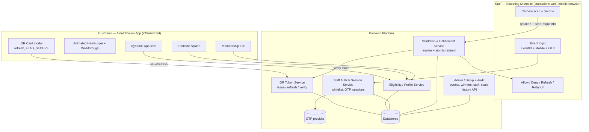
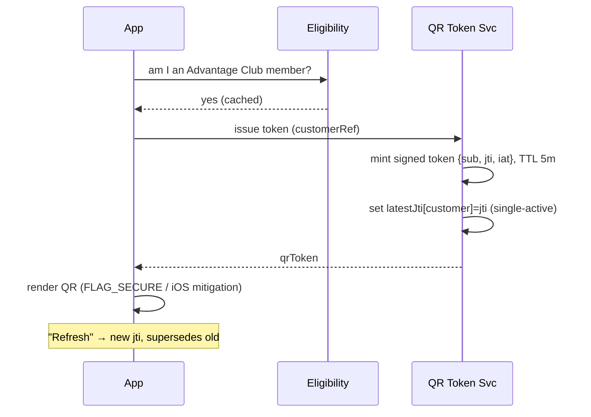
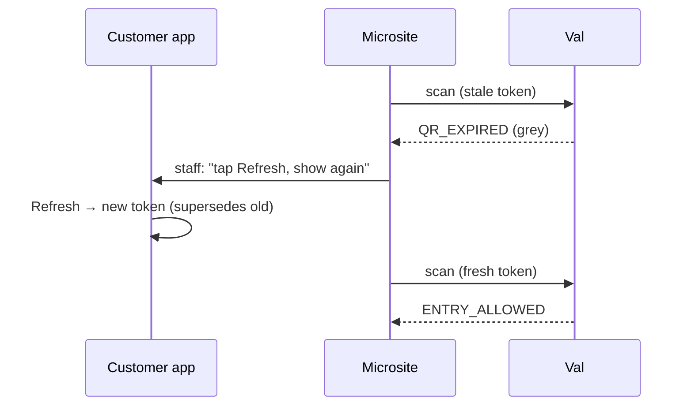

# High-Level Design (HLD)

## 1. Design principle

> **Identity QR + session-bound event.** The QR proves *who the customer is*. The *event* and
> *checkpoint* come from the authenticated staff session. Entitlement (is this customer a winner
> for **this** event?) is resolved **server-side at scan time**, and redemption is an atomic,
> exactly-once, per-checkpoint operation.

Everything else in the design follows from this: one always-available QR, no event knowledge in
the app, all trust decisions on the backend.

## 2. Component map



### Components

| Component | Responsibility |
|---|---|
| **Airtel Thanks app** | Renders the premium surfaces gated on eligibility; hosts the QR card; requests/refreshes tokens; applies screenshot mitigation. Holds **no** event/entitlement logic. |
| **Eligibility / Profile service** | Authoritative "active Postpaid + Fastlane/Advantage Club member?" Feeds icon/splash/tile gating and gates QR issuance. |
| **QR Token service** | Issues **signed, short-TTL, customer-bound** tokens; enforces **single-active** per customer; verifies tokens for the validation service. |
| **Staff Auth & Session service** | Whitelist check `(eventId, mobile, checkpoints)`, OTP issue/verify, single-active event-bound sessions. |
| **Validation & Entitlement service** | The core. Runs the validation chain, resolves entitlement for `(session.event, tokenCustomer)`, performs **atomic per-checkpoint redemption**, writes audit, returns a callback code. |
| **Admin / Setup + Audit** | Engineering-only: create events, load winners, whitelist staff, retrieve scan history. Not a UI role. |
| **Scanning microsite** | Standalone web app (not in the Airtel app). Login, camera capture/decode, POST scan, render decision. Trusts nothing — server decides. |

## 3. Trust boundaries

- The **app** is semi-trusted: it can request a token but the token is only meaningful once the backend verifies it. The app never learns event/entitlement outcomes.
- The **microsite** is **untrusted** for decisions: it captures a QR string and displays a server verdict. Event, checkpoint, staff identity, venue, and timestamp are all derived **server-side** from the session — never accepted from the client.
- The **signing key** for tokens lives only in the backend (KMS/HSM-backed). Compromising the app cannot forge tokens.

## 4. Data domains (logical)

- **Customer / eligibility** — membership status, customer reference.
- **QR issuance** — per-customer latest `jti` + issue time (fast store, TTL'd) for single-active + TTL.
- **Event** — event id, name, venue, window, checkpoints enabled.
- **Entitlement** — `(eventId, customerRef)` winner rows.
- **Redemption** — `(entitlementId, checkpoint)` status, first-claim metadata; the exactly-once anchor.
- **Staff whitelist & session** — `(eventId, msisdn, checkpoints[])`; active sessions.
- **Scan audit log** — append-only record of every scan attempt.

(Concrete schema in the LLD.)

## 5. Primary flows

### 5.1 Customer opens the QR card & shows it



### 5.2 Staff login (event-bound session)

```mermaid
sequenceDiagram
  participant Site as Microsite
  participant Auth as Staff Auth
  participant OTP as OTP provider
  Site->>Auth: eventId + mobile → requestOtp
  Auth->>Auth: (eventId, mobile) whitelisted & event active?
  alt whitelisted
    Auth->>OTP: send OTP
  else not whitelisted
    Note over Auth: no OTP initiated
  end
  Auth-->>Site: generic "if authorized, OTP sent"
  Site->>Auth: eventId + mobile + OTP → verify
  Auth->>Auth: validate OTP; revoke any prior session for mobile
  Auth-->>Site: session (event, checkpoints[], TTL 24h)
  Note over Site: show ENTRY / GOODIE ingresses per checkpoints[]
```

### 5.3 Scan & validate (the core)

```mermaid
sequenceDiagram
  participant Site as Microsite
  participant Val as Validation Svc
  participant QRS as QR Token Svc
  participant DB as DB
  Site->>Site: decode QR → qrToken; pause scanning
  Site->>Val: POST {qrToken, scanRequestId}  (+session cookie)
  Val->>Val: derive staff/event/checkpoint/venue from session (authoritative)
  alt scanRequestId already seen
    Val-->>Site: original stored result (idempotent)
  else new
    Val->>Val: 1 session active? 2 staff authz for event?
    Val->>QRS: 3-5 verify structure/signature/TTL
    QRS-->>Val: ok + customerRef  (else INVALID_QR / QR_EXPIRED)
    Val->>DB: 6 entitlement for (event, customerRef)?
    alt none
      Val-->>Site: NOT_ENTITLED
    else exists
      Val->>DB: 7 atomic redeem (entitlement, checkpoint): UNUSED→USED
      alt won the race (1 row)
        Val->>DB: 8 write audit (ENTRY_ALLOWED)
        Val-->>Site: ENTRY_ALLOWED (+ masked identity)
      else already used (0 rows)
        Val->>DB: read first-claim time; write audit (ALREADY_USED)
        Val-->>Site: ALREADY_USED (+ first-claim time)
      end
    end
  end
  Site->>Site: render color+text; resume scanning
```

### 5.4 Expired-at-gate (the "refresh & re-present" loop)



## 6. Cross-cutting

- **Fail-safe defaults:** unknown eligibility → Default (non-branded) surfaces; unknown entitlement → `NOT_ENTITLED`; backend error → `SERVICE_UNAVAILABLE` (never auto-allow).
- **Server time is authoritative** for TTL and audit; client timestamps are ignored.
- **Observability:** live dashboards for scan latency (target < 2s), allow/deny mix, error rates during events; alerting on validation-service health.
- **Config over code:** TTL, refresh limits, OTP params, session TTL are environment config so they can be tuned during pilot without a release.
- **Platform parity:** iOS/Android functionally equivalent; the only intentional divergence is screenshot handling (block vs. detect) — see open questions Q5.
