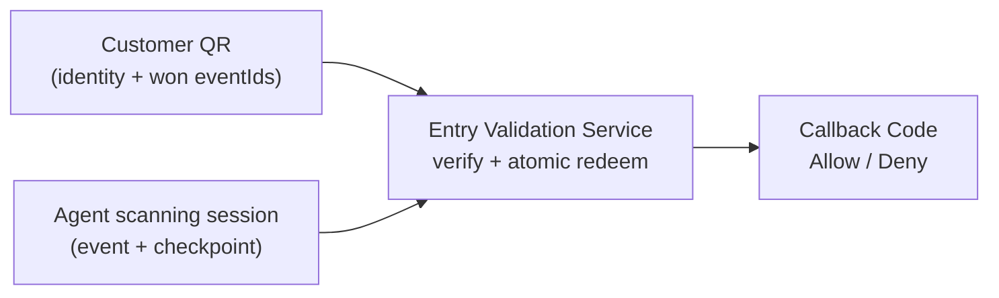
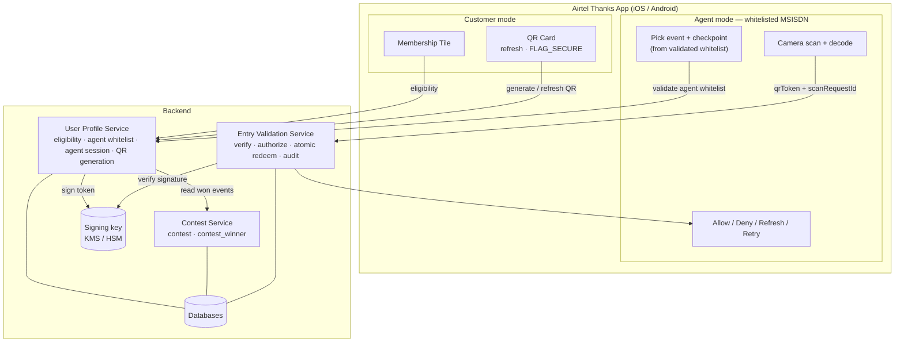
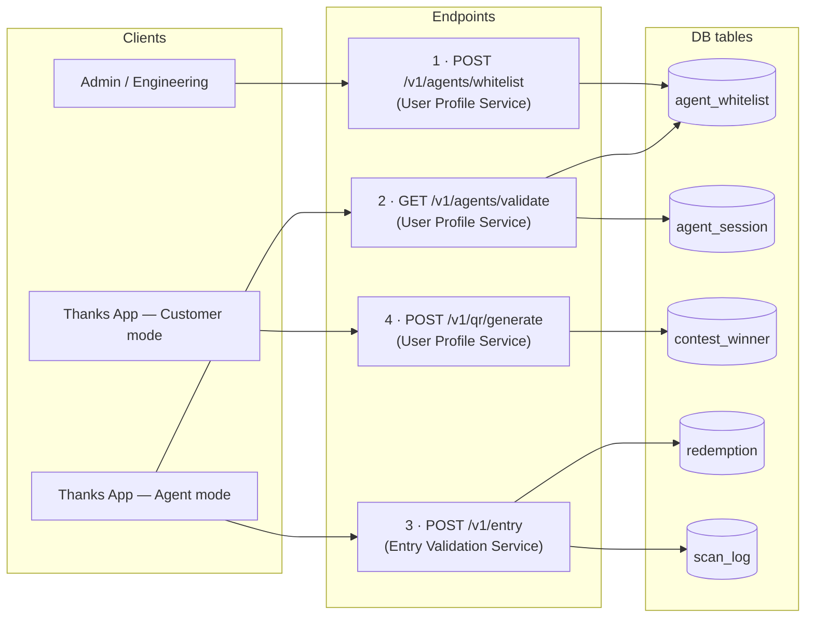
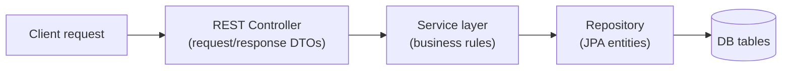
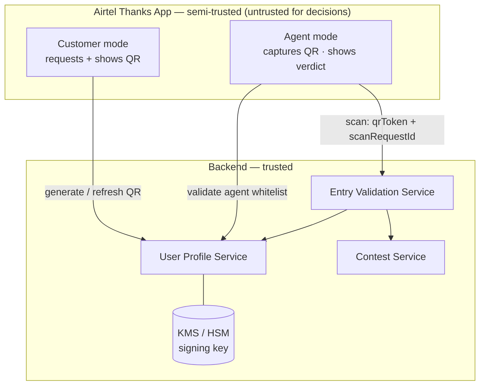
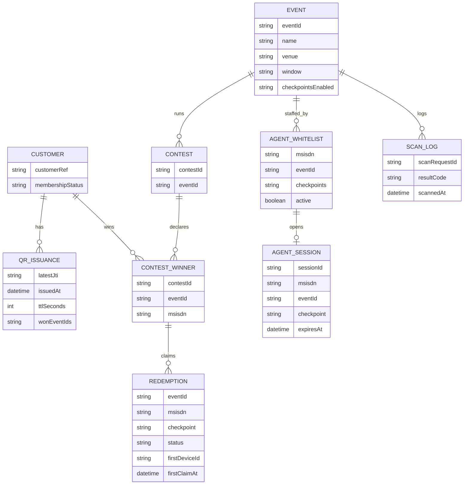
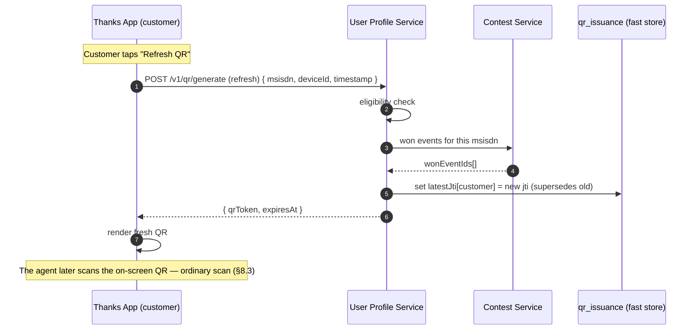
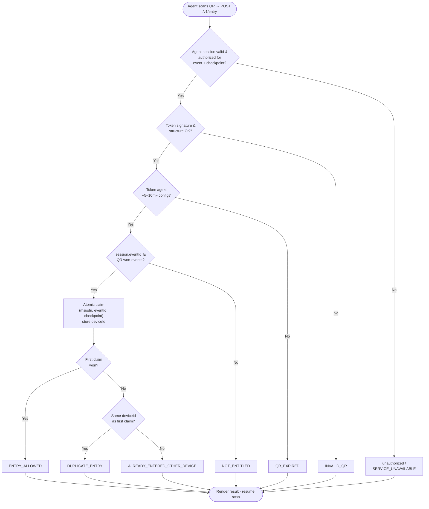

# HLD — Advantage Club Membership QR & Event Entry Validation

| | |
|---|---|
| **Document type** | High-Level Design |
| **Status** | Proposed — for review |
| **Author** | Amit Pawar |
| **Reviewers** | `[names]` |
| **Related** | [`04-lld.md`](./04-lld.md) (schema, endpoints), [`01-open-questions.md`](./01-open-questions.md) |
| **Date** | September 2026 |

---

## Table of Contents

1. [Design Principle](#1-design-principle)
2. [Checkpoint Model](#2-checkpoint-model)
3. [Component Map (Block Diagram)](#3-component-map-block-diagram)
4. [Component Responsibilities](#4-component-responsibilities)
5. [Service Layering (Controller / Service / Repository)](#5-service-layering-controller--service--repository)
6. [Trust Boundaries](#6-trust-boundaries)
7. [Data Domains](#7-data-domains)
8. [Primary Flows (Sequence Diagrams)](#8-primary-flows-sequence-diagrams)
9. [API Surface — the Four Endpoints](#9-api-surface--the-four-endpoints)
10. [Entry Decision Flow (Flowchart)](#10-entry-decision-flow-flowchart)
11. [Entry Decisions → Callback Codes](#11-entry-decisions--callback-codes)
12. [Cross-Cutting Concerns](#12-cross-cutting-concerns)
13. [Open Decisions](#13-open-decisions)

---

## 1. Design Principle

> **Identity + won-events QR, agent-session-bound checkpoint. One app for both roles.**
> The QR proves **who** the customer is **and which events they have won** — the winning
> `eventId`s are read from the **Contest Service** at generation time and **signed into the
> token** by the **User Profile Service**. The QR is **generated by the User Profile Service and
> shown inside the Airtel Thanks App**. Scanning is **also done inside the Airtel Thanks App**, by
> an **agent whose MSISDN is whitelisted** for the event — **there is no separate microsite**. The
> **checkpoint** (ENTRY / GOODIE) and the **event being scanned** come from the **agent's
> validated scanning session**. Entry is allowed when the session's event is among the QR's won
> events **and** that `(customer, event, checkpoint)` has not already been redeemed — an
> **atomic, exactly-once, per-checkpoint** operation.

Consequences:

- **One Airtel Thanks App, two modes** — *customer mode* shows the QR; *agent mode* (unlocked only for whitelisted MSISDNs) scans it.
- A customer who has won multiple events carries **all** their won `eventId`s in the one signed token.
- No per-event logic on the client; the winner source of truth is the **Contest Service**, and the agent's authority is the **whitelist held in the User Profile Service**.



---

## 2. Checkpoint Model

A **checkpoint** is the ingress an agent is scanning at. Each event has **two**, and they are
**independent one-time redemptions**:

| Checkpoint | Meaning | Redemption rule |
|---|---|---|
| **`ENTRY`** | Physical **admission gate** to the event | One admission per winner per event |
| **`GOODIE`** | **Goodie / collectible distribution** desk | One collection per winner per event |

- The two are independent: a winner can be admitted at `ENTRY` **and separately** collect at `GOODIE`; **order does not matter**, and using one does not consume the other.
- An agent is whitelisted, **per event**, for **`ENTRY` only, `GOODIE` only, or both**. In agent mode they may operate only the checkpoints they are authorized for; if authorized for both, they can switch between them without re-validating.
- The active checkpoint is **bound to the agent scanning session** and sent on every scan.
- Redemption is tracked per **`(customer, event, checkpoint)`**, so the **same QR** redeems **once at ENTRY** and **once at GOODIE** for a given event.

---

## 3. Component Map (Block Diagram)



### API ↔ owning-service wiring



---

## 4. Component Responsibilities

| Component | Responsibility |
|---|---|
| **Airtel Thanks App — Customer mode** | Renders the membership surfaces (icon, tile, splash, walkthrough) gated on eligibility, and the **QR Card**. Requests a QR from the **User Profile Service** and displays it; applies screenshot mitigation (Android `FLAG_SECURE`, iOS detect/obscure). Holds **no** event or winner logic. |
| **Airtel Thanks App — Agent mode** | Available **only** to MSISDNs whitelisted as event agents. After the **User Profile Service** validates the whitelist, the agent picks an **authorized event + checkpoint**, opens the camera, decodes a customer QR, and posts it to the **Entry Validation Service**. Renders the returned decision. **Decides nothing — the backend decides.** |
| **User Profile Service** | The customer- and agent-identity authority. It owns: (a) **membership eligibility** (active Postpaid + Fastlane / Advantage Club); (b) the **agent whitelist** — which **events** and which **checkpoints** (ENTRY / GOODIE / both) each agent MSISDN may scan; (c) **agent scanning-session validation**; and (d) **QR generation** — on request it checks eligibility, reads the customer's won events from the **Contest Service**, and returns a **signed, short-TTL** token. |
| **Contest Service** | Owns the **contest tables** (`contest`, `contest_winner`). Sole source of truth for "**which events has this MSISDN won?**" Read by the User Profile Service at QR generation. Winners are loaded/appended by engineering before and during the event. |
| **Entry Validation Service** | The **gate authority**. On each scan it verifies the token (signature, structure, TTL), confirms the **agent is authorized** for the session's **event + checkpoint**, checks the session's event is **among the QR's won events**, performs the **atomic per-checkpoint redemption**, writes the **audit log**, and returns a **callback code**. Also serves the **scan-history** API for dispute resolution. |
| **Admin / Engineering tooling** | Not a UI role. Creates events, loads **contest winners** (Contest Service) and **agent whitelist** rows (User Profile Service), and retrieves **scan history** (Entry Validation Service). |

---

## 5. Service Layering (Controller / Service / Repository)

Each backend service follows the same three layers. Naming is explicit so the LLD and code line up:



| Layer | Role | Example names |
|---|---|---|
| **Controller (API boundary)** | Accepts/returns **DTOs** only — never DB entities | `QrGenerateRequest` / `QrGenerateResponse`, `AgentValidateResponse`, `EntryScanRequest` / `EntryScanResponse`, `WhitelistUpsertRequest` |
| **Service (business logic)** | Eligibility, whitelist checks, token mint/verify, redemption orchestration | `UserProfileService`, `ContestService`, `EntryValidationService` |
| **Repository (persistence)** | Maps **JPA entities** ↔ **DB tables** | `AgentWhitelistRepository`→`agent_whitelist`, `ContestWinnerRepository`→`contest_winner`, `RedemptionRepository`→`redemption`, `ScanLogRepository`→`scan_log` |

- **DTOs never leak DB entities** to the client (and never carry raw PII beyond what a screen needs — see Q14).
- The **QR token** is minted/verified in the Service layer; the signing key sits behind KMS/HSM, not in any entity.
- The fast store for **single-active QR** (`qr_issuance`: latest `jti` per customer, TTL'd) is accessed from the User Profile Service layer, not a JPA table.

---

## 6. Trust Boundaries



- **The app is semi-trusted** — it can request a QR and ask the User Profile Service to validate an agent, but neither the token nor the whitelist result lets the app decide anything at the gate.
- **Agent mode is untrusted for decisions** — it captures the customer QR and shows a verdict, but the **Entry Validation Service** makes the call server-side. Event, checkpoint, agent identity, and timestamp are derived from the **validated agent session**, never accepted from the client body.
- **The signing key lives only in the backend** (KMS/HSM). Compromising the app cannot forge tokens nor fabricate the won-events list — that list is **inside the signature**.

---

## 7. Data Domains



| Domain | Owner | Contents |
|---|---|---|
| Customer / eligibility | **User Profile Service** | Membership status, customer reference |
| QR issuance (`qr_issuance`) | **User Profile Service** | Per-customer latest `jti` + issue time + **won `eventId`s** (fast store, TTL'd) — powers single-active + TTL |
| Event | Admin | Event id, name, venue, window, checkpoints enabled |
| **Contest** (`contest`, `contest_winner`) | **Contest Service** | The **winner source of truth**: which MSISDN won which event |
| **Agent whitelist** (`agent_whitelist`) | **User Profile Service** | Per **`(msisdn, eventId)`**: the **checkpoints** (ENTRY / GOODIE / both) that agent may scan. One agent MSISDN can hold **many** rows (many events) |
| Agent session (`agent_session`) | **User Profile Service** | Active scanning session bound to `(msisdn, eventId, checkpoint)`; single-active per MSISDN |
| Redemption (`redemption`) | **Entry Validation Service** | `(eventId, msisdn, checkpoint)` status + **first-claim deviceId & time** — **the exactly-once anchor** |
| Scan audit log (`scan_log`) | **Entry Validation Service** | Append-only record of every scan attempt (for the history API) |

*(Concrete schema, columns, and constraints in the [LLD](./04-lld.md).)*

---

## 8. Primary Flows (Sequence Diagrams)

### 8.1 Customer opens the QR card (QR generated by the User Profile Service)

```mermaid
sequenceDiagram
  autonumber
  participant App as Thanks App (customer)
  participant UPS as User Profile Service
  participant CTS as Contest Service
  participant Store as qr_issuance (fast store)
  participant KMS as KMS / HSM

  App->>UPS: POST /v1/qr/generate { msisdn, deviceId, timestamp }
  UPS->>UPS: eligibility check (Advantage Club member?)
  UPS->>CTS: which events has this msisdn won?
  CTS-->>UPS: wonEventIds[]
  UPS->>KMS: sign token { sub, dev, events: wonEventIds[], jti, iat }
  KMS-->>UPS: signature
  UPS->>Store: set latestJti[customer] = jti (single-active); TTL «5–10m»
  UPS-->>App: { qrToken, expiresAt }

  App->>App: render QR (FLAG_SECURE / iOS mitigation)
  Note over App: Refresh → re-generate → new jti supersedes old
```

### 8.2 Agent validation (inside the Thanks App — whitelist checked at the User Profile Service)

```mermaid
sequenceDiagram
  autonumber
  participant App as Thanks App (agent)
  participant UPS as User Profile Service
  participant DB as agent_whitelist / agent_session

  App->>UPS: GET /v1/agents/validate (agent msisdn from app auth)
  UPS->>DB: rows where msisdn whitelisted & active
  alt whitelisted for ≥ 1 event
    DB-->>UPS: [ { eventId, checkpoints[] }, ... ]
    UPS-->>App: authorized events + checkpoints
    App->>App: agent picks one event + checkpoint (only from authorized set)
    App->>UPS: open scanning session (msisdn, eventId, checkpoint)
    UPS->>DB: revoke prior session for msisdn; create agent_session
    UPS-->>App: agent session (TTL 24h)
  else not whitelisted
    DB-->>UPS: none
    UPS-->>App: not an event agent (no event data)
  end

  Note over App: If authorized for both checkpoints, switch without re-validating
```

### 8.3 Scan & validate (agent mode in the app → Entry Validation Service)

```mermaid
sequenceDiagram
  autonumber
  participant App as Thanks App (agent)
  participant EVS as Entry Validation Service
  participant UPS as User Profile Service
  participant KMS as KMS / HSM
  participant DB as redemption / scan_log

  App->>App: decode customer QR → qrToken; pause scanning
  App->>EVS: POST /v1/entry { qrToken, checkpoint, scanRequestId } (+ agent session)

  EVS->>UPS: is agent session valid & authorized for event + checkpoint?
  UPS-->>EVS: ok (eventId derived from session)

  alt scanRequestId already seen
    EVS-->>App: original stored result (idempotent)
  else new request
    EVS->>KMS: verify structure / signature / TTL
    alt invalid / forged
      EVS-->>App: INVALID_QR
    else expired
      EVS-->>App: QR_EXPIRED
    else ok
      KMS-->>EVS: ok → { customerRef, deviceId, wonEventIds[] }
      EVS->>EVS: session.eventId ∈ wonEventIds ?
      alt not in list
        EVS-->>App: NOT_ENTITLED
      else winner for this event
        EVS->>DB: atomic redeem (msisdn, eventId, checkpoint) store deviceId
        alt won the race (1 row)
          EVS->>DB: write audit ENTRY_ALLOWED
          EVS-->>App: ENTRY_ALLOWED (+ masked identity)
        else already redeemed (0 rows)
          EVS->>DB: read first-claim deviceId + time; write audit
          alt same deviceId
            EVS-->>App: DUPLICATE_ENTRY (+ first-claim time)
          else different deviceId
            EVS-->>App: ALREADY_ENTERED_OTHER_DEVICE (+ first deviceId)
          end
        end
      end
    end
  end

  App->>App: render colour + text; resume scanning
```

### 8.4 Customer refreshes the QR (independent of the agent)

Refresh is purely a **customer ↔ User Profile Service** action — the agent is **not** part of it.
The customer taps **Refresh** (proactively, or because the agent said the QR looked expired — a
verbal, out-of-band nudge, never a system call), the app calls `POST /v1/qr/generate`, and the
User Profile Service returns a fresh token whose new `jti` supersedes the old one. The agent's
next scan is then just an ordinary scan of whatever QR is on screen (flow §8.3).



---

## 9. API Surface — the Four Endpoints

| # | Method / Endpoint | Owning service | Caller | Purpose | Key inputs | Success output |
|---|---|---|---|---|---|---|
| 1 | `POST /v1/agents/whitelist` | User Profile Service | Admin / eng | Whitelist an agent **MSISDN** for an event with its checkpoints | `msisdn`, `eventId`, `checkpoints[]` | whitelist row created/updated |
| 2 | `GET /v1/agents/validate` | User Profile Service | Thanks App (agent) | Confirm the agent MSISDN is whitelisted; return authorized **events + checkpoints**; open session | agent `msisdn` (from app auth) | authorized events + checkpoints + agent session |
| 3 | `POST /v1/entry` | Entry Validation Service | Thanks App (agent) | Record an entry after scanning | `qrToken`, `checkpoint`, `scanRequestId` (event from session) | `ENTRY_ALLOWED` / duplicate / other-device / expired |
| 4 | `POST /v1/qr/generate` | User Profile Service | Thanks App (customer) | Generate the signed QR carrying **won `eventId`s** | `msisdn`, `deviceId`, `timestamp` | signed `qrToken` (+ `expiresAt`) |

**Notes**
- **No microsite** — API 2 and API 3 are called by the **Airtel Thanks App in agent mode**; the agent's MSISDN is already authenticated by the app.
- **No OTP** — agent authority is the User Profile Service **whitelist** (per event + checkpoint). See Q10 for the accepted tradeoff.
- **Whitelist carries checkpoints** — a `(msisdn, eventId)` row lists ENTRY, GOODIE, or both; agent mode surfaces only what the agent is authorized for.

### 9.1 API 1 — Whitelist an agent MSISDN (with checkpoints)

```mermaid
sequenceDiagram
  autonumber
  participant Admin
  participant UPS as User Profile Service
  participant DB as agent_whitelist

  Admin->>UPS: POST /v1/agents/whitelist { msisdn, eventId, checkpoints[] }
  UPS->>UPS: authz (eng only); validate event exists & active
  UPS->>DB: upsert (unique msisdn + eventId) with checkpoints
  UPS-->>Admin: 200 created / updated

  Note over UPS,DB: Idempotent; one MSISDN can be whitelisted for many events; mid-event appends allowed
```

### 9.2 API 2 — Validate agent & list authorized events/checkpoints

```mermaid
sequenceDiagram
  autonumber
  participant App as Thanks App (agent)
  participant UPS as User Profile Service
  participant DB as agent_whitelist / agent_session

  App->>UPS: GET /v1/agents/validate (msisdn from app auth)
  UPS->>DB: whitelisted & active rows for msisdn
  alt has authorized events
    DB-->>UPS: [ { eventId, checkpoints[] } ... ]
    UPS->>DB: revoke prior session; create agent_session on pick
    UPS-->>App: authorized events + checkpoints + session
  else none
    UPS-->>App: not authorized (no event data)
  end
```

### 9.3 API 3 — Entry after scan (won-events + device + TTL)

The event comes from the **agent session**; the winner check is **`session.eventId ∈ token.wonEventIds`**.
The dedup record is keyed **`(msisdn, eventId, checkpoint)`** and stores the `deviceId` + timestamp
of the first entry.

```mermaid
sequenceDiagram
  autonumber
  participant App as Thanks App (agent)
  participant EVS as Entry Validation Service
  participant KMS as KMS / HSM
  participant DB as redemption

  App->>App: decode QR → qrToken (carries msisdn, deviceId, wonEventIds[], iat)
  App->>EVS: POST /v1/entry { qrToken, checkpoint, scanRequestId } (+ agent session)

  EVS->>EVS: session valid & authorized for event + checkpoint?
  EVS->>KMS: verify signature + structure

  alt bad / forged
    EVS-->>App: INVALID_QR
  else ok
    EVS->>EVS: token age > «5–10m config»?
    alt too old
      EVS-->>App: QR_EXPIRED (refresh & rescan)
    else fresh
      EVS->>EVS: session.eventId ∈ token.wonEventIds ?
      alt not a winner for this event
        EVS-->>App: NOT_ENTITLED
      else winner
        EVS->>DB: atomic claim (msisdn, eventId, checkpoint) storing deviceId
        alt first claim (won)
          EVS->>DB: write audit ENTRY_ALLOWED
          EVS-->>App: ENTRY_ALLOWED
        else already claimed
          EVS->>DB: read stored deviceId
          alt same deviceId
            EVS-->>App: DUPLICATE_ENTRY
          else different deviceId
            EVS-->>App: ALREADY_ENTERED_OTHER_DEVICE
          end
        end
      end
    end
  end

  App->>App: render result; resume scanning
```

### 9.4 API 4 — Generate the signed QR (from contest tables)

```mermaid
sequenceDiagram
  autonumber
  participant App as Thanks App (customer)
  participant UPS as User Profile Service
  participant CTS as Contest Service
  participant KMS as KMS / HSM

  App->>UPS: POST /v1/qr/generate { msisdn, deviceId, timestamp }
  UPS->>UPS: eligibility check (Advantage Club member?)
  UPS->>CTS: which events has this msisdn won? (contest_winner)
  CTS-->>UPS: wonEventIds[]
  UPS->>KMS: sign token { sub, dev, events: wonEventIds[], iat, jti }
  KMS-->>UPS: signature
  UPS->>UPS: set latestJti[msisdn] (single-active); TTL «5–10m»
  UPS-->>App: { qrToken, expiresAt }

  Note over App: Won multiple events → ALL eventIds ride in one token.<br/>Refresh re-calls API 4 → new jti supersedes old
```

---

## 10. Entry Decision Flow (Flowchart)



---

## 11. Entry Decisions → Callback Codes

| Situation (API 3) | Callback | Admit? | Agent message |
|---|---|:---:|---|
| First valid scan at checkpoint | `ENTRY_ALLOWED` | ✅ | Entry allowed / goodie given |
| Same `(msisdn, event, checkpoint)`, **same** deviceId | `DUPLICATE_ENTRY` | ❌ | Already done on this device (show first-claim time) |
| Same `(msisdn, event, checkpoint)`, **different** deviceId | `ALREADY_ENTERED_OTHER_DEVICE` | ❌ | Already done on another device — returns that deviceId |
| `session.eventId` **not** in QR's won events | `NOT_ENTITLED` | ❌ | Member, not a winner for this event |
| Token older than «5–10m» config | `QR_EXPIRED` | ❌ | Ask customer to refresh & rescan |
| Forged / malformed / non-Airtel | `INVALID_QR` | ❌ | Open QR from the Airtel app |
| Backend error / timeout | `SERVICE_UNAVAILABLE` | ❌ | Retry; **never auto-allow** |

> **TTL note:** API 3 and API 4 read the **same** «5–10m» config knob (Q1). Issuance and
> validation must agree (recommend **5m**), and agent-facing copy must match.

---

## 12. Cross-Cutting Concerns

| Concern | Design |
|---|---|
| **Fail-safe defaults** | Unknown eligibility → Default (non-branded) surfaces; not a winner → `NOT_ENTITLED`; backend error → `SERVICE_UNAVAILABLE` — **never auto-allow** |
| **Authoritative time** | Server time governs TTL and audit; client timestamps are ignored |
| **Observability** | Live dashboards for scan latency (target **&lt; 2s**), allow/deny mix, error rates during events; alerting on Entry Validation Service health |
| **Config over code** | TTL, refresh limits, agent-session TTL are environment config — tunable during pilot without a release |
| **Platform parity** | iOS/Android functionally equivalent; only intentional divergence is screenshot handling (block vs. detect) — see Q5 |
| **Idempotency** | `scanRequestId` makes API 3 retries safe — return the original stored result |
| **Winner source of truth** | Only the **Contest Service** (`contest`, `contest_winner`) declares winners; read at generation (embedded in token) and re-checkable at entry |
| **DTOs vs entities** | Controllers speak DTOs; DB entities never cross the API boundary (§5) |

---

## 13. Open Decisions

| # | Question | Impact |
|---|---|---|
| **Q1** | QR TTL value (recommend **5m**) | API 3 & API 4 must share the same knob; agent copy must match |
| **Q5** | Screenshot handling — block (Android) vs detect (iOS) | Platform parity |
| **Q10** | **Agent auth is whitelist-only (no OTP).** Possession of the MSISDN is proven by the Thanks App's own login; is the app-auth + whitelist combination sufficient, or add an extra agent step? | Agent-side security |
| **Q22** | `deviceId` is the **customer's** QR-generating device (agent whitelist is MSISDN + checkpoints, no deviceId). Needs a **stable** id; screenshots carry the original deviceId → read as `DUPLICATE_ENTRY` | API 3 dedup semantics |

---

*Concrete schema, indexes, DTOs, and request/response contracts are in the accompanying [LLD](./04-lld.md).*
