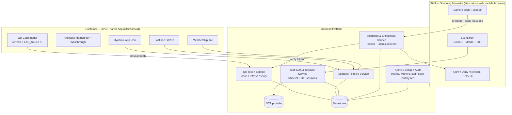
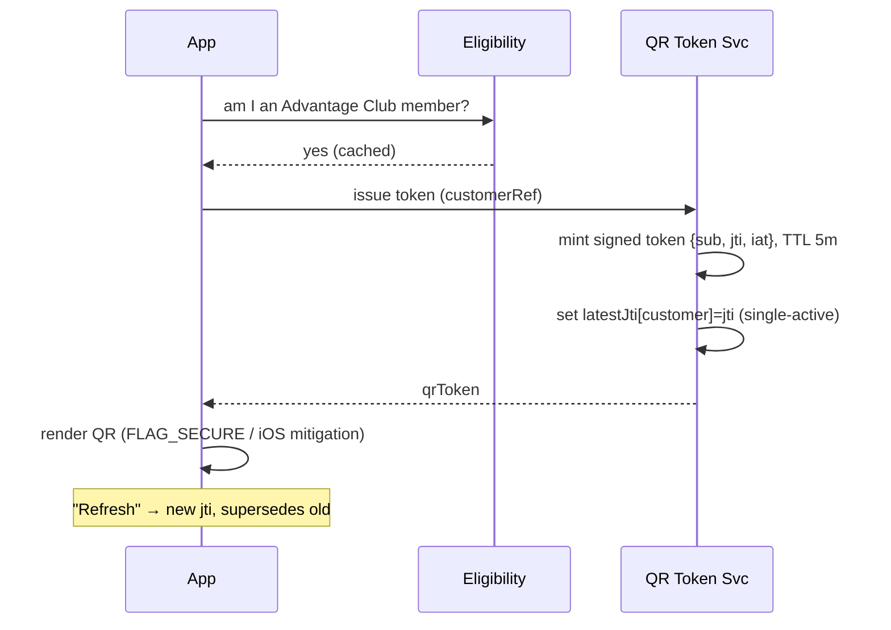
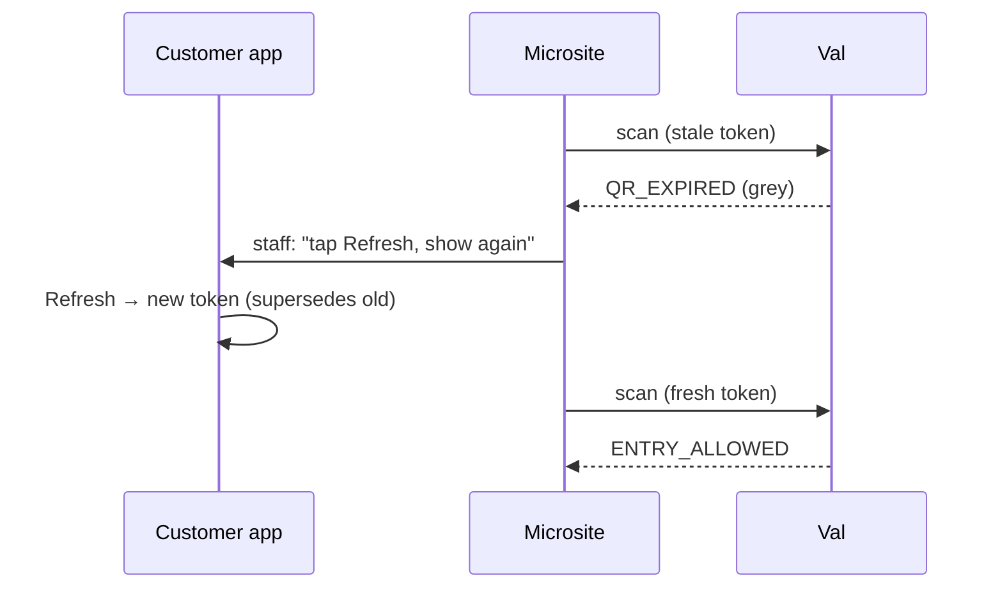
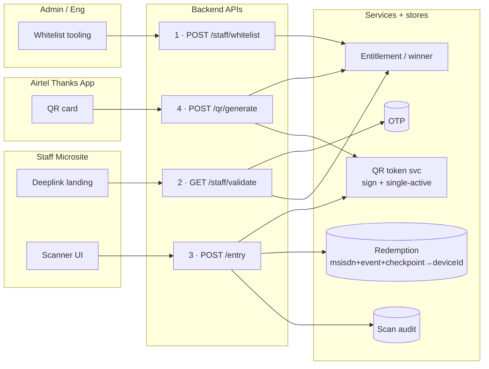

# High-Level Design (HLD)

## 1. Design principle

> **Identity QR + session-bound event.** The QR proves *who the customer is*. The *event* and
> *checkpoint* come from the authenticated staff session. Entitlement (is this customer a winner
> for **this** event?) is resolved **server-side at scan time**, and redemption is an atomic,
> exactly-once, per-checkpoint operation.

Everything else in the design follows from this: one always-available QR, no event knowledge in
the app, all trust decisions on the backend.

## 2. Component map



### Components

| Component | Responsibility |
|---|---|
| **Airtel Thanks app** | Renders the premium surfaces gated on eligibility; hosts the QR card; requests/refreshes tokens; applies screenshot mitigation. Holds **no** event/entitlement logic. |
| **Eligibility / Profile service** | Authoritative "active Postpaid + Fastlane/Advantage Club member?" Feeds icon/splash/tile gating and gates QR issuance. |
| **QR Token service** | Issues **signed, short-TTL, customer-bound** tokens; enforces **single-active** per customer; verifies tokens for the validation service. |
| **Staff Auth & Session service** | Whitelist check `(eventId, mobile, checkpoints)`, OTP issue/verify, single-active event-bound sessions. |
| **Validation & Entitlement service** | The core. Runs the validation chain, resolves entitlement for `(session.event, tokenCustomer)`, performs **atomic per-checkpoint redemption**, writes audit, returns a callback code. |
| **Admin / Setup + Audit** | Engineering-only: create events, load winners, whitelist staff, retrieve scan history. Not a UI role. |
| **Scanning microsite** | Standalone web app (not in the Airtel app). Login, camera capture/decode, POST scan, render decision. Trusts nothing — server decides. |

## 3. Trust boundaries

- The **app** is semi-trusted: it can request a token but the token is only meaningful once the backend verifies it. The app never learns event/entitlement outcomes.
- The **microsite** is **untrusted** for decisions: it captures a QR string and displays a server verdict. Event, checkpoint, staff identity, venue, and timestamp are all derived **server-side** from the session — never accepted from the client.
- The **signing key** for tokens lives only in the backend (KMS/HSM-backed). Compromising the app cannot forge tokens.

## 4. Data domains (logical)

- **Customer / eligibility** — membership status, customer reference.
- **QR issuance** — per-customer latest `jti` + issue time (fast store, TTL'd) for single-active + TTL.
- **Event** — event id, name, venue, window, checkpoints enabled.
- **Entitlement** — `(eventId, customerRef)` winner rows.
- **Redemption** — `(entitlementId, checkpoint)` status, first-claim metadata; the exactly-once anchor.
- **Staff whitelist & session** — `(eventId, msisdn, checkpoints[])`; active sessions.
- **Scan audit log** — append-only record of every scan attempt.

(Concrete schema in the LLD.)

## 5. Primary flows

### 5.1 Customer opens the QR card & shows it



### 5.2 Staff login (event-bound session)

```mermaid
sequenceDiagram
  participant Site as Microsite
  participant Auth as Staff Auth
  participant OTP as OTP provider
  Site->>Auth: eventId + mobile → requestOtp
  Auth->>Auth: (eventId, mobile) whitelisted & event active?
  alt whitelisted
    Auth->>OTP: send OTP
  else not whitelisted
    Note over Auth: no OTP initiated
  end
  Auth-->>Site: generic "if authorized, OTP sent"
  Site->>Auth: eventId + mobile + OTP → verify
  Auth->>Auth: validate OTP; revoke any prior session for mobile
  Auth-->>Site: session (event, checkpoints[], TTL 24h)
  Note over Site: show ENTRY / GOODIE ingresses per checkpoints[]
```

### 5.3 Scan & validate (the core)

```mermaid
sequenceDiagram
  participant Site as Microsite
  participant Val as Validation Svc
  participant QRS as QR Token Svc
  participant DB as DB
  Site->>Site: decode QR → qrToken; pause scanning
  Site->>Val: POST {qrToken, scanRequestId}  (+session cookie)
  Val->>Val: derive staff/event/checkpoint/venue from session (authoritative)
  alt scanRequestId already seen
    Val-->>Site: original stored result (idempotent)
  else new
    Val->>Val: 1 session active? 2 staff authz for event?
    Val->>QRS: 3-5 verify structure/signature/TTL
    QRS-->>Val: ok + customerRef  (else INVALID_QR / QR_EXPIRED)
    Val->>DB: 6 entitlement for (event, customerRef)?
    alt none
      Val-->>Site: NOT_ENTITLED
    else exists
      Val->>DB: 7 atomic redeem (entitlement, checkpoint): UNUSED→USED
      alt won the race (1 row)
        Val->>DB: 8 write audit (ENTRY_ALLOWED)
        Val-->>Site: ENTRY_ALLOWED (+ masked identity)
      else already used (0 rows)
        Val->>DB: read first-claim time; write audit (ALREADY_USED)
        Val-->>Site: ALREADY_USED (+ first-claim time)
      end
    end
  end
  Site->>Site: render color+text; resume scanning
```

### 5.4 Expired-at-gate (the "refresh & re-present" loop)



## 6. API surface — the four endpoints

The whole system is delivered through **four** backend APIs. Everything above maps onto them.

> **Assumption (flagged as open — see Q22 in `01-open-questions.md`):** `deviceId` is the
> **customer's device that generated the QR**, carried *inside the signed token*, so the entry
> API receives it on scan. This is the only reading consistent with both API 3 and API 4
> collecting `deviceId`. If instead it should be the *staff scanner* device, the dedup key in
> API 3 changes — resolve before build.

| # | Method / Endpoint | Caller | Purpose | Key inputs | Success output |
|---|---|---|---|---|---|
| 1 | `POST /v1/staff/whitelist` | Admin / eng | Whitelist an agent for an event | `msisdn`, `deviceId`, event info (`eventId`, checkpoints) | whitelist record created/updated |
| 2 | `GET /v1/staff/validate` (deeplink landing) | Agent (microsite) | Check the agent is whitelisted; return the events they may scan | `msisdn`, `deviceId` (+ OTP challenge, see note) | list of eligible events + checkpoints, session |
| 3 | `POST /v1/entry` | Agent (microsite) | Record an entry after scanning the QR | `msisdn`, `deviceId`, `eventId`, `checkpoint (ENTRY\|GOODIE)`, `qrToken` | `ENTRY_ALLOWED` / duplicate / other-device / expired |
| 4 | `POST /v1/qr/generate` | Customer app | Generate the signed membership QR | `msisdn`, `deviceId`, `timestamp` | signed `qrToken` (+ `expiresAt`) |

**Security note on API 2:** a bare `GET` that returns eligible events for any `(msisdn, deviceId)`
is weak — the PRD requires OTP. Recommended: the deeplink `validate` **triggers/consumes an OTP**
(possession proof) before returning events + issuing the session. `deviceId` binding is an
*additional* factor, not a replacement. Kept as API 2's responsibility; wiring shown below.

### 6.1 Block diagram (API-centric)



### 6.2 API 1 — whitelist an agent

```mermaid
sequenceDiagram
  participant Admin
  participant A1 as POST /staff/whitelist
  participant DB
  Admin->>A1: { msisdn, deviceId, eventId, checkpoints[] }
  A1->>A1: authz (eng only); validate event exists & active
  A1->>DB: upsert staff_whitelist (unique eventId+msisdn)
  A1-->>Admin: 200 created/updated
  Note over A1,DB: idempotent; supports mid-event appends
```

### 6.3 API 2 — agent opens deeplink, validate & get events

```mermaid
sequenceDiagram
  participant Agent as Agent (browser)
  participant A2 as GET /staff/validate
  participant OTP
  participant DB
  Agent->>A2: deeplink { msisdn, deviceId }
  A2->>DB: is (msisdn, deviceId) whitelisted & active?
  alt not whitelisted
    A2-->>Agent: generic "not authorized" (no events leaked)
  else whitelisted
    A2->>OTP: send OTP (possession proof)
    Agent->>A2: submit OTP
    A2->>A2: verify OTP; revoke prior session for msisdn
    A2->>DB: read events + checkpoints for this agent
    A2-->>Agent: eligible events[] + checkpoints[] + session
  end
```

### 6.4 API 3 — entry after scan (dedup + device + TTL)

The core decision. Dedup record is keyed **`(msisdn, eventId, checkpoint)`** and stores the
`deviceId` + timestamp of the first entry.

```mermaid
sequenceDiagram
  participant Site as Scanner
  participant A3 as POST /entry
  participant QRS as QR token svc
  participant DB
  Site->>Site: decode QR → qrToken (carries msisdn, deviceId, ts)
  Site->>A3: { msisdn, deviceId, eventId, checkpoint, qrToken }
  A3->>A3: session valid & authorized for event+checkpoint?
  A3->>QRS: verify signature + structure
  alt bad / forged
    A3-->>Site: INVALID_QR
  else ok
    A3->>A3: token age > «5–10m config»?
    alt too old
      A3-->>Site: QR_EXPIRED (refresh & rescan)
    else fresh
      A3->>A3: winner for (eventId, msisdn)?
      alt not a winner
        A3-->>Site: NOT_ENTITLED
      else winner
        A3->>DB: atomic claim (msisdn,eventId,checkpoint) storing deviceId
        alt first claim (won)
          A3->>DB: write audit ENTRY_ALLOWED
          A3-->>Site: ENTRY_ALLOWED
        else already claimed
          A3->>DB: read stored deviceId
          alt same deviceId
            A3-->>Site: DUPLICATE_ENTRY (already done on this device)
          else different deviceId
            A3-->>Site: ALREADY_ENTERED_OTHER_DEVICE (+ first deviceId)
          end
        end
      end
    end
  end
  Site->>Site: render result; resume scanning
```

### 6.5 API 4 — generate the signed QR

```mermaid
sequenceDiagram
  participant App as Customer app
  participant A4 as POST /qr/generate
  participant ENT as Entitlement
  participant QRS as QR token svc
  App->>A4: { msisdn, deviceId, timestamp }
  A4->>A4: eligibility check (Advantage Club member?)
  A4->>ENT: resolve events this msisdn is a winner for
  A4->>QRS: mint signed token { sub(msisdn ref), deviceId, iat, jti }
  QRS->>QRS: set latestJti[msisdn] (single-active); TTL «5–10m»
  QRS-->>A4: qrToken
  A4-->>App: { qrToken, expiresAt }
  Note over App: Refresh re-calls API 4 → new jti supersedes old
```

### 6.6 Entry decisions → callback codes

The device-aware entry rules extend the earlier matrix. `DUPLICATE_ENTRY` and
`ALREADY_ENTERED_OTHER_DEVICE` are the two device-split variants of the "already used" family:

| Situation (API 3) | Callback | Admit? | Staff message |
|---|---|---|---|
| first valid scan at checkpoint | `ENTRY_ALLOWED` | ✅ | Entry allowed / goodie given |
| same `(msisdn, event, checkpoint)` again, **same** deviceId | `DUPLICATE_ENTRY` | ❌ | Already done on this device (show first-claim time) |
| same `(msisdn, event, checkpoint)` again, **different** deviceId | `ALREADY_ENTERED_OTHER_DEVICE` | ❌ | Already done on another device — returns that deviceId |
| winner, but not for this event | `NOT_ENTITLED` | ❌ | Member, not eligible for this event |
| token older than «5–10m» config | `QR_EXPIRED` | ❌ | Ask customer to refresh & rescan |
| forged / malformed / non-Airtel | `INVALID_QR` | ❌ | Open QR from the Airtel app |
| backend error/timeout | `SERVICE_UNAVAILABLE` | ❌ | Retry; never auto-allow |

> **Note on TTL value:** API 3 and API 4 read the **same** `«5–10m»` config knob (Q1). Whatever
> is chosen (recommend 5m), issuance and validation must agree, and staff copy must match.

## 7. Cross-cutting

- **Fail-safe defaults:** unknown eligibility → Default (non-branded) surfaces; unknown entitlement → `NOT_ENTITLED`; backend error → `SERVICE_UNAVAILABLE` (never auto-allow).
- **Server time is authoritative** for TTL and audit; client timestamps are ignored.
- **Observability:** live dashboards for scan latency (target < 2s), allow/deny mix, error rates during events; alerting on validation-service health.
- **Config over code:** TTL, refresh limits, OTP params, session TTL are environment config so they can be tuned during pilot without a release.
- **Platform parity:** iOS/Android functionally equivalent; the only intentional divergence is screenshot handling (block vs. detect) — see open questions Q5.
