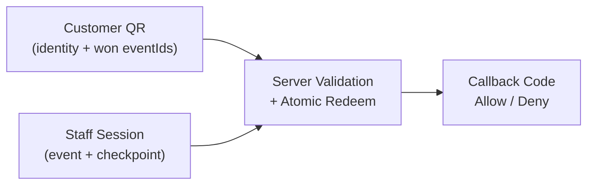
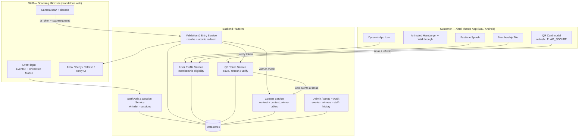
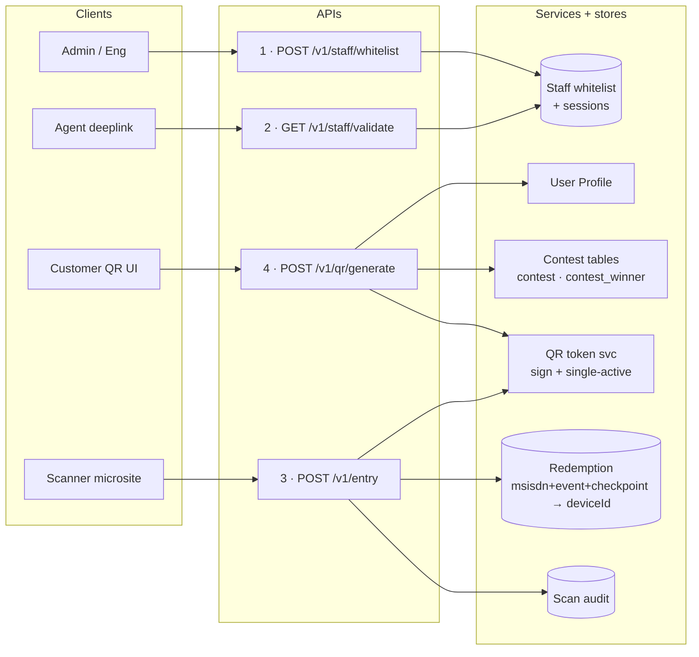
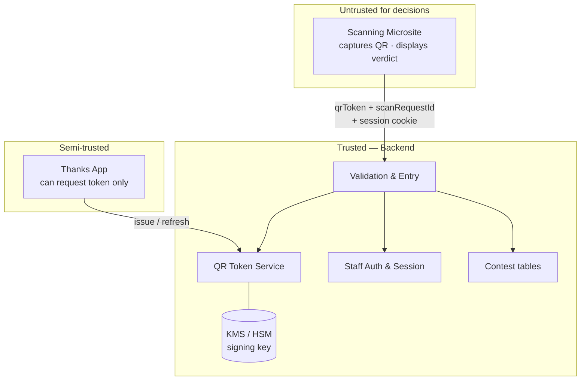
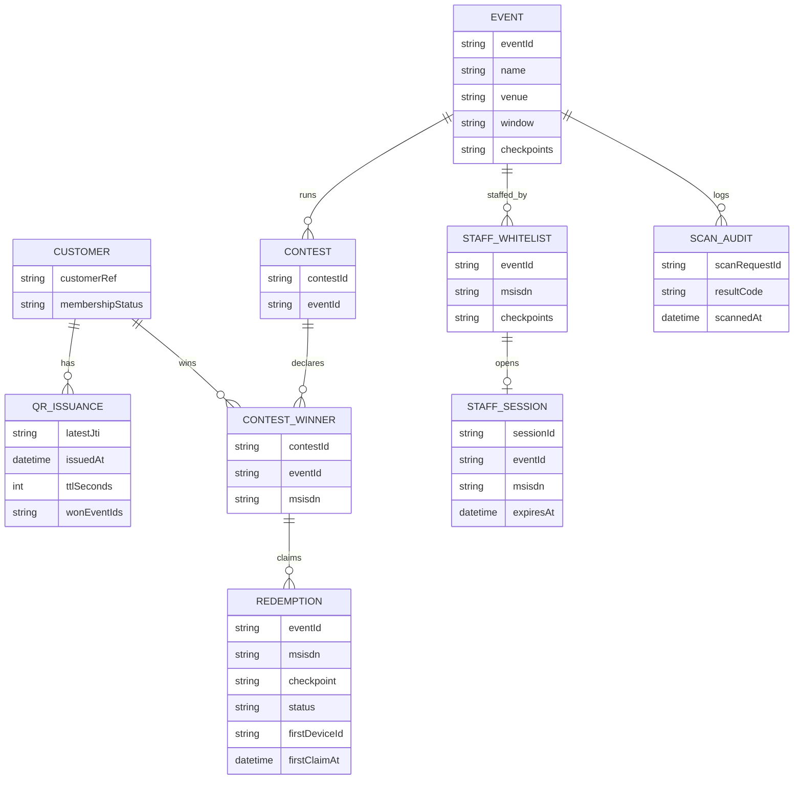
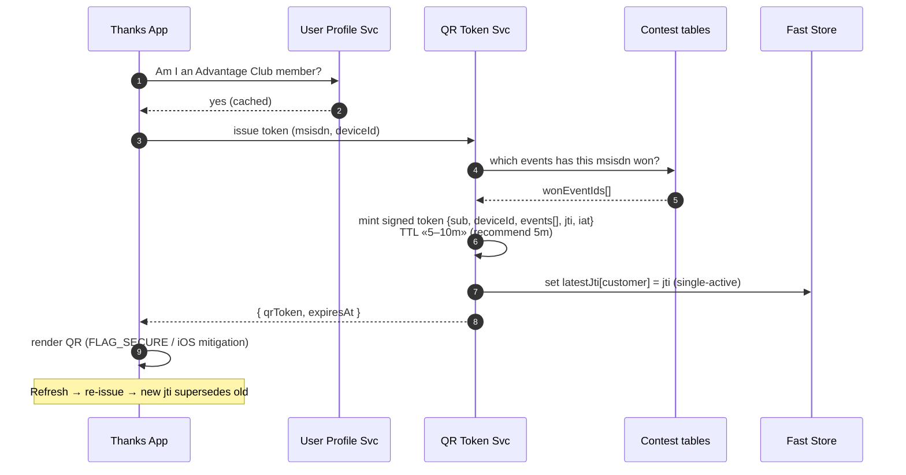
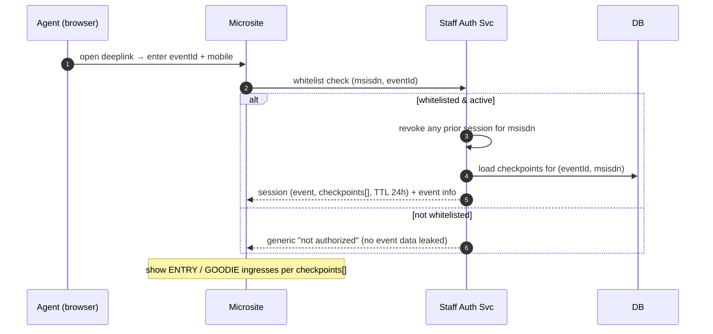
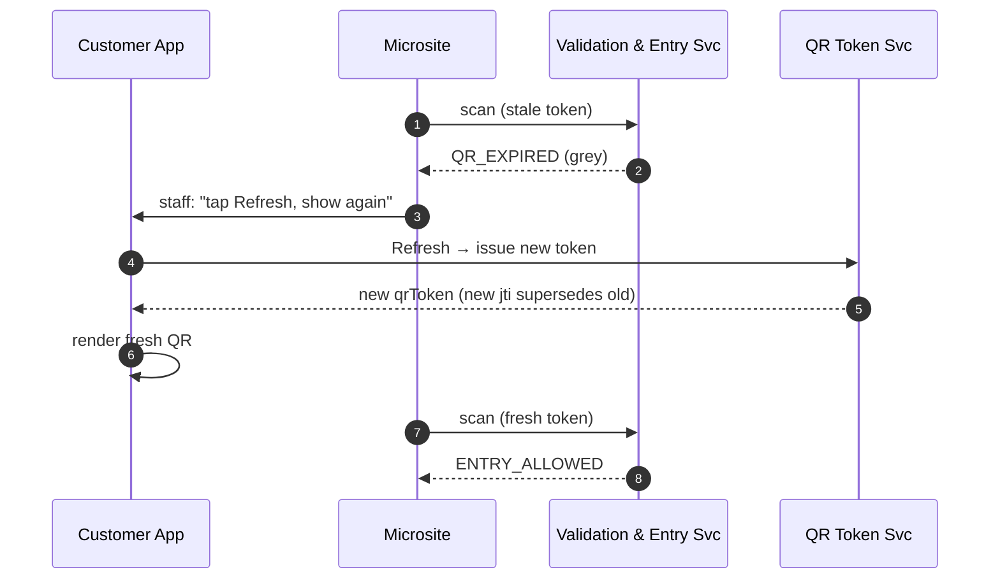
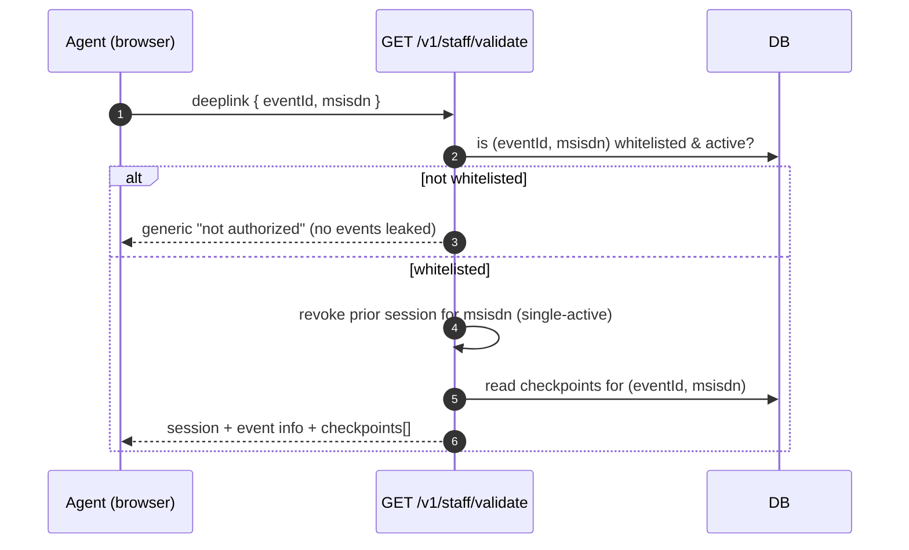

# HLD — Advantage Club Membership QR & Event Entry Validation

| | |
|---|---|
| **Document type** | High-Level Design |
| **Status** | Proposed — for review |
| **Author** | Amit Pawar |
| **Reviewers** | `[names]` |
| **Related** | [`04-lld.md`](./04-lld.md) (schema, endpoints), [`01-open-questions.md`](./01-open-questions.md) |
| **Date** | September 2026 |

---

## Table of Contents

1. [Design Principle](#1-design-principle)
2. [Checkpoint Model](#2-checkpoint-model)
3. [Component Map (Block Diagram)](#3-component-map-block-diagram)
4. [Trust Boundaries](#4-trust-boundaries)
5. [Data Domains](#5-data-domains)
6. [Primary Flows (Sequence Diagrams)](#6-primary-flows-sequence-diagrams)
7. [API Surface — the Four Endpoints](#7-api-surface--the-four-endpoints)
8. [Entry Decision Flow (Flowchart)](#8-entry-decision-flow-flowchart)
9. [Entry Decisions → Callback Codes](#9-entry-decisions--callback-codes)
10. [Cross-Cutting Concerns](#10-cross-cutting-concerns)
11. [Open Decisions](#11-open-decisions)

---

## 1. Design Principle

> **Identity + won-events QR, session-bound checkpoint.**
> The QR proves **who** the customer is **and which events they have won** — the winning
> `eventId`s are resolved from the **Contest tables** at generation time and **signed into the
> token**. The **checkpoint** (ENTRY / GOODIE) and the specific **event being scanned** come from
> the authenticated **staff session**. Entry is allowed when the session's event is among the
> QR's won events **and** that `(customer, event, checkpoint)` has not already been redeemed —
> an **atomic, exactly-once, per-checkpoint** operation.

Everything else follows from this:

- One always-available QR; if the customer has won multiple events, **all** their won `eventId`s ride inside the one token.
- No per-event logic in the customer app — it only asks for a token and shows it.
- All trust decisions on the backend; the winner source of truth is the **Contest tables**.



---

## 2. Checkpoint Model

A **checkpoint** is the ingress the staff agent is scanning at. Each event has **two**, and they
are **independent one-time redemptions**:

| Checkpoint | Meaning | Redemption rule |
|---|---|---|
| **`ENTRY`** | Physical **admission gate** to the event | One admission per winner per event |
| **`GOODIE`** | **Goodie / collectible distribution** desk | One collection per winner per event |

- The two are independent: a winner can be admitted at `ENTRY` **and separately** collect at `GOODIE`; **order does not matter**, and using one does not consume the other.
- The agent selects a checkpoint after login — only the ones their MSISDN is whitelisted for — and it is **bound to the session**. Every scan carries that checkpoint.
- Redemption is tracked per **`(customer, event, checkpoint)`**, so the **same QR** redeems **once at ENTRY** and **once at GOODIE** for a given event.

---

## 3. Component Map (Block Diagram)



### Component responsibilities

| Component | Responsibility |
|---|---|
| **Airtel Thanks app** | Renders premium surfaces gated on eligibility; hosts the QR card; requests/refreshes tokens; applies screenshot mitigation. **Holds no event/entitlement logic.** |
| **User Profile Service** | Authoritative "active Postpaid + Fastlane / Advantage Club member?" Feeds icon / splash / tile gating and gates QR issuance. |
| **QR Token Service** | Issues signed, short-TTL, customer-bound tokens carrying the customer's **won `eventId`s**; enforces **single-active per customer**; verifies tokens for the validation service. |
| **Contest Service** | Owns the **contest tables** (`contest`, `contest_winner`). Sole source of truth for "which events has this MSISDN won?" Read at QR generation and (optionally) re-checked at entry. |
| **Staff Auth & Session Service** | **Whitelist check `(eventId, msisdn, checkpoints)`** and **single-active, event-bound sessions**. (No OTP — see §11.) |
| **Validation & Entry Service** | The core. Runs the validation chain, checks the session's event against the QR's won events, performs **atomic per-checkpoint redemption**, writes audit, returns a callback code. |
| **Admin / Setup + Audit** | Engineering-only: create events, load contest winners, whitelist staff MSISDNs, retrieve scan history. Not a UI role. |
| **Scanning microsite** | Standalone web app (**not** in the Airtel app). Login, camera capture/decode, POST scan, render decision. **Trusts nothing — server decides.** |

### API ↔ services wiring



---

## 4. Trust Boundaries



- **App is semi-trusted** — it can request a token, but the token is only meaningful once the backend verifies it. The app never learns event/entitlement outcomes.
- **Microsite is untrusted for decisions** — it captures a QR string and displays a server verdict. Event, checkpoint, staff identity, venue, and timestamp are derived **server-side from the session**, never accepted from the client.
- **Signing key lives only in the backend** (KMS/HSM-backed). Compromising the app cannot forge tokens, nor can it fake the won-events list inside a token (it's inside the signature).

---

## 5. Data Domains



| Domain | Contents |
|---|---|
| Customer / eligibility | Membership status, customer reference (**User Profile Service**) |
| QR issuance | Per-customer latest `jti` + issue time + **won `eventId`s** (fast store, TTL'd) — powers single-active + TTL |
| Event | Event id, name, venue, window, checkpoints enabled |
| **Contest** (`contest`, `contest_winner`) | The **winner source of truth**: which MSISDN won which event/contest |
| Redemption | `(eventId, msisdn, checkpoint)` status + **first-claim deviceId & time** — **the exactly-once anchor** |
| Staff whitelist & session | `(eventId, msisdn, checkpoints[])` — **MSISDN-whitelisted, no deviceId**; active sessions |
| Scan audit log | Append-only record of every scan attempt |

*(Concrete schema in the [LLD](./04-lld.md).)*

---

## 6. Primary Flows (Sequence Diagrams)

### 6.1 Customer opens the QR card & shows it



### 6.2 Staff logs into the microsite (whitelist only — no OTP)



### 6.3 Scan & validate (the core)

```mermaid
sequenceDiagram
  autonumber
  participant Site as Microsite
  participant Val as Validation & Entry Svc
  participant QRS as QR Token Svc
  participant DB as DB

  Site->>Site: decode QR → qrToken; pause scanning
  Site->>Val: POST {qrToken, scanRequestId} (+ session cookie)

  Val->>Val: derive event / checkpoint / staff / venue<br/>from SESSION (authoritative)

  alt scanRequestId already seen
    Val-->>Site: original stored result (idempotent)
  else new request
    Val->>Val: 1) session active?<br/>2) staff authorized for event + checkpoint?
    Val->>QRS: 3–5) verify structure / signature / TTL
    alt invalid / forged
      QRS-->>Val: fail
      Val-->>Site: INVALID_QR
    else expired
      QRS-->>Val: expired
      Val-->>Site: QR_EXPIRED
    else ok
      QRS-->>Val: ok + { customerRef, deviceId, wonEventIds[] }
      Val->>Val: 6) session.eventId ∈ wonEventIds ?
      alt not in list
        Val-->>Site: NOT_ENTITLED
      else winner for this event
        Val->>DB: 7) atomic redeem (msisdn, eventId, checkpoint)<br/>store deviceId
        alt won the race (1 row)
          Val->>DB: 8) write audit ENTRY_ALLOWED
          Val-->>Site: ENTRY_ALLOWED (+ masked identity)
        else already redeemed (0 rows)
          Val->>DB: read first-claim deviceId + time; write audit
          alt same deviceId
            Val-->>Site: DUPLICATE_ENTRY (+ first-claim time)
          else different deviceId
            Val-->>Site: ALREADY_ENTERED_OTHER_DEVICE (+ first deviceId)
          end
        end
      end
    end
  end

  Site->>Site: render colour + text; resume scanning
```

### 6.4 Expired-token recovery



---

## 7. API Surface — the Four Endpoints

The whole system is delivered through **four** backend APIs.

| # | Method / Endpoint | Caller | Purpose | Key inputs | Success output |
|---|---|---|---|---|---|
| 1 | `POST /v1/staff/whitelist` | Admin / eng | Whitelist a staff **MSISDN** for an event | `msisdn`, `eventId`, `checkpoints[]` | whitelist record created/updated |
| 2 | `GET /v1/staff/validate` (deeplink) | Agent (microsite) | Verify MSISDN is whitelisted; open session; return scannable events | `eventId`, `msisdn` | eligible events + checkpoints + session |
| 3 | `POST /v1/entry` | Agent (microsite) | Record an entry after scanning | `qrToken`, `checkpoint`, `scanRequestId` (event from session) | `ENTRY_ALLOWED` / duplicate / other-device / expired |
| 4 | `POST /v1/qr/generate` | Customer app | Generate the signed membership QR carrying **won `eventId`s** | `msisdn`, `deviceId`, `timestamp` | signed `qrToken` (+ `expiresAt`) |

**Staff auth is whitelist-only (no OTP).** A whitelisted `(eventId, msisdn)` pair opening the
deeplink is granted a session directly. This drops possession-of-number proof — see **Q10** in
§11 for the accepted tradeoff. `deviceId` is **not** part of staff whitelisting; it is a
**customer-side** value carried in the QR token (see Q22).

### 7.1 API 1 — Whitelist a staff MSISDN

```mermaid
sequenceDiagram
  autonumber
  participant Admin
  participant A1 as POST /v1/staff/whitelist
  participant DB

  Admin->>A1: { msisdn, eventId, checkpoints[] }
  A1->>A1: authz (eng only); validate event exists & active
  A1->>DB: upsert staff_whitelist<br/>(unique eventId + msisdn)
  A1-->>Admin: 200 created / updated

  Note over A1,DB: Idempotent; supports mid-event appends
```

### 7.2 API 2 — Agent deeplink: validate & get events (no OTP)



### 7.3 API 3 — Entry after scan (won-events + device + TTL)

The event comes from the **session**; the winner check is **`session.eventId ∈ token.wonEventIds`**.
The dedup record is keyed **`(msisdn, eventId, checkpoint)`** and stores the `deviceId` + timestamp
of the first entry.

```mermaid
sequenceDiagram
  autonumber
  participant Site as Scanner
  participant A3 as POST /v1/entry
  participant QRS as QR Token Svc
  participant DB

  Site->>Site: decode QR → qrToken<br/>(carries msisdn, deviceId, wonEventIds[], iat)
  Site->>A3: { qrToken, checkpoint, scanRequestId } (+ session cookie)

  A3->>A3: session valid & authorized for event + checkpoint?
  A3->>QRS: verify signature + structure

  alt bad / forged
    A3-->>Site: INVALID_QR
  else ok
    A3->>A3: token age > «5–10m config»?
    alt too old
      A3-->>Site: QR_EXPIRED (refresh & rescan)
    else fresh
      A3->>A3: session.eventId ∈ token.wonEventIds ?
      alt not a winner for this event
        A3-->>Site: NOT_ENTITLED
      else winner
        A3->>DB: atomic claim (msisdn, eventId, checkpoint)<br/>storing deviceId
        alt first claim (won)
          A3->>DB: write audit ENTRY_ALLOWED
          A3-->>Site: ENTRY_ALLOWED
        else already claimed
          A3->>DB: read stored deviceId
          alt same deviceId
            A3-->>Site: DUPLICATE_ENTRY
          else different deviceId
            A3-->>Site: ALREADY_ENTERED_OTHER_DEVICE
          end
        end
      end
    end
  end

  Site->>Site: render result; resume scanning
```

### 7.4 API 4 — Generate the signed QR (from contest tables)

```mermaid
sequenceDiagram
  autonumber
  participant App as Customer App
  participant A4 as POST /v1/qr/generate
  participant UP as User Profile
  participant CON as Contest tables
  participant QRS as QR Token Svc

  App->>A4: { msisdn, deviceId, timestamp }
  A4->>UP: eligibility check (Advantage Club member?)
  A4->>CON: which events has this msisdn won? (contest_winner)
  CON-->>A4: wonEventIds[]
  A4->>QRS: mint signed token { sub, deviceId, events: wonEventIds[], iat, jti }
  QRS->>QRS: set latestJti[msisdn] (single-active); TTL «5–10m»
  QRS-->>A4: qrToken
  A4-->>App: { qrToken, expiresAt }

  Note over App: If the customer won multiple events, ALL eventIds ride in the one token.<br/>Refresh re-calls API 4 → new jti supersedes old
```

---

## 8. Entry Decision Flow (Flowchart)


---

## 9. Entry Decisions → Callback Codes

| Situation (API 3) | Callback | Admit? | Staff message |
|---|---|:---:|---|
| First valid scan at checkpoint | `ENTRY_ALLOWED` | ✅ | Entry allowed / goodie given |
| Same `(msisdn, event, checkpoint)`, **same** deviceId | `DUPLICATE_ENTRY` | ❌ | Already done on this device (show first-claim time) |
| Same `(msisdn, event, checkpoint)`, **different** deviceId | `ALREADY_ENTERED_OTHER_DEVICE` | ❌ | Already done on another device — returns that deviceId |
| `session.eventId` **not** in QR's won events | `NOT_ENTITLED` | ❌ | Member, not a winner for this event |
| Token older than «5–10m» config | `QR_EXPIRED` | ❌ | Ask customer to refresh & rescan |
| Forged / malformed / non-Airtel | `INVALID_QR` | ❌ | Open QR from the Airtel app |
| Backend error / timeout | `SERVICE_UNAVAILABLE` | ❌ | Retry; **never auto-allow** |

> **TTL note:** API 3 and API 4 read the **same** «5–10m» config knob (Q1). Issuance and
> validation must agree (recommend **5m**), and staff copy must match.

---

## 10. Cross-Cutting Concerns

| Concern | Design |
|---|---|
| **Fail-safe defaults** | Unknown eligibility → Default (non-branded) surfaces; not a winner → `NOT_ENTITLED`; backend error → `SERVICE_UNAVAILABLE` — **never auto-allow** |
| **Authoritative time** | Server time governs TTL and audit; client timestamps are ignored |
| **Observability** | Live dashboards for scan latency (target **&lt; 2s**), allow/deny mix, error rates during events; alerting on validation-service health |
| **Config over code** | TTL, refresh limits, session TTL are environment config — tunable during pilot without a release |
| **Platform parity** | iOS/Android functionally equivalent; only intentional divergence is screenshot handling (block vs. detect) — see Q5 |
| **Idempotency** | `scanRequestId` makes API 3 retries safe — return the original stored result |
| **Winner source of truth** | Only the **Contest tables** (`contest`, `contest_winner`) declare winners; read at generation (embedded in token) and re-checkable at entry |

---

## 11. Open Decisions

| # | Question | Impact |
|---|---|---|
| **Q1** | QR TTL value (recommend **5m**) | API 3 & API 4 must share the same knob; staff copy must match |
| **Q5** | Screenshot handling — block (Android) vs detect (iOS) | Platform parity |
| **Q10** | **Staff auth is whitelist-only (OTP dropped).** Possession of the MSISDN is not proven — anyone who knows a whitelisted number + event can open a session. Accept, or add OTP/device-binding later? | Staff-side security |
| **Q22** | `deviceId` is the **customer's** QR-generating device (staff whitelist is MSISDN-only). Needs a **stable** id; note screenshots carry the original deviceId → read as `DUPLICATE_ENTRY` | API 3 dedup semantics |

---

*Concrete schema, indexes, and request/response contracts are in the accompanying [LLD](./04-lld.md).*
