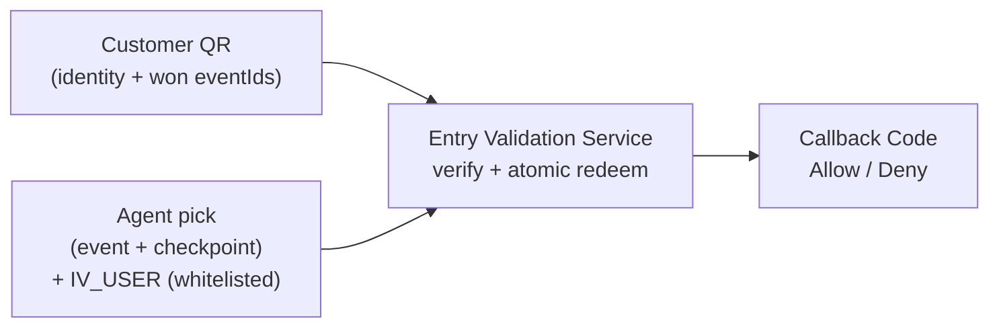
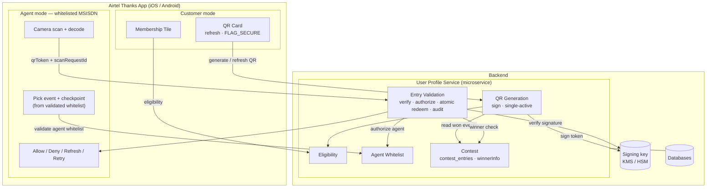
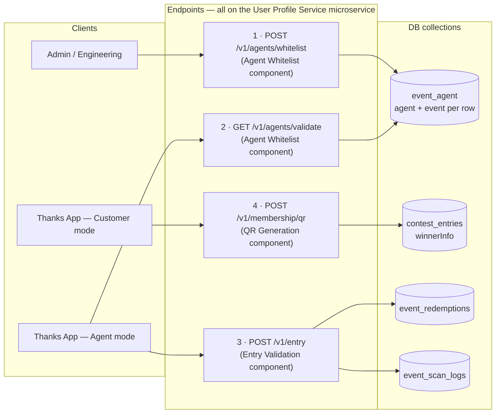
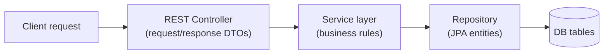
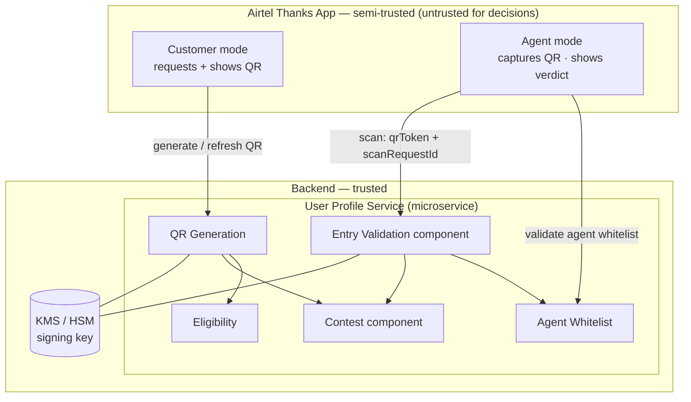
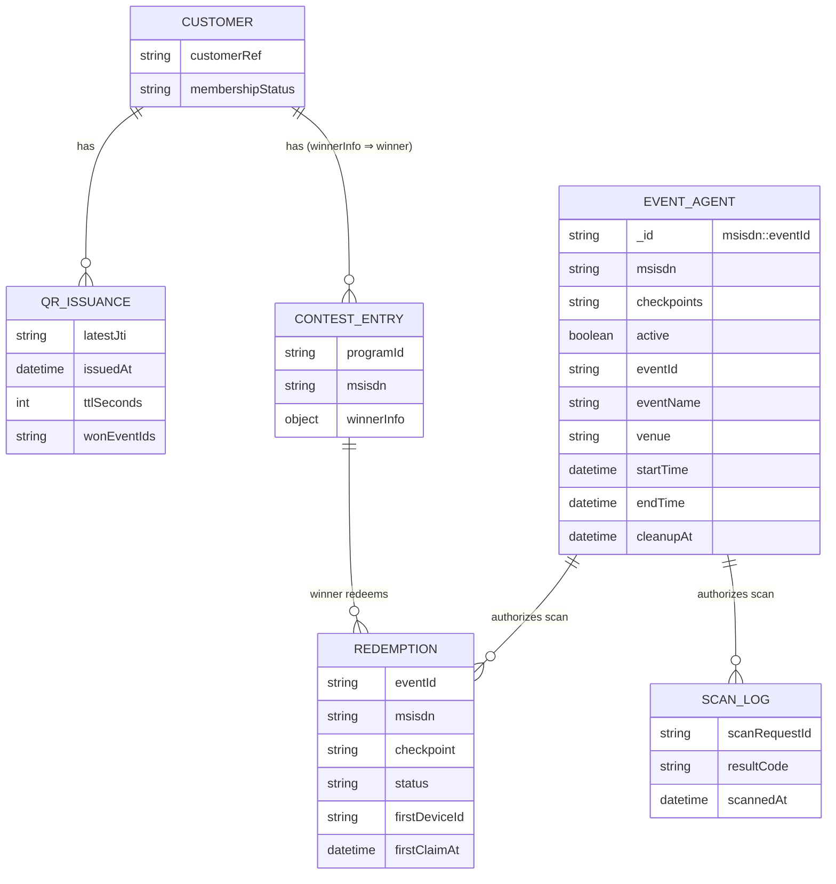
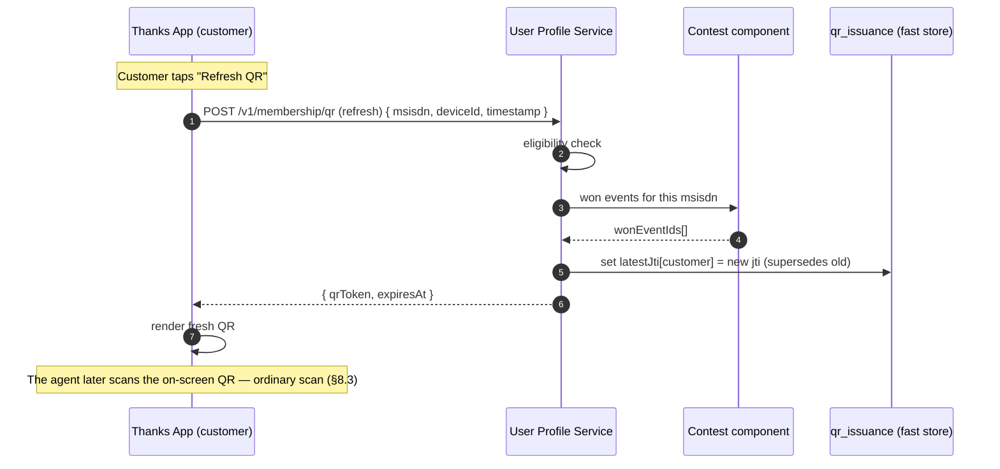
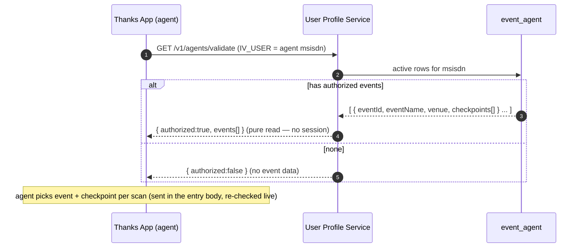
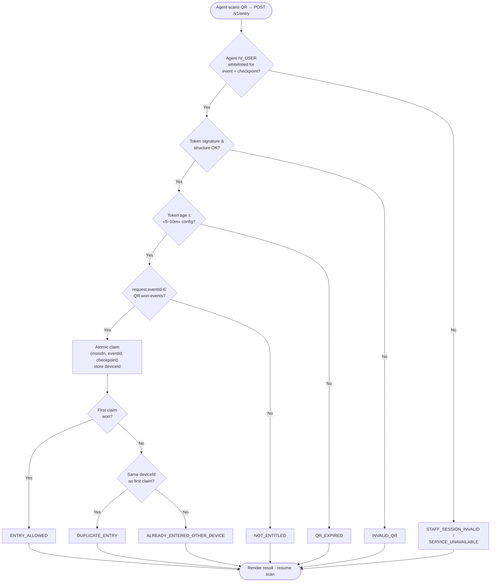

# HLD — Advantage Club Membership QR & Event Entry Validation

| | |
|---|---|
| **Document type** | High-Level Design |
| **Status** | Proposed — for review |
| **Author** | Amit Pawar |
| **Reviewers** | `[names]` |
| **Related** | [`LLD-EventPass.md`](./LLD-EventPass.md) (code-level LLD + full source), [`01-open-questions.md`](./01-open-questions.md) |
| **Date** | September 2026 |

---

## Table of Contents

1. [Design Principle](#1-design-principle)
2. [Checkpoint Model](#2-checkpoint-model)
3. [Component Map (Block Diagram)](#3-component-map-block-diagram)
4. [Component Responsibilities](#4-component-responsibilities)
5. [Service Layering (Controller / Service / Repository)](#5-service-layering-controller--service--repository)
6. [Trust Boundaries](#6-trust-boundaries)
7. [Data Domains](#7-data-domains)
8. [Primary Flows (Sequence Diagrams)](#8-primary-flows-sequence-diagrams)
9. [API Surface — the Five Endpoints](#9-api-surface--the-five-endpoints)
10. [Entry Decision Flow (Flowchart)](#10-entry-decision-flow-flowchart)
11. [Entry Decisions → Callback Codes](#11-entry-decisions--callback-codes)
12. [Cross-Cutting Concerns](#12-cross-cutting-concerns)
13. [Open Decisions](#13-open-decisions)

---

## 1. Design Principle

> **Identity + won-events QR, whitelist-authorized checkpoint. One app for both roles.**
> The QR proves **who** the customer is **and which events they have won** — the winning
> `eventId`s are read from the **Contest component** at generation time and **signed into the
> token** by the **User Profile Service**. The QR is **generated by the User Profile Service and
> shown inside the Airtel Thanks App**. Scanning is **also done inside the Airtel Thanks App**, by
> an **agent whose MSISDN is whitelisted** for the event — **there is no separate microsite**. The
> **checkpoint** (ENTRY / GOODIE) and the **event being scanned** are **picked by the agent and sent
> on each scan**, and re-checked live against the agent's whitelist (there is **no session** — the
> agent is already authenticated by the Thanks App login, `IV_USER`). Entry is allowed when the
> scanned event is among the QR's won events **and** that `(customer, event, checkpoint)` has not
> already been redeemed — an **atomic, exactly-once, per-checkpoint** operation.

Consequences:

- **One Airtel Thanks App, two modes** — *customer mode* shows the QR; *agent mode* (unlocked only for whitelisted MSISDNs) scans it.
- A customer who has won multiple events carries **all** their won `eventId`s in the one signed token.
- No per-event logic on the client; the winner source of truth is the **Contest component**, and the agent's authority is the **whitelist held in the User Profile Service**.

```mermaid
flowchart LR
  QR["Customer QR\n(identity + won eventIds)"]
  PICK["Agent pick\n(event + checkpoint)\n+ IV_USER (whitelisted)"]
  VAL["Entry Validation Service\nverify + atomic redeem"]
  OUT["Callback Code\nAllow / Deny"]

  QR --> VAL
  PICK --> VAL
  VAL --> OUT
```

---

## 2. Checkpoint Model

A **checkpoint** is the ingress an agent is scanning at. Each event has **two**, and they are
**independent one-time redemptions**:

| Checkpoint | Meaning | Redemption rule |
|---|---|---|
| **`ENTRY`** | Physical **admission gate** to the event | One admission per winner per event |
| **`GOODIE`** | **Goodie / collectible distribution** desk | One collection per winner per event |

- The two are independent: a winner can be admitted at `ENTRY` **and separately** collect at `GOODIE`; **order does not matter**, and using one does not consume the other.
- An agent is whitelisted, **per event**, for **`ENTRY` only, `GOODIE` only, or both**. In agent mode they may operate only the checkpoints they are authorized for; if authorized for both, they can switch between them without re-validating.
- The active checkpoint is **picked by the agent in the app** and sent on every scan, where it is re-checked against the agent's whitelist (no session).
- Redemption is tracked per **`(customer, event, checkpoint)`**, so the **same QR** redeems **once at ENTRY** and **once at GOODIE** for a given event.

---

## 3. Component Map (Block Diagram)

```mermaid
flowchart TB
  subgraph App["Airtel Thanks App (iOS / Android)"]
    subgraph Cust["Customer mode"]
      TILE[Membership Tile]
      QRC["QR Card\nrefresh · FLAG_SECURE"]
    end
    subgraph Agt["Agent mode — whitelisted MSISDN"]
      PICK["Pick event + checkpoint\n(from validated whitelist)"]
      SCAN["Camera scan + decode"]
      RESULT["Allow / Deny / Refresh / Retry"]
    end
  end

  subgraph Backend["Backend"]
    subgraph UPS["User Profile Service (microservice)"]
      QRG["QR Generation\nsign · single-active"]
      ELIG["Eligibility"]
      WLC["Agent Whitelist"]
      CTS["Contest\ncontest_entries · winnerInfo"]
      EVS["Entry Validation\nverify · authorize · atomic redeem · audit"]
    end
    KMS[("Signing key\nKMS / HSM")]
    DB[(Databases)]
  end

  TILE -->|eligibility| ELIG
  QRC -->|generate / refresh QR| QRG
  PICK -->|validate agent whitelist| WLC
  SCAN -->|qrToken + scanRequestId| EVS
  EVS --> RESULT

  QRG --> ELIG
  QRG -->|read won events| CTS
  QRG -->|sign token| KMS
  EVS -->|authorize agent| WLC
  EVS -->|winner check| CTS
  EVS -->|verify signature| KMS
  UPS --- DB
```

### API ↔ owning-service wiring

```mermaid
flowchart LR
  subgraph Clients
    ADMIN[Admin / Engineering]
    ACUST[Thanks App — Customer mode]
    AAGENT[Thanks App — Agent mode]
  end

  subgraph Endpoints["Endpoints — all on the User Profile Service microservice"]
    A1["1 · POST /v1/agents/whitelist\n(Agent Whitelist component)"]
    A2["2 · GET /v1/agents/validate\n(Agent Whitelist component)"]
    A3["3 · POST /v1/entry\n(Entry Validation component)"]
    A4["4 · POST /v1/membership/qr\n(QR Generation component)"]
  end

  subgraph Data["DB collections"]
    EA[(event_agent\nagent + event per row)]
    CW[(contest_entries\nwinnerInfo)]
    RDM[(event_redemptions)]
    LOG[(event_scan_logs)]
  end

  ADMIN --> A1 --> EA
  AAGENT --> A2 --> EA
  ACUST --> A4 --> CW
  AAGENT --> A3 --> RDM
  A3 --> LOG
```

---

## 4. Component Responsibilities

The backend is **one microservice — the User Profile Service**. Contest, Entry Validation, QR
Generation, Eligibility, and Agent Whitelist are **components (modules) inside it**, not
separate deployables.

| Component | Responsibility |
|---|---|
| **Airtel Thanks App — Customer mode** | Renders the membership surfaces (icon, tile, splash, walkthrough) gated on eligibility, and the **QR Card**. Requests a QR from the **User Profile Service** and displays it; applies screenshot mitigation (Android `FLAG_SECURE`, iOS detect/obscure). Holds **no** event or winner logic. |
| **Airtel Thanks App — Agent mode** | Available **only** to MSISDNs whitelisted as event agents. After the **User Profile Service** validates the whitelist, the agent picks an **authorized event + checkpoint**, opens the camera, decodes a customer QR, and posts it to the **Entry Validation component**. Renders the returned decision. **Decides nothing — the backend decides.** |
| **User Profile Service (microservice)** | The single backend deployable and the customer- and agent-identity authority. It hosts all the components below and owns their data. |
| ├ **Eligibility component** | Membership status — active Postpaid + Fastlane / Advantage Club. Gates the customer surfaces and QR generation. |
| ├ **Agent Whitelist component** | The **agent whitelist** — which **events** and which **checkpoints** (ENTRY / GOODIE / both) each agent MSISDN may scan — held as the single **`event_agent`** collection (one row per agent+event, carrying that event's info). Read for validate (API 2) and re-checked live per scan. **No session** — the agent is authenticated by the Thanks App login (`IV_USER`). |
| ├ **QR Generation component** | On request, checks eligibility, reads the customer's won events from the **Contest component**, and returns a **signed, short-TTL** token (single-active per customer). |
| ├ **Contest component** | The existing contest engine. Sole source of truth for "**which events has this MSISDN won?**" — a winner is a **`contest_entries`** row whose **`winnerInfo`** is set (as `DrawServiceImpl` marks winners); a live **event maps to a contest `programId`**. **Read** at QR generation / re-checkable at entry, and **written** by the winner-admin override (API 5) which sets `winnerInfo` on an existing entry. |
| └ **Entry Validation component** | The **gate authority**. On each scan it verifies the token (signature, structure, TTL), confirms the **agent (`IV_USER`) is whitelisted** for the scanned **event + checkpoint**, checks that event is **among the QR's won events**, performs the **atomic per-checkpoint redemption**, writes the **audit log**, and returns a **callback code**. Also serves the **scan-history** API. |
| **Admin / Engineering tooling** | Not a UI role. Against the User Profile Service, it loads **contest winners** (Contest component) and **agent whitelist** rows (Agent Whitelist component — the first whitelist of an event also supplies that event's info), and retrieves **scan history** (Entry Validation component). |

---

## 5. Service Layering (Controller / Service / Repository)

Inside the **User Profile Service microservice**, each component is layered the same way (its
`@Service` beans below are components of that one deployable). Naming is explicit so the LLD and
code line up:

```mermaid
flowchart LR
  REQ[Client request] --> CTRL["REST Controller\n(request/response DTOs)"]
  CTRL --> SVC["Service layer\n(business rules)"]
  SVC --> REPO["Repository\n(JPA entities)"]
  REPO --> DBT[("DB tables")]
```

| Layer | Role | Example names |
|---|---|---|
| **Controller (API boundary)** | Accepts/returns **DTOs** only — never DB entities | `QrGenerateRequest` / `QrGenerateResponse`, `AgentValidateResponse`, `EntryScanRequest` / `EntryScanResponse`, `WhitelistUpsertRequest` |
| **Service (business logic)** | Eligibility, whitelist checks, token mint/verify, redemption orchestration — all `@Service` components of the one microservice | `EligibilityService`, `ContestService`, `EntryValidationService`, `QrTokenService` |
| **Repository / DAO (persistence)** | DAO + `MongoTemplate` mapping **documents** ↔ **collections** | `EventAgentDao`→`event_agent` (one row per agent+event), `EventRedemptionDao`→`event_redemptions`, `ScanLogDao`→`event_scan_logs`; `WinnerLookupService` **reads** `contest_entries` (winnerInfo) |

- **DTOs never leak DB entities** to the client (and never carry raw PII beyond what a screen needs — see Q14).
- The **QR token** is minted/verified in the Service layer; the signing key sits behind KMS/HSM, not in any entity.
- The fast store for **single-active QR** (`qr_issuance`: latest `jti` per customer, TTL'd) is accessed from the User Profile Service layer, not a JPA table.

---

## 6. Trust Boundaries

The **backend is one microservice — the User Profile Service** — and everything the gate trusts
lives inside it: the **QR Generation**, **Eligibility**, **Agent Whitelist**, **Contest**,
and **Entry Validation** components are modules of that one microservice, not separate deployables.

```mermaid
flowchart TB
  subgraph Client["Airtel Thanks App — semi-trusted (untrusted for decisions)"]
    CUST["Customer mode\nrequests + shows QR"]
    AGT["Agent mode\ncaptures QR · shows verdict"]
  end

  subgraph Trusted["Backend — trusted"]
    subgraph UPS["User Profile Service (microservice)"]
      QRG[QR Generation]
      ELIG[Eligibility]
      WLC[Agent Whitelist]
      CTS[Contest component]
      EVS[Entry Validation component]
    end
    KMS[("KMS / HSM\nsigning key")]
  end

  CUST -->|generate / refresh QR| QRG
  AGT -->|validate agent whitelist| WLC
  AGT -->|scan: qrToken + scanRequestId| EVS
  QRG --> ELIG
  QRG --> CTS
  EVS --> WLC
  EVS --> CTS
  QRG --- KMS
  EVS --- KMS
```

- **The app is semi-trusted** — it can request a QR and ask the User Profile Service to validate an agent, but neither the token nor the whitelist result lets the app decide anything at the gate.
- **Agent mode is untrusted for decisions** — it captures the customer QR and shows a verdict, but the **Entry Validation component** (inside the User Profile Service) makes the call server-side. The agent identity is the authenticated **`IV_USER`**; the event + checkpoint picked by the agent are **re-checked live against the agent's whitelist** on every scan, never trusted blindly.
- **The signing key lives only in the backend** (KMS/HSM). Compromising the app cannot forge tokens nor fabricate the won-events list — that list is **inside the signature**.

---

## 7. Data Domains

```mermaid
erDiagram
  CUSTOMER ||--o{ QR_ISSUANCE : has
  CUSTOMER ||--o{ CONTEST_ENTRY : "has (winnerInfo ⇒ winner)"
  CONTEST_ENTRY ||--o{ REDEMPTION : "winner redeems"
  EVENT_AGENT ||--o{ REDEMPTION : "authorizes scan"
  EVENT_AGENT ||--o{ SCAN_LOG : "authorizes scan"

  CUSTOMER {
    string customerRef
    string membershipStatus
  }
  QR_ISSUANCE {
    string latestJti
    datetime issuedAt
    int ttlSeconds
    string wonEventIds
  }
  EVENT_AGENT {
    string _id "msisdn::eventId"
    string msisdn
    string checkpoints
    boolean active
    string eventId
    string eventName
    string venue
    datetime startTime
    datetime endTime
    datetime cleanupAt
  }
  CONTEST_ENTRY {
    string programId
    string msisdn
    object winnerInfo
  }
  REDEMPTION {
    string eventId
    string msisdn
    string checkpoint
    string status
    string firstDeviceId
    datetime firstClaimAt
  }
  SCAN_LOG {
    string scanRequestId
    string resultCode
    datetime scannedAt
  }
```

| Domain | Owner | Contents |
|---|---|---|
| Customer / eligibility | **User Profile Service** | Membership status, customer reference |
| QR issuance (`qr_issuance`) | **User Profile Service** | Per-customer latest `jti` + issue time + **won `eventId`s** (fast store, TTL'd) — powers single-active + TTL |
| **Agent↔event** (`event_agent`) | **Agent Whitelist component** | **The single collection**: one doc per **(agent, event)**, composite key `msisdn::eventId`, carrying the **checkpoints** that agent may scan + `active` **and that one event's info** (name/venue/window) + **`cleanupAt = endTime+30d`** (TTL). One agent MSISDN holds many rows; there is no separate event or session collection |
| **Contest** (existing `contest_entries`) | **Contest component** | The **winner source of truth**: a `contest_entries` row with **`winnerInfo`** set is a winner; **event = `programId`**. Read at QR generation; **written** only by API 5 (winner override, sets `winnerInfo`) |
| Redemption (`event_redemptions`) | **Entry Validation component** | unique `(eventId, msisdn, checkpoint)` + first-claim deviceId & time + **`cleanupAt`** (TTL) — the exactly-once anchor |
| Scan audit log (`event_scan_logs`) | **Entry Validation component** | Append-only **audit: which agent scanned which customer for which event** (+ callback, ts); **`cleanupAt`** (TTL) |

*(Concrete schema, columns, and constraints in the [consolidated LLD](./LLD-EventPass.md).)*

---

## 8. Primary Flows (Sequence Diagrams)

### 8.1 Customer opens the QR card (QR generated by the User Profile Service)

```mermaid
sequenceDiagram
  autonumber
  participant App as Thanks App (customer)
  participant UPS as User Profile Service
  participant CTS as Contest component
  participant Store as qr_issuance (fast store)
  participant KMS as KMS / HSM

  App->>UPS: POST /v1/membership/qr { msisdn, deviceId, timestamp }
  UPS->>UPS: eligibility check (Advantage Club member?)
  UPS->>CTS: which events has this msisdn won?
  CTS-->>UPS: wonEventIds[]
  UPS->>KMS: sign token { sub, dev, events: wonEventIds[], jti, iat }
  KMS-->>UPS: signature
  UPS->>Store: set latestJti[customer] = jti (single-active); TTL «5–10m»
  UPS-->>App: { qrToken, expiresAt }

  App->>App: render QR (FLAG_SECURE / iOS mitigation)
  Note over App: Refresh → re-generate → new jti supersedes old
```

### 8.2 Agent validation (inside the Thanks App — whitelist checked at the User Profile Service)

```mermaid
sequenceDiagram
  autonumber
  participant App as Thanks App (agent)
  participant UPS as User Profile Service
  participant DB as event_agent

  App->>UPS: GET /v1/agents/validate (IV_USER = agent msisdn)
  UPS->>DB: active rows where msisdn whitelisted
  alt whitelisted for ≥ 1 event
    DB-->>UPS: [ { eventId, eventName, venue, checkpoints[] }, ... ]
    UPS-->>App: { authorized:true, events[] }  (pure read — no session)
    App->>App: agent picks one event + checkpoint (only from authorized set), sent on each scan
  else not whitelisted
    DB-->>UPS: none
    UPS-->>App: { authorized:false }  (not an event agent, no event data)
  end

  Note over App: If authorized for both checkpoints, switch freely; each scan is re-checked against the whitelist
```

### 8.3 Scan & validate (agent mode in the app → Entry Validation Service)

```mermaid
sequenceDiagram
  autonumber
  participant App as Thanks App (agent)
  participant EVS as Entry Validation Service
  participant UPS as User Profile Service
  participant KMS as KMS / HSM
  participant DB as event_redemptions / event_scan_logs

  App->>App: decode customer QR → qrToken; pause scanning
  App->>EVS: POST /v1/entry { qrToken, eventId, checkpoint, scanRequestId } (IV_USER = agent msisdn)

  EVS->>UPS: is agent (IV_USER) whitelisted for (eventId, checkpoint)?
  UPS-->>EVS: ok (event_agent row; carries cleanupAt)

  alt scanRequestId already seen
    EVS-->>App: original stored result (idempotent)
  else new request
    EVS->>KMS: verify structure / signature / TTL
    alt invalid / forged
      EVS-->>App: INVALID_QR
    else expired
      EVS-->>App: QR_EXPIRED
    else ok
      KMS-->>EVS: ok → { customerRef, deviceId, wonEventIds[] }
      EVS->>EVS: request.eventId ∈ wonEventIds ?
      alt not in list
        EVS-->>App: NOT_ENTITLED
      else winner for this event
        EVS->>DB: atomic redeem (msisdn, eventId, checkpoint) store deviceId
        alt won the race (1 row)
          EVS->>DB: write audit ENTRY_ALLOWED
          EVS-->>App: ENTRY_ALLOWED (+ masked identity)
        else already redeemed (0 rows)
          EVS->>DB: read first-claim deviceId + time; write audit
          alt same deviceId
            EVS-->>App: DUPLICATE_ENTRY (+ first-claim time)
          else different deviceId
            EVS-->>App: ALREADY_ENTERED_OTHER_DEVICE (+ first deviceId)
          end
        end
      end
    end
  end

  App->>App: render colour + text; resume scanning
```

### 8.4 Customer refreshes the QR (independent of the agent)

Refresh is purely a **customer ↔ User Profile Service** action — the agent is **not** part of it.
The customer taps **Refresh** (proactively, or because the agent said the QR looked expired — a
verbal, out-of-band nudge, never a system call), the app calls `POST /v1/membership/qr`, and the
User Profile Service returns a fresh token whose new `jti` supersedes the old one. The agent's
next scan is then just an ordinary scan of whatever QR is on screen (flow §8.3).

```mermaid
sequenceDiagram
  autonumber
  participant CApp as Thanks App (customer)
  participant UPS as User Profile Service
  participant CTS as Contest component
  participant Store as qr_issuance (fast store)

  Note over CApp: Customer taps "Refresh QR"
  CApp->>UPS: POST /v1/membership/qr (refresh) { msisdn, deviceId, timestamp }
  UPS->>UPS: eligibility check
  UPS->>CTS: won events for this msisdn
  CTS-->>UPS: wonEventIds[]
  UPS->>Store: set latestJti[customer] = new jti (supersedes old)
  UPS-->>CApp: { qrToken, expiresAt }
  CApp->>CApp: render fresh QR
  Note over CApp: The agent later scans the on-screen QR — ordinary scan (§8.3)
```

---

## 9. API Surface — the Five Endpoints

All endpoints are exposed by the **User Profile Service microservice**; the "Owning component"
column names the internal module that handles each.

| # | Method / Endpoint | Owning component (in User Profile Service) | Caller | Purpose | Key inputs | Success output |
|---|---|---|---|---|---|---|
| 1a | `POST /v1/agents/whitelist` | Agent Whitelist | Admin / eng | **Create** — whitelist an agent MSISDN for an event with checkpoints; the **first** whitelist of an event supplies its info (`eventName`/`venue`/`startTime`/`endTime` → `cleanupAt = endTime+30d`), inherited by later agents | `msisdn`, `eventId`, `checkpoints[]`, `active?`, event info (first time) | `{eventId, msisdn, status}` |
| 1b | `GET /v1/agents/whitelist` | Agent Whitelist | Admin / eng | **Read** — one row (`eventId`+`msisdn`) or all rows for an event | `eventId`, `msisdn?` | `[{eventId, eventName, venue, msisdn, checkpoints[], active}]` |
| 1c | `PUT /v1/agents/whitelist` | Agent Whitelist | Admin / eng | **Update** — change checkpoints and/or active flag | `eventId`, `msisdn`, `checkpoints?`, `active?` | updated row |
| 1d | `DELETE /v1/agents/whitelist` | Agent Whitelist | Admin / eng | **Delete** — remove the `(eventId, msisdn)` row | `eventId`, `msisdn` | `{status:"DELETED"}` |
| 2 | `GET /v1/agents/validate` | Agent Whitelist | Thanks App (agent) | **Pure read:** validate the agent and list authorized events + checkpoints (no session) | agent `msisdn` (`IV_USER`) | `{authorized, events[]}` |
| 3 | `POST /v1/entry` | Entry Validation | Thanks App (agent) | Record an entry after scanning (agent identity via `IV_USER` header) | `qrToken`, `eventId`, `checkpoint`, `scanRequestId` | `ENTRY_ALLOWED` / duplicate / other-device / expired |
| 4a | `POST /v1/membership/qr` | QR Generation | Thanks App (customer) | **Generate** — always mint a fresh signed QR | `deviceId`, `timestamp` (+ `IV_USER`) | signed `qrToken` (+ `expiresAt`) |
| 4b | `POST /v1/membership/qr/validate` | QR Generation | Thanks App (customer) | **Validate / get-or-create** — return the cached live QR from Aerospike if present, else mint new | `deviceId` (+ `IV_USER`) | signed `qrToken` (+ `expiresAt`) |
| 4c | `POST /v1/membership/qr/refresh` | QR Generation | Thanks App (customer) | **Refresh** — force a new QR (supersede the previous) | `deviceId` (+ `IV_USER`) | signed `qrToken` (+ `expiresAt`) |
| 5 | `POST /v1/admin/winners` | Contest (winner write) | Admin / eng | **Mark/update a winner** on the customer's existing `contest_entries` doc (sets `winnerInfo`) | `eventId`, `msisdn`, `rank?`, `drawId?` | `{entriesUpdated, status}` |

**Notes**
- **Single validate call (pure read)** — `GET /v1/agents/validate` lists the agent's authorized events/checkpoints. There is **no session** — the agent is authenticated by the Thanks App login (`IV_USER`), which is sent on API 3 as well; the agent picks event + checkpoint per scan (sent in the entry body and re-checked live against the whitelist).
- **No microsite** — API 2 and API 3 are called by the **Airtel Thanks App in agent mode**; the agent's MSISDN is already authenticated by the app (carried as `IV_USER`).
- **No OTP** — agent authority is the User Profile Service **whitelist** (per event + checkpoint). See Q10.
- **Whitelist carries checkpoints** — a `(eventId, msisdn)` row lists ENTRY, GOODIE, or both; every scan's `(eventId, checkpoint)` is re-checked live against it.
- **Every entry decision is HTTP 200 + callback** (INVALID_QR / QR_EXPIRED / STAFF_SESSION_INVALID included) so the scanner always renders a result; only unexpected faults map to `SERVICE_UNAVAILABLE`.
- **Winners: draw or admin API** — winners are normally produced by the existing **contest draw** (`contest_entries.winnerInfo`). **API 5** is a manual override that sets `winnerInfo` on the customer's existing entry; it **never creates an entry** (the customer must have played the contest). A newly-marked win is picked up on the customer's next QR refresh.
- **Whitelist CRUD** — API 1 is a full admin CRUD (`POST` create, `GET` read, `PUT` update, `DELETE`) on the single `event_agent` collection. There is **no separate event-admin API**: the first whitelist of an event carries its info (`eventName`/`venue`/`startTime`/`endTime`), so the event comes into being with its first agent, and later agents inherit that info.
- **Agent↔event collection + 30-day retention (TTL)** — a **single `event_agent` collection**, one doc per **(agent, event)** keyed by `msisdn::eventId`, carrying the agent's checkpoints/active **and** that event's info. Each row owns its **`cleanupAt = endTime + 30d`** and is TTL-expired independently; `event_redemptions` and `event_scan_logs` carry the same `cleanupAt`. A Mongo **TTL index** auto-deletes everything 30 days after the event ends — no cron, no separate event or session collection. There is **no standalone agent doc**, so an agent with no events for 30 days leaves no data behind. The **audit record** of *which agent scanned which customer for which event* is `event_scan_logs`, retained for the same 30-day window.
- **QR generate vs validate vs refresh** — `validate` (4b) is get-or-create: it returns the **cached live QR** from the Aerospike active-QR store if one exists for this customer+device, else mints a new one (the default the app calls on card open). `generate` (4a) and `refresh` (4c) always mint a fresh QR (supersede). The active-QR store now caches the **whole token** (not just the `jti`) so validate can return it as-is.

### 9.1 API 1 — Whitelist an agent MSISDN (with checkpoints)

```mermaid
sequenceDiagram
  autonumber
  participant Admin
  participant UPS as User Profile Service
  participant DB as event_agent

  Admin->>UPS: POST /v1/agents/whitelist { msisdn, eventId, checkpoints[], event info (first time) }
  UPS->>UPS: authz (eng only); set or inherit event info; cleanupAt = endTime + 30d
  UPS->>DB: upsert row _id = msisdn::eventId (agent + event info)
  UPS-->>Admin: 200 { eventId, msisdn, status }

  Note over UPS,DB: Idempotent; one MSISDN can be whitelisted for many events (one row each); mid-event appends allowed
```

### 9.2 API 2 — Validate agent & list authorized events/checkpoints

```mermaid
sequenceDiagram
  autonumber
  participant App as Thanks App (agent)
  participant UPS as User Profile Service
  participant DB as event_agent

  App->>UPS: GET /v1/agents/validate (IV_USER = agent msisdn)
  UPS->>DB: active rows for msisdn
  alt has authorized events
    DB-->>UPS: [ { eventId, eventName, venue, checkpoints[] } ... ]
    UPS-->>App: { authorized:true, events[] }   (pure read — no session)
  else none
    UPS-->>App: { authorized:false } (no event data)
  end
  Note over App: agent picks event + checkpoint per scan (sent in the entry body, re-checked live)
```

### 9.3 API 3 — Entry after scan (won-events + device + TTL)

The `eventId` + `checkpoint` come in the **request** and are re-checked live against the agent's
**`event_agent` row** (keyed by the `IV_USER` agent msisdn); the winner check is
**`request.eventId ∈ token.wonEventIds`**. The dedup record is keyed **`(msisdn, eventId, checkpoint)`**
and stores the `deviceId` + timestamp of the first entry.

```mermaid
sequenceDiagram
  autonumber
  participant App as Thanks App (agent)
  participant EVS as Entry Validation Service
  participant KMS as KMS / HSM
  participant DB as redemption

  App->>App: decode QR → qrToken (carries msisdn, deviceId, wonEventIds[], iat)
  App->>EVS: POST /v1/entry { qrToken, eventId, checkpoint, scanRequestId } (IV_USER = agent msisdn)

  EVS->>EVS: agent (IV_USER) whitelisted for (eventId, checkpoint)?
  EVS->>KMS: verify signature + structure

  alt bad / forged
    EVS-->>App: INVALID_QR
  else ok
    EVS->>EVS: token age > «5–10m config»?
    alt too old
      EVS-->>App: QR_EXPIRED (refresh & rescan)
    else fresh
      EVS->>EVS: request.eventId ∈ token.wonEventIds ?
      alt not a winner for this event
        EVS-->>App: NOT_ENTITLED
      else winner
        EVS->>DB: atomic claim (msisdn, eventId, checkpoint) storing deviceId
        alt first claim (won)
          EVS->>DB: write audit ENTRY_ALLOWED
          EVS-->>App: ENTRY_ALLOWED
        else already claimed
          EVS->>DB: read stored deviceId
          alt same deviceId
            EVS-->>App: DUPLICATE_ENTRY
          else different deviceId
            EVS-->>App: ALREADY_ENTERED_OTHER_DEVICE
          end
        end
      end
    end
  end

  App->>App: render result; resume scanning
```

### 9.4 API 4 — Generate the signed QR (from contest tables)

```mermaid
sequenceDiagram
  autonumber
  participant App as Thanks App (customer)
  participant UPS as User Profile Service
  participant CTS as Contest component
  participant KMS as KMS / HSM

  App->>UPS: POST /v1/membership/qr { msisdn, deviceId, timestamp }
  UPS->>UPS: eligibility check (Advantage Club member?)
  UPS->>CTS: which events has this msisdn won? (contest_entries where winnerInfo set)
  CTS-->>UPS: wonEventIds[]
  UPS->>KMS: sign token { sub, dev, events: wonEventIds[], iat, jti }
  KMS-->>UPS: signature
  UPS->>UPS: set latestJti[msisdn] (single-active); TTL «5–10m»
  UPS-->>App: { qrToken, expiresAt }

  Note over App: Won multiple events → ALL eventIds ride in one token.<br/>Refresh re-calls API 4 → new jti supersedes old
```

### 9.5 API 5 — Mark/update a winner (writes `contest_entries.winnerInfo`)

```mermaid
sequenceDiagram
  autonumber
  participant Admin
  participant WA as Winner Admin (Contest write)
  participant DB as contest_entries

  Admin->>WA: POST /v1/admin/winners { eventId, msisdn, rank?, drawId? }
  WA->>WA: authz (eng only); build WinnerInfo{rank, drawId, createdAt}
  WA->>DB: updateMulti(programId==eventId, msisdn) set winnerInfo
  alt ≥ 1 entry matched
    DB-->>WA: matchedCount
    WA-->>Admin: { entriesUpdated, status: WINNER_MARKED }
  else no entry for (event, msisdn)
    DB-->>WA: 0
    WA-->>Admin: 400 — customer never entered this contest (no entry to mark)
  end

  Note over Admin,DB: Winner is picked up in the customer's next QR (API 4 reads winnerInfo).
```

---

## 10. Entry Decision Flow (Flowchart)

```mermaid
flowchart TD
  START([Agent scans QR → POST /v1/entry]) --> SESS{Agent IV_USER\nwhitelisted for\nevent + checkpoint?}
  SESS -->|No| DENY1[STAFF_SESSION_INVALID /\nSERVICE_UNAVAILABLE]
  SESS -->|Yes| SIG{Token signature &\nstructure OK?}

  SIG -->|No| INV[INVALID_QR]
  SIG -->|Yes| TTL{Token age ≤\n«5–10m» config?}

  TTL -->|No| EXP[QR_EXPIRED]
  TTL -->|Yes| WIN{"request.eventId ∈\nQR won-events?"}

  WIN -->|No| NE[NOT_ENTITLED]
  WIN -->|Yes| ATOM["Atomic claim\n(msisdn, eventId, checkpoint)\nstore deviceId"]

  ATOM --> FIRST{First claim\nwon?}
  FIRST -->|Yes| OK[ENTRY_ALLOWED]
  FIRST -->|No| DEV{Same deviceId\nas first claim?}

  DEV -->|Yes| DUP[DUPLICATE_ENTRY]
  DEV -->|No| OTHER[ALREADY_ENTERED_OTHER_DEVICE]

  OK --> END([Render result · resume scan])
  DUP --> END
  OTHER --> END
  NE --> END
  EXP --> END
  INV --> END
  DENY1 --> END
```

---

## 11. Entry Decisions → Callback Codes

| Situation (API 3) | Callback | Admit? | Agent message |
|---|---|:---:|---|
| First valid scan at checkpoint | `ENTRY_ALLOWED` | ✅ | Entry allowed / goodie given |
| Same `(msisdn, event, checkpoint)`, **same** deviceId | `DUPLICATE_ENTRY` | ❌ | Already done on this device (show first-claim time) |
| Same `(msisdn, event, checkpoint)`, **different** deviceId | `ALREADY_ENTERED_OTHER_DEVICE` | ❌ | Already done on another device — returns that deviceId |
| `request.eventId` **not** in QR's won events | `NOT_ENTITLED` | ❌ | Member, not a winner for this event |
| Token older than «5–10m» config | `QR_EXPIRED` | ❌ | Ask customer to refresh & rescan |
| Forged / malformed / non-Airtel | `INVALID_QR` | ❌ | Open QR from the Airtel app |
| Backend error / timeout | `SERVICE_UNAVAILABLE` | ❌ | Retry; **never auto-allow** |

> **TTL note:** API 3 and API 4 read the **same** «5–10m» config knob (Q1). Issuance and
> validation must agree (recommend **5m**), and agent-facing copy must match.

---

## 12. Cross-Cutting Concerns

| Concern | Design |
|---|---|
| **Fail-safe defaults** | Unknown eligibility → Default (non-branded) surfaces; not a winner → `NOT_ENTITLED`; backend error → `SERVICE_UNAVAILABLE` — **never auto-allow** |
| **Authoritative time** | Server time governs TTL and audit; client timestamps are ignored |
| **Observability** | Live dashboards for scan latency (target **&lt; 2s**), allow/deny mix, error rates during events; alerting on Entry Validation Service health |
| **Config over code** | QR TTL and refresh limits are environment config — tunable during pilot without a release |
| **Platform parity** | iOS/Android functionally equivalent; only intentional divergence is screenshot handling (block vs. detect) — see Q5 |
| **Idempotency** | `scanRequestId` makes API 3 retries safe — return the original stored result |
| **Winner source of truth** | Only the **Contest component** declares winners — `contest_entries` rows with `winnerInfo` set (event = `programId`); read at generation (embedded in token) and re-checkable at entry |
| **Retention / cleanup** | All per-event data (`event_agent`, `event_redemptions`, `event_scan_logs`) carries `cleanupAt = endTime + 30d` with a **Mongo TTL index** → auto-purged 30 days after the event ends, no cron. No separate event or session collection, and no standalone agent doc → an agent with no events for 30 days leaves nothing behind |
| **DTOs vs entities** | Controllers speak DTOs; DB entities never cross the API boundary (§5) |

---

## 13. Open Decisions

| # | Question | Impact |
|---|---|---|
| **Q1** | QR TTL value (recommend **5m**) | API 3 & API 4 must share the same knob; agent copy must match |
| **Q5** | Screenshot handling — block (Android) vs detect (iOS) | Platform parity |
| **Q10** | **Agent auth is whitelist-only (no OTP).** Possession of the MSISDN is proven by the Thanks App's own login; is the app-auth + whitelist combination sufficient, or add an extra agent step? | Agent-side security |
| **Q22** | `deviceId` is the **customer's** QR-generating device (agent whitelist is MSISDN + checkpoints, no deviceId). Needs a **stable** id; screenshots carry the original deviceId → read as `DUPLICATE_ENTRY` | API 3 dedup semantics |
| **Q23** | **Event ↔ contest mapping.** The winner check treats a live event as a contest **`programId`** (winner = `contest_entries` row with `winnerInfo`). Confirm this holds — if an event spans multiple contests or keys on `campaignId`, the winner query and the token's `events[]` change accordingly. | Winner resolution |
| **Q24** | **30-day retention** — TTL purges `event_agent` + redemptions + **scan audit** 30 days after `endTime`. Confirm the audit/redemption retention is acceptable (disputes closed within 30d), and whether an **archival export** is needed before purge. | Compliance / audit |

---

*Concrete schema, indexes, DTOs, request/response contracts, and the full source are in the [consolidated LLD](./LLD-EventPass.md).*
