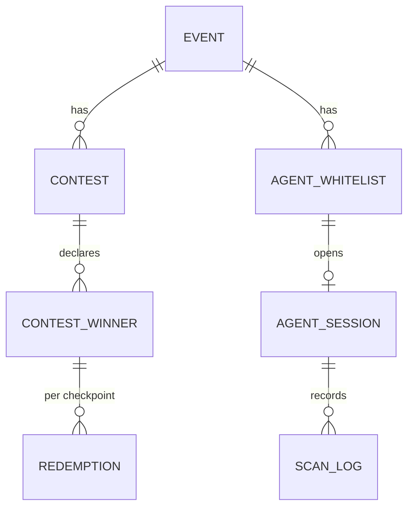
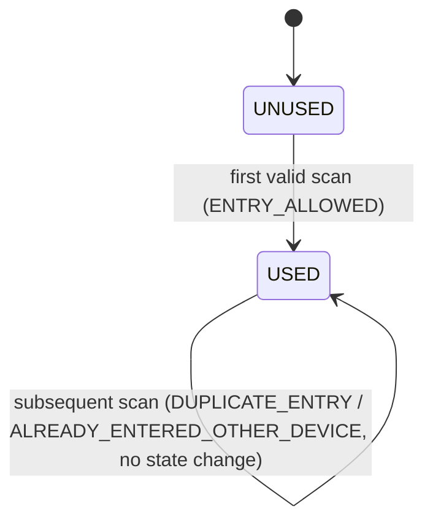

# Low-Level Design (LLD)

Concrete enough to build against. Values shown as `«config»` are environment-tunable
(see open questions Q1, Q2, Q10, Q13, Q20).

**Service ownership (see HLD §4–6):** the backend is **one microservice — the User Profile
Service**. Its internal components: **QR Generation** mints the token, **Eligibility** and **Agent
Whitelist & Session** gate it, **Contest** is the winner source of truth, and **Entry Validation**
validates scans. They are modules of the one deployable, not separate services. Both the customer
QR and the agent scanner live **inside the Airtel Thanks App** — there is no microsite.

## 1. QR token

**Format:** a signed, compact token (JWS/JWT-style) — opaque to the app and the agent scanner.
Encoded into the QR as a plain string (not a URL). Minted/verified in the **Service layer**
(User Profile Service signs at generation; Entry Validation Service verifies at scan); the signing
key stays behind KMS/HSM and never appears in a DTO or DB entity.

**Claims:**

| Claim | Meaning |
|---|---|
| `ver` | token schema version (enables clean upgrades; unknown ⇒ `INVALID_QR`) |
| `sub` | **opaque customer reference** — never the raw MSISDN (Q3) |
| `dev` | **deviceId** of the customer device that generated the QR (Q22) — powers the API 3 duplicate vs. other-device split |
| `events` | **array of won `eventId`s** for this customer, resolved from the **contest tables** at generation (see §7 API 4). If the customer won multiple events, all ride here. Entry check is `session.eventId ∈ events` |
| `jti` | unique id for *this* issuance — the single-active anchor |
| `iat` | issued-at (server clock) |
| `exp` | `iat + «TTL=5m»` (defense-in-depth; server re-checks against `latestJti` too) |
| `iss` | issuing service id |
| signature | detached signature over the header+payload with the backend signing key |

> Because `events` is **inside the signature**, the scanner/app cannot add or edit an eventId to
> force an admit. A win declared *after* the QR was issued isn't in the token — the customer's next
> refresh (or a natural re-issue within the ~5m TTL) picks it up. Entry MAY additionally re-check
> the contest tables server-side for defense in depth; the token's `events` is the primary check.

**Signing:** asymmetric (e.g. ES256/EdDSA). Private key in KMS/HSM, backend-only. The validation
service verifies with the public key. Support **key rotation** via a `kid` header.

**Single-active enforcement (why `exp` alone isn't enough):** to make "Refresh invalidates the
previous QR **immediately**" (FR12) and "an old shared screenshot stops working" (US5) true even
*within* the TTL, the QR service keeps a per-customer pointer:

```
KV (fast store, e.g. Redis):  qr:latest:{customerRef} = { jti, iat }   TTL = «TTL»
```

- **Issue/refresh:** mint token, overwrite `qr:latest:{customerRef}`.
- **Verify (at scan):** signature ok **AND** not past `exp` **AND** `jti == qr:latest[sub]`.
  - signature bad / `ver` unknown / malformed → `INVALID_QR`
  - past `exp` **or** `jti != latest` (superseded) → `QR_EXPIRED` (customer refreshes → passes)

This gives forgery-proofing (signature) + instant supersede (latest pointer) + hard TTL.

## 2. Data model

All tables map to JPA entities via repositories (HLD §5); the API boundary uses DTOs, never these
entities.



### `event`
`event_id (PK, e.g. ARTLPPAZK)`, `name`, `venue`, `starts_at`, `ends_at`, `status (DRAFT|ACTIVE|CLOSED)`, `checkpoints_enabled (ENTRY,GOODIE)`, `created_by`, `created_at`.

### `contest` + `contest_winner` — winner source of truth
The **only** authority on who won what. QR generation (API 4) reads these to build the token's
`events[]`.

- **`contest`**: `contest_id (PK)`, `event_id (FK)`, `name`, `created_at`.
- **`contest_winner`**: `contest_winner_id (PK)`, `contest_id (FK)`, `event_id (FK, denormalized for fast lookup)`, `msisdn`, `created_at`. **Unique:** `(event_id, msisdn)`.

Winner check = "does a `contest_winner` row exist for `(event_id, msisdn)`?" Absence ⇒ `NOT_ENTITLED`.
Rows loaded/appended via the admin winner-load endpoint (§7).

### `redemption` — the exactly-once anchor (device-aware)
`redemption_id (PK)`, `msisdn`, `event_id`, `checkpoint (ENTRY|GOODIE)`, `status (USED)`, `device_id`, `redeemed_at`, `redeemed_by_agent_msisdn`, `scan_request_id`.
**Unique:** `(event_id, msisdn, checkpoint)` — this is the dedup key from API 3. The row stores the
`device_id` of the **first** entry, which powers the `DUPLICATE_ENTRY` vs.
`ALREADY_ENTERED_OTHER_DEVICE` split:

```
on API 3 claim, after winner + TTL + signature checks:
  INSERT (event_id, msisdn, checkpoint, device_id, ...) ON CONFLICT (event_id,msisdn,checkpoint) DO NOTHING
  inserted 1 row      -> ENTRY_ALLOWED
  inserted 0 rows     -> SELECT stored device_id:
                           stored device_id == incoming -> DUPLICATE_ENTRY
                           stored device_id != incoming -> ALREADY_ENTERED_OTHER_DEVICE (+ stored device_id)
```

Two build options (either satisfies FR25 — pick per DB ergonomics):
- **(a) Pre-seed + conditional UPDATE:** create a `UNUSED` row per `(event_id, msisdn, checkpoint)` at winner load; redeem = `UPDATE … WHERE status='UNUSED'`.
- **(b) Insert-on-conflict:** no pre-seed; redeem = `INSERT (event_id, msisdn, checkpoint, …)` guarded by the unique constraint; first insert wins, duplicate = already used.

### `agent_whitelist` — agent MSISDN + per-event checkpoints (owned by User Profile Service)
`event_id (FK)`, `msisdn`, `checkpoints (set of ENTRY|GOODIE — ENTRY only, GOODIE only, or both)`, `active`, `created_by`, `created_at`.
**Unique:** `(event_id, msisdn)`. One agent MSISDN can hold **many** rows (many events), each with its
own checkpoint set. This is the authority API 2 reads to list what an agent may scan. **No `deviceId`** —
device is a customer-side concept only (Q22). The agent's *identity* is proven by the Thanks App's
own login (the whitelist grants scanning authority, not identity).

### `agent_session` — active scanning session (owned by User Profile Service)
`session_id (PK)`, `msisdn`, `event_id`, `checkpoint`, `created_at`, `expires_at (=created_at+«24h»)`, `revoked (bool)`, `device_info`.
Bound to one `(msisdn, eventId, checkpoint)`. **Single-active:** opening a new session revokes prior
non-expired sessions for `msisdn`. An agent authorized for both checkpoints re-opens the session to
switch checkpoint (or the session carries the allowed set and the client sends the active one).

### `scan_log` — append-only audit (FR34/FR35)
`scan_id (PK)`, `scan_request_id`, `event_id`, `checkpoint`, `agent_msisdn`, `customer_ref (nullable if unresolved)`, `callback_code`, `server_ts`, `token_jti (nullable)`.
**Index:** by `customer_ref`, by `agent_msisdn`, and by `event_id` for the history API.
`scan_request_id` unique → idempotency (see §5).

## 3. Atomic redemption (reference SQL)

Option (a), conditional update inside a transaction (rows pre-seeded at winner load):

```sql
-- attempt redemption; rows_affected tells us who won
UPDATE redemption
   SET status = 'USED',
       device_id = :device_id,
       redeemed_at = :server_ts,
       redeemed_by_agent_msisdn = :agent_msisdn,
       scan_request_id = :scan_request_id
 WHERE event_id = :event_id
   AND msisdn = :msisdn
   AND checkpoint = :checkpoint
   AND status = 'UNUSED';
-- rows_affected = 1 -> ENTRY_ALLOWED
-- rows_affected = 0 -> already USED: SELECT device_id, redeemed_at for the device split + first-claim time
```

Option (b), insert-on-conflict (Postgres flavor):

```sql
INSERT INTO redemption (event_id, msisdn, checkpoint, status, device_id,
                        redeemed_at, redeemed_by_agent_msisdn, scan_request_id)
VALUES (:event_id, :msisdn, :checkpoint, 'USED', :device_id, :server_ts, :agent_msisdn, :scan_request_id)
ON CONFLICT (event_id, msisdn, checkpoint) DO NOTHING;
-- inserted 1 row -> ENTRY_ALLOWED
-- 0 rows -> SELECT existing device_id: same -> DUPLICATE_ENTRY ; different -> ALREADY_ENTERED_OTHER_DEVICE
```

Both make **two concurrent scans of the same QR at the same checkpoint** resolve to exactly one
`ENTRY_ALLOWED` + one already-claimed result (FR25/AC). ENTRY and GOODIE are separate rows, so a QR
redeemed at ENTRY still redeems once at GOODIE (FR28).

## 4. Backend validation chain (FR / §8.11 order)

For every scan, short-circuit on first failure:

| # | Check | On fail |
|---|---|---|
| 1 | agent session active & not revoked/expired | `STAFF_SESSION_INVALID` (stop, re-validate) |
| 2 | agent authorized (whitelist) for session's event & the sent checkpoint | `STAFF_SESSION_INVALID` |
| 3 | token structure & `ver` supported | `INVALID_QR` |
| 4 | signature valid | `INVALID_QR` |
| 5 | within TTL **and** `jti == latest` | `QR_EXPIRED` |
| 6 | `session.eventId ∈ token.events` (won-events from contest tables; optional server re-check of `contest_winner`) | `NOT_ENTITLED` |
| 7 | atomic redeem `(event_id, msisdn, checkpoint)` storing `device_id` | 1 row → `ENTRY_ALLOWED`; 0 rows → `DUPLICATE_ENTRY` (same device) / `ALREADY_ENTERED_OTHER_DEVICE` (different device) |
| 8 | write scan_log (always, including denials) | — |
| — | infra/exception at any point | `SERVICE_UNAVAILABLE` (never auto-allow, do **not** mark used) |

**Server timestamp is authoritative** everywhere (TTL, audit). Client-supplied time is ignored.
Note the event under check comes from the **session**, and the winner proof comes from the
**token's `events`** (built from contest tables at issue) — the client never supplies either.

State machine per `(event_id, msisdn, checkpoint)`:



## 5. Idempotency (`scanRequestId`)

- Scanner generates a UUID `scanRequestId` per **decoded QR** and **reuses it on retry** (contract, Q20).
- Backend, before the chain: `SELECT` prior `scan_log` by `scan_request_id`; if a **terminal** result exists, **replay it** (no re-redeem).
- `SERVICE_UNAVAILABLE` is **not** terminal → a retry re-runs the chain.
- Because redemption also stamps `scan_request_id`, a crash between "committed redeem" and "returned response" is safe: the retry finds the redemption already carries this `scanRequestId` and returns `ENTRY_ALLOWED`, not `ALREADY_USED`.

## 6. Callback codes (authoritative matrix)

| Callback | When | Admit? | Color | Entitlement | Scanner resumes |
|---|---|---|---|---|---|
| `ENTRY_ALLOWED` | first valid scan at checkpoint | ✅ | Green | → USED (this checkpoint) | yes |
| `DUPLICATE_ENTRY` | repeat at same checkpoint, **same** deviceId | ❌ | Red | unchanged | yes |
| `ALREADY_ENTERED_OTHER_DEVICE` | repeat at same checkpoint, **different** deviceId (returns first deviceId) | ❌ | Red | unchanged | yes |
| `NOT_ENTITLED` | valid member, but `session.eventId` not in the QR's won events | ❌ | Red | unchanged | yes |
| `INVALID_QR` | malformed/forged/non-Airtel/bad `ver`/bad sig | ❌ | Red | unchanged | yes |
| `QR_EXPIRED` | past TTL or superseded (`jti≠latest`) | ❌ (refresh) | Grey | unchanged | yes |
| `STAFF_SESSION_INVALID` | session revoked/expired/unauth | ❌ | Red | n/a | **no** (re-login) |
| `CAMERA_PERMISSION_DENIED` | browser denied camera | n/a | Instructional | n/a | after grant |
| `QR_NOT_DETECTED` | no QR in frame (client-only, no backend call) | n/a | Instructional | n/a | stays active |
| `SERVICE_UNAVAILABLE` | backend error/timeout | ❌ (retry) | Grey | **must not change** | stays active |

**Every result carries explicit text** (never color-only) — NFR accessibility.
`CAMERA_PERMISSION_DENIED` and `QR_NOT_DETECTED` are **local scanner states** with no backend call.

## 7. API contracts — the four endpoints

Each request/response below is a **DTO** at the controller boundary (never a DB entity). Owning
service is noted per endpoint.

### API 1 — `POST /v1/agents/whitelist` — **User Profile Service** (admin / eng only)
DTO `WhitelistUpsertRequest` / `WhitelistUpsertResponse`
```
body: { msisdn, eventId, checkpoints:["ENTRY"|"GOODIE"...] }     # MSISDN + per-event checkpoints
-> 200 { whitelistId, status:"UPSERTED" }
```
Idempotent upsert; unique `(eventId, msisdn)`; one MSISDN may be whitelisted for many events;
supports mid-event appends. Supporting admin endpoints:
```
POST /v1/admin/events                                  create event (returns eventId)   [Admin]
POST /v1/admin/contests/{eventId}/winners:bulkUpsert   load/append contest_winner rows   [Contest Service]
GET  /v1/admin/scan-history?msisdn=...                  full chronological history (FR35) [Entry Validation Service]:
       [ { eventId, checkpoint, callback, serverTs, agentMsisdn, deviceId } ]
```

### API 2 — `GET /v1/agents/validate` — **User Profile Service** (no OTP, no microsite)
DTO `AgentValidateResponse`
```
GET  /v1/agents/validate            # agent msisdn taken from the Thanks App's authenticated session
   -> if whitelisted & active:
        { agentSessionId, events:[ { eventId, name, venue, window, checkpoints:[...] } ... ] }
   -> if not: "not an event agent" (no event data leaked)
```
Called by the **Thanks App in agent mode**. The agent's identity is already proven by app login; the
whitelist grants scanning authority. The agent picks one authorized `event + checkpoint`, which opens
an `agent_session` (single-active per msisdn — a new one revokes the prior, FR21).

### API 3 — `POST /v1/entry` — **Entry Validation Service** (authenticated by agent session)
DTO `EntryScanRequest` / `EntryScanResponse`
```
body: { qrToken, checkpoint, scanRequestId }     # eventId comes from the AGENT SESSION, not the body
-> 200 { callback, holderMasked?, firstClaimAt?, otherDeviceId?, displayColor, message }
```
- `checkpoint` validated against the agent's authorized set; `eventId` is the session's event.
- `msisdn`, `deviceId`, and the won `events[]` are read from the **verified token** (inside the signature).
- Winner check = `session.eventId ∈ token.events` (optional server re-check against `contest_winner`).
- **Server timestamp authoritative**; `scanRequestId` gives idempotent retries (§5).
- Callback ∈ `{ ENTRY_ALLOWED, DUPLICATE_ENTRY, ALREADY_ENTERED_OTHER_DEVICE, NOT_ENTITLED, QR_EXPIRED, INVALID_QR, SERVICE_UNAVAILABLE }`.

### API 4 — `POST /v1/qr/generate` — **User Profile Service** (customer, authenticated)
DTO `QrGenerateRequest` / `QrGenerateResponse`
```
body: { msisdn, deviceId, timestamp }
-> 200 { qrToken, expiresAt }         # eligibility-gated; supersedes previous jti (single-active)
```
1. Eligibility check (Advantage Club member?).
2. Read the **Contest Service** (`contest_winner`) for **all** `eventId`s this `msisdn` has won.
3. Mint a **signed** token carrying `sub` (opaque msisdn ref), `dev` (deviceId), `events` (won `eventId`s),
   `iat`, `jti`; set `latestJti[msisdn]`; TTL = `«5–10m»`.

If the customer won multiple events, **all** their `eventId`s are in the one token. Refresh = call
again (rate-limited per Q2); a win declared after issue is picked up on the next refresh/re-issue.

## 8. Agent-scanner client behavior (Thanks App — agent mode)

- After `validate`, the agent picks an authorized event + checkpoint; on ingress select → request camera (rear where available); on decode → **pause processing**, generate/keep `scanRequestId`, POST `/v1/entry`, render result, then resume after ack or `«resumeDelay»`.
- Never resubmit the same decode while a scan is in flight (FR24).
- Authorized for both checkpoints → switch between ENTRY and GOODIE in-app without re-validating.
- Large tap targets, high-contrast, readable in sun/low-light (NFR).
- `QR_NOT_DETECTED` shown as a *hint* ("reposition / brighten screen"), **never** as a rejection.

## 9. Customer-app specifics

| Surface | Mechanism |
|---|---|
| App icon | iOS `setAlternateIconName` (accepts the unavoidable system alert, Q6); Android `activity-alias` enable/disable on cold start after eligibility sync. Revert to default on eligibility loss. |
| Hamburger animation | local `launchCount` + `clickedFlag`; render animated until rule met (confirm "later vs first", Q7); single transition on first tap; static thereafter. |
| Membership tile | eligible → branded tile + QR entry point; ineligible → standard tile, **no** QR entry. |
| QR card | modal; render token as QR; **Refresh** (supersede); loading state during (re)issue; `FLAG_SECURE` (Android) + screenshot detect/obscure (iOS, Q5). |
| Splash | branded only when cached eligibility = member (never blocks cold start, Q8); else default. |
| Walkthrough | once per eligible user post go-live (version+flag gated, Q9); dismissal persisted (mirror server-side). |

## 10. Non-functional targets (build to these)

- Scan validation **< 2s** end-to-end (NFR); the chain is a signature verify + a couple of indexed lookups + one atomic write — comfortably within budget.
- Eligibility read on cold start is **cache-only**, no blocking network (Q8).
- Redemption path is the only strongly-consistent write; everything else can tolerate eventual consistency.
- Idempotency + atomic redemption together guarantee **exactly-once admission per (event_id, msisdn, checkpoint)** under retries, races, and duplicate scans.

## 11. Build sequencing (suggested)

1. **Backend core first** — token service (issue/refresh/verify + single-active + won-events from contest tables), event/contest/redemption model, validation chain, idempotency, audit + history API. This is where correctness lives.
2. **Thanks App agent mode** — whitelist validation via User Profile Service (no OTP), camera scan, decision UI, against the live backend.
3. **Admin/setup** — event creation, contest-winner + staff bulk load, readiness check.
4. **Customer app surfaces** — QR card + refresh (depends on token service), then tile, splash, icon, hamburger, walkthrough (these are independent and can parallelize once eligibility gating is agreed).
5. **Harden** — rate limits, key rotation, dashboards/alerts, device-matrix test for icon-switch + screenshot behavior, load test the concurrent-scan race.
