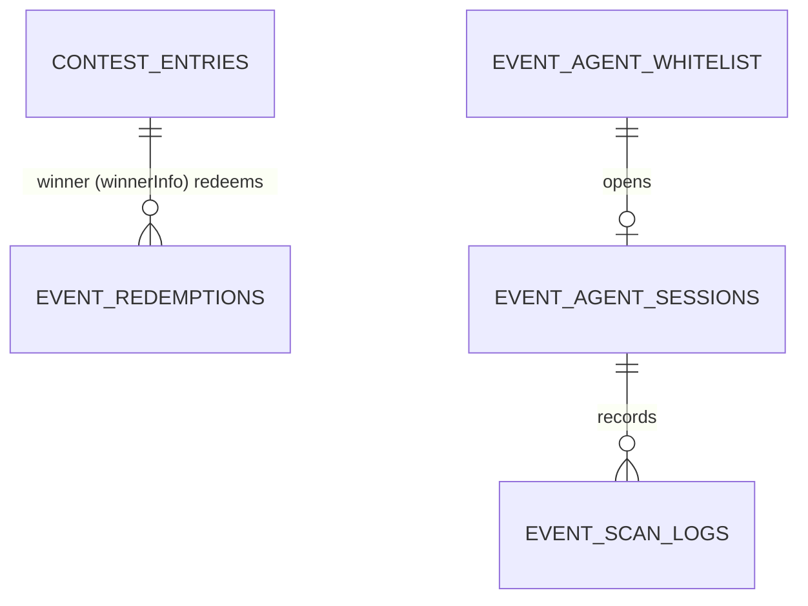
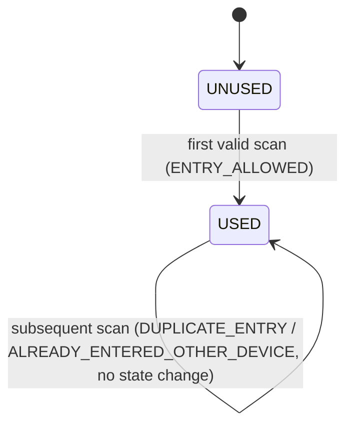

# Low-Level Design (LLD)

Concrete enough to build against. Values shown as `«config»` are environment-tunable
(see open questions Q1, Q2, Q10, Q13, Q20).

**Service ownership (see HLD §4–6):** the backend is **one microservice — the User Profile
Service**. Its internal components: **QR Generation** mints the token, **Eligibility** and **Agent
Whitelist & Session** gate it, **Contest** is the winner source of truth, and **Entry Validation**
validates scans. They are modules of the one deployable, not separate services. Both the customer
QR and the agent scanner live **inside the Airtel Thanks App** — there is no microsite.

## 1. QR token

**Format:** a signed, compact token (JWS/JWT-style) — opaque to the app and the agent scanner.
Encoded into the QR as a plain string (not a URL). Minted/verified in the **Service layer**
(User Profile Service signs at generation; Entry Validation Service verifies at scan); the signing
key stays behind KMS/HSM and never appears in a DTO or DB entity.

**Claims:**

| Claim | Meaning |
|---|---|
| `ver` | token schema version (enables clean upgrades; unknown ⇒ `INVALID_QR`) |
| `sub` | **opaque customer reference** — never the raw MSISDN (Q3) |
| `dev` | **deviceId** of the customer device that generated the QR (Q22) — powers the API 3 duplicate vs. other-device split |
| `events` | **array of won `eventId`s** for this customer, resolved from the **contest tables** at generation (see §7 API 4). If the customer won multiple events, all ride here. Entry check is `session.eventId ∈ events` |
| `jti` | unique id for *this* issuance — the single-active anchor |
| `iat` | issued-at (server clock) |
| `exp` | `iat + «TTL=5m»` (defense-in-depth; server re-checks against `latestJti` too) |
| `iss` | issuing service id |
| signature | detached signature over the header+payload with the backend signing key |

> Because `events` is **inside the signature**, the scanner/app cannot add or edit an eventId to
> force an admit. A win declared *after* the QR was issued isn't in the token — the customer's next
> refresh (or a natural re-issue within the ~5m TTL) picks it up. Entry MAY additionally re-check
> the contest tables server-side for defense in depth; the token's `events` is the primary check.

**Signing:** asymmetric (e.g. ES256/EdDSA). Private key in KMS/HSM, backend-only. The validation
service verifies with the public key. Support **key rotation** via a `kid` header.

**Single-active enforcement (why `exp` alone isn't enough):** to make "Refresh invalidates the
previous QR **immediately**" (FR12) and "an old shared screenshot stops working" (US5) true even
*within* the TTL, the QR service keeps a per-customer pointer:

```
KV (fast store — Aerospike, as the contest module uses; Redis equivalent):
  qr:latest:{msisdn} = { jti }   TTL = «TTL»          // QrIssuanceStore (lld.md §8)
```

- **Issue/refresh:** mint token, overwrite `qr:latest:{customerRef}`.
- **Verify (at scan):** signature ok **AND** not past `exp` **AND** `jti == qr:latest[sub]`.
  - signature bad / `ver` unknown / malformed → `INVALID_QR`
  - past `exp` **or** `jti != latest` (superseded) → `QR_EXPIRED` (customer refreshes → passes)

This gives forgery-proofing (signature) + instant supersede (latest pointer) + hard TTL.

## 2. Data model

All collections map to Mongo `@Document`s via DAO + `MongoTemplate` (HLD §5); the API boundary
uses DTOs, never these documents. Winners are read from the existing `contest_entries`.



### `event`
`event_id (PK, e.g. ARTLPPAZK)`, `name`, `venue`, `starts_at`, `ends_at`, `status (DRAFT|ACTIVE|CLOSED)`, `checkpoints_enabled (ENTRY,GOODIE)`, `created_by`, `created_at`.

### Winner source of truth — existing `contest_entries` (`winnerInfo`)
The store is **MongoDB**, matching the existing contest module. There is **no separate
`contest_winner` table**: a winner is an existing **`contest_entries`** document whose
**`winnerInfo`** field is set (exactly how `DrawServiceImpl` marks winners), and a live **event
maps to a contest `programId`**. QR generation (API 4) reads these to build the token's `events[]`.

- Winner check = "is there a `contest_entries` doc with `msisdn == ? AND winnerInfo exists (AND programId == eventId)`?" — see `WinnerLookupService` in [`lld.md`](./lld.md) §10.
- Winners are produced by the **existing contest draw**, not loaded by this feature. Absence ⇒ `NOT_ENTITLED`.
- Open item **Q23** (HLD): confirm event ↔ contest `programId` (vs `campaignId` / multi-contest).

### `event_redemptions` — the exactly-once anchor (device-aware)
`id (PK)`, `msisdn`, `eventId`, `checkpoint (ENTRY|GOODIE)`, `deviceId`, `redeemedAt`, `redeemedByAgentMsisdn`, `scanRequestId`.
**Unique compound index:** `(eventId, msisdn, checkpoint)` — the dedup key from API 3; **unique sparse** `scanRequestId`.
The row stores the `deviceId` of the **first** entry, which powers the `DUPLICATE_ENTRY` vs.
`ALREADY_ENTERED_OTHER_DEVICE` split. The store is **MongoDB**, so the redeem is an insert guarded
by the unique index (`DuplicateKeyException` on conflict) — the same pattern `contest` uses for
`orderId`. Concrete impl: `EventRedemptionDaoImpl.tryRedeem` in [`lld.md`](./lld.md) §9.

```
on API 3 claim, after session + token + winner checks:
  mongoTemplate.insert(redemption)      // unique (eventId,msisdn,checkpoint)
    success                 -> ENTRY_ALLOWED
    DuplicateKeyException    -> read existing row's deviceId:
                                 stored deviceId == incoming -> DUPLICATE_ENTRY
                                 stored deviceId != incoming -> ALREADY_ENTERED_OTHER_DEVICE (+ stored deviceId)
```

### `event_agent_whitelist` — agent MSISDN + per-event checkpoints
`id (PK)`, `eventId`, `msisdn`, `checkpoints (set of ENTRY|GOODIE — ENTRY only, GOODIE only, or both)`, `active`, `createdBy`, `createdAt`, `updatedAt`.
**Unique compound index:** `(eventId, msisdn)`. One agent MSISDN can hold **many** rows (many events),
each with its own checkpoint set — the authority API 2 reads. **No `deviceId`** — device is a
customer-side concept only (Q22). The agent's *identity* is proven by the Thanks App's own login.

### `event_agent_sessions` — active scanning session
`id (PK)`, `msisdn (indexed)`, `eventId`, `checkpoint`, `createdAt`, `expiresAt (=createdAt+«24h»)`, `revoked (bool)`, `deviceInfo`.
Bound to one `(msisdn, eventId, checkpoint)`. **Single-active:** opening a new session revokes prior
non-expired sessions for `msisdn`. An agent authorized for both checkpoints opens a new session to
switch checkpoint.

### `event_scan_logs` — append-only audit (FR34/FR35)
`id (PK)`, `scanRequestId (unique sparse)`, `eventId`, `checkpoint`, `agentMsisdn (indexed)`, `customerMsisdn (indexed, nullable if unresolved)`, `deviceId`, `callback`, `serverTs`, `tokenJti (nullable)`.
`scanRequestId` unique → idempotency (see §5).

## 3. Atomic redemption

**Chosen store: MongoDB** (matching the contest module). The redeem is an **insert guarded by the
unique compound index** `(eventId, msisdn, checkpoint)` — the DB, not app logic, is the
concurrency guarantee; no read-then-write window. This is the same `DuplicateKeyException` pattern
`contest` uses for `orderId`. Concrete impl: `EventRedemptionDaoImpl.tryRedeem` ([`lld.md`](./lld.md) §9).

```java
try {
    mongoTemplate.insert(redemption);            // unique (eventId, msisdn, checkpoint)
    return new RedeemOutcome(true, redemption);  // inserted → ENTRY_ALLOWED
} catch (DuplicateKeyException dup) {
    var existing = find(eventId, msisdn, checkpoint).orElseThrow(() -> dup);
    return new RedeemOutcome(false, existing);   // conflict → device split from existing.deviceId
}
```

Equivalent on a relational store (if ever migrated): `INSERT … ON CONFLICT (event_id, msisdn,
checkpoint) DO NOTHING`, or a pre-seeded `UPDATE … WHERE status='UNUSED'`.

Either way, **two concurrent scans of the same QR at the same checkpoint** resolve to exactly one
`ENTRY_ALLOWED` + one already-claimed result (FR25/AC). ENTRY and GOODIE are separate rows, so a QR
redeemed at ENTRY still redeems once at GOODIE (FR28).

## 4. Backend validation chain (FR / §8.11 order)

For every scan, short-circuit on first failure:

| # | Check | On fail |
|---|---|---|
| 1 | agent session active & not revoked/expired | `STAFF_SESSION_INVALID` (stop, re-validate) |
| 2 | agent authorized (whitelist) for session's event & the sent checkpoint | `STAFF_SESSION_INVALID` |
| 3 | token structure & `ver` supported | `INVALID_QR` |
| 4 | signature valid | `INVALID_QR` |
| 5 | within TTL **and** `jti == latest` | `QR_EXPIRED` |
| 6 | `session.eventId ∈ token.events` (won-events from `contest_entries.winnerInfo`; optional server re-check via `WinnerLookupService.isWinner`) | `NOT_ENTITLED` |
| 7 | atomic redeem `(eventId, msisdn, checkpoint)` storing `deviceId` (Mongo insert / `DuplicateKeyException`) | inserted → `ENTRY_ALLOWED`; conflict → `DUPLICATE_ENTRY` (same device) / `ALREADY_ENTERED_OTHER_DEVICE` (different device) |
| 8 | write `event_scan_logs` (always, including denials) | — |
| — | infra/exception at any point | `SERVICE_UNAVAILABLE` (never auto-allow, do **not** mark used) |

**Server timestamp is authoritative** everywhere (TTL, audit). Client-supplied time is ignored.
Note the event under check comes from the **session**, and the winner proof comes from the
**token's `events`** (built from `contest_entries.winnerInfo` at issue) — the client never supplies either.

State machine per `(event_id, msisdn, checkpoint)`:



## 5. Idempotency (`scanRequestId`)

- Scanner generates a UUID `scanRequestId` per **decoded QR** and **reuses it on retry** (contract, Q20).
- Backend, before the chain: look up prior `event_scan_logs` by `scanRequestId`; if a **terminal** result exists, **replay it** (no re-redeem).
- `SERVICE_UNAVAILABLE` is **not** terminal → a retry re-runs the chain.
- Because the redemption row also stamps `scanRequestId`, a crash between "committed redeem" and "returned response" is safe: the retry finds the log (or re-derives from the redemption row) and returns the original `ENTRY_ALLOWED`, never a second admission.

## 6. Callback codes (authoritative matrix)

| Callback | When | Admit? | Color | Entitlement | Scanner resumes |
|---|---|---|---|---|---|
| `ENTRY_ALLOWED` | first valid scan at checkpoint | ✅ | Green | → USED (this checkpoint) | yes |
| `DUPLICATE_ENTRY` | repeat at same checkpoint, **same** deviceId | ❌ | Red | unchanged | yes |
| `ALREADY_ENTERED_OTHER_DEVICE` | repeat at same checkpoint, **different** deviceId (returns first deviceId) | ❌ | Red | unchanged | yes |
| `NOT_ENTITLED` | valid member, but `session.eventId` not in the QR's won events | ❌ | Red | unchanged | yes |
| `INVALID_QR` | malformed/forged/non-Airtel/bad `ver`/bad sig | ❌ | Red | unchanged | yes |
| `QR_EXPIRED` | past TTL or superseded (`jti≠latest`) | ❌ (refresh) | Grey | unchanged | yes |
| `STAFF_SESSION_INVALID` | session revoked/expired/unauth | ❌ | Red | n/a | **no** (re-login) |
| `CAMERA_PERMISSION_DENIED` | browser denied camera | n/a | Instructional | n/a | after grant |
| `QR_NOT_DETECTED` | no QR in frame (client-only, no backend call) | n/a | Instructional | n/a | stays active |
| `SERVICE_UNAVAILABLE` | backend error/timeout | ❌ (retry) | Grey | **must not change** | stays active |

**Every result carries explicit text** (never color-only) — NFR accessibility.
`CAMERA_PERMISSION_DENIED` and `QR_NOT_DETECTED` are **local scanner states** with no backend call.

## 7. API contracts — the four endpoints

Each request/response below is a **DTO** at the controller boundary (never a DB entity). Owning
service is noted per endpoint.

### API 1 — `POST /v1/agents/whitelist` — **User Profile Service** (admin / eng only)
DTO `WhitelistUpsertRequest` / `WhitelistUpsertResponse`
```
body: { msisdn, eventId, checkpoints:["ENTRY"|"GOODIE"...] }     # MSISDN + per-event checkpoints
-> 200 { whitelistId, status:"UPSERTED" }
```
Idempotent upsert; unique `(eventId, msisdn)`; one MSISDN may be whitelisted for many events;
supports mid-event appends. Supporting admin endpoint:
```
GET  /v1/admin/scan-history?msisdn=...   full chronological history (FR35) [Entry Validation component]:
       [ { eventId, checkpoint, callback, serverTs, agentMsisdn, deviceId } ]
```
> **Winners are NOT loaded here.** They are produced by the existing **contest draw**
> (`contest_entries.winnerInfo`); this feature only reads them. Events are contest `programId`s (Q23).

### API 2 — validate then open session — **User Profile Service** (no OTP, no microsite)
DTO `AgentValidateResponse`. Two calls:
```
GET  /v1/agents/validate            # agent msisdn from the Thanks App's authenticated session (IV_USER)
   -> if whitelisted & active: { authorized:true, events:[ { eventId, name?, venue?, checkpoints:[...] } ... ] }
   -> else:                    { authorized:false }        # "not an event agent" (no event data leaked)

POST /v1/agents/session   { eventId, checkpoint }          # agent picks one authorized event+checkpoint
   -> 200 { agentSessionId }                                # single-active per msisdn (revokes prior, FR21)
```
Called by the **Thanks App in agent mode**; identity is already proven by app login, the whitelist
grants scanning authority.

### API 3 — `POST /v1/entry` — **Entry Validation component** (agent session via header)
DTO `EntryScanRequest` / `EntryScanResponse`
```
Header: X-Agent-Session: <agentSessionId>
body:   { qrToken, checkpoint, scanRequestId }   # eventId comes from the AGENT SESSION, not the body
-> 200  { callback, admit, displayColor, message, holderMasked?, firstClaimAt?, otherDeviceId? }
```
- `checkpoint` validated against the session's authorized checkpoint; `eventId` is the session's event.
- `msisdn`, `deviceId`, and the won `events[]` are read from the **verified token** (inside the signature).
- Winner check = `session.eventId ∈ token.events` (optional server re-check via `WinnerLookupService.isWinner`).
- **Every decision is HTTP 200 + callback** (INVALID_QR / QR_EXPIRED / STAFF_SESSION_INVALID included); `scanRequestId` gives idempotent retries (§5).
- Callback ∈ `{ ENTRY_ALLOWED, DUPLICATE_ENTRY, ALREADY_ENTERED_OTHER_DEVICE, NOT_ENTITLED, QR_EXPIRED, INVALID_QR, STAFF_SESSION_INVALID, SERVICE_UNAVAILABLE }`.

### API 4 — `POST /v1/membership/qr` — **User Profile Service** (customer, authenticated)
DTO `QrGenerateRequest` / `QrGenerateResponse`
```
Header: IV_USER: <customer msisdn>
body:   { deviceId, timestamp }
-> 200  { qrToken, expiresAt }        # eligibility-gated; supersedes previous jti (single-active)
```
1. Eligibility check (Advantage Club member?) — else 400 (non-members get no QR).
2. Read `contest_entries` (where `winnerInfo` set) for **all** `programId`s (= eventIds) this `msisdn` has won.
3. Mint a **signed** token carrying `sub` (opaque msisdn ref), `dev` (deviceId), `events` (won `eventId`s),
   `ver`, `iat`, `jti`; set `latestJti[msisdn]`; TTL = `«5m»`.

If the customer won multiple events, **all** their `eventId`s are in the one token. Refresh = call
again (rate-limited per Q2); a win declared after issue is picked up on the next refresh/re-issue.

## 8. Agent-scanner client behavior (Thanks App — agent mode)

- After `validate`, the agent picks an authorized event + checkpoint; on ingress select → request camera (rear where available); on decode → **pause processing**, generate/keep `scanRequestId`, POST `/v1/entry`, render result, then resume after ack or `«resumeDelay»`.
- Never resubmit the same decode while a scan is in flight (FR24).
- Authorized for both checkpoints → switch between ENTRY and GOODIE in-app without re-validating.
- Large tap targets, high-contrast, readable in sun/low-light (NFR).
- `QR_NOT_DETECTED` shown as a *hint* ("reposition / brighten screen"), **never** as a rejection.

## 9. Customer-app specifics

| Surface | Mechanism |
|---|---|
| App icon | iOS `setAlternateIconName` (accepts the unavoidable system alert, Q6); Android `activity-alias` enable/disable on cold start after eligibility sync. Revert to default on eligibility loss. |
| Hamburger animation | local `launchCount` + `clickedFlag`; render animated until rule met (confirm "later vs first", Q7); single transition on first tap; static thereafter. |
| Membership tile | eligible → branded tile + QR entry point; ineligible → standard tile, **no** QR entry. |
| QR card | modal; render token as QR; **Refresh** (supersede); loading state during (re)issue; `FLAG_SECURE` (Android) + screenshot detect/obscure (iOS, Q5). |
| Splash | branded only when cached eligibility = member (never blocks cold start, Q8); else default. |
| Walkthrough | once per eligible user post go-live (version+flag gated, Q9); dismissal persisted (mirror server-side). |

## 10. Non-functional targets (build to these)

- Scan validation **< 2s** end-to-end (NFR); the chain is a signature verify + a couple of indexed lookups + one atomic write — comfortably within budget.
- Eligibility read on cold start is **cache-only**, no blocking network (Q8).
- Redemption path is the only strongly-consistent write; everything else can tolerate eventual consistency.
- Idempotency + atomic redemption together guarantee **exactly-once admission per (event_id, msisdn, checkpoint)** under retries, races, and duplicate scans.

## 11. Build sequencing (suggested)

1. **Backend core first** — token service (issue/refresh/verify + single-active + won-events from contest tables), event/contest/redemption model, validation chain, idempotency, audit + history API. This is where correctness lives.
2. **Thanks App agent mode** — whitelist validation via User Profile Service (no OTP), camera scan, decision UI, against the live backend.
3. **Admin/setup** — event creation, contest-winner + staff bulk load, readiness check.
4. **Customer app surfaces** — QR card + refresh (depends on token service), then tile, splash, icon, hamburger, walkthrough (these are independent and can parallelize once eligibility gating is agreed).
5. **Harden** — rate limits, key rotation, dashboards/alerts, device-matrix test for icon-switch + screenshot behavior, load test the concurrent-scan race.
