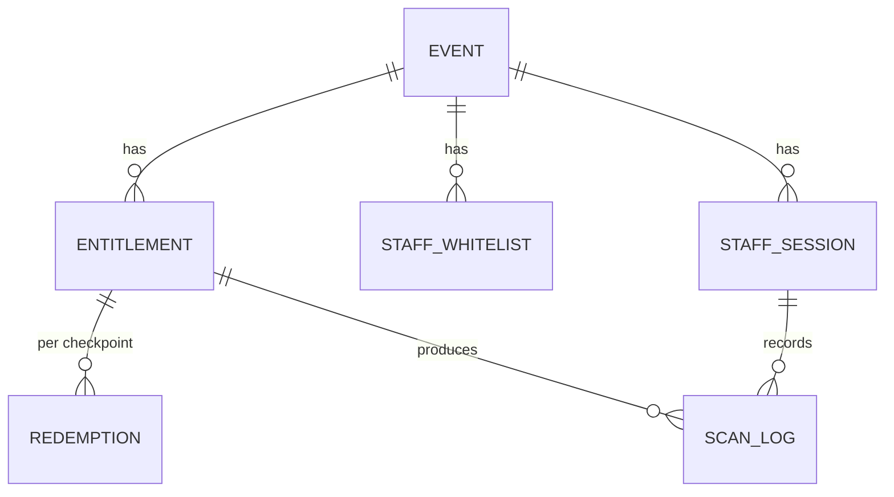
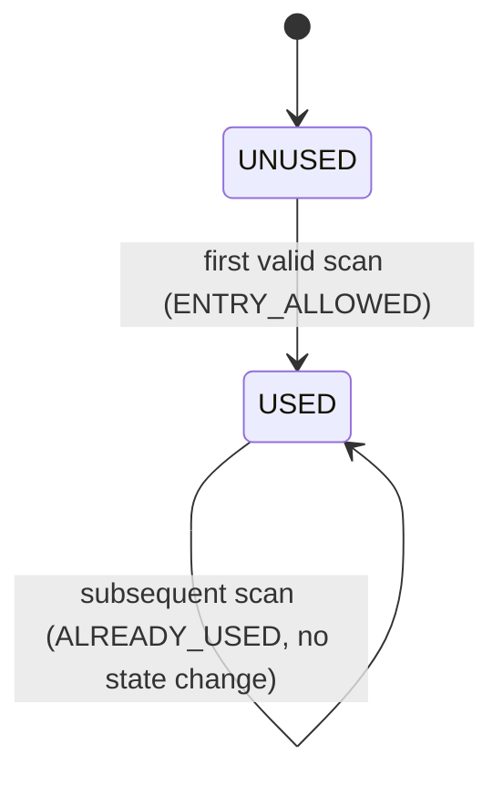

# Low-Level Design (LLD)

Concrete enough to build against. Values shown as `«config»` are environment-tunable
(see open questions Q1, Q2, Q10, Q13, Q20).

## 1. QR token

**Format:** a signed, compact token (JWS/JWT-style) — opaque to the app and the scanner.
Encoded into the QR as a plain string (not a URL).

**Claims:**

| Claim | Meaning |
|---|---|
| `ver` | token schema version (enables clean upgrades; unknown ⇒ `INVALID_QR`) |
| `sub` | **opaque customer reference** — never the raw MSISDN (Q3) |
| `jti` | unique id for *this* issuance — the single-active anchor |
| `iat` | issued-at (server clock) |
| `exp` | `iat + «TTL=5m»` (defense-in-depth; server re-checks against `latestJti` too) |
| `iss` | issuing service id |
| signature | detached signature over the header+payload with the backend signing key |

**Signing:** asymmetric (e.g. ES256/EdDSA). Private key in KMS/HSM, backend-only. The validation
service verifies with the public key. Support **key rotation** via a `kid` header.

**Single-active enforcement (why `exp` alone isn't enough):** to make "Refresh invalidates the
previous QR **immediately**" (FR12) and "an old shared screenshot stops working" (US5) true even
*within* the TTL, the QR service keeps a per-customer pointer:

```
KV (fast store, e.g. Redis):  qr:latest:{customerRef} = { jti, iat }   TTL = «TTL»
```

- **Issue/refresh:** mint token, overwrite `qr:latest:{customerRef}`.
- **Verify (at scan):** signature ok **AND** not past `exp` **AND** `jti == qr:latest[sub]`.
  - signature bad / `ver` unknown / malformed → `INVALID_QR`
  - past `exp` **or** `jti != latest` (superseded) → `QR_EXPIRED` (customer refreshes → passes)

This gives forgery-proofing (signature) + instant supersede (latest pointer) + hard TTL.

## 2. Data model



### `event`
`event_id (PK, e.g. ARTLPPAZK)`, `name`, `venue`, `starts_at`, `ends_at`, `status (DRAFT|ACTIVE|CLOSED)`, `checkpoints_enabled (ENTRY,GOODIE)`, `created_by`, `created_at`.

### `entitlement`
`entitlement_id (PK)`, `event_id (FK)`, `customer_ref`, `created_at`.
**Unique:** `(event_id, customer_ref)`. Rows created by the winner-list load. Absence ⇒ `NOT_ENTITLED`.

### `redemption` — the exactly-once anchor (device-aware)
`redemption_id (PK)`, `entitlement_id (FK)`, `msisdn`, `event_id`, `checkpoint (ENTRY|GOODIE)`, `status (USED)`, `device_id`, `redeemed_at`, `redeemed_by_staff_id`, `scan_request_id`.
**Unique:** `(event_id, msisdn, checkpoint)` — this is the dedup key from API 3. The row stores the
`device_id` of the **first** entry, which powers the `DUPLICATE_ENTRY` vs.
`ALREADY_ENTERED_OTHER_DEVICE` split:

```
on API 3 claim, after winner + TTL + signature checks:
  INSERT (event_id, msisdn, checkpoint, device_id, ...) ON CONFLICT (event_id,msisdn,checkpoint) DO NOTHING
  inserted 1 row      -> ENTRY_ALLOWED
  inserted 0 rows     -> SELECT stored device_id:
                           stored device_id == incoming -> DUPLICATE_ENTRY
                           stored device_id != incoming -> ALREADY_ENTERED_OTHER_DEVICE (+ stored device_id)
```

Two build options (either satisfies FR25 — pick per DB ergonomics):
- **(a) Pre-seed + conditional UPDATE:** create a `UNUSED` row per `(entitlement, checkpoint)` at winner load; redeem = `UPDATE … WHERE status='UNUSED'`.
- **(b) Insert-on-conflict:** no pre-seed; redeem = `INSERT (entitlement, checkpoint, …)` guarded by the unique constraint; first insert wins, duplicate = already used.

### `staff_whitelist`
`event_id (FK)`, `msisdn`, `checkpoints (set of ENTRY|GOODIE)`, `staff_ref`, `active`, `created_by`.
**Unique:** `(event_id, msisdn)`. The only pairs that can request an OTP.

### `staff_session`
`session_id (PK)`, `event_id`, `msisdn`, `staff_ref`, `checkpoints[]`, `created_at`, `expires_at (=created_at+«24h»)`, `revoked (bool)`, `device_info`.
**Single-active:** on new login, revoke prior non-expired sessions for `msisdn`.

### `scan_log` — append-only audit (FR34/FR35)
`scan_id (PK)`, `scan_request_id`, `event_id`, `checkpoint`, `staff_id`, `staff_msisdn`, `customer_ref (nullable if unresolved)`, `callback_code`, `server_ts`, `token_jti (nullable)`.
**Index:** by `customer_ref` and by `staff_msisdn` and by `event_id` for the history API.
`scan_request_id` unique → idempotency (see §5).

## 3. Atomic redemption (reference SQL)

Option (a), conditional update inside a transaction:

```sql
-- attempt redemption; rows_affected tells us who won
UPDATE redemption
   SET status = 'USED',
       redeemed_at = :server_ts,
       redeemed_by_staff_id = :staff_id,
       scan_request_id = :scan_request_id
 WHERE entitlement_id = :entitlement_id
   AND checkpoint = :checkpoint
   AND status = 'UNUSED';
-- rows_affected = 1  -> ENTRY_ALLOWED
-- rows_affected = 0  -> already USED: SELECT redeemed_at,... for first-claim time -> ALREADY_USED
```

Option (b), insert-on-conflict (Postgres flavor):

```sql
INSERT INTO redemption (entitlement_id, checkpoint, status, redeemed_at,
                        redeemed_by_staff_id, scan_request_id)
VALUES (:entitlement_id, :checkpoint, 'USED', :server_ts, :staff_id, :scan_request_id)
ON CONFLICT (entitlement_id, checkpoint) DO NOTHING;
-- inserted 1 row -> ENTRY_ALLOWED ; 0 rows -> ALREADY_USED (SELECT existing for first-claim)
```

Both make **two concurrent scans of the same QR at the same checkpoint** resolve to exactly one
`ENTRY_ALLOWED` + one `ALREADY_USED` (FR25/AC). ENTRY and GOODIE are separate rows, so a QR
redeemed at ENTRY still redeems once at GOODIE (FR28).

## 4. Backend validation chain (FR / §8.11 order)

For every scan, short-circuit on first failure:

| # | Check | On fail |
|---|---|---|
| 1 | staff session active & not revoked/expired | `STAFF_SESSION_INVALID` (stop, re-login) |
| 2 | staff authorized for session's event & the sent checkpoint | `STAFF_SESSION_INVALID` |
| 3 | token structure & `ver` supported | `INVALID_QR` |
| 4 | signature valid | `INVALID_QR` |
| 5 | within TTL **and** `jti == latest` | `QR_EXPIRED` |
| 6 | resolve `customer_ref`; entitlement exists for `(event, customer)` | `NOT_ENTITLED` |
| 7 | atomic redeem `(entitlement, checkpoint)` | 1 row → `ENTRY_ALLOWED`; 0 rows → `ALREADY_USED` |
| 8 | write scan_log (always, including denials) | — |
| — | infra/exception at any point | `SERVICE_UNAVAILABLE` (never auto-allow, do **not** mark used) |

**Server timestamp is authoritative** everywhere (TTL, audit). Client-supplied time is ignored.

State machine per `(entitlement, checkpoint)`:



## 5. Idempotency (`scanRequestId`)

- Scanner generates a UUID `scanRequestId` per **decoded QR** and **reuses it on retry** (contract, Q20).
- Backend, before the chain: `SELECT` prior `scan_log` by `scan_request_id`; if a **terminal** result exists, **replay it** (no re-redeem).
- `SERVICE_UNAVAILABLE` is **not** terminal → a retry re-runs the chain.
- Because redemption also stamps `scan_request_id`, a crash between "committed redeem" and "returned response" is safe: the retry finds the redemption already carries this `scanRequestId` and returns `ENTRY_ALLOWED`, not `ALREADY_USED`.

## 6. Callback codes (authoritative matrix)

| Callback | When | Admit? | Color | Entitlement | Scanner resumes |
|---|---|---|---|---|---|
| `ENTRY_ALLOWED` | first valid scan at checkpoint | ✅ | Green | → USED (this checkpoint) | yes |
| `DUPLICATE_ENTRY` | repeat at same checkpoint, **same** deviceId | ❌ | Red | unchanged | yes |
| `ALREADY_ENTERED_OTHER_DEVICE` | repeat at same checkpoint, **different** deviceId (returns first deviceId) | ❌ | Red | unchanged | yes |
| `NOT_ENTITLED` | valid member, not a winner for this event | ❌ | Red | unchanged | yes |
| `INVALID_QR` | malformed/forged/non-Airtel/bad `ver`/bad sig | ❌ | Red | unchanged | yes |
| `QR_EXPIRED` | past TTL or superseded (`jti≠latest`) | ❌ (refresh) | Grey | unchanged | yes |
| `STAFF_SESSION_INVALID` | session revoked/expired/unauth | ❌ | Red | n/a | **no** (re-login) |
| `CAMERA_PERMISSION_DENIED` | browser denied camera | n/a | Instructional | n/a | after grant |
| `QR_NOT_DETECTED` | no QR in frame (client-only, no backend call) | n/a | Instructional | n/a | stays active |
| `SERVICE_UNAVAILABLE` | backend error/timeout | ❌ (retry) | Grey | **must not change** | stays active |

**Every result carries explicit text** (never color-only) — NFR accessibility.
`CAMERA_PERMISSION_DENIED` and `QR_NOT_DETECTED` are **local scanner states** with no backend call.

## 7. API contracts — the four endpoints

These are the four APIs the build introduces. (Admin winner-load + scan-history are supporting
endpoints on the same admin surface as API 1.)

### API 1 — `POST /v1/staff/whitelist` (admin / eng only)
```
body: { msisdn, deviceId, eventId, checkpoints:["ENTRY"|"GOODIE"...] }
-> 200 { whitelistId, status:"UPSERTED" }
```
Idempotent upsert; unique `(eventId, msisdn)`; supports mid-event appends. Also on this surface:
```
POST /v1/admin/events                          create event (returns eventId)
POST /v1/admin/events/{id}/winners:bulkUpsert  load/append entitlements (idempotent)
GET  /v1/admin/scan-history?msisdn=...          full chronological history (FR35):
       [ { eventId, checkpoint, callback, serverTs, staffMsisdn, deviceId } ]
```

### API 2 — `GET /v1/staff/validate` (deeplink landing → session)
```
GET  /v1/staff/validate?msisdn=...&deviceId=...
   -> if whitelisted: triggers OTP; on OTP verify returns
        { sessionId(HttpOnly cookie), events:[{id,name,venue,window,checkpoints[]}] }
   -> if not: generic "not authorized" (no event data leaked)
POST /v1/staff/validate/otp   { msisdn, deviceId, otp }   # possession proof (PRD requires OTP)
```
`(msisdn, deviceId)` must both match an active whitelist row. New session revokes any prior
session for `msisdn` (single-active, FR21).

### API 3 — `POST /v1/entry` (post-scan; authenticated by session cookie)
```
body: { msisdn, deviceId, eventId, checkpoint, qrToken, scanRequestId }
-> 200 { callback, holderMasked?, firstClaimAt?, otherDeviceId?, displayColor, message }
```
- `eventId`/`checkpoint` are validated against the **session's** authorized set (not trusted blindly).
- `msisdn` + `deviceId` are taken from the **verified token**, not the raw body, where present (body copies are cross-checked; mismatch ⇒ `INVALID_QR`).
- **Server timestamp authoritative**; `scanRequestId` gives idempotent retries (§5).
- Callback ∈ `{ ENTRY_ALLOWED, DUPLICATE_ENTRY, ALREADY_ENTERED_OTHER_DEVICE, NOT_ENTITLED, QR_EXPIRED, INVALID_QR, SERVICE_UNAVAILABLE }`.

### API 4 — `POST /v1/qr/generate` (customer app; authenticated as the customer)
```
body: { msisdn, deviceId, timestamp }
-> 200 { qrToken, expiresAt }         # eligibility-gated; supersedes previous jti (single-active)
```
Resolves the events this `msisdn` is a winner for, mints a **signed** token carrying an opaque
`sub` (msisdn ref), `deviceId`, `iat`, `jti`; sets `latestJti[msisdn]`; TTL = `«5–10m»`.
Refresh = call again (rate-limited per Q2). The token is customer-identity + device; it does **not**
enumerate the winning events into the QR — event resolution happens at API 3 against the session.

## 8. Scanner (microsite) client behavior

- On ingress select → request camera (rear where available); on decode → **pause processing**, generate/keep `scanRequestId`, POST, render result, then resume after ack or `«resumeDelay»`.
- Never resubmit the same decode while a scan is in flight (FR24).
- Large tap targets, high-contrast, readable in sun/low-light (NFR).
- `QR_NOT_DETECTED` shown as a *hint* ("reposition / brighten screen"), **never** as a rejection.

## 9. Customer-app specifics

| Surface | Mechanism |
|---|---|
| App icon | iOS `setAlternateIconName` (accepts the unavoidable system alert, Q6); Android `activity-alias` enable/disable on cold start after eligibility sync. Revert to default on eligibility loss. |
| Hamburger animation | local `launchCount` + `clickedFlag`; render animated until rule met (confirm "later vs first", Q7); single transition on first tap; static thereafter. |
| Membership tile | eligible → branded tile + QR entry point; ineligible → standard tile, **no** QR entry. |
| QR card | modal; render token as QR; **Refresh** (supersede); loading state during (re)issue; `FLAG_SECURE` (Android) + screenshot detect/obscure (iOS, Q5). |
| Splash | branded only when cached eligibility = member (never blocks cold start, Q8); else default. |
| Walkthrough | once per eligible user post go-live (version+flag gated, Q9); dismissal persisted (mirror server-side). |

## 10. Non-functional targets (build to these)

- Scan validation **< 2s** end-to-end (NFR); the chain is a signature verify + a couple of indexed lookups + one atomic write — comfortably within budget.
- Eligibility read on cold start is **cache-only**, no blocking network (Q8).
- Redemption path is the only strongly-consistent write; everything else can tolerate eventual consistency.
- Idempotency + atomic redemption together guarantee **exactly-once admission per (entitlement, checkpoint)** under retries, races, and duplicate scans.

## 11. Build sequencing (suggested)

1. **Backend core first** — token service (issue/refresh/verify + single-active), event/entitlement/redemption model, validation chain, idempotency, audit + history API. This is where correctness lives.
2. **Staff microsite** — login/OTP/session, camera scan, decision UI, against the live backend.
3. **Admin/setup** — event creation, winner + staff bulk load, readiness check.
4. **Customer app surfaces** — QR card + refresh (depends on token service), then tile, splash, icon, hamburger, walkthrough (these are independent and can parallelize once eligibility gating is agreed).
5. **Harden** — rate limits, key rotation, dashboards/alerts, device-matrix test for icon-switch + screenshot behavior, load test the concurrent-scan race.
