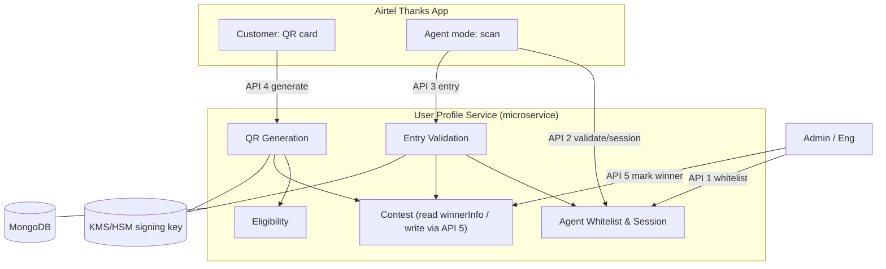
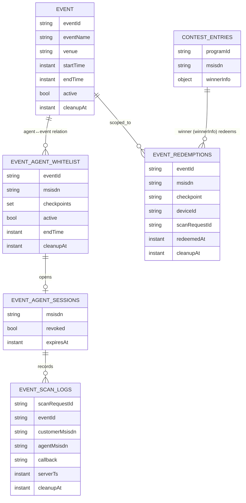
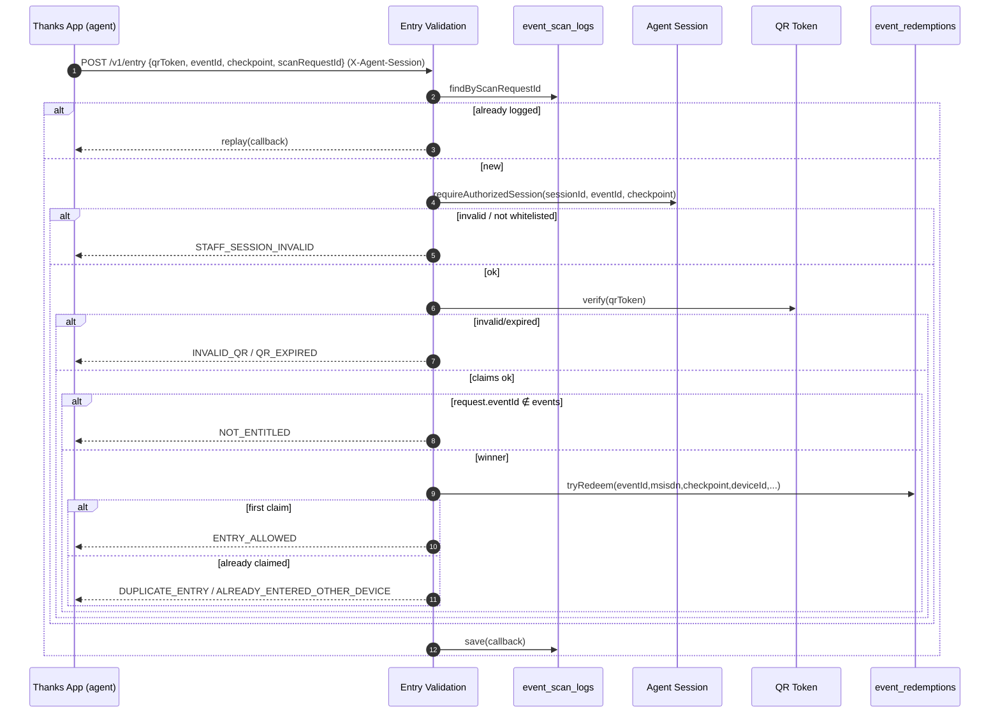
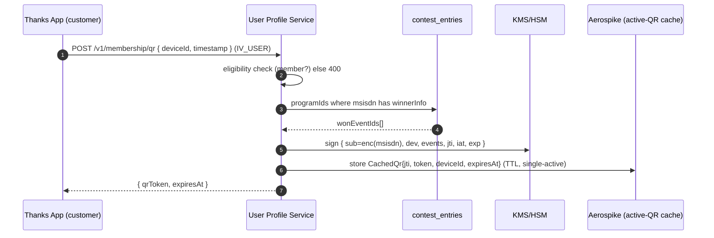
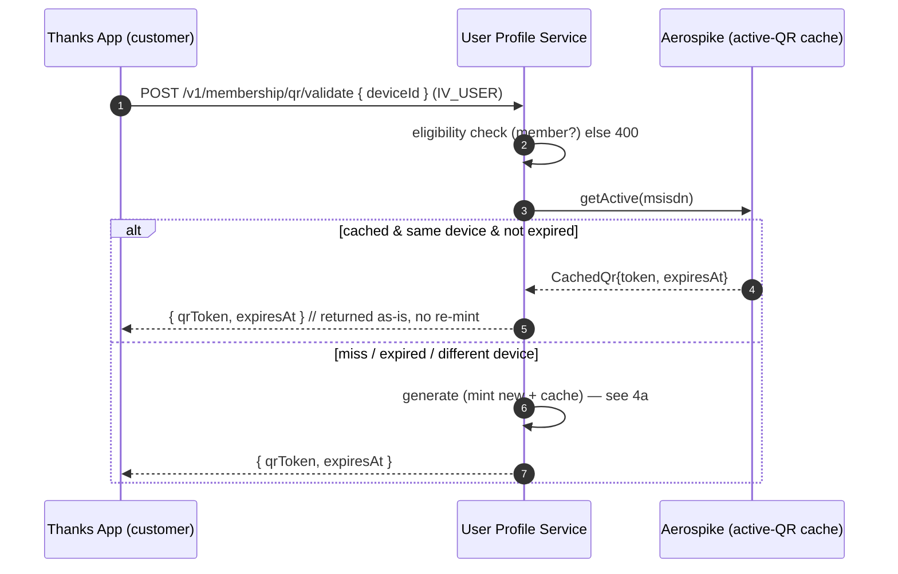
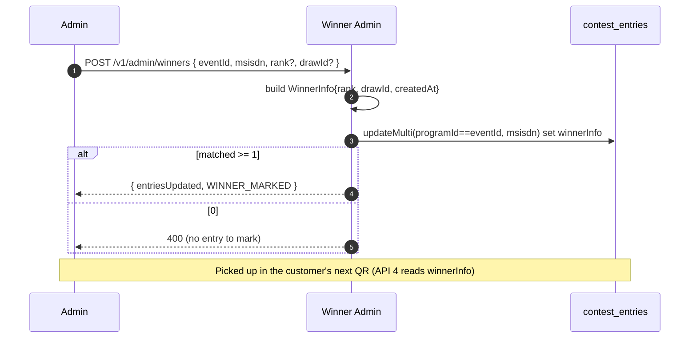

# LLD — Advantage Club Membership QR & Event Entry (Event Pass)

> **Confluence note:** paste via **Confluence → … → Insert Markup → Markdown**, or the Markdown
> macro. ` ```mermaid ` blocks render if the **Mermaid** app/macro is installed (otherwise wrap
> each in a Mermaid macro or export as an image); ` ```java ` blocks render as code blocks. This is
> a single, self-contained page: architecture, data model, all **5 APIs** with conditions and
> sequence diagrams, and the **full code changes**.

| | |
|---|---|
| **Type** | Low-Level Design (single page) |
| **Module** | `com.airtel.userprofile.eventpass` (new, inside the **User Profile Service** microservice) |
| **Store** | MongoDB (reuses existing `contest_entries`); Aerospike for the single-active QR pointer; KMS/HSM for the signing key |
| **Conventions** | Matches the existing `contest` module: Lombok Mongo `@Document`s, DAO + `MongoTemplate`, `DuplicateKeyException` for atomic uniqueness, `com.airtel.core.dto.genericResponse.Response`, `@AuditLog`, `IV_USER` header |
| **Status** | Proposed — for review |
| **Related** | HLD: `03-hld.md`; reference code: `reference-impl/eventpass/` (also embedded in §13) |

---

## Table of Contents
1. [Design principle](#1-design-principle)
2. [Architecture & components](#2-architecture--components)
3. [Service layering (Controller / Service / DAO)](#3-service-layering)
4. [Data model, collections & indexes](#4-data-model-collections--indexes)
5. [QR token](#5-qr-token)
5A. [QR image util — render & validate](#5a-qr-image-util--render--validate)
6. [Callback contract](#6-callback-contract)
7. [API surface — the five endpoints](#7-api-surface--the-five-endpoints)
8. [API sequences & conditions](#8-api-sequences--conditions)
8A. [Sample requests, responses & error responses](#8a-sample-requests-responses--error-responses-per-api)
9. [Atomic redemption — exactly-once](#9-atomic-redemption--exactly-once)
10. [Winner read & write (contest reuse)](#10-winner-read--write-contest-reuse)
11. [Idempotency, exceptions, config](#11-idempotency-exceptions-config)
12. [Module map (all files)](#12-module-map-all-files)
13. [Code changes (full source)](#13-code-changes-full-source)
14. [Open decisions](#14-open-decisions)

---

## 1. Design principle

> **Identity + won-events QR, agent-session-bound checkpoint. One app for both roles.**
> The QR proves **who** the customer is **and which events they have won** — the winning
> `eventId`s are read from the contest data at generation time and **signed into the token** by the
> **User Profile Service**, then shown in the Airtel Thanks App. Scanning is **also inside the same
> Thanks App**, in an *agent mode* unlocked only for **whitelisted MSISDNs** — **no microsite, no
> OTP**. The **checkpoint** (ENTRY / GOODIE) and the **event** come from the **agent's validated
> session**. Entry is allowed when `session.eventId ∈ token.wonEvents` **and** that
> `(customer, event, checkpoint)` has not already been redeemed — an **atomic, exactly-once,
> per-checkpoint** operation.

- One Thanks App, two modes: *customer* (shows QR) and *agent* (scans, whitelisted MSISDNs only).
- Won events resolve from the existing **contest** data (`contest_entries.winnerInfo`, **event = `programId`**).
- All trust decisions on the backend; the signing key is backend-only; the won-events list is inside the token signature.

---

## 2. Architecture & components

One microservice (**User Profile Service**) with internal components. The customer QR and the agent
scanner both live in the Thanks App.



| Component | Responsibility |
|---|---|
| **Thanks App — Customer mode** | Renders membership surfaces + QR card; requests QR from the User Profile Service; screenshot mitigation. No event/winner logic. |
| **Thanks App — Agent mode** | Whitelisted MSISDNs only; pick authorized event+checkpoint, scan, POST to Entry Validation, render decision. Decides nothing. |
| **QR Generation** | Checks eligibility, reads won events from Contest, mints signed short-TTL token, single-active per customer. |
| **Eligibility** | Active Postpaid + Fastlane / Advantage Club membership. |
| **Agent Whitelist & Session** | Which events + checkpoints each agent MSISDN may scan; single-active scanning session. |
| **Contest** | Existing contest engine; winner source of truth (`contest_entries.winnerInfo`, event=`programId`). Read at API 4 / entry; **written** by API 5. |
| **Entry Validation** | The gate authority: verify token, authorize agent, winner check, atomic redeem, audit, callback. |

**Trust boundaries:** the app is semi-trusted (can request a QR / validate an agent) but **untrusted
for decisions** — Entry Validation decides server-side; event, checkpoint, agent identity and
timestamp come from the session, never the client body.

---

## 3. Service layering

Inside the one microservice, each component is layered Controller → Service → DAO/Repository:

| Layer | Role | Examples |
|---|---|---|
| **Controller (API boundary)** | Accepts/returns **DTOs** only, never DB entities | `MembershipQrController`, `AgentController`, `EventEntryController`, `WinnerAdminController` |
| **Service (business logic)** | Eligibility, whitelist, token mint/verify, redemption, winner read/write | `MembershipQrService`, `AgentAccessService`, `EventEntryService`, `WinnerLookupService`, `WinnerAdminService`, `QrTokenService` |
| **DAO (persistence)** | `MongoTemplate` mapping documents ↔ collections | `EventRedemptionDao`, `ScanLogDao`, `AgentWhitelistDao`, `AgentSessionDao`, `ContestWinnerAdminDao` |

DTOs never cross into the DB layer; the signing key stays behind KMS/HSM.

---

## 4. Data model, collections & indexes



| Collection | Key index | TTL (auto-delete) | Purpose |
|---|---|---|---|
| `event` | `_id = eventId` | `cleanupAt` (`endTime+30d`) | event master; name/venue/window/active |
| `event_agent_whitelist` | **unique** `(eventId, msisdn)` | `cleanupAt` (`endTime+30d`) | **agent↔event relation** (events + checkpoints an agent may scan) |
| `event_redemptions` | **unique** `(eventId, msisdn, checkpoint)`; unique sparse `scanRequestId` | `cleanupAt` (`endTime+30d`) | exactly-once redemption + idempotency |
| `event_scan_logs` | unique sparse `scanRequestId`; `customerMsisdn`, `agentMsisdn`, `eventId` | `cleanupAt` (`endTime+30d`) | **audit** (agent↔customer↔event) + idempotency + history |
| `event_agent_sessions` | `msisdn` | `expiresAt` (24h) | single-active scanning session |
| `contest_entries` *(existing)* | `winnerInfo` presence + `programId` | — (owned by contest) | winner source (read at API 4; **written** by API 5) |
| Aerospike `qr:latest:{msisdn}` | — | record TTL = QR TTL | single-active QR cache (`CachedQr`) |

Unique indexes are declared on the documents (`@CompoundIndex` / `@Indexed(unique=true, sparse=true)`),
and each **TTL index** is `@Indexed(expireAfterSeconds = 0)` on the `cleanupAt` / `expiresAt` date —
Mongo's background sweeper deletes the doc once that instant passes. See §4A.

---

## 4A. Agent↔event relation & 30-day retention (TTL)

**Chosen shape: a separate relation document per `(agent, event)`** (`event_agent_whitelist`),
**not** an embedded `List<events>` on an agent document.

| Why | Separate relation doc | Embedded list on agent |
|---|---|---|
| **Per-event 30-day cleanup** | ✅ TTL index deletes each row independently at `endTime+30d` | ❌ TTL can't expire array elements — needs a cron to prune |
| Unbounded growth | ✅ one small row per event | ❌ agent doc grows forever |
| Write contention | ✅ independent rows | ❌ one hot doc for all events |
| "Events for agent" query | ✅ `find({msisdn})` | ✅ single doc |

**How cleanup works end-to-end:**
1. Admin creates the **`event`** (`POST /v1/admin/events`) with `startTime`/`endTime`; the service sets `cleanupAt = endTime + 30d`.
2. Whitelisting an agent copies the event's `endTime`/`cleanupAt` onto the relation row (API 1 requires the event to exist first).
3. At scan time, `event_redemptions` and `event_scan_logs` are stamped with the same `cleanupAt`.
4. Mongo **TTL indexes** auto-purge every per-event doc 30 days after the event ends — no cron.
5. **"Agent with no events for 30 days is removed" falls out for free:** we keep **no standalone
   agent-master doc**; an agent's only footprint is relation rows + sessions + audit, all TTL'd.
   When the last one expires, nothing about that agent remains.

**Audit record** = `event_scan_logs`: every scan (allow and deny) writes `{agentMsisdn,
customerMsisdn, eventId, checkpoint, callback, serverTs, scanRequestId}` — the authoritative record
of *which agent scanned which customer for which event*, retained for the 30-day dispute window.

> A **failed-auth** scan log (no event resolved) still gets `cleanupAt = now + 30d` so it cannot
> leak past retention.

---

## 5. QR token

Compact signed JWS (ES256). Claims:

| Claim | Meaning |
|---|---|
| `ver` | schema version (unknown/greater ⇒ `INVALID_QR`) |
| `sub` | **opaque** (encrypted via `PiiEncryptionDecryption`) MSISDN — never raw PII |
| `dev` | customer `deviceId` (powers the duplicate vs other-device split) |
| `events` | won `programId`s (= eventIds), inside the signature |
| `jti` / `iat` / `exp` | single-active id / issued-at / `iat + «TTL»` |

**Two expiry gates:** the JWT `exp` (hard TTL) **and** the single-active `latestJti` pointer
(immediate supersede on refresh). Either failing → `QR_EXPIRED`. Signing key in KMS/HSM (`kid`
rotation); verified with the public key.

---

## 5A. QR image util — render & validate

The `qrToken` above is a **string**; §5 says nothing about how it becomes the *picture* in the
Thanks App. The image util (package `…​eventpass.util`) draws the **styled circular QR** shown in the
Figma — dotted modules under a radial gradient, rounded finder "eyes", a centre badge with the
Advantage-Club logo / changeable text — and reads one back. Styling never touches the encoded bits,
so any payload round-trips unchanged.

**What it carries.** The util is payload-agnostic: pass the signed membership `qrToken`, a deeplink
(`airtelthanks://…` / `https://…`), or any opaque info string as `data`. On scan the app decodes
`data` locally and POSTs it to the backend (e.g. API 3 `/v1/entry`), which is how a scan "publishes"
to the backend — the QR itself is only the carrier.

**Two halves.**

| Half | Class | Does |
|---|---|---|
| generate | `CircularQrGenerator` | `data` (+ resolved `Style`) → styled PNG / `data:image/png;base64,…`. ZXing encodes the bare module matrix (EC level **H**), Java2D paints dots + gradient + finder rings + centre badge. Stateless / thread-safe. |
| validate | `QrImageDecoder` | image bytes → payload string (ZXing decode, `TRY_HARDER`). `decode` throws `QrInvalidException` when unreadable; `tryDecode` returns `Optional`; `matches(bytes, expected)` asserts a clean round-trip. This is **structural** validation only — trust validation (signature / TTL / single-active) stays `QrTokenService.verify`. |

`QrImageService`(+impl) wraps both with the configured defaults and layers per-request overrides.

**Resilience.** Neither half fails a caller for a recoverable reason:
- *Generation* — encoding is the only hard failure (an un-encodable/too-long payload throws `IllegalArgumentException` → 400). If the **styling** then fails (bad centre logo, font, or colour) and `resilient-render` is on (default), the generator falls back to a **plain black-on-white QR of the same matrix** — a valid payload always yields a scannable code. The fallback is logged at WARN.
- *Validation* — `tryDecode` walks a **strategy ladder** (Hybrid then Global-histogram binarizer, each on normal and inverted luminance, all `TRY_HARDER`) and returns the first hit, so a photographed / compressed / dark-mode / dotted image that defeats one binarizer still decodes. Later passes run only on a miss; all failing → empty `Optional` (→ `QrInvalidException` from `decode`).

**Config — `eventpass.qr-style.*`** (`@RefreshScope`; hex `#RRGGBB` / `#AARRGGBB`, or `transparent`):

| Key | Default | Meaning |
|---|---|---|
| `size` | `720` | Output edge in px (square). |
| `quiet-zone-modules` | `2` | Quiet-zone modules around the code. |
| `background-color` | `#FFFFFF` | Canvas fill; `transparent` for overlay. |
| `module-shape` | `DOTS` | `DOTS` / `ROUNDED` / `SQUARE`. |
| `module-size-ratio` | `0.86` | Dot size vs cell (airy gaps < 1.0). |
| `gradient-enabled` | `true` | Radial gradient across the modules. |
| `gradient-inner-color` / `gradient-outer-color` | `#F5A623` / `#C8102E` | Centre → edge gradient stops. |
| `foreground-color` | `#C8102E` | Flat module colour when gradient off. |
| `styled-finder` / `finder-corner-ratio` / `finder-color` | `true` / `0.35` / `#C8102E` | Rounded concentric "eyes". |
| `center-badge-enabled` / `center-badge-ratio` | `true` / `0.24` | Centre disc (needs EC H). |
| `center-badge-inner-color` / `center-badge-outer-color` | `#E4002B` / `#8B0000` | Badge gradient. |
| `center-ring-*` | `true` / `#FFFFFF` / `0.04` | White separator ring. |
| `center-text` | `airtel\nPOSTPAID\nADVANTAGE\nCLUB` | Stacked lines; first is the brand line. **Changeable per request** via `QrRenderRequest.centerText`. |
| `center-text-color` / `center-text-font` | `#FFFFFF` / `SansSerif` | Centre text style. |
| `center-logo-resource` | *(unset)* | Optional `classpath:…` logo drawn in the badge. |
| `error-correction` | `H` | L/M/Q/H — keep **H** while a centre badge covers the middle. |
| `resilient-render` | `true` | On a styling failure, fall back to a plain scannable QR instead of erroring. |

```yaml
# application.yml (User Profile Service)
eventpass:
  qr-style:
    size: 720
    module-shape: DOTS
    gradient-inner-color: "#F5A623"
    gradient-outer-color: "#C8102E"
    finder-color: "#C8102E"
    center-badge-inner-color: "#E4002B"
    center-badge-outer-color: "#8B0000"
    center-text: "airtel\nPOSTPAID\nADVANTAGE\nCLUB"
    center-text-color: "#FFFFFF"
    error-correction: H
```

**API surface** (`MembershipQrImageController`, util endpoints — member QR string is still API 4):

| Endpoint | Body / param | Returns |
|---|---|---|
| `POST /v1/membership/qr/image` | `QrRenderRequest` (`data` required; optional `centerText`, colour & `size` overrides) | `QrRenderResponse` — `imageDataUri`, `width/height`, `encoded` |
| `POST /v1/membership/qr/image.png` | `QrRenderRequest` | raw `image/png` |
| `POST /v1/membership/qr/validate-image` | multipart `image` | `{ "data": "<decoded payload>" }` |

**pom.xml**

```xml
<dependency>
  <groupId>com.google.zxing</groupId>
  <artifactId>core</artifactId>
  <version>3.5.3</version>
</dependency>
<dependency>
  <groupId>com.google.zxing</groupId>
  <artifactId>javase</artifactId>
  <version>3.5.3</version>
</dependency>
```

---

## 6. Callback contract (API 3)

| Callback | admit | color | resumes | Meaning |
|---|:---:|---|:---:|---|
| `ENTRY_ALLOWED` | ✅ | green | yes | first valid scan at checkpoint |
| `DUPLICATE_ENTRY` | ❌ | red | yes | repeat, same device |
| `ALREADY_ENTERED_OTHER_DEVICE` | ❌ | red | yes | repeat, different device (returns first deviceId) |
| `NOT_ENTITLED` | ❌ | red | yes | `session.eventId ∉ token.events` |
| `QR_EXPIRED` | ❌ | grey | yes | past TTL or superseded |
| `INVALID_QR` | ❌ | red | yes | malformed/forged/unsupported |
| `STAFF_SESSION_INVALID` | ❌ | red | **no** | session missing/revoked/expired/mismatch |
| `SERVICE_UNAVAILABLE` | ❌ | grey | yes | unexpected fault — never auto-allow |

Every entry decision returns **HTTP 200 + callback**; only unexpected faults map to `SERVICE_UNAVAILABLE`.

---

## 7. API surface

All endpoints are on the **User Profile Service**. "Owning component" names the internal module.
The **agent whitelist is a full admin CRUD** (POST/GET/PUT/DELETE); **agent validation is a single
API** (validate + open session); the **membership QR has generate / validate (get-or-create) /
refresh**.

| # | Method / Endpoint | Owning component | Caller | Key inputs | Success output |
|---|---|---|---|---|---|
| 0a | `POST /v1/admin/events` | Event Admin | Admin/eng | `eventId`, `eventName`, `startTime`, `endTime`, `venue?` | event (incl. `cleanupAt=endTime+30d`) |
| 0b | `GET /v1/admin/events/{eventId}` | Event Admin | Admin/eng | `eventId` | event |
| 0c | `POST /v1/admin/events/{eventId}/close` | Event Admin | Admin/eng | `eventId` | `{status:"CLOSED"}` |
| 1a | `POST /v1/agents/whitelist` | Agent Whitelist | Admin/eng | `msisdn`, `eventId`, `checkpoints[]`, `active?` | `{whitelistId, status}` |
| 1b | `GET /v1/agents/whitelist?eventId=&msisdn=` | Agent Whitelist | Admin/eng | `eventId`, `msisdn?` | `[{eventId, msisdn, checkpoints[], active}]` |
| 1c | `PUT /v1/agents/whitelist` | Agent Whitelist | Admin/eng | `eventId`, `msisdn`, `checkpoints?`, `active?` | updated row |
| 1d | `DELETE /v1/agents/whitelist?eventId=&msisdn=` | Agent Whitelist | Admin/eng | `eventId`, `msisdn` | `{status:"DELETED"}` |
| 2 | `GET /v1/agents/validate` | Agent Whitelist & Session | Thanks App (agent) | agent `msisdn` (`IV_USER`) | `{authorized, events[], agentSessionId}` |
| 3 | `POST /v1/entry` | Entry Validation | Thanks App (agent) | `qrToken`, `eventId`, `checkpoint`, `scanRequestId` (+ `X-Agent-Session`) | callback |
| 4a | `POST /v1/membership/qr` | QR Generation | Thanks App (customer) | `deviceId`, `timestamp` (+ `IV_USER`) | `{qrToken, expiresAt}` (always new) |
| 4b | `POST /v1/membership/qr/validate` | QR Generation | Thanks App (customer) | `deviceId` (+ `IV_USER`) | cached live QR if present, else new |
| 4c | `POST /v1/membership/qr/refresh` | QR Generation | Thanks App (customer) | `deviceId` (+ `IV_USER`) | new QR (supersedes) |
| 5 | `POST /v1/admin/winners` | Contest (winner write) | Admin/eng | `eventId`, `msisdn`, `rank?`, `drawId?` | `{entriesUpdated, status}` |
| — | `GET /v1/admin/scan-history?msisdn=` | Entry Validation | Admin/eng | `msisdn` | chronological scan log |

**API → class map**

| API | Controller | Service | Persistence |
|---|---|---|---|
| 0 event | `EventAdminController` | `EventAdminService.upsert`/`get`/`close` | `EventDao` → `event` (TTL) |
| 1a create | `AgentController.createWhitelist` | `AgentAccessService.upsertWhitelist` (requires event) | `AgentWhitelistDao.upsert` |
| 1b read | `AgentController.getWhitelist` | `AgentAccessService.getWhitelist` | `AgentWhitelistDao.findOne`/`findByEvent` |
| 1c update | `AgentController.updateWhitelist` | `AgentAccessService.updateWhitelist` | `AgentWhitelistDao.update` |
| 1d delete | `AgentController.deleteWhitelist` | `AgentAccessService.deleteWhitelist` | `AgentWhitelistDao.delete` |
| 2 | `AgentController.validate` | `AgentAccessService.validate` (validates + opens session) | `AgentWhitelistDao`, `AgentSessionDao` |
| 3 | `EventEntryController` | `EventEntryService.recordEntry` | `EventRedemptionDao` + `ScanLogDao` |
| 4a/4b/4c | `MembershipQrController` | `MembershipQrService.generate` / `validateOrGenerate` / `refresh` | `WinnerLookupService` (read) + `QrTokenService` + `QrIssuanceStore` (get-or-create) |
| 5 | `WinnerAdminController` | `WinnerAdminService.markWinner` | `ContestWinnerAdminDao` (write `winnerInfo`) |

**Request/response contracts**

```
API 1a POST   /v1/agents/whitelist            body { msisdn, eventId, checkpoints[], active? }
                                              -> 200 { whitelistId, status:"UPSERTED" }
API 1b GET    /v1/agents/whitelist?eventId=&msisdn=   (msisdn optional → all rows for the event)
                                              -> 200 [ { eventId, msisdn, checkpoints[], active, updatedAt } ]
API 1c PUT    /v1/agents/whitelist            body { eventId, msisdn, checkpoints?, active? }
                                              -> 200 { eventId, msisdn, checkpoints[], active }   (400 if absent)
API 1d DELETE /v1/agents/whitelist?eventId=&msisdn=
                                              -> 200 { eventId, msisdn, status:"DELETED" }        (400 if absent)
API 2  GET    /v1/agents/validate             (IV_USER = agent msisdn)   // validates AND opens the session
                                              -> { authorized, events:[{eventId,name?,venue?,checkpoints[]}], agentSessionId }
API 3  POST   /v1/entry                       Header X-Agent-Session; body { qrToken, eventId, checkpoint, scanRequestId }
                                              -> 200 { callback, admit, displayColor, message, holderMasked?, firstClaimAt?, otherDeviceId? }
API 4a POST   /v1/membership/qr               Header IV_USER; body { deviceId, timestamp }   // always new
                                              -> 200 { qrToken, expiresAt }        (else 400 non-member)
API 4b POST   /v1/membership/qr/validate      Header IV_USER; body { deviceId }     // cached-if-live else new
                                              -> 200 { qrToken, expiresAt }
API 4c POST   /v1/membership/qr/refresh       Header IV_USER; body { deviceId }     // force new
                                              -> 200 { qrToken, expiresAt }
API 5  POST   /v1/admin/winners               Header IV_USER; body { eventId, msisdn, rank?, drawId? }
                                              -> 200 { eventId, msisdn, entriesUpdated, status:"WINNER_MARKED" }  (400 if no entry)
```

---

## 8. API sequences & conditions

### API 1 — Whitelist agent (admin)
Idempotent upsert on `(eventId, msisdn)`; one MSISDN may serve many events; mid-event appends supported.

### API 2 — Validate agent + open session (single call; no OTP)
```mermaid
sequenceDiagram
  autonumber
  participant App as Thanks App (agent)
  participant UPS as User Profile Service
  participant DB as whitelist / sessions
  App->>UPS: GET /v1/agents/validate (IV_USER = agent msisdn)
  UPS->>DB: active whitelist rows for msisdn
  alt authorized
    UPS->>DB: revoke prior sessions; insert agent_session (per-agent, TTL 24h)
    UPS-->>App: { authorized:true, events[], agentSessionId }
  else not an agent
    UPS-->>App: { authorized:false }   (no session)
  end
  Note over App: agent picks event + checkpoint per scan (sent in the entry body)
```

### API 3 — Entry after scan (the gate decision)
Ordered conditions (short-circuit on first match):

| Step | Condition | Result |
|---|---|---|
| 0 | `scanRequestId` already logged | replay stored callback (idempotent) |
| 1–2 | session invalid, or agent not whitelisted for `(request.eventId, checkpoint)` | `STAFF_SESSION_INVALID` |
| 3 | signature/version bad, unresolvable subject | `INVALID_QR` |
| 4 | past TTL or superseded | `QR_EXPIRED` |
| 5 | `request.eventId ∉ token.events` | `NOT_ENTITLED` |
| 6a | redeem inserted (won race) | `ENTRY_ALLOWED` |
| 6b | already redeemed, same device | `DUPLICATE_ENTRY` (+ firstClaimAt) |
| 6c | already redeemed, other device | `ALREADY_ENTERED_OTHER_DEVICE` (+ otherDeviceId) |
| 7 | (always) write `event_scan_logs` | audit |
| — | any exception | `SERVICE_UNAVAILABLE` (never auto-allow) |



### API 4a — Generate QR (customer) — always mint


### API 4b — Validate QR (get-or-create): return cached if present in Aerospike, else create


### API 4c — Refresh QR — force new
`POST /v1/membership/qr/refresh` → `MembershipQrService.refresh` → mints a fresh QR (same as 4a),
superseding the cached one. Use when the customer taps **Refresh** (or after a `QR_EXPIRED` at the gate).

### API 5 — Mark/update winner (admin) — writes `contest_entries.winnerInfo`

| # | Condition | Outcome |
|---|---|---|
| 1 | `eventId`/`msisdn` blank | 400 |
| 2 | ≥1 entry for `(programId=eventId, msisdn)` | set `winnerInfo{rank?, drawId?, createdAt}` → `{entriesUpdated, WINNER_MARKED}` |
| 3 | no matching entry (never played) | 400 — do not fabricate an entry |
| 4 | already a winner | idempotent — overwrite rank/drawId |



**Effect chain:** API 5 writes `winnerInfo` → API 4 embeds the event in the QR on next refresh →
API 3 admits at the gate.

---

## 8A. Sample requests, responses & error responses (per API)

> **Envelope.** All responses use the shared `com.airtel.core.dto.genericResponse.Response<T>`
> wrapper: a success carries the payload under `data`; a failure carries `error.code` +
> `error.message` and the HTTP status. The envelope field names below (`successful`, `data`,
> `error`) follow that shared class; the **payloads** are the DTOs defined in this LLD. Bodies are
> `application/json`. `IV_USER` = the caller's authenticated MSISDN.

### API 1 — `POST /v1/agents/whitelist` (admin)

**Request**
```http
POST /v1/agents/whitelist
IV_USER: 9812300000            # actor (engineering)
Content-Type: application/json

{ "eventId": "ARTLPPAZK", "msisdn": "7023398743", "checkpoints": ["ENTRY", "GOODIE"] }
```
**Success — 200**
```json
{ "successful": true, "data": { "whitelistId": "6f2e1c40-...", "status": "UPSERTED" } }
```
**Errors**

| HTTP | When | Body |
|---|---|---|
| 400 | missing/blank field, empty `checkpoints` | `{ "successful": false, "error": { "code": "bad_request", "message": "checkpoints must not be empty" } }` |
| 400 | unknown checkpoint value | `{ "successful": false, "error": { "code": "bad_request", "message": "Unsupported checkpoint: VIP" } }` |
| 401/403 | caller not engineering (enforced upstream) | `{ "successful": false, "error": { "code": "forbidden", "message": "Not authorized" } }` |

### API 2 — `GET /v1/agents/validate` (agent) — validates **and** opens the session

**Request**
```http
GET /v1/agents/validate
IV_USER: 7000000001            # agent msisdn (from app auth)
```
**Success — 200 (authorized — events + a session, in one call)**
```json
{ "successful": true,
  "data": { "authorized": true,
            "agentSessionId": "sess-3f9ac2b1-...",
            "events": [ { "eventId": "ARTLPPAZK", "eventName": "Advantage Club Live", "venue": "Delhi", "checkpoints": ["ENTRY","GOODIE"] },
                        { "eventId": "ARTLXYZ12", "checkpoints": ["GOODIE"] } ] } }
```
**Success — 200 (not an event agent — no event data, no session)**
```json
{ "successful": true, "data": { "authorized": false } }
```
The agent picks an event + checkpoint in the UI and sends them on each scan (API 3); a new
`validate` call revokes any prior session for the MSISDN (single-active).

### API 3 — `POST /v1/entry` (agent) — every decision is HTTP 200 + callback

**Request**
```http
POST /v1/entry
X-Agent-Session: sess-3f9ac2b1-...
Content-Type: application/json

{ "qrToken": "eyJraWQiOiJrMSIsImFsZyI6IkVTMjU2In0...", "eventId": "ARTLPPAZK", "checkpoint": "ENTRY", "scanRequestId": "7b3d9e2a-..." }
```
**Success — 200 (`ENTRY_ALLOWED`)**
```json
{ "successful": true,
  "data": { "callback": "ENTRY_ALLOWED", "admit": true, "displayColor": "green",
            "message": "Entry allowed. Customer admitted.", "holderMasked": "***** 8743" } }
```
**Deny / exception decisions — also HTTP 200** (the scanner always parses a callback):

| `callback` | admit | Example `data` |
|---|:---:|---|
| `DUPLICATE_ENTRY` | false | `{ "callback":"DUPLICATE_ENTRY","admit":false,"displayColor":"red","message":"Already claimed on this device.","firstClaimAt":"2026-09-28T09:40:12Z" }` |
| `ALREADY_ENTERED_OTHER_DEVICE` | false | `{ "callback":"ALREADY_ENTERED_OTHER_DEVICE","admit":false,"displayColor":"red","message":"Already claimed on another device.","firstClaimAt":"2026-09-28T09:40:12Z","otherDeviceId":"a1b2-first-device" }` |
| `NOT_ENTITLED` | false | `{ "callback":"NOT_ENTITLED","admit":false,"displayColor":"red","message":"Member is not a winner for this event.","holderMasked":"***** 8743" }` |
| `QR_EXPIRED` | false | `{ "callback":"QR_EXPIRED","admit":false,"displayColor":"grey","message":"QR expired. Ask the customer to refresh and re-present." }` |
| `INVALID_QR` | false | `{ "callback":"INVALID_QR","admit":false,"displayColor":"red","message":"Invalid QR. Ask the customer to open it from the Airtel app." }` |
| `STAFF_SESSION_INVALID` | false | `{ "callback":"STAFF_SESSION_INVALID","admit":false,"displayColor":"red","message":"Session expired. Re-open the scanner to continue." }` |
| `SERVICE_UNAVAILABLE` | false | `{ "callback":"SERVICE_UNAVAILABLE","admit":false,"displayColor":"grey","message":"Service error. Retry the scan." }` |

Full body for a deny, e.g. `NOT_ENTITLED`:
```json
{ "successful": true,
  "data": { "callback": "NOT_ENTITLED", "admit": false, "displayColor": "red",
            "message": "Member is not a winner for this event.", "holderMasked": "***** 8743" } }
```
**True HTTP errors** (request never reached a decision):

| HTTP | When | Body |
|---|---|---|
| 400 | missing `qrToken` / `eventId` / `checkpoint` / `scanRequestId` | `{ "successful": false, "error": { "code": "bad_request", "message": "qrToken must not be blank" } }` |
| 400 | missing `X-Agent-Session` header | `{ "successful": false, "error": { "code": "bad_request", "message": "Required header 'X-Agent-Session' is not present" } }` |

> Note: a revoked/expired session is **not** a 4xx — it returns 200 `STAFF_SESSION_INVALID` so the
> scanner renders the "re-open" screen. `SERVICE_UNAVAILABLE` is likewise 200 (never auto-allow).

### API 4 — `POST /v1/membership/qr` (customer)

**Request**
```http
POST /v1/membership/qr
IV_USER: 7023398743
Content-Type: application/json

{ "deviceId": "a1b2c3d4-stable-install-id", "timestamp": 1790000000000 }
```
**Success — 200**
```json
{ "successful": true,
  "data": { "qrToken": "eyJraWQiOiJrMSIsImFsZyI6IkVTMjU2In0.eyJzdWIiOiJ...opaque...",
            "expiresAt": "2026-09-28T10:35:00Z" } }
```
(The customer may have won zero events — the QR is still issued with an empty `events[]`; any gate then returns `NOT_ENTITLED`.)

**Errors**

| HTTP | When | Body |
|---|---|---|
| 400 | not an Advantage Club member | `{ "successful": false, "error": { "code": "bad_request", "message": "Not an Advantage Club member" } }` |
| 400 | missing/blank `deviceId` | `{ "successful": false, "error": { "code": "bad_request", "message": "deviceId must not be blank" } }` |

### API 5 — `POST /v1/admin/winners` (admin) — mark/update winner

**Request**
```http
POST /v1/admin/winners
IV_USER: 9812300000            # actor
Content-Type: application/json

{ "eventId": "ARTLPPAZK", "msisdn": "7023398743", "rank": 1, "drawId": "draw-2026-09-28" }
```
**Success — 200**
```json
{ "successful": true,
  "data": { "eventId": "ARTLPPAZK", "msisdn": "7023398743", "entriesUpdated": 1, "status": "WINNER_MARKED" } }
```
**Errors**

| HTTP | When | Body |
|---|---|---|
| 400 | customer has **no** contest entry for this event (never played) | `{ "successful": false, "error": { "code": "bad_request", "message": "No contest entry found for msisdn in event ARTLPPAZK; cannot mark winner" } }` |
| 400 | missing/blank `eventId` or `msisdn` | `{ "successful": false, "error": { "code": "bad_request", "message": "eventId must not be blank" } }` |

---

## 8B. curl — event admin, whitelist CRUD & QR validate/refresh

`$BASE` = service base URL (e.g. `https://userprofile.internal`).

**Event — CREATE (must exist before whitelisting agents; sets cleanupAt = endTime + 30d)**
```bash
curl -sS -X POST "$BASE/v1/admin/events" \
  -H "IV_USER: 9812300000" -H "Content-Type: application/json" \
  -d '{ "eventId":"ARTLPPAZK","eventName":"Advantage Club Live","venue":"Delhi",
        "startTime":"2026-10-10T14:00:00Z","endTime":"2026-10-10T22:00:00Z",
        "checkpointsEnabled":["ENTRY","GOODIE"] }'
# 200 { "successful": true, "data": { "eventId":"ARTLPPAZK", ..., "cleanupAt":"2026-11-09T22:00:00Z" } }

curl -sS "$BASE/v1/admin/events/ARTLPPAZK" -H "IV_USER: 9812300000"           # read
curl -sS -X POST "$BASE/v1/admin/events/ARTLPPAZK/close" -H "IV_USER: 9812300000"   # close (active=false)
```

**Whitelist — CREATE (POST)**
```bash
curl -sS -X POST "$BASE/v1/agents/whitelist" \
  -H "IV_USER: 9812300000" -H "Content-Type: application/json" \
  -d '{ "eventId":"ARTLPPAZK", "msisdn":"7000000001", "checkpoints":["ENTRY","GOODIE"] }'
# 200 { "successful": true, "data": { "whitelistId":"6f2e...", "status":"UPSERTED" } }
```
**Whitelist — READ (GET one, or all rows for an event)**
```bash
# one row
curl -sS "$BASE/v1/agents/whitelist?eventId=ARTLPPAZK&msisdn=7000000001" -H "IV_USER: 9812300000"
# all rows for the event (omit msisdn)
curl -sS "$BASE/v1/agents/whitelist?eventId=ARTLPPAZK" -H "IV_USER: 9812300000"
# 200 { "successful": true, "data": [ { "eventId":"ARTLPPAZK","msisdn":"7000000001","checkpoints":["ENTRY","GOODIE"],"active":true,"updatedAt":"2026-09-28T09:00:00Z" } ] }
# 400 (get one, not found) { "successful": false, "error": { "code":"bad_request","message":"No whitelist row for event ARTLPPAZK / msisdn 7000000001" } }
```
**Whitelist — UPDATE (PUT)** — change checkpoints and/or deactivate
```bash
curl -sS -X PUT "$BASE/v1/agents/whitelist" \
  -H "IV_USER: 9812300000" -H "Content-Type: application/json" \
  -d '{ "eventId":"ARTLPPAZK", "msisdn":"7000000001", "checkpoints":["GOODIE"], "active":true }'
# 200 { "successful": true, "data": { "eventId":"ARTLPPAZK","msisdn":"7000000001","checkpoints":["GOODIE"],"active":true } }
# 400 (absent) { "successful": false, "error": { "code":"bad_request","message":"No whitelist row to update ..." } }
```
**Whitelist — DELETE**
```bash
curl -sS -X DELETE "$BASE/v1/agents/whitelist?eventId=ARTLPPAZK&msisdn=7000000001" -H "IV_USER: 9812300000"
# 200 { "successful": true, "data": { "eventId":"ARTLPPAZK","msisdn":"7000000001","status":"DELETED" } }
# 400 (absent) { "successful": false, "error": { "code":"bad_request","message":"No whitelist row to delete ..." } }
```

**QR — VALIDATE (get-or-create)** — returns the cached live QR if present, else mints a new one
```bash
curl -sS -X POST "$BASE/v1/membership/qr/validate" \
  -H "IV_USER: 7023398743" -H "Content-Type: application/json" \
  -d '{ "deviceId":"a1b2c3d4-stable-install-id" }'
# 200 { "successful": true, "data": { "qrToken":"eyJraWQiOiJrMSIsImFsZyI6IkVTMjU2In0...", "expiresAt":"2026-09-28T10:35:00Z" } }
# 400 (non-member) { "successful": false, "error": { "code":"bad_request","message":"Not an Advantage Club member" } }
```
**QR — REFRESH (force new)**
```bash
curl -sS -X POST "$BASE/v1/membership/qr/refresh" \
  -H "IV_USER: 7023398743" -H "Content-Type: application/json" \
  -d '{ "deviceId":"a1b2c3d4-stable-install-id" }'
# 200 { "successful": true, "data": { "qrToken":"<new opaque token>", "expiresAt":"2026-09-28T10:40:00Z" } }
```
**QR — GENERATE (always new)** and the other flows, for reference
```bash
curl -sS -X POST "$BASE/v1/membership/qr" -H "IV_USER: 7023398743" \
  -H "Content-Type: application/json" -d '{ "deviceId":"a1b2c3d4-stable-install-id","timestamp":1790000000000 }'

curl -sS "$BASE/v1/agents/validate" -H "IV_USER: 7000000001"     # validate + open session

curl -sS -X POST "$BASE/v1/entry" -H "X-Agent-Session: sess-3f9ac2b1-..." \
  -H "Content-Type: application/json" \
  -d '{ "qrToken":"eyJ...","eventId":"ARTLPPAZK","checkpoint":"ENTRY","scanRequestId":"7b3d9e2a-..." }'

curl -sS -X POST "$BASE/v1/admin/winners" -H "IV_USER: 9812300000" \
  -H "Content-Type: application/json" \
  -d '{ "eventId":"ARTLPPAZK","msisdn":"7023398743","rank":1,"drawId":"draw-2026-09-28" }'
```

---

## 9. Atomic redemption — exactly-once

**Chosen store: MongoDB.** The redeem is an **insert guarded by the unique compound index**
`(eventId, msisdn, checkpoint)` — the DB, not app logic, is the concurrency guarantee (no
read-then-write window). Same `DuplicateKeyException` pattern `contest` uses for `orderId`.

```java
// EventRedemptionDaoImpl.tryRedeem
try {
    mongoTemplate.insert(redemption);            // unique (eventId, msisdn, checkpoint)
    return new RedeemOutcome(true, redemption);  // inserted → ENTRY_ALLOWED
} catch (DuplicateKeyException dup) {
    var existing = find(eventId, msisdn, checkpoint).orElseThrow(() -> dup);
    return new RedeemOutcome(false, existing);   // conflict → device split from existing.deviceId
}
```

| Scenario | Result |
|---|---|
| First scan | insert succeeds → `ENTRY_ALLOWED` |
| Repeat, same device | conflict → `DUPLICATE_ENTRY` |
| Repeat, different device | conflict → `ALREADY_ENTERED_OTHER_DEVICE` (+ first deviceId) |
| Two devices simultaneously | exactly one insert wins → one admit |
| ENTRY vs GOODIE | different `checkpoint` → different row → each redeems once |

---

## 10. Winner read & write (contest reuse)

A winner is a `contest_entries` document whose **`winnerInfo`** is set (as `DrawServiceImpl` marks
winners); a live **event = contest `programId`**.

- **Read** (`WinnerLookupService`): `findWonEventIds(msisdn)` (build token `events[]` at API 4) and
  `isWinner(msisdn, eventId)` (optional re-check at entry).
- **Write** (`WinnerAdminService` + `ContestWinnerAdminDao`, API 5): `updateMulti(programId==eventId,
  msisdn) set winnerInfo`; **never creates** an entry (400 if the customer never played).

No new winner store; the only write to `contest_entries` is the API 5 override.

---

## 11. Idempotency, exceptions, config

**Idempotency** — `scanRequestId` is the key. API 3 first checks `event_scan_logs.findByScanRequestId`
and replays a prior terminal result; the `event_redemptions.scanRequestId` unique index makes a
crash between redeem-commit and response safe (retry returns the original `ENTRY_ALLOWED`, never a
second admit). `SERVICE_UNAVAILABLE` is not terminal → a genuine retry re-runs the chain. Contract:
the scanner reuses one `scanRequestId` per decoded QR.

**Exception → HTTP / callback**

| Source | Result |
|---|---|
| `QrInvalid` / `QrExpired` / `AgentSessionInvalid` (entry path) | 200 `INVALID_QR` / `QR_EXPIRED` / `STAFF_SESSION_INVALID` |
| any other exception (entry path) | 200 `SERVICE_UNAVAILABLE` |
| `AgentSessionInvalidException` (open session) | 401 |
| `IllegalArgumentException` (bad input / non-member / no entry to mark) | 400 |

**Config** (`eventpass.*`, `@RefreshScope`): `qrTtlSeconds=300` (shared by API 3 & 4),
`agentSessionTtlSeconds=86400`, `tokenVersion=1`, `issuer`, `signingKeyId`. QR **image style** is a
separate `@RefreshScope` block `eventpass.qr-style.*` (see §5A) — colours, module shape, centre text —
so branding is retuned without a redeploy.

**Platform wiring to confirm:** (1) **jjwt** 0.12.x in `pom.xml`; (2) `@Configuration` KMS/HSM
`PrivateKey`/`PublicKey` beans; (3) `MembershipEligibilityService` → existing eligibility bean;
(4) `AerospikeDetails.EVENT_QR_LATEST` + TTL-aware `putDetails`; (5) event name/venue enrichment (optional);
(6) **ZXing** for the image util — `com.google.zxing:core` (encode) and `com.google.zxing:javase`
(decode / `BufferedImageLuminanceSource`), both 3.5.x, in `pom.xml`.

---

## 12. Module map (all files)

Every file is **new** under `com.airtel.userprofile.eventpass`; the `contest` module is not modified
(read for the winner check, `winnerInfo` written by API 5).

| Layer | Files |
|---|---|
| enums | `Checkpoint`, `EntryCallback` |
| document | `EventDocument`, `EventRedemptionDocument`, `AgentWhitelistDocument`, `AgentSessionDocument`, `ScanLogDocument` |
| dto/request | `EventUpsertRequest`, `QrGenerateRequest`, `QrRenderRequest`, `EntryScanRequest`, `WhitelistUpsertRequest`, `WinnerUpsertRequest` |
| dto/response | `EventResponse`, `QrGenerateResponse`, `QrRenderResponse`, `EntryScanResponse`, `AgentValidateResponse`, `AgentEventAccess`, `AgentWhitelistResponse` |
| dao | `EventDao`(+impl), `EventRedemptionDao`(+impl), `RedeemOutcome`, `ScanLogDao`(+impl), `AgentWhitelistDao`(+impl), `AgentSessionDao`(+impl), `ContestWinnerAdminDao`(+impl) |
| service | `EventAdminService`(+impl), `MembershipQrService`(+impl), `EventEntryService`(+impl), `AgentAccessService`(+impl), `WinnerLookupService`(+impl), `WinnerAdminService`(+impl), `QrTokenService`(+impl), `QrIssuanceStore`(+impl, caches `CachedQr`), `QrImageService`(+impl), `MembershipEligibilityService`, `QrClaims`, `CachedQr` |
| util | `CircularQrGenerator` (render styled circular QR), `QrImageDecoder` (decode/validate QR image), `HexColors` (hex→`Color` parsing) |
| controller | `MembershipQrController`, `MembershipQrImageController`, `AgentController`, `EventEntryController`, `WinnerAdminController`, `EventAdminController` |
| exception | `QrInvalidException`, `QrExpiredException`, `AgentSessionInvalidException`, `EventPassExceptionHandler` |
| converter | `CheckpointConverter` |
| config | `EventPassProperties`, `QrStyleProperties` |

---

## 13. Code changes (full source)

The complete reference implementation follows, grouped by layer. Drop into
`src/main/java/com/airtel/userprofile/eventpass/` in the User Profile Service.


### Enums

#### `com/airtel/userprofile/eventpass/enums/Checkpoint.java`

```java
package com.airtel.userprofile.eventpass.enums;

import com.fasterxml.jackson.annotation.JsonCreator;
import com.fasterxml.jackson.annotation.JsonValue;

/**
 * The two ingresses at a live Advantage Club event. Each is an independent, one-time redemption
 * per (event, customer): a winner is admitted once at {@link #ENTRY} and collects once at
 * {@link #GOODIE}; order does not matter and one does not consume the other.
 */
public enum Checkpoint {

	ENTRY("entry"),
	GOODIE("goodie");

	private final String value;

	Checkpoint(String value) {
		this.value = value;
	}

	@JsonValue
	public String getValue() {
		return value;
	}

	@JsonCreator
	public static Checkpoint fromValue(String value) {
		if (value == null || value.isBlank()) {
			throw new IllegalArgumentException("checkpoint is required");
		}
		String normalized = value.trim();
		for (Checkpoint c : values()) {
			if (c.value.equalsIgnoreCase(normalized) || c.name().equalsIgnoreCase(normalized)) {
				return c;
			}
		}
		throw new IllegalArgumentException("Unsupported checkpoint: " + value);
	}
}
```

#### `com/airtel/userprofile/eventpass/enums/EntryCallback.java`

```java
package com.airtel.userprofile.eventpass.enums;

import lombok.Getter;

/**
 * Authoritative decision codes returned to the agent scanner (Thanks App, agent mode).
 * Only {@link #ENTRY_ALLOWED} admits. {@code color} and {@code admit} drive the result screen;
 * every code also carries explicit text (accessibility — never colour alone).
 */
@Getter
public enum EntryCallback {

	ENTRY_ALLOWED("green", true, true, "Entry allowed. Customer admitted."),
	DUPLICATE_ENTRY("red", false, true, "Already claimed on this device."),
	ALREADY_ENTERED_OTHER_DEVICE("red", false, true, "Already claimed on another device."),
	NOT_ENTITLED("red", false, true, "Member is not a winner for this event."),
	QR_EXPIRED("grey", false, true, "QR expired. Ask the customer to refresh and re-present."),
	INVALID_QR("red", false, true, "Invalid QR. Ask the customer to open it from the Airtel app."),
	STAFF_SESSION_INVALID("red", false, false, "Session expired. Re-open the scanner to continue."),
	SERVICE_UNAVAILABLE("grey", false, true, "Service error. Retry the scan.");

	private final String color;
	private final boolean admit;
	private final boolean scannerResumes;
	private final String defaultMessage;

	EntryCallback(String color, boolean admit, boolean scannerResumes, String defaultMessage) {
		this.color = color;
		this.admit = admit;
		this.scannerResumes = scannerResumes;
		this.defaultMessage = defaultMessage;
	}
}
```

### Documents (Mongo collections)

#### `com/airtel/userprofile/eventpass/document/AgentSessionDocument.java`

```java
package com.airtel.userprofile.eventpass.document;

import com.fasterxml.jackson.annotation.JsonIgnoreProperties;
import lombok.AllArgsConstructor;
import lombok.Builder;
import lombok.Data;
import lombok.NoArgsConstructor;
import org.springframework.data.annotation.Id;
import org.springframework.data.mongodb.core.index.Indexed;
import org.springframework.data.mongodb.core.mapping.Document;

import java.time.Instant;

/**
 * An active agent scanning session, opened by the single {@code GET /v1/agents/validate} call. It
 * is per-agent (not bound to one event/checkpoint) — the agent may scan any (event, checkpoint) it
 * is whitelisted for, checked live per scan. Single-active per msisdn: opening a new session
 * revokes prior non-expired ones. Identity is already proven by the Thanks App login.
 */
@Data
@Document(collection = "event_agent_sessions")
@JsonIgnoreProperties(ignoreUnknown = true)
@NoArgsConstructor
@AllArgsConstructor
@Builder
public class AgentSessionDocument {

	@Id
	private String id;

	@Indexed
	private String msisdn;
	private boolean revoked;
	private Instant createdAt;

	/** Session TTL (24h). TTL index auto-purges stale sessions at expiry. */
	@Indexed(name = "ttl_session_expiry", expireAfterSeconds = 0)
	private Instant expiresAt;

	private String deviceInfo;
}
```

#### `com/airtel/userprofile/eventpass/document/AgentWhitelistDocument.java`

```java
package com.airtel.userprofile.eventpass.document;

import com.airtel.userprofile.eventpass.enums.Checkpoint;
import com.fasterxml.jackson.annotation.JsonIgnoreProperties;
import lombok.AllArgsConstructor;
import lombok.Builder;
import lombok.Data;
import lombok.NoArgsConstructor;
import org.springframework.data.annotation.Id;
import org.springframework.data.mongodb.core.index.CompoundIndex;
import org.springframework.data.mongodb.core.index.CompoundIndexes;
import org.springframework.data.mongodb.core.index.Indexed;
import org.springframework.data.mongodb.core.mapping.Document;

import java.time.Instant;
import java.util.Set;

/**
 * The <b>agent ↔ event relation</b> (one doc per {@code (agent, event)}) — the recommended shape
 * over an embedded event list, because each row can be TTL-expired independently. Holds which
 * {@code checkpoints} the agent is authorized for at that event. One agent MSISDN holds many rows.
 *
 * <p>{@code endTime}/{@code cleanupAt} are copied from the event at whitelist time; the TTL index on
 * {@code cleanupAt} ({@code = endTime + 30d}) auto-deletes the relation 30 days after the event ends.
 * When an agent's last relation row expires, the agent has no Event-Pass data left in Mongo.
 */
@Data
@Document(collection = "event_agent_whitelist")
@JsonIgnoreProperties(ignoreUnknown = true)
@NoArgsConstructor
@AllArgsConstructor
@Builder
@CompoundIndexes({
		@CompoundIndex(name = "uq_event_agent", def = "{'eventId': 1, 'msisdn': 1}", unique = true)
})
public class AgentWhitelistDocument {

	@Id
	private String id;

	private String eventId;
	private String msisdn;              // agent MSISDN
	private Set<Checkpoint> checkpoints;
	private boolean active;

	private Instant endTime;            // copied from the event (for cleanup alignment)

	/** = endTime + 30d. TTL index purges the relation 30 days after the event ends. */
	@Indexed(name = "ttl_whitelist_cleanup", expireAfterSeconds = 0)
	private Instant cleanupAt;

	private String createdBy;
	private Instant createdAt;
	private Instant updatedAt;
}
```

#### `com/airtel/userprofile/eventpass/document/EventDocument.java`

```java
package com.airtel.userprofile.eventpass.document;

import com.airtel.userprofile.eventpass.enums.Checkpoint;
import com.fasterxml.jackson.annotation.JsonIgnoreProperties;
import lombok.AllArgsConstructor;
import lombok.Builder;
import lombok.Data;
import lombok.NoArgsConstructor;
import org.springframework.data.annotation.Id;
import org.springframework.data.mongodb.core.index.Indexed;
import org.springframework.data.mongodb.core.mapping.Document;

import java.time.Instant;
import java.util.Set;

/**
 * A live Advantage Club event. {@code active} is flipped false at {@code endTime}; the document
 * then lives for a 30-day dispute window and is auto-deleted by the <b>TTL index</b> on
 * {@code cleanupAt} ({@code = endTime + 30d}).
 *
 * <p>TTL: a Mongo TTL index with {@code expireAfterSeconds = 0} deletes a document once the date in
 * {@code cleanupAt} is in the past. Setting {@code cleanupAt = endTime + 30d} means the row is
 * purged exactly 30 days after the event ends — no cron needed.
 */
@Data
@Document(collection = "event")
@JsonIgnoreProperties(ignoreUnknown = true)
@NoArgsConstructor
@AllArgsConstructor
@Builder
public class EventDocument {

	/** 30-day retention window after an event ends. */
	public static final long CLEANUP_AFTER_DAYS = 30L;

	@Id
	private String eventId;          // e.g. ARTLPPAZK

	private String eventName;
	private String venue;
	private Instant startTime;
	private Instant endTime;
	private boolean active;
	private Set<Checkpoint> checkpointsEnabled;

	/** = endTime + 30d. TTL index deletes the doc once this instant passes. */
	@Indexed(name = "ttl_event_cleanup", expireAfterSeconds = 0)
	private Instant cleanupAt;

	private String createdBy;
	private Instant createdAt;
	private Instant updatedAt;

	public static Instant cleanupFrom(Instant endTime) {
		return endTime == null ? null : endTime.plus(java.time.Duration.ofDays(CLEANUP_AFTER_DAYS));
	}
}
```

#### `com/airtel/userprofile/eventpass/document/EventRedemptionDocument.java`

```java
package com.airtel.userprofile.eventpass.document;

import com.airtel.userprofile.eventpass.enums.Checkpoint;
import com.fasterxml.jackson.annotation.JsonIgnoreProperties;
import lombok.AllArgsConstructor;
import lombok.Builder;
import lombok.Data;
import lombok.NoArgsConstructor;
import org.springframework.data.annotation.Id;
import org.springframework.data.mongodb.core.index.CompoundIndex;
import org.springframework.data.mongodb.core.index.CompoundIndexes;
import org.springframework.data.mongodb.core.index.Indexed;
import org.springframework.data.mongodb.core.mapping.Document;

import java.time.Instant;

/**
 * The exactly-once anchor for event entry / goodie redemption.
 *
 * <p>One row exists per successful redemption. The unique compound index
 * {@code (eventId, msisdn, checkpoint)} is what makes redemption atomic: two concurrent scans of
 * the same QR at the same checkpoint both try to insert this key, exactly one wins, the other gets
 * a {@link org.springframework.dao.DuplicateKeyException} — the same pattern the contest module
 * uses for {@code orderId} uniqueness on {@code contest_entries}.
 *
 * <p>{@code deviceId} stores the customer device of the FIRST redemption, which powers the
 * {@code DUPLICATE_ENTRY} (same device) vs {@code ALREADY_ENTERED_OTHER_DEVICE} (different device)
 * split. {@code scanRequestId} is unique for idempotent retries.
 */
@Data
@Document(collection = "event_redemptions")
@JsonIgnoreProperties(ignoreUnknown = true)
@NoArgsConstructor
@AllArgsConstructor
@Builder
@CompoundIndexes({
		@CompoundIndex(name = "uq_event_msisdn_checkpoint",
				def = "{'eventId': 1, 'msisdn': 1, 'checkpoint': 1}", unique = true)
})
public class EventRedemptionDocument {

	@Id
	private String id;

	private String eventId;
	private String msisdn;
	private Checkpoint checkpoint;

	/** Customer device that generated the QR used for the FIRST successful redemption. */
	private String deviceId;

	/** MSISDN of the agent whose session recorded the redemption. */
	private String redeemedByAgentMsisdn;

	/** Idempotency key from the scanner; unique so a retried scan cannot create a second row. */
	@Indexed(unique = true, sparse = true)
	private String scanRequestId;

	private Instant redeemedAt;

	/** = event.endTime + 30d. TTL index purges redemptions 30 days after the event ends. */
	@Indexed(name = "ttl_redemption_cleanup", expireAfterSeconds = 0)
	private Instant cleanupAt;
}
```

#### `com/airtel/userprofile/eventpass/document/ScanLogDocument.java`

```java
package com.airtel.userprofile.eventpass.document;

import com.airtel.userprofile.eventpass.enums.Checkpoint;
import com.airtel.userprofile.eventpass.enums.EntryCallback;
import com.fasterxml.jackson.annotation.JsonIgnoreProperties;
import lombok.AllArgsConstructor;
import lombok.Builder;
import lombok.Data;
import lombok.NoArgsConstructor;
import org.springframework.data.annotation.Id;
import org.springframework.data.mongodb.core.index.Indexed;
import org.springframework.data.mongodb.core.mapping.Document;

import java.time.Instant;

/**
 * Append-only audit of every scan attempt (allow AND deny), for dispute resolution and the
 * scan-history API. Indexed by customer msisdn, agent msisdn, and eventId. {@code scanRequestId}
 * is unique so an idempotent retry replays the original decision instead of re-running the chain.
 */
@Data
@Document(collection = "event_scan_logs")
@JsonIgnoreProperties(ignoreUnknown = true)
@NoArgsConstructor
@AllArgsConstructor
@Builder
public class ScanLogDocument {

	@Id
	private String id;

	@Indexed(unique = true, sparse = true)
	private String scanRequestId;

	private String eventId;
	private Checkpoint checkpoint;

	@Indexed
	private String agentMsisdn;

	/** Customer resolved from the token; null when the token could not be resolved (e.g. INVALID_QR). */
	@Indexed
	private String customerMsisdn;

	private String deviceId;
	private EntryCallback callback;
	private String tokenJti;
	private Instant serverTs;

	/** = event.endTime + 30d. TTL index purges the audit log 30 days after the event ends. */
	@Indexed(name = "ttl_scanlog_cleanup", expireAfterSeconds = 0)
	private Instant cleanupAt;
}
```

### DTOs — request

#### `com/airtel/userprofile/eventpass/dto/request/EntryScanRequest.java`

```java
package com.airtel.userprofile.eventpass.dto.request;

import com.airtel.userprofile.eventpass.enums.Checkpoint;
import com.fasterxml.jackson.annotation.JsonIgnoreProperties;
import com.fasterxml.jackson.annotation.JsonInclude;
import jakarta.validation.constraints.NotBlank;
import jakarta.validation.constraints.NotNull;
import lombok.Data;
import lombok.NoArgsConstructor;

/**
 * API 3 — agent posts a decoded QR for a decision. {@code eventId} + {@code checkpoint} are the
 * gate the agent is operating; both are validated against the agent's whitelist (via the session),
 * so a client cannot self-authorize an event it is not whitelisted for. {@code scanRequestId} is
 * the idempotency key (reuse the same value on retry).
 */
@Data
@NoArgsConstructor
@JsonIgnoreProperties(ignoreUnknown = true)
@JsonInclude(JsonInclude.Include.NON_NULL)
public class EntryScanRequest {

	@NotBlank
	private String qrToken;

	@NotBlank
	private String eventId;

	@NotNull
	private Checkpoint checkpoint;

	@NotBlank
	private String scanRequestId;
}
```

#### `com/airtel/userprofile/eventpass/dto/request/EventUpsertRequest.java`

```java
package com.airtel.userprofile.eventpass.dto.request;

import com.airtel.userprofile.eventpass.enums.Checkpoint;
import com.fasterxml.jackson.annotation.JsonIgnoreProperties;
import com.fasterxml.jackson.annotation.JsonInclude;
import jakarta.validation.constraints.NotBlank;
import jakarta.validation.constraints.NotNull;
import lombok.Data;
import lombok.NoArgsConstructor;

import java.time.Instant;
import java.util.Set;

/** Admin — create/update an event. {@code endTime} drives the 30-day cleanup (TTL). */
@Data
@NoArgsConstructor
@JsonIgnoreProperties(ignoreUnknown = true)
@JsonInclude(JsonInclude.Include.NON_NULL)
public class EventUpsertRequest {

	@NotBlank
	private String eventId;

	@NotBlank
	private String eventName;

	private String venue;

	@NotNull
	private Instant startTime;

	@NotNull
	private Instant endTime;

	private Set<Checkpoint> checkpointsEnabled;
}
```

#### `com/airtel/userprofile/eventpass/dto/request/QrGenerateRequest.java`

```java
package com.airtel.userprofile.eventpass.dto.request;

import com.fasterxml.jackson.annotation.JsonIgnoreProperties;
import com.fasterxml.jackson.annotation.JsonInclude;
import jakarta.validation.constraints.NotBlank;
import lombok.Data;
import lombok.NoArgsConstructor;

/** API 4 — customer app asks the User Profile Service to (re)generate the signed membership QR. */
@Data
@NoArgsConstructor
@JsonIgnoreProperties(ignoreUnknown = true)
@JsonInclude(JsonInclude.Include.NON_NULL)
public class QrGenerateRequest {

	/** Stable customer-device identifier (install id / keychain-backed), NOT reset per launch. */
	@NotBlank
	private String deviceId;

	/** Client timestamp (advisory only — the server clock is authoritative for iat/exp). */
	private Long timestamp;
}
```

#### `com/airtel/userprofile/eventpass/dto/request/QrRenderRequest.java`

```java
package com.airtel.userprofile.eventpass.dto.request;

import com.fasterxml.jackson.annotation.JsonIgnoreProperties;
import com.fasterxml.jackson.annotation.JsonInclude;
import jakarta.validation.constraints.NotBlank;
import lombok.Data;
import lombok.NoArgsConstructor;

/**
 * Render a styled circular QR for any payload. {@code data} is what the QR carries and what a camera
 * reads back — a signed membership token, a deeplink ({@code airtelthanks://…} / {@code https://…}),
 * or any opaque info string. On scan the app decodes {@code data} locally and POSTs it to the backend
 * (e.g. API 3 {@code /v1/entry}); the image is purely a carrier, so any string round-trips unchanged.
 *
 * <p>The style fields are optional per-request overrides on top of {@code eventpass.qr-style.*}; any
 * left null falls back to config. Only {@code data} is required.
 */
@Data
@NoArgsConstructor
@JsonIgnoreProperties(ignoreUnknown = true)
@JsonInclude(JsonInclude.Include.NON_NULL)
public class QrRenderRequest {

	/** The token / deeplink / info to encode. This exact string is what a scanner recovers. */
	@NotBlank
	private String data;

	/** Overrides the configured centre text (newline-separated lines). Blank string hides the text. */
	private String centerText;

	/** Optional colour overrides (hex {@code #RRGGBB} / {@code #AARRGGBB}); null ⇒ use config. */
	private String gradientInnerColor;
	private String gradientOuterColor;
	private String finderColor;
	private String backgroundColor;

	/** Optional size override in px; null/<=0 ⇒ use config. */
	private Integer size;
}
```

#### `com/airtel/userprofile/eventpass/dto/request/WhitelistUpsertRequest.java`

```java
package com.airtel.userprofile.eventpass.dto.request;

import com.airtel.userprofile.eventpass.enums.Checkpoint;
import com.fasterxml.jackson.annotation.JsonIgnoreProperties;
import com.fasterxml.jackson.annotation.JsonInclude;
import jakarta.validation.constraints.NotBlank;
import jakarta.validation.constraints.NotEmpty;
import lombok.Data;
import lombok.NoArgsConstructor;

import java.util.Set;

/** API 1 — engineering whitelists an agent MSISDN for an event with the checkpoints they may scan. */
@Data
@NoArgsConstructor
@JsonIgnoreProperties(ignoreUnknown = true)
@JsonInclude(JsonInclude.Include.NON_NULL)
public class WhitelistUpsertRequest {

	@NotBlank
	private String eventId;

	@NotBlank
	private String msisdn;

	@NotEmpty
	private Set<Checkpoint> checkpoints;

	/** Optional on create (defaults to true). On UPDATE (PUT) it toggles the row active/inactive. */
	private Boolean active;
}
```

#### `com/airtel/userprofile/eventpass/dto/request/WinnerUpsertRequest.java`

```java
package com.airtel.userprofile.eventpass.dto.request;

import com.fasterxml.jackson.annotation.JsonIgnoreProperties;
import com.fasterxml.jackson.annotation.JsonInclude;
import jakarta.validation.constraints.NotBlank;
import lombok.Data;
import lombok.NoArgsConstructor;

/**
 * API 5 — admin marks/updates a winner on the customer's existing {@code contest_entries} document
 * (sets {@code winnerInfo}). {@code eventId} is the contest {@code programId} (Q23). Optional
 * {@code rank}/{@code drawId} let ops record which draw/position produced the win; for a purely
 * manual override they can be omitted.
 */
@Data
@NoArgsConstructor
@JsonIgnoreProperties(ignoreUnknown = true)
@JsonInclude(JsonInclude.Include.NON_NULL)
public class WinnerUpsertRequest {

	@NotBlank
	private String eventId;   // == contest programId

	@NotBlank
	private String msisdn;

	private Integer rank;
	private String drawId;
}
```

### DTOs — response

#### `com/airtel/userprofile/eventpass/dto/response/AgentEventAccess.java`

```java
package com.airtel.userprofile.eventpass.dto.response;

import com.airtel.userprofile.eventpass.enums.Checkpoint;
import com.fasterxml.jackson.annotation.JsonInclude;
import lombok.AllArgsConstructor;
import lombok.Builder;
import lombok.Data;
import lombok.NoArgsConstructor;

import java.util.Set;

/** One event an agent is authorized to scan, and the checkpoints allowed there. */
@Data
@NoArgsConstructor
@AllArgsConstructor
@Builder
@JsonInclude(JsonInclude.Include.NON_NULL)
public class AgentEventAccess {

	private String eventId;
	private String eventName;
	private String venue;
	private Set<Checkpoint> checkpoints;
}
```

#### `com/airtel/userprofile/eventpass/dto/response/AgentValidateResponse.java`

```java
package com.airtel.userprofile.eventpass.dto.response;

import com.fasterxml.jackson.annotation.JsonInclude;
import lombok.AllArgsConstructor;
import lombok.Builder;
import lombok.Data;
import lombok.NoArgsConstructor;

import java.util.List;

/**
 * API 2 response — the events + checkpoints this agent MSISDN may scan. Empty {@code events}
 * means "not an event agent" (no data leaked). {@code agentSessionId} is issued once the agent
 * picks an event + checkpoint (single-active per msisdn).
 */
@Data
@NoArgsConstructor
@AllArgsConstructor
@Builder
@JsonInclude(JsonInclude.Include.NON_NULL)
public class AgentValidateResponse {

	private boolean authorized;
	private List<AgentEventAccess> events;
	private String agentSessionId;
}
```

#### `com/airtel/userprofile/eventpass/dto/response/AgentWhitelistResponse.java`

```java
package com.airtel.userprofile.eventpass.dto.response;

import com.airtel.userprofile.eventpass.document.AgentWhitelistDocument;
import com.airtel.userprofile.eventpass.enums.Checkpoint;
import com.fasterxml.jackson.annotation.JsonInclude;
import lombok.AllArgsConstructor;
import lombok.Builder;
import lombok.Data;
import lombok.NoArgsConstructor;

import java.time.Instant;
import java.util.Set;

/** DTO for whitelist read/update responses — never exposes the raw Mongo document to the API. */
@Data
@NoArgsConstructor
@AllArgsConstructor
@Builder
@JsonInclude(JsonInclude.Include.NON_NULL)
public class AgentWhitelistResponse {

	private String eventId;
	private String msisdn;
	private Set<Checkpoint> checkpoints;
	private boolean active;
	private Instant updatedAt;

	public static AgentWhitelistResponse from(AgentWhitelistDocument d) {
		return AgentWhitelistResponse.builder()
				.eventId(d.getEventId())
				.msisdn(d.getMsisdn())
				.checkpoints(d.getCheckpoints())
				.active(d.isActive())
				.updatedAt(d.getUpdatedAt())
				.build();
	}
}
```

#### `com/airtel/userprofile/eventpass/dto/response/EntryScanResponse.java`

```java
package com.airtel.userprofile.eventpass.dto.response;

import com.airtel.userprofile.eventpass.enums.EntryCallback;
import com.fasterxml.jackson.annotation.JsonInclude;
import lombok.AllArgsConstructor;
import lombok.Builder;
import lombok.Data;
import lombok.NoArgsConstructor;

import java.time.Instant;

/** API 3 response — the gate decision. Only {@code ENTRY_ALLOWED} admits. */
@Data
@NoArgsConstructor
@AllArgsConstructor
@Builder
@JsonInclude(JsonInclude.Include.NON_NULL)
public class EntryScanResponse {

	private EntryCallback callback;
	private boolean admit;
	private String displayColor;
	private String message;

	/** Masked holder identity for the agent to eyeball, e.g. "Amit ***** 3210". Never raw PII. */
	private String holderMasked;

	/** Set on DUPLICATE_ENTRY / ALREADY_ENTERED_OTHER_DEVICE — when the first claim happened. */
	private Instant firstClaimAt;

	/** Set on ALREADY_ENTERED_OTHER_DEVICE — the device that made the first claim. */
	private String otherDeviceId;

	public static EntryScanResponse of(EntryCallback cb) {
		return EntryScanResponse.builder()
				.callback(cb)
				.admit(cb.isAdmit())
				.displayColor(cb.getColor())
				.message(cb.getDefaultMessage())
				.build();
	}
}
```

#### `com/airtel/userprofile/eventpass/dto/response/EventResponse.java`

```java
package com.airtel.userprofile.eventpass.dto.response;

import com.airtel.userprofile.eventpass.document.EventDocument;
import com.airtel.userprofile.eventpass.enums.Checkpoint;
import com.fasterxml.jackson.annotation.JsonInclude;
import lombok.AllArgsConstructor;
import lombok.Builder;
import lombok.Data;
import lombok.NoArgsConstructor;

import java.time.Instant;
import java.util.Set;

/** Admin event view, including the computed {@code cleanupAt} (when the TTL will purge it). */
@Data
@NoArgsConstructor
@AllArgsConstructor
@Builder
@JsonInclude(JsonInclude.Include.NON_NULL)
public class EventResponse {

	private String eventId;
	private String eventName;
	private String venue;
	private Instant startTime;
	private Instant endTime;
	private boolean active;
	private Set<Checkpoint> checkpointsEnabled;
	private Instant cleanupAt;

	public static EventResponse from(EventDocument d) {
		return EventResponse.builder()
				.eventId(d.getEventId())
				.eventName(d.getEventName())
				.venue(d.getVenue())
				.startTime(d.getStartTime())
				.endTime(d.getEndTime())
				.active(d.isActive())
				.checkpointsEnabled(d.getCheckpointsEnabled())
				.cleanupAt(d.getCleanupAt())
				.build();
	}
}
```

#### `com/airtel/userprofile/eventpass/dto/response/QrGenerateResponse.java`

```java
package com.airtel.userprofile.eventpass.dto.response;

import com.fasterxml.jackson.annotation.JsonInclude;
import lombok.AllArgsConstructor;
import lombok.Builder;
import lombok.Data;
import lombok.NoArgsConstructor;

import java.time.Instant;

/** API 4 response — the signed membership QR string and its expiry. */
@Data
@NoArgsConstructor
@AllArgsConstructor
@Builder
@JsonInclude(JsonInclude.Include.NON_NULL)
public class QrGenerateResponse {

	/** Opaque signed token to render as a QR (not a URL). */
	private String qrToken;
	private Instant expiresAt;
}
```

#### `com/airtel/userprofile/eventpass/dto/response/QrRenderResponse.java`

```java
package com.airtel.userprofile.eventpass.dto.response;

import com.fasterxml.jackson.annotation.JsonInclude;
import lombok.AllArgsConstructor;
import lombok.Builder;
import lombok.Data;
import lombok.NoArgsConstructor;

/**
 * A rendered styled QR image. {@code imageDataUri} is a ready-to-use {@code data:image/png;base64,…}
 * string the app can drop straight into an {@code } / {@code Image}. {@code width}/{@code height}
 * are the pixel dimensions. {@code encoded} echoes the exact payload embedded, so callers can assert
 * the round-trip without re-decoding.
 */
@Data
@NoArgsConstructor
@AllArgsConstructor
@Builder
@JsonInclude(JsonInclude.Include.NON_NULL)
public class QrRenderResponse {

	/** {@code data:image/png;base64,<...>} — renderable as-is. */
	private String imageDataUri;

	private int width;
	private int height;

	/** The payload embedded in the image (== request {@code data}). */
	private String encoded;
}
```

### DAO interfaces

#### `com/airtel/userprofile/eventpass/dao/AgentSessionDao.java`

```java
package com.airtel.userprofile.eventpass.dao;

import com.airtel.userprofile.eventpass.document.AgentSessionDocument;

import java.util.Optional;

public interface AgentSessionDao {

	/** Revoke all non-revoked sessions for a msisdn (single-active), then persist the new one. */
	AgentSessionDocument openExclusive(AgentSessionDocument session);

	/** Active (not revoked, not expired) session by id — used to authorize a scan. */
	Optional<AgentSessionDocument> findActiveById(String sessionId);
}
```

#### `com/airtel/userprofile/eventpass/dao/AgentWhitelistDao.java`

```java
package com.airtel.userprofile.eventpass.dao;

import com.airtel.userprofile.eventpass.document.AgentWhitelistDocument;
import com.airtel.userprofile.eventpass.enums.Checkpoint;

import java.util.List;
import java.util.Optional;
import java.util.Set;

public interface AgentWhitelistDao {

	/** Idempotent upsert on (eventId, msisdn) — admin CREATE (POST). */
	AgentWhitelistDocument upsert(AgentWhitelistDocument doc);

	/** All active whitelist rows for an agent — API 2 lists the events/checkpoints they may scan. */
	List<AgentWhitelistDocument> findActiveByMsisdn(String msisdn);

	/** The active row for a specific (eventId, msisdn) — used to authorize a scan. */
	Optional<AgentWhitelistDocument> findActive(String eventId, String msisdn);

	/** READ: a single row (active or not) for (eventId, msisdn). */
	Optional<AgentWhitelistDocument> findOne(String eventId, String msisdn);

	/** READ: all whitelist rows for an event (admin listing). */
	List<AgentWhitelistDocument> findByEvent(String eventId);

	/** UPDATE: set checkpoints and/or active on an existing (eventId, msisdn) row. @return matched count. */
	long update(String eventId, String msisdn, Set<Checkpoint> checkpoints, Boolean active);

	/** DELETE: hard-delete the (eventId, msisdn) row. @return deleted count. */
	long delete(String eventId, String msisdn);
}
```

#### `com/airtel/userprofile/eventpass/dao/ContestWinnerAdminDao.java`

```java
package com.airtel.userprofile.eventpass.dao;

import com.airtel.userprofile.contest.document.WinnerInfo;

/**
 * Write side of the winner data: sets {@code winnerInfo} on the customer's existing
 * {@code contest_entries} document(s). Read side stays in {@code WinnerLookupService}.
 */
public interface ContestWinnerAdminDao {

	/**
	 * Set {@code winnerInfo} on every {@code contest_entries} row matching
	 * {@code (programId, msisdn)}.
	 * @return number of entry documents updated (0 ⇒ the customer has no entry for this event).
	 */
	long markWinner(String programId, String msisdn, WinnerInfo winnerInfo);
}
```

#### `com/airtel/userprofile/eventpass/dao/EventDao.java`

```java
package com.airtel.userprofile.eventpass.dao;

import com.airtel.userprofile.eventpass.document.EventDocument;

import java.util.Optional;

public interface EventDao {

	/** Create or update an event; recomputes {@code cleanupAt = endTime + 30d}. */
	EventDocument upsert(EventDocument event);

	Optional<EventDocument> findById(String eventId);

	/** Flip {@code active=false} (e.g. at endTime); the TTL still purges at endTime+30d. @return matched. */
	long setActive(String eventId, boolean active);
}
```

#### `com/airtel/userprofile/eventpass/dao/EventRedemptionDao.java`

```java
package com.airtel.userprofile.eventpass.dao;

import com.airtel.userprofile.eventpass.enums.Checkpoint;

import java.util.Optional;

/**
 * Persistence for the exactly-once redemption anchor. The single method that matters is
 * {@link #tryRedeem}: it must be atomic so two concurrent scans of the same QR at the same
 * checkpoint produce exactly one first-claim.
 */
public interface EventRedemptionDao {

	/**
	 * Atomically claim {@code (eventId, msisdn, checkpoint)}.
	 * <p>Implemented as an insert guarded by the unique compound index: the first insert wins
	 * ({@code firstClaim=true}); a concurrent/duplicate insert throws DuplicateKeyException, which
	 * the impl converts into {@code firstClaim=false} + the existing row. No read-then-write race.
	 */
	RedeemOutcome tryRedeem(String eventId, String msisdn, Checkpoint checkpoint,
							String deviceId, String agentMsisdn, String scanRequestId,
							java.time.Instant cleanupAt);

	Optional<com.airtel.userprofile.eventpass.document.EventRedemptionDocument> find(
			String eventId, String msisdn, Checkpoint checkpoint);
}
```

#### `com/airtel/userprofile/eventpass/dao/RedeemOutcome.java`

```java
package com.airtel.userprofile.eventpass.dao;

import com.airtel.userprofile.eventpass.document.EventRedemptionDocument;
import lombok.AllArgsConstructor;
import lombok.Getter;

/**
 * Result of an atomic redeem attempt.
 * <ul>
 *   <li>{@code firstClaim == true}  → this scan won the race; {@code row} is the freshly created redemption.</li>
 *   <li>{@code firstClaim == false} → already redeemed; {@code row} is the EXISTING first-claim record
 *       (used to decide DUPLICATE_ENTRY vs ALREADY_ENTERED_OTHER_DEVICE and to show first-claim time).</li>
 * </ul>
 */
@Getter
@AllArgsConstructor
public class RedeemOutcome {

	private final boolean firstClaim;
	private final EventRedemptionDocument row;
}
```

#### `com/airtel/userprofile/eventpass/dao/ScanLogDao.java`

```java
package com.airtel.userprofile.eventpass.dao;

import com.airtel.userprofile.eventpass.document.ScanLogDocument;

import java.util.List;
import java.util.Optional;

public interface ScanLogDao {

	ScanLogDocument save(ScanLogDocument log);

	/** Idempotency lookup: the prior terminal result for this scanRequestId, if any. */
	Optional<ScanLogDocument> findByScanRequestId(String scanRequestId);

	/** Full chronological scan history for a customer (dispute API, FR35). */
	List<ScanLogDocument> findByCustomerMsisdnOrderByServerTs(String customerMsisdn);
}
```

### DAO implementations

#### `com/airtel/userprofile/eventpass/dao/impl/AgentSessionDaoImpl.java`

```java
package com.airtel.userprofile.eventpass.dao.impl;

import com.airtel.userprofile.eventpass.dao.AgentSessionDao;
import com.airtel.userprofile.eventpass.document.AgentSessionDocument;
import lombok.RequiredArgsConstructor;
import org.springframework.data.mongodb.core.MongoTemplate;
import org.springframework.data.mongodb.core.query.Criteria;
import org.springframework.data.mongodb.core.query.Query;
import org.springframework.data.mongodb.core.query.Update;
import org.springframework.stereotype.Repository;

import java.time.Instant;
import java.util.Optional;

@Repository
@RequiredArgsConstructor
public class AgentSessionDaoImpl implements AgentSessionDao {

	private final MongoTemplate mongoTemplate;

	@Override
	public AgentSessionDocument openExclusive(AgentSessionDocument session) {
		// single-active: revoke any prior live session for this msisdn
		Query prior = new Query(Criteria.where("msisdn").is(session.getMsisdn()).and("revoked").is(false));
		mongoTemplate.updateMulti(prior, new Update().set("revoked", true), AgentSessionDocument.class);
		return mongoTemplate.insert(session);
	}

	@Override
	public Optional<AgentSessionDocument> findActiveById(String sessionId) {
		Query q = new Query(Criteria.where("_id").is(sessionId)
				.and("revoked").is(false)
				.and("expiresAt").gt(Instant.now()));
		return Optional.ofNullable(mongoTemplate.findOne(q, AgentSessionDocument.class));
	}
}
```

#### `com/airtel/userprofile/eventpass/dao/impl/AgentWhitelistDaoImpl.java`

```java
package com.airtel.userprofile.eventpass.dao.impl;

import com.airtel.userprofile.eventpass.dao.AgentWhitelistDao;
import com.airtel.userprofile.eventpass.document.AgentWhitelistDocument;
import com.airtel.userprofile.eventpass.enums.Checkpoint;
import lombok.RequiredArgsConstructor;
import org.springframework.data.mongodb.core.MongoTemplate;
import org.springframework.data.mongodb.core.query.Criteria;
import org.springframework.data.mongodb.core.query.Query;
import org.springframework.data.mongodb.core.query.Update;
import org.springframework.stereotype.Repository;

import java.time.Instant;
import java.util.List;
import java.util.Optional;
import java.util.Set;

@Repository
@RequiredArgsConstructor
public class AgentWhitelistDaoImpl implements AgentWhitelistDao {

	private final MongoTemplate mongoTemplate;

	@Override
	public AgentWhitelistDocument upsert(AgentWhitelistDocument doc) {
		Query q = new Query(Criteria.where("eventId").is(doc.getEventId()).and("msisdn").is(doc.getMsisdn()));
		Update u = new Update()
				.set("checkpoints", doc.getCheckpoints())
				.set("active", doc.isActive())
				.set("endTime", doc.getEndTime())
				.set("cleanupAt", doc.getCleanupAt())
				.set("createdBy", doc.getCreatedBy())
				.set("updatedAt", Instant.now())
				.setOnInsert("createdAt", Instant.now());
		mongoTemplate.upsert(u, q, AgentWhitelistDocument.class);
		return findActive(doc.getEventId(), doc.getMsisdn()).orElse(doc);
	}

	@Override
	public List<AgentWhitelistDocument> findActiveByMsisdn(String msisdn) {
		Query q = new Query(Criteria.where("msisdn").is(msisdn).and("active").is(true));
		return mongoTemplate.find(q, AgentWhitelistDocument.class);
	}

	@Override
	public Optional<AgentWhitelistDocument> findActive(String eventId, String msisdn) {
		Query q = new Query(Criteria.where("eventId").is(eventId).and("msisdn").is(msisdn).and("active").is(true));
		return Optional.ofNullable(mongoTemplate.findOne(q, AgentWhitelistDocument.class));
	}

	@Override
	public Optional<AgentWhitelistDocument> findOne(String eventId, String msisdn) {
		Query q = new Query(Criteria.where("eventId").is(eventId).and("msisdn").is(msisdn));
		return Optional.ofNullable(mongoTemplate.findOne(q, AgentWhitelistDocument.class));
	}

	@Override
	public List<AgentWhitelistDocument> findByEvent(String eventId) {
		return mongoTemplate.find(new Query(Criteria.where("eventId").is(eventId)), AgentWhitelistDocument.class);
	}

	@Override
	public long update(String eventId, String msisdn, Set<Checkpoint> checkpoints, Boolean active) {
		Query q = new Query(Criteria.where("eventId").is(eventId).and("msisdn").is(msisdn));
		Update u = new Update().set("updatedAt", Instant.now());
		if (checkpoints != null) u.set("checkpoints", checkpoints);
		if (active != null) u.set("active", active);
		return mongoTemplate.updateFirst(u, q, AgentWhitelistDocument.class).getMatchedCount();
	}

	@Override
	public long delete(String eventId, String msisdn) {
		Query q = new Query(Criteria.where("eventId").is(eventId).and("msisdn").is(msisdn));
		return mongoTemplate.remove(q, AgentWhitelistDocument.class).getDeletedCount();
	}
}
```

#### `com/airtel/userprofile/eventpass/dao/impl/ContestWinnerAdminDaoImpl.java`

```java
package com.airtel.userprofile.eventpass.dao.impl;

import com.airtel.userprofile.contest.document.EntryDocument;
import com.airtel.userprofile.contest.document.WinnerInfo;
import com.airtel.userprofile.eventpass.dao.ContestWinnerAdminDao;
import lombok.RequiredArgsConstructor;
import lombok.extern.slf4j.Slf4j;
import org.springframework.data.mongodb.core.MongoTemplate;
import org.springframework.data.mongodb.core.query.Criteria;
import org.springframework.data.mongodb.core.query.Query;
import org.springframework.data.mongodb.core.query.Update;
import org.springframework.stereotype.Repository;

import java.time.Instant;

/**
 * Writes {@code winnerInfo} onto existing {@code contest_entries} documents via MongoTemplate —
 * the same field {@code DrawServiceImpl} sets, but as a manual admin override. Never creates an
 * entry: a customer must already have entered the contest to be marked a winner.
 */
@Repository
@Slf4j
@RequiredArgsConstructor
public class ContestWinnerAdminDaoImpl implements ContestWinnerAdminDao {

	private final MongoTemplate mongoTemplate;

	@Override
	public long markWinner(String programId, String msisdn, WinnerInfo winnerInfo) {
		Query q = new Query(Criteria.where("programId").is(programId).and("msisdn").is(msisdn));
		Update u = new Update()
				.set("winnerInfo", winnerInfo)
				.set("updatedAt", Instant.now());
		long matched = mongoTemplate.updateMulti(q, u, EntryDocument.class).getMatchedCount();
		log.info("markWinner: programId={} msisdn={} matchedEntries={}", programId, msisdn, matched);
		return matched;
	}
}
```

#### `com/airtel/userprofile/eventpass/dao/impl/EventDaoImpl.java`

```java
package com.airtel.userprofile.eventpass.dao.impl;

import com.airtel.userprofile.eventpass.dao.EventDao;
import com.airtel.userprofile.eventpass.document.EventDocument;
import lombok.RequiredArgsConstructor;
import org.springframework.data.mongodb.core.MongoTemplate;
import org.springframework.data.mongodb.core.query.Criteria;
import org.springframework.data.mongodb.core.query.Query;
import org.springframework.data.mongodb.core.query.Update;
import org.springframework.stereotype.Repository;

import java.time.Instant;
import java.util.Optional;

@Repository
@RequiredArgsConstructor
public class EventDaoImpl implements EventDao {

	private final MongoTemplate mongoTemplate;

	@Override
	public EventDocument upsert(EventDocument event) {
		event.setCleanupAt(EventDocument.cleanupFrom(event.getEndTime()));
		event.setUpdatedAt(Instant.now());
		if (event.getCreatedAt() == null) {
			event.setCreatedAt(Instant.now());
		}
		return mongoTemplate.save(event);   // _id == eventId → create or replace
	}

	@Override
	public Optional<EventDocument> findById(String eventId) {
		return Optional.ofNullable(mongoTemplate.findById(eventId, EventDocument.class));
	}

	@Override
	public long setActive(String eventId, boolean active) {
		Query q = new Query(Criteria.where("_id").is(eventId));
		Update u = new Update().set("active", active).set("updatedAt", Instant.now());
		return mongoTemplate.updateFirst(u, q, EventDocument.class).getMatchedCount();
	}
}
```

#### `com/airtel/userprofile/eventpass/dao/impl/EventRedemptionDaoImpl.java`

```java
package com.airtel.userprofile.eventpass.dao.impl;

import com.airtel.userprofile.eventpass.dao.EventRedemptionDao;
import com.airtel.userprofile.eventpass.dao.RedeemOutcome;
import com.airtel.userprofile.eventpass.document.EventRedemptionDocument;
import com.airtel.userprofile.eventpass.enums.Checkpoint;
import lombok.RequiredArgsConstructor;
import lombok.extern.slf4j.Slf4j;
import org.springframework.dao.DuplicateKeyException;
import org.springframework.data.mongodb.core.MongoTemplate;
import org.springframework.data.mongodb.core.query.Criteria;
import org.springframework.data.mongodb.core.query.Query;
import org.springframework.stereotype.Repository;

import java.time.Instant;
import java.util.Optional;
import java.util.UUID;

/**
 * MongoTemplate implementation of the atomic redemption.
 *
 * <p>The concurrency guarantee is the DB's, not the app's: the unique compound index
 * {@code (eventId, msisdn, checkpoint)} means an {@code insert} either creates the one row (this
 * scan won) or throws {@link DuplicateKeyException} (someone already claimed). We never
 * read-then-write, so there is no lost-update window — exactly the pattern the contest module uses
 * for {@code orderId} on {@code contest_entries}.
 */
@Repository
@Slf4j
@RequiredArgsConstructor
public class EventRedemptionDaoImpl implements EventRedemptionDao {

	private final MongoTemplate mongoTemplate;

	@Override
	public RedeemOutcome tryRedeem(String eventId, String msisdn, Checkpoint checkpoint,
								   String deviceId, String agentMsisdn, String scanRequestId,
								   java.time.Instant cleanupAt) {
		EventRedemptionDocument doc = EventRedemptionDocument.builder()
				.id(UUID.randomUUID().toString())
				.eventId(eventId)
				.msisdn(msisdn)
				.checkpoint(checkpoint)
				.deviceId(deviceId)
				.redeemedByAgentMsisdn(agentMsisdn)
				.scanRequestId(scanRequestId)
				.redeemedAt(Instant.now())
				.cleanupAt(cleanupAt)          // = event.endTime + 30d (TTL)
				.build();
		try {
			mongoTemplate.insert(doc);
			// won the race — first and only claim for this (event, msisdn, checkpoint)
			return new RedeemOutcome(true, doc);
		} catch (DuplicateKeyException dup) {
			// someone already claimed this checkpoint; return the existing first-claim record so the
			// service can decide DUPLICATE_ENTRY vs ALREADY_ENTERED_OTHER_DEVICE and show first-claim time
			EventRedemptionDocument existing = find(eventId, msisdn, checkpoint)
					.orElseThrow(() -> dup); // unique conflict but no row → surface as infra error (SERVICE_UNAVAILABLE)
			return new RedeemOutcome(false, existing);
		}
	}

	@Override
	public Optional<EventRedemptionDocument> find(String eventId, String msisdn, Checkpoint checkpoint) {
		Query q = new Query(Criteria.where("eventId").is(eventId)
				.and("msisdn").is(msisdn)
				.and("checkpoint").is(checkpoint));
		return Optional.ofNullable(mongoTemplate.findOne(q, EventRedemptionDocument.class));
	}
}
```

#### `com/airtel/userprofile/eventpass/dao/impl/ScanLogDaoImpl.java`

```java
package com.airtel.userprofile.eventpass.dao.impl;

import com.airtel.userprofile.eventpass.dao.ScanLogDao;
import com.airtel.userprofile.eventpass.document.ScanLogDocument;
import lombok.RequiredArgsConstructor;
import org.springframework.data.domain.Sort;
import org.springframework.data.mongodb.core.MongoTemplate;
import org.springframework.data.mongodb.core.query.Criteria;
import org.springframework.data.mongodb.core.query.Query;
import org.springframework.stereotype.Repository;

import java.util.List;
import java.util.Optional;

@Repository
@RequiredArgsConstructor
public class ScanLogDaoImpl implements ScanLogDao {

	private final MongoTemplate mongoTemplate;

	@Override
	public ScanLogDocument save(ScanLogDocument log) {
		return mongoTemplate.save(log);
	}

	@Override
	public Optional<ScanLogDocument> findByScanRequestId(String scanRequestId) {
		if (scanRequestId == null || scanRequestId.isBlank()) {
			return Optional.empty();
		}
		Query q = new Query(Criteria.where("scanRequestId").is(scanRequestId));
		return Optional.ofNullable(mongoTemplate.findOne(q, ScanLogDocument.class));
	}

	@Override
	public List<ScanLogDocument> findByCustomerMsisdnOrderByServerTs(String customerMsisdn) {
		Query q = new Query(Criteria.where("customerMsisdn").is(customerMsisdn))
				.with(Sort.by(Sort.Direction.ASC, "serverTs"));
		return mongoTemplate.find(q, ScanLogDocument.class);
	}
}
```

### Service interfaces

#### `com/airtel/userprofile/eventpass/service/AgentAccessService.java`

```java
package com.airtel.userprofile.eventpass.service;

import com.airtel.userprofile.eventpass.document.AgentSessionDocument;
import com.airtel.userprofile.eventpass.document.AgentWhitelistDocument;
import com.airtel.userprofile.eventpass.dto.request.WhitelistUpsertRequest;
import com.airtel.userprofile.eventpass.dto.response.AgentValidateResponse;
import com.airtel.userprofile.eventpass.enums.Checkpoint;

/** Agent whitelist validation + scanning-session lifecycle (all inside the User Profile Service). */
public interface AgentAccessService {

	// ---- Whitelist admin CRUD (API 1) ----

	/** CREATE (POST) — idempotently whitelist an agent MSISDN for an event with its checkpoints. */
	AgentWhitelistDocument upsertWhitelist(WhitelistUpsertRequest request, String actor);

	/** READ (GET) — one whitelist row for (eventId, msisdn), or all rows for an event when msisdn is null. */
	java.util.List<AgentWhitelistDocument> getWhitelist(String eventId, String msisdn);

	/** UPDATE (PUT) — change checkpoints and/or active on an existing row. @throws IllegalArgumentException if absent. */
	AgentWhitelistDocument updateWhitelist(WhitelistUpsertRequest request, String actor);

	/** DELETE — remove the (eventId, msisdn) row. @throws IllegalArgumentException if absent. */
	void deleteWhitelist(String eventId, String msisdn, String actor);

	/**
	 * API 2 (single call) — validate the agent and **open a single-active session** in one shot.
	 * Returns the events + checkpoints the agent may scan plus an {@code agentSessionId}; empty /
	 * {@code authorized=false} (and no session) if the MSISDN is not an event agent.
	 */
	AgentValidateResponse validate(String agentMsisdn, String deviceInfo);

	/**
	 * Resolve an active session and confirm the agent is (still) whitelisted for the requested
	 * (eventId, checkpoint) — checked live against the whitelist, since the session is per-agent.
	 * @return the authorizing whitelist relation (carries agent msisdn, endTime and cleanupAt).
	 * @throws com.airtel.userprofile.eventpass.exception.AgentSessionInvalidException if missing,
	 *         revoked, expired, or not whitelisted for that event/checkpoint.
	 */
	AgentWhitelistDocument requireAuthorizedSession(String sessionId, String eventId, Checkpoint requestedCheckpoint);
}
```

#### `com/airtel/userprofile/eventpass/service/CachedQr.java`

```java
package com.airtel.userprofile.eventpass.service;

import com.fasterxml.jackson.annotation.JsonIgnoreProperties;
import lombok.AllArgsConstructor;
import lombok.Builder;
import lombok.Data;
import lombok.NoArgsConstructor;

import java.time.Instant;

/**
 * The active QR cached per customer in the fast store (Aerospike). Holds enough to (a) enforce
 * single-active via {@code jti}, and (b) <b>return the existing token</b> on validate without
 * re-minting. TTL of the cache record == the token TTL, so it self-expires with the QR.
 */
@Data
@NoArgsConstructor
@AllArgsConstructor
@Builder
@JsonIgnoreProperties(ignoreUnknown = true)
public class CachedQr {

	private String jti;
	private String token;
	private String deviceId;
	private Instant expiresAt;
}
```

#### `com/airtel/userprofile/eventpass/service/EventAdminService.java`

```java
package com.airtel.userprofile.eventpass.service;

import com.airtel.userprofile.eventpass.document.EventDocument;
import com.airtel.userprofile.eventpass.dto.request.EventUpsertRequest;

/** Admin — manage events (the source of {@code endTime} that drives the 30-day TTL cleanup). */
public interface EventAdminService {

	EventDocument upsert(EventUpsertRequest request, String actor);

	EventDocument get(String eventId);

	/** Close an event (active=false) without deleting it; the TTL still purges at endTime+30d. */
	void close(String eventId, String actor);
}
```

#### `com/airtel/userprofile/eventpass/service/EventEntryService.java`

```java
package com.airtel.userprofile.eventpass.service;

import com.airtel.userprofile.eventpass.document.ScanLogDocument;
import com.airtel.userprofile.eventpass.dto.request.EntryScanRequest;
import com.airtel.userprofile.eventpass.dto.response.EntryScanResponse;

import java.util.List;

/** API 3 — record an entry / goodie redemption after a scan. Returns the gate decision. */
public interface EventEntryService {

	/**
	 * @param agentSessionId the agent's active scanning session (event + checkpoint bound to it)
	 * @param request        decoded qrToken + checkpoint + scanRequestId (idempotency key)
	 */
	EntryScanResponse recordEntry(String agentSessionId, EntryScanRequest request);

	/** Admin (FR35) — full chronological scan history for a customer, for dispute resolution. */
	List<ScanLogDocument> scanHistory(String customerMsisdn);
}
```

#### `com/airtel/userprofile/eventpass/service/MembershipEligibilityService.java`

```java
package com.airtel.userprofile.eventpass.service;

/**
 * Membership eligibility gate for QR generation. Backed by the existing User Profile eligibility
 * logic (active Postpaid + Fastlane / Advantage Club). Wired to the platform's existing bean; the
 * eventpass module only depends on this narrow contract.
 */
public interface MembershipEligibilityService {

	boolean isAdvantageClubMember(String msisdn);
}
```

#### `com/airtel/userprofile/eventpass/service/MembershipQrService.java`

```java
package com.airtel.userprofile.eventpass.service;

import com.airtel.userprofile.eventpass.dto.response.QrGenerateResponse;

/** API 4 family — generate / validate (get-or-create) / refresh the signed membership QR. */
public interface MembershipQrService {

	/** Always mint a fresh QR (supersedes any previous one). */
	QrGenerateResponse generate(String msisdn, String deviceId);

	/**
	 * Get-or-create: if a live QR for this customer+device is already cached in the fast store,
	 * return it as-is; otherwise mint a new one. This is the default the app calls on card open.
	 */
	QrGenerateResponse validateOrGenerate(String msisdn, String deviceId);

	/** Force a new QR (explicit refresh); supersedes the previous one immediately. */
	QrGenerateResponse refresh(String msisdn, String deviceId);
}
```

#### `com/airtel/userprofile/eventpass/service/QrClaims.java`

```java
package com.airtel.userprofile.eventpass.service;

import lombok.AllArgsConstructor;
import lombok.Getter;

import java.time.Instant;
import java.util.Set;

/** Verified, trusted contents of a membership QR token (all read from inside the signature). */
@Getter
@AllArgsConstructor
public class QrClaims {

	/** Customer MSISDN resolved from the opaque subject. */
	private final String msisdn;
	/** Customer device that generated the QR. */
	private final String deviceId;
	/** Events (programIds) the customer had won at issue time. */
	private final Set<String> wonEventIds;
	private final String jti;
	private final Instant issuedAt;
}
```

#### `com/airtel/userprofile/eventpass/service/QrImageService.java`

```java
package com.airtel.userprofile.eventpass.service;

import com.airtel.userprofile.eventpass.dto.request.QrRenderRequest;
import com.airtel.userprofile.eventpass.dto.response.QrRenderResponse;

/**
 * Generates styled circular QR images and reads them back. Wraps the low-level utils with the
 * configured {@code eventpass.qr-style.*} defaults and per-request overrides.
 */
public interface QrImageService {

	/** Render a styled QR carrying {@code request.data} (token / deeplink / info) as a PNG data URI. */
	QrRenderResponse render(QrRenderRequest request);

	/** Render raw PNG bytes for {@code data} using the configured defaults (no overrides). */
	byte[] renderPng(String data);

	/**
	 * Decode a QR image to its payload (structural validation).
	 * @throws com.airtel.userprofile.eventpass.exception.QrInvalidException if unreadable.
	 */
	String decode(byte[] imageBytes);
}
```

#### `com/airtel/userprofile/eventpass/service/QrIssuanceStore.java`

```java
package com.airtel.userprofile.eventpass.service;

import java.util.Optional;

/**
 * Per-customer active-QR cache with a TTL (Aerospike / Redis), shared across service instances.
 * It is both the single-active anchor (a refresh/screenshot older than the stored {@code jti}
 * fails) <b>and</b> the source for QR "validate" (get-or-create): if a live QR is cached, it is
 * returned as-is instead of minting a new one.
 */
public interface QrIssuanceStore {

	/** Store {@code qr} as the active QR for {@code msisdn}, expiring after {@code ttlSeconds}. */
	void store(String msisdn, CachedQr qr, long ttlSeconds);

	/** The active (not-yet-expired) cached QR for {@code msisdn}, if any. */
	Optional<CachedQr> getActive(String msisdn);

	/** True iff {@code jti} is still the active token for {@code msisdn} (single-active check). */
	default boolean isLatest(String msisdn, String jti) {
		return getActive(msisdn).map(c -> jti != null && jti.equals(c.getJti())).orElse(false);
	}
}
```

#### `com/airtel/userprofile/eventpass/service/QrTokenService.java`

```java
package com.airtel.userprofile.eventpass.service;

import java.util.Set;

/** Mints and verifies the signed membership QR token. Signing key lives in KMS/HSM, backend-only. */
public interface QrTokenService {

	/**
	 * Mint a signed token for the customer, embedding the won events, and cache it as the
	 * single-active QR (supersedes any previous QR immediately).
	 * @return the minted {@link CachedQr} (token + jti + expiresAt).
	 */
	CachedQr issue(String msisdn, String deviceId, Set<String> wonEventIds);

	/**
	 * Verify signature, version, TTL and single-active status.
	 * @throws com.airtel.userprofile.eventpass.exception.QrInvalidException malformed/forged/unsupported
	 * @throws com.airtel.userprofile.eventpass.exception.QrExpiredException past TTL or superseded
	 */
	QrClaims verify(String qrToken);
}
```

#### `com/airtel/userprofile/eventpass/service/WinnerAdminService.java`

```java
package com.airtel.userprofile.eventpass.service;

/** API 5 — mark/update a winner on the customer's existing contest entry (writes winnerInfo). */
public interface WinnerAdminService {

	/**
	 * @return number of contest entries updated for (eventId, msisdn).
	 * @throws IllegalArgumentException if the customer has no contest entry for this event.
	 */
	long markWinner(String eventId, String msisdn, Integer rank, String drawId, String actor);
}
```

#### `com/airtel/userprofile/eventpass/service/WinnerLookupService.java`

```java
package com.airtel.userprofile.eventpass.service;

import java.util.Set;

/**
 * The "draw winner check" for event access. Reuses the Contest module's winner data: a winner is a
 * {@code contest_entries} row whose {@code winnerInfo} is set (that is how {@code DrawServiceImpl}
 * marks winners). A live event maps to a contest {@code programId}, so:
 * <ul>
 *   <li>{@link #findWonEventIds(String)} → the programIds this msisdn has won (embedded into the QR at generation).</li>
 *   <li>{@link #isWinner(String, String)} → server-side re-check at entry time (defense in depth).</li>
 * </ul>
 */
public interface WinnerLookupService {

	/** Distinct programIds (= eventIds) where this msisdn has a winning contest entry. */
	Set<String> findWonEventIds(String msisdn);

	/** True if this msisdn has a winning entry for the given event (programId). */
	boolean isWinner(String msisdn, String eventId);
}
```

### Service implementations

#### `com/airtel/userprofile/eventpass/service/impl/AgentAccessServiceImpl.java`

```java
package com.airtel.userprofile.eventpass.service.impl;

import com.airtel.userprofile.eventpass.config.EventPassProperties;
import com.airtel.userprofile.eventpass.dao.AgentSessionDao;
import com.airtel.userprofile.eventpass.dao.AgentWhitelistDao;
import com.airtel.userprofile.eventpass.dao.EventDao;
import com.airtel.userprofile.eventpass.document.AgentSessionDocument;
import com.airtel.userprofile.eventpass.document.AgentWhitelistDocument;
import com.airtel.userprofile.eventpass.document.EventDocument;
import com.airtel.userprofile.eventpass.dto.request.WhitelistUpsertRequest;
import com.airtel.userprofile.eventpass.dto.response.AgentEventAccess;
import com.airtel.userprofile.eventpass.dto.response.AgentValidateResponse;
import com.airtel.userprofile.eventpass.enums.Checkpoint;
import com.airtel.userprofile.eventpass.exception.AgentSessionInvalidException;
import lombok.RequiredArgsConstructor;
import lombok.extern.slf4j.Slf4j;
import org.springframework.stereotype.Service;

import java.time.Instant;
import java.util.List;
import java.util.UUID;
import java.util.stream.Collectors;

@Service
@Slf4j
@RequiredArgsConstructor
public class AgentAccessServiceImpl implements AgentAccessService {

	private final AgentWhitelistDao whitelistDao;
	private final AgentSessionDao sessionDao;
	private final EventDao eventDao;
	private final EventPassProperties props;

	@Override
	public AgentWhitelistDocument upsertWhitelist(WhitelistUpsertRequest request, String actor) {
		// Require the event to exist so we can align the relation's cleanup with the event's end.
		EventDocument event = eventDao.findById(request.getEventId())
				.orElseThrow(() -> new IllegalArgumentException(
						"Unknown event " + request.getEventId() + "; create the event first"));
		AgentWhitelistDocument doc = AgentWhitelistDocument.builder()
				.eventId(request.getEventId())
				.msisdn(request.getMsisdn())
				.checkpoints(request.getCheckpoints())
				.active(request.getActive() == null || request.getActive())   // defaults active
				.endTime(event.getEndTime())
				.cleanupAt(event.getCleanupAt())                              // = endTime + 30d (TTL)
				.createdBy(actor)
				.build();
		AgentWhitelistDocument saved = whitelistDao.upsert(doc);
		log.info("Whitelist created/upserted by {}: event={} msisdn={} checkpoints={} cleanupAt={}",
				actor, request.getEventId(), request.getMsisdn(), request.getCheckpoints(), saved.getCleanupAt());
		return saved;
	}

	@Override
	public java.util.List<AgentWhitelistDocument> getWhitelist(String eventId, String msisdn) {
		if (msisdn != null && !msisdn.isBlank()) {
			AgentWhitelistDocument row = whitelistDao.findOne(eventId, msisdn)
					.orElseThrow(() -> new IllegalArgumentException(
							"No whitelist row for event " + eventId + " / msisdn " + msisdn));
			return java.util.List.of(row);
		}
		return whitelistDao.findByEvent(eventId);
	}

	@Override
	public AgentWhitelistDocument updateWhitelist(WhitelistUpsertRequest request, String actor) {
		long matched = whitelistDao.update(
				request.getEventId(), request.getMsisdn(), request.getCheckpoints(), request.getActive());
		if (matched == 0) {
			throw new IllegalArgumentException(
					"No whitelist row to update for event " + request.getEventId() + " / msisdn " + request.getMsisdn());
		}
		log.info("Whitelist updated by {}: event={} msisdn={} checkpoints={} active={}",
				actor, request.getEventId(), request.getMsisdn(), request.getCheckpoints(), request.getActive());
		return whitelistDao.findOne(request.getEventId(), request.getMsisdn()).orElseThrow();
	}

	@Override
	public void deleteWhitelist(String eventId, String msisdn, String actor) {
		long deleted = whitelistDao.delete(eventId, msisdn);
		if (deleted == 0) {
			throw new IllegalArgumentException(
					"No whitelist row to delete for event " + eventId + " / msisdn " + msisdn);
		}
		log.info("Whitelist deleted by {}: event={} msisdn={}", actor, eventId, msisdn);
	}

	@Override
	public AgentValidateResponse validate(String agentMsisdn, String deviceInfo) {
		List<AgentWhitelistDocument> rows = whitelistDao.findActiveByMsisdn(agentMsisdn);
		if (rows.isEmpty()) {
			return AgentValidateResponse.builder().authorized(false).build();  // no event data / no session
		}
		List<AgentEventAccess> events = rows.stream()
				.map(r -> AgentEventAccess.builder()
						.eventId(r.getEventId())
						.checkpoints(r.getCheckpoints())
						// eventName/venue enriched from event/program metadata where available
						.build())
				.collect(Collectors.toList());

		// open a single-active per-agent session in the same call (revokes any prior session)
		Instant now = Instant.now();
		AgentSessionDocument session = AgentSessionDocument.builder()
				.id(UUID.randomUUID().toString())
				.msisdn(agentMsisdn)
				.revoked(false)
				.createdAt(now)
				.expiresAt(now.plusSeconds(props.getAgentSessionTtlSeconds()))
				.deviceInfo(deviceInfo)
				.build();
		sessionDao.openExclusive(session);
		log.info("Agent validated + session opened: msisdn={} events={}", agentMsisdn, events.size());

		return AgentValidateResponse.builder()
				.authorized(true)
				.events(events)
				.agentSessionId(session.getId())
				.build();
	}

	@Override
	public AgentWhitelistDocument requireAuthorizedSession(String sessionId, String eventId, Checkpoint requestedCheckpoint) {
		AgentSessionDocument session = sessionDao.findActiveById(sessionId)
				.orElseThrow(() -> new AgentSessionInvalidException("Session missing, revoked, or expired"));

		// authorize live against the whitelist for the (eventId, checkpoint) this scan targets
		AgentWhitelistDocument wl = whitelistDao.findActive(eventId, session.getMsisdn())
				.orElseThrow(() -> new AgentSessionInvalidException("Not whitelisted for event " + eventId));
		if (wl.getCheckpoints() == null || !wl.getCheckpoints().contains(requestedCheckpoint)) {
			throw new AgentSessionInvalidException("Not authorized for checkpoint " + requestedCheckpoint);
		}
		return wl;   // carries agent msisdn + endTime + cleanupAt for the entry path
	}
}
```

#### `com/airtel/userprofile/eventpass/service/impl/EventAdminServiceImpl.java`

```java
package com.airtel.userprofile.eventpass.service.impl;

import com.airtel.userprofile.eventpass.dao.EventDao;
import com.airtel.userprofile.eventpass.document.EventDocument;
import com.airtel.userprofile.eventpass.dto.request.EventUpsertRequest;
import com.airtel.userprofile.eventpass.service.EventAdminService;
import lombok.RequiredArgsConstructor;
import lombok.extern.slf4j.Slf4j;
import org.springframework.stereotype.Service;

@Service
@Slf4j
@RequiredArgsConstructor
public class EventAdminServiceImpl implements EventAdminService {

	private final EventDao eventDao;

	@Override
	public EventDocument upsert(EventUpsertRequest r, String actor) {
		if (r.getEndTime().isBefore(r.getStartTime())) {
			throw new IllegalArgumentException("endTime must be after startTime");
		}
		EventDocument event = EventDocument.builder()
				.eventId(r.getEventId())
				.eventName(r.getEventName())
				.venue(r.getVenue())
				.startTime(r.getStartTime())
				.endTime(r.getEndTime())
				.active(true)
				.checkpointsEnabled(r.getCheckpointsEnabled())
				.createdBy(actor)
				.build();
		EventDocument saved = eventDao.upsert(event);   // sets cleanupAt = endTime + 30d
		log.info("Event upserted by {}: eventId={} endTime={} cleanupAt={}",
				actor, saved.getEventId(), saved.getEndTime(), saved.getCleanupAt());
		return saved;
	}

	@Override
	public EventDocument get(String eventId) {
		return eventDao.findById(eventId)
				.orElseThrow(() -> new IllegalArgumentException("No event " + eventId));
	}

	@Override
	public void close(String eventId, String actor) {
		if (eventDao.setActive(eventId, false) == 0) {
			throw new IllegalArgumentException("No event " + eventId);
		}
		log.info("Event closed by {}: eventId={}", actor, eventId);
	}
}
```

#### `com/airtel/userprofile/eventpass/service/impl/EventEntryServiceImpl.java`

```java
package com.airtel.userprofile.eventpass.service.impl;

import com.airtel.userprofile.eventpass.dao.EventRedemptionDao;
import com.airtel.userprofile.eventpass.dao.RedeemOutcome;
import com.airtel.userprofile.eventpass.dao.ScanLogDao;
import com.airtel.userprofile.eventpass.document.AgentWhitelistDocument;
import com.airtel.userprofile.eventpass.document.EventRedemptionDocument;
import com.airtel.userprofile.eventpass.document.ScanLogDocument;
import com.airtel.userprofile.eventpass.dto.request.EntryScanRequest;
import com.airtel.userprofile.eventpass.dto.response.EntryScanResponse;
import com.airtel.userprofile.eventpass.enums.Checkpoint;
import com.airtel.userprofile.eventpass.enums.EntryCallback;
import com.airtel.userprofile.eventpass.exception.AgentSessionInvalidException;
import com.airtel.userprofile.eventpass.exception.QrExpiredException;
import com.airtel.userprofile.eventpass.exception.QrInvalidException;
import com.airtel.userprofile.eventpass.service.AgentAccessService;
import com.airtel.userprofile.eventpass.service.EventEntryService;
import com.airtel.userprofile.eventpass.service.QrClaims;
import com.airtel.userprofile.eventpass.service.QrTokenService;
import lombok.RequiredArgsConstructor;
import lombok.extern.slf4j.Slf4j;
import org.springframework.stereotype.Service;

import java.time.Duration;
import java.time.Instant;
import java.util.Optional;

/**
 * The gate authority. Order mirrors the HLD validation chain: session → token → winner → atomic
 * redeem → audit. Every DECISION (allow and deny) is returned as a 200 {@link EntryScanResponse};
 * only unexpected infra faults become {@code SERVICE_UNAVAILABLE} and never auto-allow.
 */
@Service
@Slf4j
@RequiredArgsConstructor
public class EventEntryServiceImpl implements EventEntryService {

	private final AgentAccessService agentAccess;
	private final QrTokenService qrTokenService;
	private final EventRedemptionDao redemptionDao;
	private final ScanLogDao scanLogDao;

	@Override
	public EntryScanResponse recordEntry(String agentSessionId, EntryScanRequest request) {
		try {
			// 0) Idempotency: a retried scanRequestId replays the original decision (no re-redeem)
			Optional<ScanLogDocument> prior = scanLogDao.findByScanRequestId(request.getScanRequestId());
			if (prior.isPresent()) {
				log.debug("Idempotent replay for scanRequestId={} -> {}",
						request.getScanRequestId(), prior.get().getCallback());
				return rebuild(prior.get());
			}

			// 1–2) Agent session valid & agent whitelisted for the requested (eventId, checkpoint)
			String eventId = request.getEventId();
			Checkpoint checkpoint = request.getCheckpoint();
			AgentWhitelistDocument wl;
			try {
				wl = agentAccess.requireAuthorizedSession(agentSessionId, eventId, checkpoint);
			} catch (AgentSessionInvalidException e) {
				log.warn("Scan rejected — session/authorization invalid: {}", e.getMessage());
				return audit(EntryScanResponse.of(EntryCallback.STAFF_SESSION_INVALID),
						eventId, null, request, null, null);
			}
			String agentMsisdn = wl.getMsisdn();
			Instant cleanupAt = wl.getCleanupAt();          // = event.endTime + 30d (drives TTL)

			// 3–5) Verify token (signature, version, TTL, single-active)
			QrClaims claims;
			try {
				claims = qrTokenService.verify(request.getQrToken());
			} catch (QrExpiredException e) {
				return audit(EntryScanResponse.of(EntryCallback.QR_EXPIRED), eventId, null, request, agentMsisdn, cleanupAt);
			} catch (QrInvalidException e) {
				return audit(EntryScanResponse.of(EntryCallback.INVALID_QR), eventId, null, request, agentMsisdn, cleanupAt);
			}

			// 6) Winner check — the scanned event must be among the QR's won events
			if (claims.getWonEventIds() == null || !claims.getWonEventIds().contains(eventId)) {
				return audit(EntryScanResponse.of(EntryCallback.NOT_ENTITLED),
						eventId, claims, request, agentMsisdn, cleanupAt);
			}

			// 7) Atomic redeem (event, msisdn, checkpoint) — exactly one first-claim
			RedeemOutcome outcome = redemptionDao.tryRedeem(
					eventId, claims.getMsisdn(), checkpoint,
					claims.getDeviceId(), agentMsisdn, request.getScanRequestId(), cleanupAt);

			EntryScanResponse response;
			if (outcome.isFirstClaim()) {
				response = EntryScanResponse.of(EntryCallback.ENTRY_ALLOWED);
			} else {
				EventRedemptionDocument first = outcome.getRow();
				boolean sameDevice = first.getDeviceId() != null
						&& first.getDeviceId().equals(claims.getDeviceId());
				response = EntryScanResponse.of(
						sameDevice ? EntryCallback.DUPLICATE_ENTRY : EntryCallback.ALREADY_ENTERED_OTHER_DEVICE);
				response.setFirstClaimAt(first.getRedeemedAt());
				if (!sameDevice) {
					response.setOtherDeviceId(first.getDeviceId());
				}
			}
			response.setHolderMasked(mask(claims.getMsisdn()));

			// 8) Audit (always)
			return audit(response, eventId, claims, request, agentMsisdn, cleanupAt);

		} catch (Exception e) {
			// Never auto-allow on infra failure; nothing that committed is lost (idempotency replays it)
			log.error("Scan failed unexpectedly for scanRequestId={}", request.getScanRequestId(), e);
			return EntryScanResponse.of(EntryCallback.SERVICE_UNAVAILABLE);
		}
	}

	private EntryScanResponse audit(EntryScanResponse response, String eventId, QrClaims claims,
									EntryScanRequest request, String agentMsisdn, Instant cleanupAt) {
		// Even a failed-auth audit row must expire: fall back to now + 30d when the event is unknown.
		Instant effectiveCleanup = cleanupAt != null ? cleanupAt : Instant.now().plus(Duration.ofDays(30));
		try {
			scanLogDao.save(ScanLogDocument.builder()
					.scanRequestId(request.getScanRequestId())
					.eventId(eventId)
					.checkpoint(request.getCheckpoint())
					.agentMsisdn(agentMsisdn)
					.customerMsisdn(claims != null ? claims.getMsisdn() : null)
					.deviceId(claims != null ? claims.getDeviceId() : null)
					.callback(response.getCallback())
					.tokenJti(claims != null ? claims.getJti() : null)
					.serverTs(Instant.now())
					.cleanupAt(effectiveCleanup)
					.build());
		} catch (Exception logEx) {
			// A duplicate scanRequestId here means a concurrent retry already logged it — replay that.
			return scanLogDao.findByScanRequestId(request.getScanRequestId())
					.map(this::rebuild)
					.orElse(response);
		}
		return response;
	}

	@Override
	public java.util.List<ScanLogDocument> scanHistory(String customerMsisdn) {
		return scanLogDao.findByCustomerMsisdnOrderByServerTs(customerMsisdn);
	}

	/** Rebuild a response from a stored log entry (idempotent replay). */
	private EntryScanResponse rebuild(ScanLogDocument log) {
		EntryScanResponse r = EntryScanResponse.of(log.getCallback());
		if (log.getCustomerMsisdn() != null) {
			r.setHolderMasked(mask(log.getCustomerMsisdn()));
		}
		return r;
	}

	/** Mask an MSISDN for the agent screen — never expose the full number. e.g. "***** 3210". */
	private static String mask(String msisdn) {
		if (msisdn == null || msisdn.length() < 4) {
			return "*****";
		}
		return "***** " + msisdn.substring(msisdn.length() - 4);
	}
}
```

#### `com/airtel/userprofile/eventpass/service/impl/MembershipQrServiceImpl.java`

```java
package com.airtel.userprofile.eventpass.service.impl;

import com.airtel.userprofile.eventpass.dto.response.QrGenerateResponse;
import com.airtel.userprofile.eventpass.service.CachedQr;
import com.airtel.userprofile.eventpass.service.MembershipEligibilityService;
import com.airtel.userprofile.eventpass.service.MembershipQrService;
import com.airtel.userprofile.eventpass.service.QrIssuanceStore;
import com.airtel.userprofile.eventpass.service.QrTokenService;
import com.airtel.userprofile.eventpass.service.WinnerLookupService;
import lombok.RequiredArgsConstructor;
import lombok.extern.slf4j.Slf4j;
import org.springframework.stereotype.Service;

import java.util.Optional;
import java.util.Set;

@Service
@Slf4j
@RequiredArgsConstructor
public class MembershipQrServiceImpl implements MembershipQrService {

	private final MembershipEligibilityService eligibility;
	private final WinnerLookupService winnerLookup;
	private final QrTokenService qrTokenService;
	private final QrIssuanceStore issuanceStore;

	@Override
	public QrGenerateResponse generate(String msisdn, String deviceId) {
		requireMember(msisdn);
		// Every member gets a QR; the won events (possibly empty) are embedded and signed in.
		Set<String> wonEventIds = winnerLookup.findWonEventIds(msisdn);
		CachedQr issued = qrTokenService.issue(msisdn, deviceId, wonEventIds);
		return toResponse(issued);
	}

	@Override
	public QrGenerateResponse validateOrGenerate(String msisdn, String deviceId) {
		requireMember(msisdn);
		// If a live QR for this same device is cached, return it as-is (no re-mint).
		Optional<CachedQr> cached = issuanceStore.getActive(msisdn);
		if (cached.isPresent() && deviceId != null && deviceId.equals(cached.get().getDeviceId())) {
			log.debug("QR validate: returning cached active QR for msisdn={}", msisdn);
			return toResponse(cached.get());
		}
		// Miss (none cached, expired, or different device) → mint a fresh one.
		return generate(msisdn, deviceId);
	}

	@Override
	public QrGenerateResponse refresh(String msisdn, String deviceId) {
		// Explicit refresh always supersedes the cached QR.
		return generate(msisdn, deviceId);
	}

	private void requireMember(String msisdn) {
		if (!eligibility.isAdvantageClubMember(msisdn)) {
			throw new IllegalArgumentException("Not an Advantage Club member");
		}
	}

	private static QrGenerateResponse toResponse(CachedQr qr) {
		return QrGenerateResponse.builder()
				.qrToken(qr.getToken())
				.expiresAt(qr.getExpiresAt())
				.build();
	}
}
```

#### `com/airtel/userprofile/eventpass/service/impl/QrImageServiceImpl.java`

```java
package com.airtel.userprofile.eventpass.service.impl;

import com.airtel.userprofile.eventpass.config.QrStyleProperties;
import com.airtel.userprofile.eventpass.dto.request.QrRenderRequest;
import com.airtel.userprofile.eventpass.dto.response.QrRenderResponse;
import com.airtel.userprofile.eventpass.service.QrImageService;
import com.airtel.userprofile.eventpass.util.CircularQrGenerator;
import com.airtel.userprofile.eventpass.util.CircularQrGenerator.Style;
import com.airtel.userprofile.eventpass.util.HexColors;
import com.airtel.userprofile.eventpass.util.QrImageDecoder;
import lombok.RequiredArgsConstructor;
import lombok.extern.slf4j.Slf4j;
import org.springframework.stereotype.Service;
import org.springframework.util.StringUtils;

/**
 * Adapts the web layer to the render utils: resolves the configured {@link QrStyleProperties} into a
 * {@link Style}, layers the request's non-null overrides on top, and delegates to {@link
 * CircularQrGenerator}/{@link QrImageDecoder}.
 */
@Service
@Slf4j
@RequiredArgsConstructor
public class QrImageServiceImpl implements QrImageService {

	private final QrStyleProperties props;
	private final CircularQrGenerator generator;
	private final QrImageDecoder decoder;

	@Override
	public QrRenderResponse render(QrRenderRequest request) {
		Style style = resolve(request);
		return QrRenderResponse.builder()
				.imageDataUri(generator.renderDataUri(request.getData(), style))
				.width(style.getSize())
				.height(style.getSize())
				.encoded(request.getData())
				.build();
	}

	@Override
	public byte[] renderPng(String data) {
		return generator.renderPng(data, Style.from(props));
	}

	@Override
	public String decode(byte[] imageBytes) {
		return decoder.decode(imageBytes);
	}

	/** Config defaults, with the request's non-null fields overriding them ("" centreText hides text). */
	private Style resolve(QrRenderRequest req) {
		Style.StyleBuilder b = Style.from(props).toBuilder();
		if (req.getCenterText() != null) b.centerText(req.getCenterText());
		if (StringUtils.hasText(req.getGradientInnerColor())) b.gradientInner(HexColors.parse(req.getGradientInnerColor()));
		if (StringUtils.hasText(req.getGradientOuterColor())) b.gradientOuter(HexColors.parse(req.getGradientOuterColor()));
		if (StringUtils.hasText(req.getFinderColor())) b.finderColor(HexColors.parse(req.getFinderColor()));
		if (req.getBackgroundColor() != null) b.background(HexColors.parse(req.getBackgroundColor()));
		if (req.getSize() != null && req.getSize() > 0) b.size(req.getSize());
		return b.build();
	}
}
```

#### `com/airtel/userprofile/eventpass/service/impl/QrIssuanceStoreImpl.java`

```java
package com.airtel.userprofile.eventpass.service.impl;

import com.airtel.userprofile.eventpass.service.CachedQr;
import com.airtel.userprofile.eventpass.service.QrIssuanceStore;
import com.airtel.userprofile.service.impl.helper.AerospikeManager;
import com.fasterxml.jackson.databind.ObjectMapper;
import lombok.extern.slf4j.Slf4j;
import org.springframework.beans.factory.annotation.Autowired;
import org.springframework.stereotype.Service;

import java.time.Instant;
import java.util.Optional;

/**
 * Aerospike-backed active-QR cache, mirroring how {@code UsedOrderCacheServiceImpl} uses
 * {@link AerospikeManager}. Key = customer msisdn; value = the {@link CachedQr} as JSON; record
 * TTL = QR TTL, so it self-expires with the token.
 *
 * <p>Platform note: add an {@code AerospikeDetails.EVENT_QR_LATEST} namespace/set and a TTL-aware
 * {@code putDetails(key, value, details, ttl, useDisk)} overload; wired here by name.
 */
@Service
@Slf4j
public class QrIssuanceStoreImpl implements QrIssuanceStore {

	private static final boolean USE_DISK = false;
	private final ObjectMapper mapper = new ObjectMapper().findAndRegisterModules();

	@Autowired(required = false)
	private AerospikeManager aerospikeManager;

	@Override
	public void store(String msisdn, CachedQr qr, long ttlSeconds) {
		if (aerospikeManager == null) {
			log.warn("AerospikeManager unavailable; active QR not cached for msisdn={}", msisdn);
			return;
		}
		try {
			String json = mapper.writeValueAsString(qr);
			aerospikeManager.putDetails(key(msisdn), json,
					com.airtel.userprofile.constants.AerospikeDetails.EVENT_QR_LATEST, (int) ttlSeconds, USE_DISK);
		} catch (Exception e) {
			log.warn("Failed to cache active QR for msisdn={}: {}", msisdn, e.getMessage());
		}
	}

	@Override
	public Optional<CachedQr> getActive(String msisdn) {
		if (aerospikeManager == null) {
			return Optional.empty();   // fail safe: cannot confirm → caller mints a fresh QR
		}
		Object raw = aerospikeManager.getDetails(key(msisdn),
				com.airtel.userprofile.constants.AerospikeDetails.EVENT_QR_LATEST, USE_DISK);
		if (raw == null) {
			return Optional.empty();
		}
		try {
			CachedQr qr = mapper.readValue(raw.toString(), CachedQr.class);
			// defensive: honour expiry even if the record has not yet been evicted
			if (qr.getExpiresAt() != null && qr.getExpiresAt().isBefore(Instant.now())) {
				return Optional.empty();
			}
			return Optional.of(qr);
		} catch (Exception e) {
			log.warn("Failed to read cached QR for msisdn={}: {}", msisdn, e.getMessage());
			return Optional.empty();
		}
	}

	private static String key(String msisdn) {
		return "qr:latest:" + msisdn;
	}
}
```

#### `com/airtel/userprofile/eventpass/service/impl/QrTokenServiceImpl.java`

```java
package com.airtel.userprofile.eventpass.service.impl;

import com.airtel.userprofile.contest.service.PiiEncryptionDecryption;
import com.airtel.userprofile.eventpass.config.EventPassProperties;
import com.airtel.userprofile.eventpass.exception.QrExpiredException;
import com.airtel.userprofile.eventpass.exception.QrInvalidException;
import com.airtel.userprofile.eventpass.service.CachedQr;
import com.airtel.userprofile.eventpass.service.QrClaims;
import com.airtel.userprofile.eventpass.service.QrIssuanceStore;
import com.airtel.userprofile.eventpass.service.QrTokenService;
import io.jsonwebtoken.Claims;
import io.jsonwebtoken.ExpiredJwtException;
import io.jsonwebtoken.JwtException;
import io.jsonwebtoken.Jws;
import io.jsonwebtoken.Jwts;
import lombok.RequiredArgsConstructor;
import lombok.extern.slf4j.Slf4j;
import org.springframework.stereotype.Service;

import java.security.PrivateKey;
import java.security.PublicKey;
import java.time.Instant;
import java.util.ArrayList;
import java.util.Date;
import java.util.HashSet;
import java.util.List;
import java.util.Set;
import java.util.UUID;

/**
 * Signs/verifies the membership QR (compact JWS, ES256). Claims: {@code sub} = opaque (encrypted)
 * msisdn — never raw PII (Q3); {@code dev} = deviceId; {@code events} = won programIds;
 * {@code ver} = schema version; {@code jti}/{@code iat}/{@code exp} standard.
 *
 * <p>Single-active: {@code issue} registers {@code jti} as the latest for the customer; {@code verify}
 * requires the token to still be the latest, so a refresh (or an old shared screenshot) fails as
 * {@code QR_EXPIRED} even within the TTL.
 *
 * <p>Keys are provided by a KMS/HSM-backed {@code @Configuration}: {@code signingKey} (private,
 * backend-only) and {@code verificationKey} (public), rotated via the {@code kid} header.
 */
@Service
@Slf4j
@RequiredArgsConstructor
public class QrTokenServiceImpl implements QrTokenService {

	private static final String CLAIM_VERSION = "ver";
	private static final String CLAIM_DEVICE = "dev";
	private static final String CLAIM_EVENTS = "events";

	private final EventPassProperties props;
	private final QrIssuanceStore issuanceStore;
	private final PiiEncryptionDecryption pii;
	private final PrivateKey signingKey;      // from KMS/HSM config bean
	private final PublicKey verificationKey;  // from KMS/HSM config bean

	@Override
	public CachedQr issue(String msisdn, String deviceId, Set<String> wonEventIds) {
		Instant now = Instant.now();
		Instant exp = now.plusSeconds(props.getQrTtlSeconds());
		String jti = UUID.randomUUID().toString();

		String token = Jwts.builder()
				.header().keyId(props.getSigningKeyId()).and()
				.id(jti)
				.issuer(props.getIssuer())
				.subject(pii.encrypt(msisdn))                 // opaque subject, never raw MSISDN
				.issuedAt(Date.from(now))
				.expiration(Date.from(exp))
				.claim(CLAIM_VERSION, props.getTokenVersion())
				.claim(CLAIM_DEVICE, deviceId)
				.claim(CLAIM_EVENTS, new ArrayList<>(wonEventIds == null ? Set.of() : wonEventIds))
				.signWith(signingKey)
				.compact();

		CachedQr cached = CachedQr.builder()
				.jti(jti).token(token).deviceId(deviceId).expiresAt(exp).build();

		// cache as the single-active QR; TTL matches the token so the record self-expires
		issuanceStore.store(msisdn, cached, props.getQrTtlSeconds());
		log.debug("Issued QR for msisdn={} jti={} events={}", msisdn, jti, wonEventIds);
		return cached;
	}

	@Override
	@SuppressWarnings("unchecked")
	public QrClaims verify(String qrToken) {
		Jws<Claims> jws;
		try {
			jws = Jwts.parser()
					.verifyWith(verificationKey)
					.requireIssuer(props.getIssuer())
					.build()
					.parseSignedClaims(qrToken);
		} catch (ExpiredJwtException e) {
			throw new QrExpiredException("QR token past TTL");
		} catch (JwtException | IllegalArgumentException e) {
			// bad signature, malformed, unsupported alg, wrong issuer, etc.
			throw new QrInvalidException("QR token invalid: " + e.getClass().getSimpleName());
		}

		Claims c = jws.getPayload();

		Integer ver = c.get(CLAIM_VERSION, Integer.class);
		if (ver == null || ver > props.getTokenVersion()) {
			throw new QrInvalidException("Unsupported token version: " + ver);
		}

		String msisdn = pii.decrypt(c.getSubject());
		if (msisdn == null || msisdn.isBlank()) {
			throw new QrInvalidException("Unresolvable subject");
		}

		// single-active: superseded token (older screenshot / pre-refresh) → treat as expired
		if (!issuanceStore.isLatest(msisdn, c.getId())) {
			throw new QrExpiredException("QR superseded by a newer issuance");
		}

		Set<String> events = new HashSet<>();
		Object raw = c.get(CLAIM_EVENTS);
		if (raw instanceof List<?> list) {
			for (Object o : list) {
				if (o != null) events.add(o.toString());
			}
		}

		return new QrClaims(msisdn, c.get(CLAIM_DEVICE, String.class), events,
				c.getId(), c.getIssuedAt().toInstant());
	}
}
```

#### `com/airtel/userprofile/eventpass/service/impl/WinnerAdminServiceImpl.java`

```java
package com.airtel.userprofile.eventpass.service.impl;

import com.airtel.userprofile.contest.document.WinnerInfo;
import com.airtel.userprofile.eventpass.dao.ContestWinnerAdminDao;
import com.airtel.userprofile.eventpass.service.WinnerAdminService;
import lombok.RequiredArgsConstructor;
import lombok.extern.slf4j.Slf4j;
import org.springframework.stereotype.Service;

import java.time.Instant;

/**
 * Manual winner override. Builds a {@link WinnerInfo} (reusing the contest document) and writes it
 * onto the customer's existing {@code contest_entries} row(s). Because the winner list is embedded
 * into the QR at generation, a customer picks up a newly-marked win on their next QR refresh.
 */
@Service
@Slf4j
@RequiredArgsConstructor
public class WinnerAdminServiceImpl implements WinnerAdminService {

	private final ContestWinnerAdminDao winnerAdminDao;

	@Override
	public long markWinner(String eventId, String msisdn, Integer rank, String drawId, String actor) {
		WinnerInfo info = WinnerInfo.builder()
				.rank(rank)
				.drawId(drawId)
				.createdAt(Instant.now())
				.build();

		long updated = winnerAdminDao.markWinner(eventId, msisdn, info);
		if (updated == 0) {
			// Never fabricate an entry — the customer must have played the contest first.
			throw new IllegalArgumentException(
					"No contest entry found for msisdn in event " + eventId + "; cannot mark winner");
		}
		log.info("Winner marked by {}: event={} msisdn={} entriesUpdated={}", actor, eventId, msisdn, updated);
		return updated;
	}
}
```

#### `com/airtel/userprofile/eventpass/service/impl/WinnerLookupServiceImpl.java`

```java
package com.airtel.userprofile.eventpass.service.impl;

import com.airtel.userprofile.contest.document.EntryDocument;
import com.airtel.userprofile.eventpass.service.WinnerLookupService;
import lombok.RequiredArgsConstructor;
import lombok.extern.slf4j.Slf4j;
import org.springframework.data.mongodb.core.MongoTemplate;
import org.springframework.data.mongodb.core.query.Criteria;
import org.springframework.data.mongodb.core.query.Query;
import org.springframework.stereotype.Service;

import java.util.HashSet;
import java.util.List;
import java.util.Set;

/**
 * Reads winners straight from the contest collection. A winning entry is one where
 * {@code winnerInfo} exists (set by the draw). {@code programId} is treated as the eventId.
 *
 * <p>We query only the fields we need (projection) and never expose PII from here — the caller
 * only receives event ids / a boolean.
 */
@Service
@Slf4j
@RequiredArgsConstructor
public class WinnerLookupServiceImpl implements WinnerLookupService {

	private final MongoTemplate mongoTemplate;

	private static Query winningEntriesOf(String msisdn) {
		// winnerInfo present == winner (mirrors DrawServiceImpl.upsertWinnerInfoOnEntries)
		return new Query(Criteria.where("msisdn").is(msisdn).and("winnerInfo").exists(true));
	}

	@Override
	public Set<String> findWonEventIds(String msisdn) {
		if (msisdn == null || msisdn.isBlank()) {
			return Set.of();
		}
		Query q = winningEntriesOf(msisdn);
		q.fields().include("programId");
		List<EntryDocument> entries = mongoTemplate.find(q, EntryDocument.class);
		Set<String> eventIds = new HashSet<>();
		for (EntryDocument e : entries) {
			if (e.getProgramId() != null && !e.getProgramId().isBlank()) {
				eventIds.add(e.getProgramId());
			}
		}
		log.debug("Winner lookup: msisdn={} won {} event(s)", msisdn, eventIds.size());
		return eventIds;
	}

	@Override
	public boolean isWinner(String msisdn, String eventId) {
		if (msisdn == null || msisdn.isBlank() || eventId == null || eventId.isBlank()) {
			return false;
		}
		Query q = winningEntriesOf(msisdn);
		q.addCriteria(Criteria.where("programId").is(eventId));
		return mongoTemplate.exists(q, EntryDocument.class);
	}
}
```

### Util (QR image render/decode)

#### `com/airtel/userprofile/eventpass/util/CircularQrGenerator.java`

```java
package com.airtel.userprofile.eventpass.util;

import com.airtel.userprofile.eventpass.config.QrStyleProperties;
import com.airtel.userprofile.eventpass.config.QrStyleProperties.ModuleShape;
import com.google.zxing.BarcodeFormat;
import com.google.zxing.EncodeHintType;
import com.google.zxing.WriterException;
import com.google.zxing.common.BitMatrix;
import com.google.zxing.qrcode.QRCodeWriter;
import com.google.zxing.qrcode.decoder.ErrorCorrectionLevel;
import lombok.Builder;
import lombok.Value;
import lombok.extern.slf4j.Slf4j;
import org.springframework.core.io.DefaultResourceLoader;
import org.springframework.core.io.Resource;
import org.springframework.core.io.ResourceLoader;
import org.springframework.stereotype.Component;
import org.springframework.util.StringUtils;

import javax.imageio.ImageIO;
import java.awt.AlphaComposite;
import java.awt.Color;
import java.awt.Composite;
import java.awt.Font;
import java.awt.FontMetrics;
import java.awt.Graphics2D;
import java.awt.MultipleGradientPaint.CycleMethod;
import java.awt.Paint;
import java.awt.RadialGradientPaint;
import java.awt.RenderingHints;
import java.awt.Shape;
import java.awt.geom.Ellipse2D;
import java.awt.geom.Point2D;
import java.awt.geom.Rectangle2D;
import java.awt.geom.RoundRectangle2D;
import java.awt.image.BufferedImage;
import java.io.ByteArrayOutputStream;
import java.io.IOException;
import java.io.InputStream;
import java.nio.charset.StandardCharsets;
import java.util.Base64;
import java.util.EnumMap;
import java.util.Map;

/**
 * Renders the styled circular membership QR — dotted modules under a radial gradient, rounded finder
 * "eyes", and a centre badge carrying a logo or changeable text — from any payload string
 * (signed token, deeplink, or opaque info). What a camera reads back is exactly the payload; the
 * styling never touches the encoded bits.
 *
 * <p>Stateless and thread-safe: every per-call input arrives through {@link Style}. Resolve a {@link
 * Style} from {@link QrStyleProperties} with {@link Style#from}, then call {@link #renderPng} /
 * {@link #renderDataUri} as often as needed. The renderer knows nothing about web DTOs or Spring
 * config binding — layering per-request overrides onto a {@link Style} is the caller's concern.
 *
 * <p>Encoding uses ZXing ({@code com.google.zxing:core}); decoding lives in {@link QrImageDecoder}
 * ({@code :javase}). See the LLD §5A platform-wiring note for the {@code pom.xml} entries.
 */
@Component
@Slf4j
public class CircularQrGenerator {

	private static final ResourceLoader RESOURCE_LOADER = new DefaultResourceLoader();

	/** Modules per side of a QR finder pattern (the three corner "eyes"). */
	private static final int FINDER_MODULES = 7;

	// Centre-text layout, all relative to the badge radius so they scale with the badge.
	private static final double BRAND_TEXT_RATIO = 0.42; // first (brand) line
	private static final double LINE_TEXT_RATIO = 0.26;  // remaining lines
	private static final double LINE_SPACING = 1.12;
	private static final double TEXT_INNER_WIDTH_RATIO = 1.5;
	private static final double BADGE_HIGHLIGHT_SPREAD = 1.4; // radial-highlight reach vs badge radius
	private static final float MIN_FONT_PX = 6f;

	/**
	 * Immutable, fully-resolved render style. Build from config with {@link #from(QrStyleProperties)}
	 * and layer any non-null per-request overrides via {@link #toBuilder()} before rendering.
	 */
	@Value
	@Builder(toBuilder = true)
	public static class Style {
		int size;
		int quietZoneModules;
		Color background;              // null ⇒ transparent
		ModuleShape moduleShape;
		double moduleSizeRatio;
		boolean gradientEnabled;
		Color gradientInner;
		Color gradientOuter;
		Color foreground;
		boolean styledFinder;
		double finderCornerRatio;
		Color finderColor;
		boolean centerBadgeEnabled;
		double centerBadgeRatio;
		Color centerBadgeInner;
		Color centerBadgeOuter;
		boolean centerRingEnabled;
		Color centerRingColor;
		double centerRingRatio;
		String centerText;
		Color centerTextColor;
		String centerTextFont;
		String centerLogoResource;
		ErrorCorrectionLevel errorCorrection;
		boolean resilient;

		/** Resolve a Style straight from configured defaults (parsing + clamping applied here). */
		public static Style from(QrStyleProperties p) {
			return Style.builder()
					.size(p.getSize())
					.quietZoneModules(p.getQuietZoneModules())
					.background(HexColors.parse(p.getBackgroundColor()))
					.moduleShape(p.getModuleShape())
					.moduleSizeRatio(clamp(p.getModuleSizeRatio(), 0.4, 1.0))
					.gradientEnabled(p.isGradientEnabled())
					.gradientInner(HexColors.parse(p.getGradientInnerColor()))
					.gradientOuter(HexColors.parse(p.getGradientOuterColor()))
					.foreground(HexColors.parse(p.getForegroundColor()))
					.styledFinder(p.isStyledFinder())
					.finderCornerRatio(clamp(p.getFinderCornerRatio(), 0.0, 0.5))
					.finderColor(HexColors.parse(p.getFinderColor()))
					.centerBadgeEnabled(p.isCenterBadgeEnabled())
					.centerBadgeRatio(clamp(p.getCenterBadgeRatio(), 0.0, 0.32))
					.centerBadgeInner(HexColors.parse(p.getCenterBadgeInnerColor()))
					.centerBadgeOuter(HexColors.parse(p.getCenterBadgeOuterColor()))
					.centerRingEnabled(p.isCenterRingEnabled())
					.centerRingColor(HexColors.parse(p.getCenterRingColor()))
					.centerRingRatio(clamp(p.getCenterRingRatio(), 0.0, 0.15))
					.centerText(p.getCenterText())
					.centerTextColor(HexColors.parse(p.getCenterTextColor()))
					.centerTextFont(p.getCenterTextFont())
					.centerLogoResource(p.getCenterLogoResource())
					.errorCorrection(parseEc(p.getErrorCorrection()))
					.resilient(p.isResilientRender())
					.build();
		}

		/**
		 * A guaranteed-scannable variant of this style: plain black square modules on opaque white,
		 * no gradient, styled finder, or centre overlay. Keeps size, quiet zone and EC level so the
		 * fallback encodes the same payload at the same dimensions.
		 */
		Style toPlain() {
			return toBuilder()
					.background(Color.WHITE)
					.foreground(Color.BLACK)
					.gradientEnabled(false)
					.moduleShape(ModuleShape.SQUARE)
					.styledFinder(false)
					.centerBadgeEnabled(false)
					.centerRingEnabled(false)
					.build();
		}
	}

	/** Immutable pixel layout of the code on the canvas — the single source of module geometry. */
	@Value
	private static class Grid {
		BitMatrix matrix;
		int modules;      // modules per side (quiet zone excluded)
		int cell;         // px per module
		int origin;       // px offset of the whole (code + quiet zone) block
		int quietZone;    // modules

		double x(int col) { return origin + (quietZone + col) * (double) cell; }
		double y(int row) { return origin + (quietZone + row) * (double) cell; }
		double codeOrigin() { return origin + quietZone * (double) cell; }
		double codeSpan() { return modules * (double) cell; }
	}

	// ---- public API ---------------------------------------------------------

	/** Render to a {@code data:image/png;base64,…} URI, ready for an {@code }. */
	public String renderDataUri(String data, Style style) {
		return "data:image/png;base64," + Base64.getEncoder().encodeToString(renderPng(data, style));
	}

	/** Render to PNG bytes. */
	public byte[] renderPng(String data, Style style) {
		try (ByteArrayOutputStream out = new ByteArrayOutputStream()) {
			ImageIO.write(render(data, style), "png", out);
			return out.toByteArray();
		} catch (IOException e) {
			throw new IllegalStateException("Failed to encode QR PNG", e);
		}
	}

	/**
	 * Render to a {@link BufferedImage}. Encoding the payload is the only hard failure (an
	 * un-encodable/too-long payload throws); if the <em>styling</em> then fails and the style is
	 * {@link Style#isResilient() resilient}, a plain black-on-white QR of the same matrix is returned
	 * so a valid payload always yields a scannable code.
	 */
	public BufferedImage render(String data, Style style) {
		Grid grid = layout(data, style); // encode: bad payload → IllegalArgumentException (propagates)
		try {
			return draw(grid, style);
		} catch (RuntimeException e) {
			if (!style.isResilient()) throw e;
			log.warn("Styled QR render failed for a valid payload; falling back to a plain QR", e);
			return draw(grid, style.toPlain());
		}
	}

	/** Paint the (already-encoded) grid with the given style onto a fresh canvas. */
	private BufferedImage draw(Grid grid, Style style) {
		BufferedImage img = new BufferedImage(style.getSize(), style.getSize(), BufferedImage.TYPE_INT_ARGB);
		Graphics2D g = img.createGraphics();
		try {
			g.setRenderingHint(RenderingHints.KEY_ANTIALIASING, RenderingHints.VALUE_ANTIALIAS_ON);
			g.setRenderingHint(RenderingHints.KEY_RENDERING, RenderingHints.VALUE_RENDER_QUALITY);
			g.setRenderingHint(RenderingHints.KEY_TEXT_ANTIALIASING, RenderingHints.VALUE_TEXT_ANTIALIAS_ON);

			fillOrClear(g, new Rectangle2D.Double(0, 0, style.getSize(), style.getSize()), style.getBackground());
			drawModules(g, style, grid);
			if (style.isStyledFinder()) {
				drawFinders(g, style, grid);
			}
			if (style.isCenterBadgeEnabled()) {
				drawCenterBadge(g, style, style.getSize() / 2.0, style.getSize() / 2.0);
			}
		} finally {
			g.dispose();
		}
		return img;
	}

	// ---- encoding & layout --------------------------------------------------

	private Grid layout(String data, Style style) {
		if (!StringUtils.hasText(data)) {
			throw new IllegalArgumentException("QR payload must not be blank");
		}
		BitMatrix matrix = encodeBareMatrix(data, style.getErrorCorrection());
		int modules = matrix.getWidth(); // square, quiet zone excluded
		int dims = modules + 2 * style.getQuietZoneModules();
		int cell = Math.max(1, style.getSize() / dims);
		int origin = (style.getSize() - cell * dims) / 2; // centre the block
		return new Grid(matrix, modules, cell, origin, style.getQuietZoneModules());
	}

	private BitMatrix encodeBareMatrix(String data, ErrorCorrectionLevel ec) {
		Map<EncodeHintType, Object> hints = new EnumMap<>(EncodeHintType.class);
		hints.put(EncodeHintType.ERROR_CORRECTION, ec);
		hints.put(EncodeHintType.CHARACTER_SET, StandardCharsets.UTF_8.name());
		hints.put(EncodeHintType.MARGIN, 0); // we add the quiet zone ourselves
		try {
			// width/height==0 asks ZXing for the natural, one-pixel-per-module matrix.
			return new QRCodeWriter().encode(data, BarcodeFormat.QR_CODE, 0, 0, hints);
		} catch (WriterException e) {
			throw new IllegalArgumentException("Cannot encode QR payload (too long?)", e);
		}
	}

	// ---- modules ------------------------------------------------------------

	private void drawModules(Graphics2D g, Style style, Grid grid) {
		double center = style.getSize() / 2.0;
		double badgeClearR = style.isCenterBadgeEnabled()
				? style.getSize() * (style.getCenterBadgeRatio() / 2.0 + style.getCenterRingRatio())
				: -1;
		g.setPaint(dataPaint(style, grid));

		for (int row = 0; row < grid.getModules(); row++) {
			for (int col = 0; col < grid.getModules(); col++) {
				if (!grid.getMatrix().get(col, row)) continue;
				if (style.isStyledFinder() && inFinder(col, row, grid.getModules())) continue; // drawn separately
				double px = grid.x(col);
				double py = grid.y(row);
				if (badgeClearR > 0
						&& Math.hypot(px + grid.getCell() / 2.0 - center, py + grid.getCell() / 2.0 - center) <= badgeClearR) {
					continue; // under the centre badge
				}
				g.fill(moduleShape(style, px, py, grid.getCell()));
			}
		}
	}

	/** Radial gradient (inner→outer) across the code, or a flat colour when disabled. */
	private Paint dataPaint(Style style, Grid grid) {
		if (!style.isGradientEnabled()) return style.getForeground();
		double c = grid.codeOrigin() + grid.codeSpan() / 2.0;
		double radius = grid.codeSpan() / 2.0 * Math.sqrt(2); // reach the corners
		return radial(c, c, radius, style.getGradientInner(), style.getGradientOuter());
	}

	private Shape moduleShape(Style style, double px, double py, int cell) {
		double d = cell * style.getModuleSizeRatio();
		double off = (cell - d) / 2.0;
		switch (style.getModuleShape()) {
			case SQUARE:
				return new Rectangle2D.Double(px, py, cell, cell);
			case ROUNDED:
				return new RoundRectangle2D.Double(px + off, py + off, d, d, d * 0.5, d * 0.5);
			case DOTS:
			default:
				return new Ellipse2D.Double(px + off, py + off, d, d);
		}
	}

	// ---- finders ------------------------------------------------------------

	private void drawFinders(Graphics2D g, Style style, Grid grid) {
		int box = FINDER_MODULES * grid.getCell();
		int last = grid.getModules() - FINDER_MODULES;
		int[][] corners = {{0, 0}, {last, 0}, {0, last}}; // top-left, top-right, bottom-left
		for (int[] c : corners) {
			drawFinder(g, style, grid.x(c[0]), grid.y(c[1]), box);
		}
	}

	/** Concentric rounded finder: outer ring (7 modules) → hole (5) → solid eye (3). */
	private void drawFinder(Graphics2D g, Style style, double x, double y, int box) {
		double arc = box * style.getFinderCornerRatio();
		double unit = box / (double) FINDER_MODULES;
		double cornerRatio = arc / box;

		g.setColor(style.getFinderColor());
		g.fill(roundBox(x, y, box, arc));

		double hole = unit * 5;
		fillOrClear(g, roundBox(x + unit, y + unit, hole, hole * cornerRatio), style.getBackground());

		double eye = unit * 3;
		g.setColor(style.getFinderColor());
		g.fill(roundBox(x + unit * 2, y + unit * 2, eye, eye * cornerRatio));
	}

	private static RoundRectangle2D.Double roundBox(double x, double y, double size, double arc) {
		return new RoundRectangle2D.Double(x, y, size, size, arc, arc);
	}

	private static boolean inFinder(int col, int row, int modules) {
		return (col < FINDER_MODULES && row < FINDER_MODULES)                       // top-left
				|| (col >= modules - FINDER_MODULES && row < FINDER_MODULES)        // top-right
				|| (col < FINDER_MODULES && row >= modules - FINDER_MODULES);       // bottom-left
	}

	// ---- centre badge -------------------------------------------------------

	private void drawCenterBadge(Graphics2D g, Style style, double cx, double cy) {
		double badgeR = style.getSize() * style.getCenterBadgeRatio() / 2.0;
		if (style.isCenterRingEnabled()) {
			double ringR = badgeR + style.getSize() * style.getCenterRingRatio();
			g.setColor(style.getCenterRingColor());
			g.fill(disc(cx, cy, ringR));
		}
		// gradient disc, highlight biased to the upper-left for a glossy look
		g.setPaint(radial(cx - badgeR * 0.25, cy - badgeR * 0.25, badgeR * BADGE_HIGHLIGHT_SPREAD,
				style.getCenterBadgeInner(), style.getCenterBadgeOuter()));
		g.fill(disc(cx, cy, badgeR));

		double contentTop = drawCenterLogo(g, style, cx, cy, badgeR);
		drawCenterText(g, style, cx, cy, badgeR, contentTop);
	}

	/** @return y where text should start (below the logo), or NaN when there is no logo. */
	private double drawCenterLogo(Graphics2D g, Style style, double cx, double cy, double badgeR) {
		if (!StringUtils.hasText(style.getCenterLogoResource())) return Double.NaN;
		boolean textToo = StringUtils.hasText(style.getCenterText());
		try {
			Resource res = RESOURCE_LOADER.getResource(style.getCenterLogoResource());
			try (InputStream in = res.getInputStream()) {
				BufferedImage logo = ImageIO.read(in);
				if (logo == null) return Double.NaN;
				double max = badgeR * (textToo ? 0.9 : 1.3);
				double scale = max / Math.max(logo.getWidth(), logo.getHeight());
				double w = logo.getWidth() * scale, h = logo.getHeight() * scale;
				double top = textToo ? cy - badgeR * 0.72 : cy - h / 2;
				g.drawImage(logo, (int) Math.round(cx - w / 2), (int) Math.round(top),
						(int) Math.round(w), (int) Math.round(h), null);
				return top + h + badgeR * 0.08;
			}
		} catch (IOException e) {
			log.warn("Centre logo '{}' not loadable, falling back to text", style.getCenterLogoResource(), e);
			return Double.NaN;
		}
	}

	private void drawCenterText(Graphics2D g, Style style, double cx, double cy, double badgeR, double startY) {
		if (!StringUtils.hasText(style.getCenterText())) return;
		String[] lines = style.getCenterText().split("\\r?\\n");
		g.setColor(style.getCenterTextColor());
		double innerW = badgeR * TEXT_INNER_WIDTH_RATIO;

		Font[] fonts = new Font[lines.length];
		double totalH = 0;
		for (int i = 0; i < lines.length; i++) {
			double px = badgeR * (i == 0 ? BRAND_TEXT_RATIO : LINE_TEXT_RATIO);
			fonts[i] = fitFont(g, style.getCenterTextFont(), px, lines[i], innerW);
			totalH += fonts[i].getSize2D() * LINE_SPACING;
		}

		double y = Double.isNaN(startY) ? cy - totalH / 2 : startY;
		for (int i = 0; i < lines.length; i++) {
			g.setFont(fonts[i]);
			FontMetrics fm = g.getFontMetrics();
			g.drawString(lines[i],
					(int) Math.round(cx - fm.stringWidth(lines[i]) / 2.0),
					(int) Math.round(y + fm.getAscent()));
			y += fonts[i].getSize2D() * LINE_SPACING;
		}
	}

	/** Largest BOLD font at {@code family} whose {@code text} fits {@code maxWidth}, down to a floor. */
	private Font fitFont(Graphics2D g, String family, double px, String text, double maxWidth) {
		float sz = (float) px;
		Font f = new Font(family, Font.BOLD, Math.max(1, Math.round(sz)));
		while (sz > MIN_FONT_PX) {
			f = new Font(family, Font.BOLD, Math.round(sz));
			if (g.getFontMetrics(f).stringWidth(text) <= maxWidth) break;
			sz -= 1f;
		}
		return f;
	}

	// ---- shared paint helpers ----------------------------------------------

	/** Two-stop radial gradient centred at (cx,cy). */
	private static RadialGradientPaint radial(double cx, double cy, double radius, Color inner, Color outer) {
		return new RadialGradientPaint(new Point2D.Double(cx, cy), (float) radius,
				new float[]{0f, 1f}, new Color[]{inner, outer}, CycleMethod.NO_CYCLE);
	}

	private static Ellipse2D.Double disc(double cx, double cy, double r) {
		return new Ellipse2D.Double(cx - r, cy - r, r * 2, r * 2);
	}

	/** Fill {@code shape} with {@code color}, or clear to transparent when {@code color} is null. */
	private static void fillOrClear(Graphics2D g, Shape shape, Color color) {
		if (color == null) {
			Composite prev = g.getComposite();
			g.setComposite(AlphaComposite.Clear);
			g.fill(shape);
			g.setComposite(prev);
		} else {
			g.setColor(color);
			g.fill(shape);
		}
	}

	// ---- misc ---------------------------------------------------------------

	private static ErrorCorrectionLevel parseEc(String level) {
		if (!StringUtils.hasText(level)) return ErrorCorrectionLevel.H;
		switch (level.trim().toUpperCase()) {
			case "L": return ErrorCorrectionLevel.L;
			case "M": return ErrorCorrectionLevel.M;
			case "Q": return ErrorCorrectionLevel.Q;
			case "H":
			default:  return ErrorCorrectionLevel.H;
		}
	}

	private static double clamp(double v, double lo, double hi) {
		return Math.max(lo, Math.min(hi, v));
	}
}
```

#### `com/airtel/userprofile/eventpass/util/HexColors.java`

```java
package com.airtel.userprofile.eventpass.util;

import org.springframework.util.StringUtils;

import java.awt.Color;

/**
 * Parses configured / request colour strings into {@link Color}. One place, one job (SRP) so the
 * renderer, the config→style mapping, and per-request overrides all agree on the accepted syntax:
 * {@code #RRGGBB}, {@code #AARRGGBB}, or {@code "transparent"} (→ {@code null}, i.e. no fill).
 */
public final class HexColors {

	private HexColors() {
	}

	/**
	 * @return the colour, or {@code null} for blank / {@code "transparent"}.
	 * @throws IllegalArgumentException if non-blank and not a valid 6-/8-digit hex.
	 */
	public static Color parse(String hex) {
		if (!StringUtils.hasText(hex) || "transparent".equalsIgnoreCase(hex.trim())) {
			return null;
		}
		String h = hex.trim();
		if (h.startsWith("#")) {
			h = h.substring(1);
		}
		try {
			if (h.length() == 6) {
				return new Color(Integer.parseInt(h, 16));
			}
			if (h.length() == 8) { // AARRGGBB
				long v = Long.parseLong(h, 16);
				return new Color((int) (v >> 16) & 0xFF, (int) (v >> 8) & 0xFF, (int) v & 0xFF, (int) (v >> 24) & 0xFF);
			}
		} catch (NumberFormatException ignored) {
			// fall through to the common error
		}
		throw new IllegalArgumentException("Invalid colour: " + hex + " (use #RRGGBB, #AARRGGBB, or 'transparent')");
	}
}
```

#### `com/airtel/userprofile/eventpass/util/QrImageDecoder.java`

```java
package com.airtel.userprofile.eventpass.util;

import com.airtel.userprofile.eventpass.exception.QrInvalidException;
import com.google.zxing.BarcodeFormat;
import com.google.zxing.BinaryBitmap;
import com.google.zxing.DecodeHintType;
import com.google.zxing.LuminanceSource;
import com.google.zxing.MultiFormatReader;
import com.google.zxing.ReaderException;
import com.google.zxing.Result;
import com.google.zxing.client.j2se.BufferedImageLuminanceSource;
import com.google.zxing.common.GlobalHistogramBinarizer;
import com.google.zxing.common.HybridBinarizer;
import lombok.extern.slf4j.Slf4j;
import org.springframework.stereotype.Component;

import javax.imageio.ImageIO;
import java.awt.image.BufferedImage;
import java.io.ByteArrayInputStream;
import java.io.IOException;
import java.util.ArrayList;
import java.util.EnumMap;
import java.util.EnumSet;
import java.util.List;
import java.util.Map;
import java.util.Optional;
import java.util.function.Function;

/**
 * Reads a QR image back to its payload — the validation half of the util. Verifies that a rendered
 * image (styled or plain) still decodes to the exact string that was encoded, so callers can prove
 * the round-trip in tests, and the backend can accept a screenshot/upload and recover the token or
 * deeplink it carries.
 *
 * <p>This is <em>structural</em> validation (the image is a readable QR and yields a payload). Trust
 * validation of that payload — signature, TTL, single-active — remains {@code QrTokenService.verify}.
 * A typical agent flow decodes on-device and POSTs the string to API 3; this decoder is the
 * server-side equivalent for uploads and tests.
 *
 * <p><b>Resilience.</b> A marginal image (photographed, compressed, dark-mode screenshot, styled
 * dots) can defeat a single binarizer. {@link #tryDecode(BufferedImage)} therefore runs a ladder of
 * strategies — Hybrid then Global-histogram binarizer, then the inverted luminance for light-on-dark
 * — all with {@code TRY_HARDER}, and returns the first hit. It never throws: unreadable input yields
 * an empty {@link Optional}; {@link #decode(byte[])} is the throwing wrapper for the gate path.
 *
 * <p>Uses ZXing ({@code com.google.zxing:javase} supplies {@link BufferedImageLuminanceSource}).
 */
@Component
@Slf4j
public class QrImageDecoder {

	/** Binarizer ladder, tried in order until one decodes. Cheap: later passes run only on miss. */
	private static final List<Function<LuminanceSource, BinaryBitmap>> BINARIZERS = List.of(
			src -> new BinaryBitmap(new HybridBinarizer(src)),
			src -> new BinaryBitmap(new GlobalHistogramBinarizer(src)));

	private static final Map<DecodeHintType, Object> HINTS = buildHints();

	/**
	 * Decode a QR image to its payload.
	 * @throws QrInvalidException if the bytes are not an image or contain no readable QR.
	 */
	public String decode(byte[] imageBytes) {
		return tryDecode(imageBytes)
				.orElseThrow(() -> new QrInvalidException("No readable QR found in image"));
	}

	/** Decode without throwing; empty when the image is unreadable or holds no QR. */
	public Optional<String> tryDecode(byte[] imageBytes) {
		if (imageBytes == null || imageBytes.length == 0) return Optional.empty();
		BufferedImage image;
		try {
			image = ImageIO.read(new ByteArrayInputStream(imageBytes));
		} catch (IOException e) {
			log.debug("QR decode: bytes are not a readable image", e);
			return Optional.empty();
		}
		return image == null ? Optional.empty() : tryDecode(image);
	}

	/**
	 * Decode a {@link BufferedImage}, walking the resilience ladder. Handy when rendering and reading
	 * in the same process/test.
	 */
	public Optional<String> tryDecode(BufferedImage image) {
		LuminanceSource source = new BufferedImageLuminanceSource(image);
		// Normal orientation first, then inverted (light-on-dark), each across both binarizers.
		for (LuminanceSource src : sources(source)) {
			for (Function<LuminanceSource, BinaryBitmap> binarizer : BINARIZERS) {
				Optional<String> hit = readQuietly(binarizer.apply(src));
				if (hit.isPresent()) return hit;
			}
		}
		return Optional.empty();
	}

	/**
	 * True when {@code imageBytes} decodes to exactly {@code expectedPayload}. Use in tests / health
	 * checks to assert a freshly rendered QR round-trips its data.
	 */
	public boolean matches(byte[] imageBytes, String expectedPayload) {
		return tryDecode(imageBytes).map(d -> d.equals(expectedPayload)).orElse(false);
	}

	// ---- internals ----------------------------------------------------------

	private static List<LuminanceSource> sources(LuminanceSource base) {
		List<LuminanceSource> list = new ArrayList<>(2);
		list.add(base);
		list.add(base.invert()); // dark-mode screenshots / inverted prints
		return list;
	}

	/** A single reader pass; MultiFormatReader is not thread-safe, so use a fresh one each call. */
	private static Optional<String> readQuietly(BinaryBitmap bitmap) {
		try {
			Result result = new MultiFormatReader().decode(bitmap, HINTS);
			return Optional.ofNullable(result.getText());
		} catch (ReaderException e) {
			return Optional.empty(); // NotFound / Checksum / Format → try the next strategy
		}
	}

	private static Map<DecodeHintType, Object> buildHints() {
		Map<DecodeHintType, Object> hints = new EnumMap<>(DecodeHintType.class);
		hints.put(DecodeHintType.TRY_HARDER, Boolean.TRUE);
		hints.put(DecodeHintType.POSSIBLE_FORMATS, EnumSet.of(BarcodeFormat.QR_CODE));
		hints.put(DecodeHintType.CHARACTER_SET, "UTF-8");
		return hints;
	}
}
```

### Controllers

#### `com/airtel/userprofile/eventpass/controller/AgentController.java`

```java
package com.airtel.userprofile.eventpass.controller;

import com.airtel.core.dto.genericResponse.Response;
import com.airtel.core.enums.Entity;
import com.airtel.core.enums.Operation;
import com.airtel.core.logging.AuditLog;
import com.airtel.userprofile.constants.UserProfileConstants;
import com.airtel.userprofile.eventpass.dto.request.WhitelistUpsertRequest;
import com.airtel.userprofile.eventpass.dto.response.AgentValidateResponse;
import com.airtel.userprofile.eventpass.dto.response.AgentWhitelistResponse;
import com.airtel.userprofile.eventpass.service.AgentAccessService;
import io.swagger.annotations.Api;
import io.swagger.annotations.ApiOperation;
import lombok.RequiredArgsConstructor;
import lombok.extern.slf4j.Slf4j;
import org.springframework.web.bind.annotation.*;

import jakarta.validation.Valid;
import java.util.List;
import java.util.Map;
import java.util.stream.Collectors;

/**
 * API 1 (admin whitelist) + API 2 (single agent validate — which also opens the scanning session).
 * No OTP, no microsite — the agent uses the Thanks App in agent mode, so {@code IV_USER} is the
 * authenticated agent MSISDN.
 */
@RestController
@Api(value = "Event Pass — Agent")
@Slf4j
@RequiredArgsConstructor
public class AgentController {

	private final AgentAccessService agentAccessService;

	// ---- API 1: admin whitelist CRUD (engineering only; secured upstream) ----

	// CREATE
	@PostMapping("/v1/agents/whitelist")
	@ApiOperation(value = "Create/whitelist an agent MSISDN for an event with checkpoints (admin)")
	@AuditLog(entity = Entity.USERPROFILE, operation = Operation.API, createNewLog = true, publishEvent = false)
	public Response<Map<String, Object>> createWhitelist(
			@RequestHeader(name = UserProfileConstants.IV_USER) String actor,
			@Valid @RequestBody WhitelistUpsertRequest request) {
		var saved = agentAccessService.upsertWhitelist(request, actor);
		return Response.getSuccessResponse(Map.of("whitelistId", saved.getId(), "status", "UPSERTED"));
	}

	// READ (one when msisdn given, else all rows for the event)
	@GetMapping("/v1/agents/whitelist")
	@ApiOperation(value = "Get whitelist row(s) for an event (all rows, or one when msisdn is given)")
	@AuditLog(entity = Entity.USERPROFILE, operation = Operation.API, createNewLog = true, publishEvent = false)
	public Response<List<AgentWhitelistResponse>> getWhitelist(
			@RequestHeader(name = UserProfileConstants.IV_USER) String actor,
			@RequestParam String eventId,
			@RequestParam(required = false) String msisdn) {
		List<AgentWhitelistResponse> rows = agentAccessService.getWhitelist(eventId, msisdn).stream()
				.map(AgentWhitelistResponse::from).collect(Collectors.toList());
		return Response.getSuccessResponse(rows);
	}

	// UPDATE
	@PutMapping("/v1/agents/whitelist")
	@ApiOperation(value = "Update checkpoints and/or active flag on an existing whitelist row (admin)")
	@AuditLog(entity = Entity.USERPROFILE, operation = Operation.API, createNewLog = true, publishEvent = false)
	public Response<AgentWhitelistResponse> updateWhitelist(
			@RequestHeader(name = UserProfileConstants.IV_USER) String actor,
			@Valid @RequestBody WhitelistUpsertRequest request) {
		return Response.getSuccessResponse(
				AgentWhitelistResponse.from(agentAccessService.updateWhitelist(request, actor)));
	}

	// DELETE
	@DeleteMapping("/v1/agents/whitelist")
	@ApiOperation(value = "Delete a whitelist row for (eventId, msisdn) (admin)")
	@AuditLog(entity = Entity.USERPROFILE, operation = Operation.API, createNewLog = true, publishEvent = false)
	public Response<Map<String, Object>> deleteWhitelist(
			@RequestHeader(name = UserProfileConstants.IV_USER) String actor,
			@RequestParam String eventId,
			@RequestParam String msisdn) {
		agentAccessService.deleteWhitelist(eventId, msisdn, actor);
		return Response.getSuccessResponse(Map.of("eventId", eventId, "msisdn", msisdn, "status", "DELETED"));
	}

	// ---- API 2: validate agent + open session (single call) ----
	@GetMapping("/v1/agents/validate")
	@ApiOperation(value = "Validate the agent and open a scanning session; returns authorized events + checkpoints + agentSessionId")
	@AuditLog(entity = Entity.USERPROFILE, operation = Operation.API, createNewLog = true, publishEvent = false)
	public Response<AgentValidateResponse> validate(
			@RequestHeader(name = UserProfileConstants.IV_USER) String agentMsisdn,
			@RequestHeader(name = "User-Agent", required = false) String userAgent) {
		return Response.getSuccessResponse(agentAccessService.validate(agentMsisdn, userAgent));
	}
}
```

#### `com/airtel/userprofile/eventpass/controller/EventAdminController.java`

```java
package com.airtel.userprofile.eventpass.controller;

import com.airtel.core.dto.genericResponse.Response;
import com.airtel.core.enums.Entity;
import com.airtel.core.enums.Operation;
import com.airtel.core.logging.AuditLog;
import com.airtel.userprofile.constants.UserProfileConstants;
import com.airtel.userprofile.eventpass.dto.request.EventUpsertRequest;
import com.airtel.userprofile.eventpass.dto.response.EventResponse;
import com.airtel.userprofile.eventpass.service.EventAdminService;
import io.swagger.annotations.Api;
import io.swagger.annotations.ApiOperation;
import lombok.RequiredArgsConstructor;
import lombok.extern.slf4j.Slf4j;
import org.springframework.web.bind.annotation.*;

import jakarta.validation.Valid;
import java.util.Map;

/**
 * Admin — create/update, read, and close events (engineering only; secured upstream). The event's
 * {@code endTime} drives the 30-day TTL cleanup of the event and all its per-event data.
 */
@RestController
@Api(value = "Event Pass — Event Admin")
@Slf4j
@RequiredArgsConstructor
public class EventAdminController {

	private final EventAdminService eventAdminService;

	@PostMapping("/v1/admin/events")
	@ApiOperation(value = "Create/update an event (endTime drives the 30-day cleanup)")
	@AuditLog(entity = Entity.USERPROFILE, operation = Operation.API, createNewLog = true, publishEvent = false)
	public Response<EventResponse> upsert(
			@RequestHeader(name = UserProfileConstants.IV_USER) String actor,
			@Valid @RequestBody EventUpsertRequest request) {
		return Response.getSuccessResponse(EventResponse.from(eventAdminService.upsert(request, actor)));
	}

	@GetMapping("/v1/admin/events/{eventId}")
	@ApiOperation(value = "Get an event")
	@AuditLog(entity = Entity.USERPROFILE, operation = Operation.API, createNewLog = true, publishEvent = false)
	public Response<EventResponse> get(@PathVariable String eventId) {
		return Response.getSuccessResponse(EventResponse.from(eventAdminService.get(eventId)));
	}

	@PostMapping("/v1/admin/events/{eventId}/close")
	@ApiOperation(value = "Close an event (active=false); TTL still purges at endTime+30d")
	@AuditLog(entity = Entity.USERPROFILE, operation = Operation.API, createNewLog = true, publishEvent = false)
	public Response<Map<String, Object>> close(
			@RequestHeader(name = UserProfileConstants.IV_USER) String actor,
			@PathVariable String eventId) {
		eventAdminService.close(eventId, actor);
		return Response.getSuccessResponse(Map.of("eventId", eventId, "status", "CLOSED"));
	}
}
```

#### `com/airtel/userprofile/eventpass/controller/EventEntryController.java`

```java
package com.airtel.userprofile.eventpass.controller;

import com.airtel.core.dto.genericResponse.Response;
import com.airtel.core.enums.Entity;
import com.airtel.core.enums.Operation;
import com.airtel.core.logging.AuditLog;
import com.airtel.userprofile.eventpass.document.ScanLogDocument;
import com.airtel.userprofile.eventpass.dto.request.EntryScanRequest;
import com.airtel.userprofile.eventpass.dto.response.EntryScanResponse;
import com.airtel.userprofile.eventpass.service.EventEntryService;
import io.swagger.annotations.Api;
import io.swagger.annotations.ApiOperation;
import lombok.RequiredArgsConstructor;
import lombok.extern.slf4j.Slf4j;
import org.springframework.web.bind.annotation.*;

import jakarta.validation.Valid;
import java.util.List;

/**
 * API 3 — record an entry after scanning (agent mode). The event is taken from the agent session
 * (header {@code X-Agent-Session}); the body carries only qrToken + checkpoint + scanRequestId.
 * Also exposes the admin scan-history API (FR35).
 */
@RestController
@Api(value = "Event Pass — Entry")
@Slf4j
@RequiredArgsConstructor
public class EventEntryController {

	public static final String HEADER_AGENT_SESSION = "X-Agent-Session";

	private final EventEntryService eventEntryService;

	@PostMapping("/v1/entry")
	@ApiOperation(value = "Record entry/goodie redemption after scanning a customer QR")
	@AuditLog(entity = Entity.USERPROFILE, operation = Operation.API, createNewLog = true, publishEvent = false)
	public Response<EntryScanResponse> recordEntry(
			@RequestHeader(name = HEADER_AGENT_SESSION) String agentSessionId,
			@Valid @RequestBody EntryScanRequest request) {
		// Every gate decision (allow/deny) returns 200 with a callback so the scanner always renders.
		return Response.getSuccessResponse(eventEntryService.recordEntry(agentSessionId, request));
	}

	@GetMapping("/v1/admin/scan-history")
	@ApiOperation(value = "Full chronological scan history for a customer (dispute resolution)")
	@AuditLog(entity = Entity.USERPROFILE, operation = Operation.API, createNewLog = true, publishEvent = false)
	public Response<List<ScanLogDocument>> scanHistory(@RequestParam String msisdn) {
		return Response.getSuccessResponse(eventEntryService.scanHistory(msisdn));
	}
}
```

#### `com/airtel/userprofile/eventpass/controller/MembershipQrController.java`

```java
package com.airtel.userprofile.eventpass.controller;

import com.airtel.core.dto.genericResponse.Response;
import com.airtel.core.enums.Entity;
import com.airtel.core.enums.Operation;
import com.airtel.core.logging.AuditLog;
import com.airtel.userprofile.constants.UserProfileConstants;
import com.airtel.userprofile.eventpass.dto.request.QrGenerateRequest;
import com.airtel.userprofile.eventpass.dto.response.QrGenerateResponse;
import com.airtel.userprofile.eventpass.service.MembershipQrService;
import io.swagger.annotations.Api;
import io.swagger.annotations.ApiOperation;
import lombok.RequiredArgsConstructor;
import lombok.extern.slf4j.Slf4j;
import org.springframework.web.bind.annotation.PostMapping;
import org.springframework.web.bind.annotation.RequestBody;
import org.springframework.web.bind.annotation.RequestHeader;
import org.springframework.web.bind.annotation.RestController;

import jakarta.validation.Valid;

/**
 * API 4 — customer app (User Profile Service). {@code IV_USER} carries the authenticated customer
 * MSISDN, matching the contest controllers' convention.
 */
@RestController
@Api(value = "Event Pass — Membership QR")
@Slf4j
@RequiredArgsConstructor
public class MembershipQrController {

	private final MembershipQrService membershipQrService;

	/** Create a new QR (always mints). */
	@PostMapping("/v1/membership/qr")
	@ApiOperation(value = "Generate the signed membership QR (carries won eventIds)")
	@AuditLog(entity = Entity.USERPROFILE, operation = Operation.API, createNewLog = true, publishEvent = false)
	public Response<QrGenerateResponse> generate(
			@RequestHeader(name = UserProfileConstants.IV_USER) String ivUser,
			@Valid @RequestBody QrGenerateRequest request) {
		return Response.getSuccessResponse(membershipQrService.generate(ivUser, request.getDeviceId()));
	}

	/** Validate / get-or-create: return the cached live QR if present, else mint a new one. */
	@PostMapping("/v1/membership/qr/validate")
	@ApiOperation(value = "Return the cached live QR if present in the fast store, else create a new one")
	@AuditLog(entity = Entity.USERPROFILE, operation = Operation.API, createNewLog = true, publishEvent = false)
	public Response<QrGenerateResponse> validate(
			@RequestHeader(name = UserProfileConstants.IV_USER) String ivUser,
			@Valid @RequestBody QrGenerateRequest request) {
		return Response.getSuccessResponse(membershipQrService.validateOrGenerate(ivUser, request.getDeviceId()));
	}

	/** Explicit refresh: always mint a new QR, superseding the previous one. */
	@PostMapping("/v1/membership/qr/refresh")
	@ApiOperation(value = "Force a new membership QR (supersedes the previous one)")
	@AuditLog(entity = Entity.USERPROFILE, operation = Operation.API, createNewLog = true, publishEvent = false)
	public Response<QrGenerateResponse> refresh(
			@RequestHeader(name = UserProfileConstants.IV_USER) String ivUser,
			@Valid @RequestBody QrGenerateRequest request) {
		return Response.getSuccessResponse(membershipQrService.refresh(ivUser, request.getDeviceId()));
	}
}
```

#### `com/airtel/userprofile/eventpass/controller/MembershipQrImageController.java`

```java
package com.airtel.userprofile.eventpass.controller;

import com.airtel.core.dto.genericResponse.Response;
import com.airtel.core.enums.Entity;
import com.airtel.core.enums.Operation;
import com.airtel.core.logging.AuditLog;
import com.airtel.userprofile.eventpass.dto.request.QrRenderRequest;
import com.airtel.userprofile.eventpass.dto.response.QrRenderResponse;
import com.airtel.userprofile.eventpass.service.QrImageService;
import io.swagger.annotations.Api;
import io.swagger.annotations.ApiOperation;
import jakarta.validation.Valid;
import lombok.RequiredArgsConstructor;
import lombok.extern.slf4j.Slf4j;
import org.springframework.http.MediaType;
import org.springframework.web.bind.annotation.PostMapping;
import org.springframework.web.bind.annotation.RequestBody;
import org.springframework.web.bind.annotation.RequestParam;
import org.springframework.web.bind.annotation.RestController;
import org.springframework.web.multipart.MultipartFile;

import java.io.IOException;
import java.util.Map;

/**
 * Utility surface for the styled circular QR — render any payload into the Advantage-Club image, and
 * read one back. Colours/centre text come from {@code eventpass.qr-style.*} config, with per-request
 * overrides on the render body.
 *
 * <p>Generation of the <em>member's</em> signed QR string stays on {@link MembershipQrController}
 * (API 4). This controller turns any payload — that token, or a deeplink / info — into the picture,
 * and validates a scanned/uploaded picture back to its payload.
 */
@RestController
@Api(value = "Event Pass — QR image util (render & validate)")
@Slf4j
@RequiredArgsConstructor
public class MembershipQrImageController {

	private final QrImageService qrImageService;

	/** Render a styled QR (PNG data URI) for the given payload + optional colour/centre-text overrides. */
	@PostMapping("/v1/membership/qr/image")
	@ApiOperation(value = "Render a styled circular QR (data URI) for any token/deeplink/info")
	@AuditLog(entity = Entity.USERPROFILE, operation = Operation.API, createNewLog = true, publishEvent = false)
	public Response<QrRenderResponse> render(@Valid @RequestBody QrRenderRequest request) {
		return Response.getSuccessResponse(qrImageService.render(request));
	}

	/** Same render, but stream the PNG directly (e.g. for an {@code } URL). */
	@PostMapping(value = "/v1/membership/qr/image.png", produces = MediaType.IMAGE_PNG_VALUE)
	@ApiOperation(value = "Render a styled circular QR as raw PNG bytes")
	public byte[] renderPng(@Valid @RequestBody QrRenderRequest request) {
		return qrImageService.renderPng(request.getData());
	}

	/**
	 * Validate/read a scanned or uploaded QR image back to its payload (structural check). Trust
	 * validation of the recovered token is the entry path's job ({@code QrTokenService.verify}).
	 */
	@PostMapping(value = "/v1/membership/qr/validate-image", consumes = MediaType.MULTIPART_FORM_DATA_VALUE)
	@ApiOperation(value = "Decode a QR image and return the payload it carries")
	@AuditLog(entity = Entity.USERPROFILE, operation = Operation.API, createNewLog = true, publishEvent = false)
	public Response<Map<String, String>> validateImage(@RequestParam("image") MultipartFile image) throws IOException {
		String payload = qrImageService.decode(image.getBytes());
		return Response.getSuccessResponse(Map.of("data", payload));
	}
}
```

#### `com/airtel/userprofile/eventpass/controller/WinnerAdminController.java`

```java
package com.airtel.userprofile.eventpass.controller;

import com.airtel.core.dto.genericResponse.Response;
import com.airtel.core.enums.Entity;
import com.airtel.core.enums.Operation;
import com.airtel.core.logging.AuditLog;
import com.airtel.userprofile.constants.UserProfileConstants;
import com.airtel.userprofile.eventpass.dto.request.WinnerUpsertRequest;
import com.airtel.userprofile.eventpass.service.WinnerAdminService;
import io.swagger.annotations.Api;
import io.swagger.annotations.ApiOperation;
import lombok.RequiredArgsConstructor;
import lombok.extern.slf4j.Slf4j;
import org.springframework.web.bind.annotation.PostMapping;
import org.springframework.web.bind.annotation.RequestBody;
import org.springframework.web.bind.annotation.RequestHeader;
import org.springframework.web.bind.annotation.RestController;

import jakarta.validation.Valid;
import java.util.Map;

/**
 * API 5 — mark/update a winner on the customer's existing {@code contest_entries} document
 * (admin / engineering only; secured upstream). Sets {@code winnerInfo}; the customer's next QR
 * refresh embeds the new event id.
 */
@RestController
@Api(value = "Event Pass — Winner Admin")
@Slf4j
@RequiredArgsConstructor
public class WinnerAdminController {

	private final WinnerAdminService winnerAdminService;

	@PostMapping("/v1/admin/winners")
	@ApiOperation(value = "Mark/update a winner on the customer's contest entry (writes winnerInfo)")
	@AuditLog(entity = Entity.USERPROFILE, operation = Operation.API, createNewLog = true, publishEvent = false)
	public Response<Map<String, Object>> markWinner(
			@RequestHeader(name = UserProfileConstants.IV_USER) String actor,
			@Valid @RequestBody WinnerUpsertRequest request) {
		long updated = winnerAdminService.markWinner(
				request.getEventId(), request.getMsisdn(), request.getRank(), request.getDrawId(), actor);
		return Response.getSuccessResponse(Map.of(
				"eventId", request.getEventId(),
				"msisdn", request.getMsisdn(),
				"entriesUpdated", updated,
				"status", "WINNER_MARKED"));
	}
}
```

### Exceptions

#### `com/airtel/userprofile/eventpass/exception/AgentSessionInvalidException.java`

```java
package com.airtel.userprofile.eventpass.exception;

/** Agent session missing, revoked, expired, or not authorized for the event/checkpoint. */
public class AgentSessionInvalidException extends RuntimeException {

	public AgentSessionInvalidException(String message) {
		super(message);
	}
}
```

#### `com/airtel/userprofile/eventpass/exception/EventPassExceptionHandler.java`

```java
package com.airtel.userprofile.eventpass.exception;

import com.airtel.core.dto.genericResponse.Error;
import com.airtel.core.dto.genericResponse.Response;
import lombok.extern.slf4j.Slf4j;
import org.springframework.http.HttpStatus;
import org.springframework.http.ResponseEntity;
import org.springframework.web.bind.annotation.ExceptionHandler;
import org.springframework.web.bind.annotation.RestControllerAdvice;

/**
 * Mirrors {@code ContestExceptionHandler}. NOTE: on the entry path (API 3) all gate DECISIONS —
 * including {@code INVALID_QR}, {@code QR_EXPIRED}, {@code STAFF_SESSION_INVALID} — are returned by
 * the service as a 200 {@code EntryScanResponse} carrying the callback, so the scanner always
 * parses a decision. This handler covers the admin/validate paths and unexpected failures.
 */
@RestControllerAdvice(basePackages = "com.airtel.userprofile.eventpass.controller")
@Slf4j
public class EventPassExceptionHandler {

	@ExceptionHandler(IllegalArgumentException.class)
	public ResponseEntity<Response<Object>> handleBadRequest(IllegalArgumentException ex) {
		log.warn("EventPass bad request: {}", ex.getMessage());
		return failure(ex.getMessage(), "bad_request", HttpStatus.BAD_REQUEST);
	}

	@ExceptionHandler(AgentSessionInvalidException.class)
	public ResponseEntity<Response<Object>> handleSession(AgentSessionInvalidException ex) {
		log.warn("EventPass agent session invalid: {}", ex.getMessage());
		return failure(ex.getMessage(), "staff_session_invalid", HttpStatus.UNAUTHORIZED);
	}

	private static ResponseEntity<Response<Object>> failure(String message, String code, HttpStatus status) {
		Error error = new Error().setMessage(message).setCode(code);
		return ResponseEntity.status(status).body(Response.getFailureResponseWithError(error, status.value()));
	}
}
```

#### `com/airtel/userprofile/eventpass/exception/QrExpiredException.java`

```java
package com.airtel.userprofile.eventpass.exception;

/** Token is genuine but past its TTL, or superseded by a newer issuance → QR_EXPIRED. */
public class QrExpiredException extends RuntimeException {

	public QrExpiredException(String message) {
		super(message);
	}
}
```

#### `com/airtel/userprofile/eventpass/exception/QrInvalidException.java`

```java
package com.airtel.userprofile.eventpass.exception;

/** Token is malformed, unsupported version, bad signature, or not Airtel-issued → INVALID_QR. */
public class QrInvalidException extends RuntimeException {

	public QrInvalidException(String message) {
		super(message);
	}
}
```

### Converters

#### `com/airtel/userprofile/eventpass/converter/CheckpointConverter.java`

```java
package com.airtel.userprofile.eventpass.converter;

import com.airtel.userprofile.eventpass.enums.Checkpoint;
import org.springframework.core.convert.converter.Converter;
import org.springframework.stereotype.Component;

/** Lets {@code @RequestParam Checkpoint} bind from a string, mirroring ContestEntryTypeConverter. */
@Component
public class CheckpointConverter implements Converter<String, Checkpoint> {

	@Override
	public Checkpoint convert(String source) {
		return Checkpoint.fromValue(source);
	}
}
```

### Config

#### `com/airtel/userprofile/eventpass/config/EventPassProperties.java`

```java
package com.airtel.userprofile.eventpass.config;

import lombok.Data;
import org.springframework.boot.context.properties.ConfigurationProperties;
import org.springframework.cloud.context.config.annotation.RefreshScope;
import org.springframework.stereotype.Component;

/**
 * Environment-tunable knobs (no redeploy needed). The QR TTL is shared by generation (API 4) and
 * validation (API 3) — issuance and validation MUST read the same value (Q1; recommend 5 min).
 */
@Data
@Component
@RefreshScope
@ConfigurationProperties(prefix = "eventpass")
public class EventPassProperties {

	/** QR token TTL in seconds (Q1 — recommend 300). */
	private long qrTtlSeconds = 300;

	/** Agent scanning session TTL in seconds (24h). */
	private long agentSessionTtlSeconds = 86_400;

	/** Token schema version currently issued; verifier accepts this and older supported versions. */
	private int tokenVersion = 1;

	/** JWT issuer claim. */
	private String issuer = "airtel-userprofile-eventpass";

	/** Active signing key id (KMS/HSM alias) for rotation. */
	private String signingKeyId;
}
```

#### `com/airtel/userprofile/eventpass/config/QrStyleProperties.java`

```java
package com.airtel.userprofile.eventpass.config;

import lombok.Data;
import org.springframework.boot.context.properties.ConfigurationProperties;
import org.springframework.cloud.context.config.annotation.RefreshScope;
import org.springframework.stereotype.Component;

/**
 * Visual style for the rendered membership QR (the circular, dotted, gradient card shown in the
 * Thanks App). Everything here is environment-tunable via {@code eventpass.qr-style.*} and picked up
 * without a redeploy ({@link RefreshScope}). Colours are hex strings ({@code #RRGGBB} or
 * {@code #AARRGGBB}); {@code "transparent"} is accepted for {@link #backgroundColor}.
 *
 * <p>These knobs only affect how the QR <em>looks</em>. The payload (the signed token / deeplink /
 * info) is untouched, so restyling never changes what a scanner reads.
 */
@Data
@Component
@RefreshScope
@ConfigurationProperties(prefix = "eventpass.qr-style")
public class QrStyleProperties {

	/** How each QR module (cell) is drawn. */
	public enum ModuleShape { DOTS, ROUNDED, SQUARE }

	// ---- canvas -------------------------------------------------------------

	/** Output image edge length in px (square). */
	private int size = 720;

	/** Quiet zone in modules around the code (ZXing margin). Keep >= 2 so scanners lock on. */
	private int quietZoneModules = 2;

	/** PNG background. {@code "transparent"} renders on alpha=0 (good for overlaying on a card). */
	private String backgroundColor = "#FFFFFF";

	// ---- modules ------------------------------------------------------------

	/** Shape used for the data modules. */
	private ModuleShape moduleShape = ModuleShape.DOTS;

	/** Diameter/size of a drawn module as a fraction of the cell (0.5–1.0). 0.86 leaves airy gaps. */
	private double moduleSizeRatio = 0.86;

	/**
	 * When true, data modules are filled with a radial gradient from {@link #gradientInnerColor}
	 * (centre) to {@link #gradientOuterColor} (edge) — the Advantage-Club look. When false, the flat
	 * {@link #foregroundColor} is used.
	 */
	private boolean gradientEnabled = true;

	private String gradientInnerColor = "#F5A623";
	private String gradientOuterColor = "#C8102E";

	/** Flat module colour when {@link #gradientEnabled} is false. */
	private String foregroundColor = "#C8102E";

	// ---- finder patterns (the three "eyes") --------------------------------

	/** Draw the three finder patterns as rounded concentric rings instead of plain modules. */
	private boolean styledFinder = true;

	/** Corner radius of the finder rings as a fraction of the finder box (0 = square, 0.5 = pill). */
	private double finderCornerRatio = 0.35;

	private String finderColor = "#C8102E";

	// ---- centre badge (logo / changeable text) -----------------------------

	/** Render the centre badge (circle + text/logo) over the middle of the code. EC level H covers it. */
	private boolean centerBadgeEnabled = true;

	/** Badge diameter as a fraction of the image edge (0.15–0.30). Larger needs EC level H. */
	private double centerBadgeRatio = 0.24;

	private String centerBadgeInnerColor = "#E4002B";
	private String centerBadgeOuterColor = "#8B0000";

	/** White ring drawn between the badge and the surrounding modules for separation. */
	private boolean centerRingEnabled = true;
	private String centerRingColor = "#FFFFFF";
	private double centerRingRatio = 0.04;

	/**
	 * Default centre text. Newlines split into stacked lines; the first line is drawn largest
	 * (brand line). Override per request via {@code QrRenderRequest.centerText}. Empty/blank hides it
	 * (e.g. when {@link #centerLogoResource} is set).
	 */
	private String centerText = "airtel\nPOSTPAID\nADVANTAGE\nCLUB";
	private String centerTextColor = "#FFFFFF";
	private String centerTextFont = "SansSerif";

	/**
	 * Optional classpath image (e.g. {@code classpath:qr/advantage-logo.png}) drawn inside the badge
	 * instead of, or above, the text. Null/blank ⇒ text only.
	 */
	private String centerLogoResource;

	// ---- encoding -----------------------------------------------------------

	/**
	 * Error-correction level: L/M/Q/H. Use H (30%) whenever {@link #centerBadgeEnabled} is true so the
	 * covered centre still decodes.
	 */
	private String errorCorrection = "H";

	/**
	 * Resilience: when the styled render fails for an otherwise-encodable payload (e.g. a bad centre
	 * logo, font, or colour), fall back to a plain black-on-white QR of the same data instead of
	 * failing the request. A payload that cannot be encoded at all still errors.
	 */
	private boolean resilientRender = true;
}
```

---

## 14. Open decisions

| # | Question |
|---|---|
| Q1 | QR TTL value (recommend 5 min) — one knob for API 3 & 4 |
| Q5 | Screenshot handling — block (Android) vs detect (iOS) |
| Q10 | Agent auth = app login + whitelist (no OTP) — confirm sufficient |
| Q22 | `deviceId` is the customer device; needs a stable id |
| Q23 | Event ↔ contest mapping — event = `programId` (vs `campaignId` / multi-contest)? |
| Q24 | 30-day retention — confirm TTL applies to redemptions + scan audit too; archival export before purge? |
