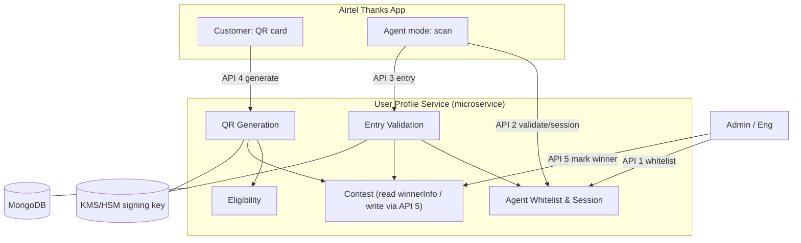
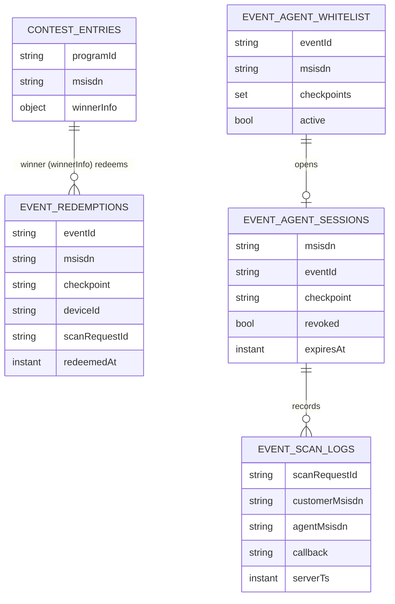
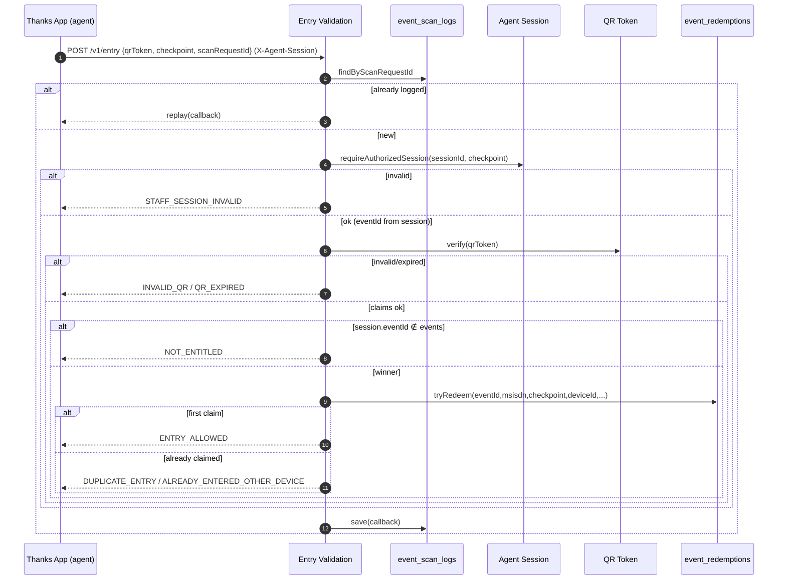
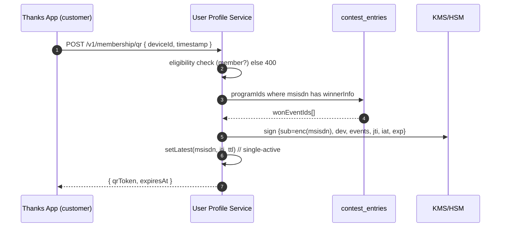
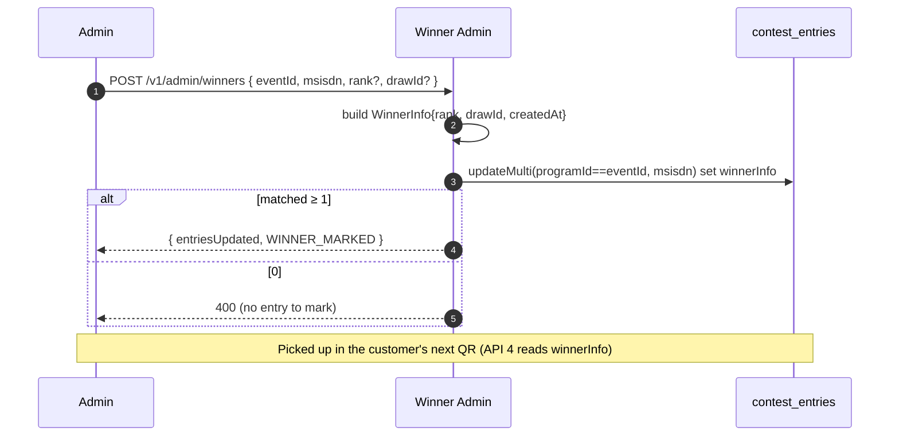

# LLD — Advantage Club Membership QR & Event Entry (Event Pass)

> **Confluence note:** paste this page via **Confluence → … → Insert Markup → Markdown**, or use
> the Markdown macro. Mermaid diagrams render if the **Mermaid** app/macro is installed; otherwise
> wrap each ` ```mermaid ` block in a Mermaid macro, or export the diagrams as images. There is no
> Confluence connector on this session, so this is a paste-ready page rather than a published one.

| | |
|---|---|
| **Type** | Low-Level Design (single-page) |
| **Module** | `com.airtel.userprofile.eventpass` (new, inside the **User Profile Service** microservice) |
| **Store** | MongoDB (reuses the existing `contest_entries`); Aerospike for the single-active QR pointer |
| **Status** | Proposed — for review |
| **Companion repo docs** | HLD `03-hld.md`, design LLD `04-lld.md`, code-level LLD `lld.md`, reference code `reference-impl/eventpass/` |

---

## 1. Summary

The QR is a **customer identity + won-events** credential, generated and signed by the **User
Profile Service** and shown in the Airtel Thanks App. **Scanning happens in the same Thanks App**
in an *agent mode* unlocked only for whitelisted MSISDNs — **no microsite, no OTP**. The event and
checkpoint come from the **agent's validated session**; the winner list comes from the existing
**contest** data (`contest_entries.winnerInfo`, event = `programId`). Entry is an **atomic,
exactly-once, per-checkpoint** redemption.

**Five backend APIs** (all on the User Profile Service):

| # | Method / Endpoint | Caller | Purpose |
|---|---|---|---|
| 1 | `POST /v1/agents/whitelist` | Admin/eng | Whitelist an agent MSISDN for an event + checkpoints |
| 2a | `GET /v1/agents/validate` | Thanks App (agent) | List events + checkpoints the agent may scan |
| 2b | `POST /v1/agents/session` | Thanks App (agent) | Open a single-active scanning session |
| 3 | `POST /v1/entry` | Thanks App (agent) | Record entry/goodie after scanning (the gate decision) |
| 4 | `POST /v1/membership/qr` | Thanks App (customer) | Generate the signed QR (carries won eventIds) |
| 5 | `POST /v1/admin/winners` | Admin/eng | **Mark/update a winner** on the customer's contest entry |

---

## 2. Architecture

One microservice (**User Profile Service**) with internal components; the customer QR and the
agent scanner both live in the Thanks App.



**Trust:** the app is untrusted for decisions — the Entry Validation component decides server-side;
the signing key is backend-only, and the won-events list is inside the token signature.

---

## 3. Data model (MongoDB collections)

| Collection | Key index | Purpose |
|---|---|---|
| `event_redemptions` | **unique** `(eventId, msisdn, checkpoint)`; unique sparse `scanRequestId` | exactly-once redemption + idempotency |
| `event_agent_whitelist` | **unique** `(eventId, msisdn)` | agent authority (events + checkpoints) |
| `event_agent_sessions` | `msisdn` | single-active scanning session |
| `event_scan_logs` | unique sparse `scanRequestId`; `customerMsisdn`, `agentMsisdn`, `eventId` | audit + idempotency + history |
| `contest_entries` *(existing)* | `winnerInfo` presence + `programId` | winner source (read at API 4, **written** at API 5) |
| Aerospike `qr:latest:{msisdn}` | — (TTL = QR TTL) | single-active QR pointer |



---

## 4. QR token

Compact signed JWS (ES256). Claims: `sub` = **encrypted** MSISDN (opaque, never raw), `dev` =
deviceId, `events` = won `programId`s, `ver`, `jti`, `iat`, `exp`. Two expiry gates: JWT `exp`
(hard TTL) **and** the single-active `latestJti` pointer (immediate supersede on refresh). Either
failing → `QR_EXPIRED`.

---

## 5. Callback contract (API 3)

| Callback | admit | color | resumes | Meaning |
|---|:---:|---|:---:|---|
| `ENTRY_ALLOWED` | ✅ | green | yes | first valid scan at checkpoint |
| `DUPLICATE_ENTRY` | ❌ | red | yes | repeat, same device |
| `ALREADY_ENTERED_OTHER_DEVICE` | ❌ | red | yes | repeat, different device (returns first deviceId) |
| `NOT_ENTITLED` | ❌ | red | yes | `session.eventId ∉ token.events` |
| `QR_EXPIRED` | ❌ | grey | yes | past TTL or superseded |
| `INVALID_QR` | ❌ | red | yes | malformed/forged/unsupported |
| `STAFF_SESSION_INVALID` | ❌ | red | **no** | session missing/revoked/expired/mismatch |
| `SERVICE_UNAVAILABLE` | ❌ | grey | yes | unexpected fault — never auto-allow |

Every entry decision returns **HTTP 200 + callback**; only unexpected faults map to `SERVICE_UNAVAILABLE`.

---

## 6. API details & sequences

### API 1 — `POST /v1/agents/whitelist` (admin)
`{ msisdn, eventId, checkpoints[] }` → idempotent upsert on `(eventId, msisdn)`; one MSISDN may
serve many events; supports mid-event appends.

### API 2 — validate then open session (agent; no OTP)
```mermaid
sequenceDiagram
  autonumber
  participant App as Thanks App (agent)
  participant UPS as User Profile Service
  participant DB as whitelist / sessions
  App->>UPS: GET /v1/agents/validate (IV_USER = agent msisdn)
  UPS->>DB: active whitelist rows for msisdn
  alt authorized
    UPS-->>App: { authorized:true, events[] }
    App->>UPS: POST /v1/agents/session { eventId, checkpoint }
    UPS->>DB: revoke prior sessions; insert agent_session (TTL 24h)
    UPS-->>App: { agentSessionId }
  else not an agent
    UPS-->>App: { authorized:false }
  end
```

### API 3 — `POST /v1/entry` (agent) — the gate decision
Header `X-Agent-Session`; body `{ qrToken, checkpoint, scanRequestId }`. Ordered conditions:

| Step | Condition | Result |
|---|---|---|
| 0 | `scanRequestId` already logged | replay stored callback (idempotent) |
| 1–2 | session invalid / checkpoint mismatch / whitelist revoked | `STAFF_SESSION_INVALID` |
| 3 | signature/version bad, unresolvable subject | `INVALID_QR` |
| 4 | past TTL or superseded | `QR_EXPIRED` |
| 5 | `session.eventId ∉ token.events` | `NOT_ENTITLED` |
| 6a | redeem inserted (won race) | `ENTRY_ALLOWED` |
| 6b | already redeemed, same device | `DUPLICATE_ENTRY` (+ firstClaimAt) |
| 6c | already redeemed, other device | `ALREADY_ENTERED_OTHER_DEVICE` (+ otherDeviceId) |
| 7 | (always) write `event_scan_logs` | audit |
| — | any exception | `SERVICE_UNAVAILABLE` (never auto-allow) |



**Atomic redeem** (`EventRedemptionDaoImpl.tryRedeem`):
```java
try { mongoTemplate.insert(redemption);        // unique (eventId,msisdn,checkpoint)
      return new RedeemOutcome(true, redemption);            // → ENTRY_ALLOWED
} catch (DuplicateKeyException dup) {
      var existing = find(eventId,msisdn,checkpoint).orElseThrow(() -> dup);
      return new RedeemOutcome(false, existing);             // → device split
}
```

### API 4 — `POST /v1/membership/qr` (customer)
Header `IV_USER` = customer msisdn; body `{ deviceId, timestamp }`.


### API 5 — `POST /v1/admin/winners` (admin) — **mark/update winner**
Header `IV_USER` = actor; body `{ eventId, msisdn, rank?, drawId? }`. Sets `winnerInfo` on the
customer's **existing** `contest_entries` row(s); **never creates** an entry.

| # | Condition | Outcome |
|---|---|---|
| 1 | `eventId`/`msisdn` blank | 400 |
| 2 | ≥1 entry for `(programId=eventId, msisdn)` | set `winnerInfo{rank?, drawId?, createdAt}` → `{entriesUpdated, WINNER_MARKED}` |
| 3 | no matching entry (never played) | 400 — do not fabricate an entry |
| 4 | already a winner | idempotent — overwrite rank/drawId |



**Effect chain:** API 5 writes `winnerInfo` → API 4 embeds the event on next refresh → API 3 admits.

---

## 7. Idempotency

`scanRequestId` is the key. API 3 first checks `event_scan_logs.findByScanRequestId` and replays a
prior terminal result; the `event_redemptions.scanRequestId` unique index makes a crash between
redeem-commit and response safe (the retry returns the original `ENTRY_ALLOWED`, never a second
admit). `SERVICE_UNAVAILABLE` is not terminal → a genuine retry re-runs the chain. Contract: the
scanner reuses one `scanRequestId` per decoded QR.

---

## 8. Exception → HTTP / callback mapping

| Source | Result |
|---|---|
| `QrInvalidException` / `QrExpiredException` / `AgentSessionInvalidException` (entry path) | 200 `INVALID_QR` / `QR_EXPIRED` / `STAFF_SESSION_INVALID` |
| any other exception (entry path) | 200 `SERVICE_UNAVAILABLE` (no auto-allow) |
| `AgentSessionInvalidException` (open session) | 401 |
| `IllegalArgumentException` (bad input / non-member / no entry to mark) | 400 |

---

## 9. Config & platform wiring

`eventpass.*` (`@RefreshScope`): `qrTtlSeconds=300` (shared by API 3 & 4), `agentSessionTtlSeconds=86400`,
`tokenVersion=1`, `issuer`, `signingKeyId`.

To wire before running: (1) **jjwt** 0.12.x in `pom.xml`; (2) `@Configuration` KMS/HSM
`PrivateKey`/`PublicKey` beans; (3) `MembershipEligibilityService` → existing eligibility bean;
(4) `AerospikeDetails.EVENT_QR_LATEST` + TTL-aware `putDetails`; (5) event name/venue enrichment (optional).

---

## 10. Open decisions

| # | Question |
|---|---|
| Q1 | QR TTL value (recommend 5 min) — one knob for API 3 & 4 |
| Q5 | Screenshot handling — block (Android) vs detect (iOS) |
| Q10 | Agent auth = app login + whitelist (no OTP) — confirm sufficient |
| Q22 | `deviceId` is the customer device; needs a stable id |
| Q23 | Event ↔ contest mapping — is event = `programId` (vs `campaignId` / multi-contest)? Affects the winner read (API 4) **and** write (API 5) |
