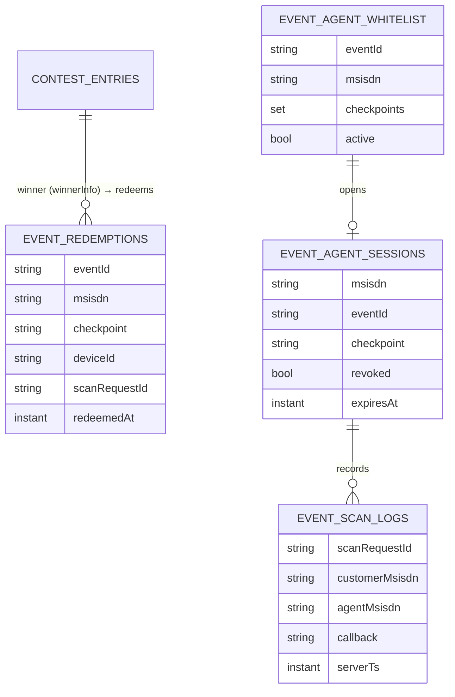
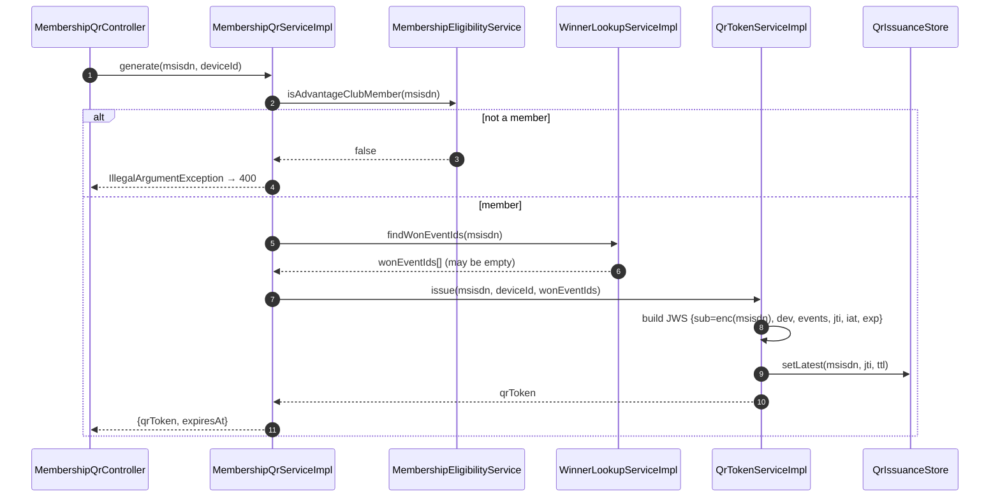
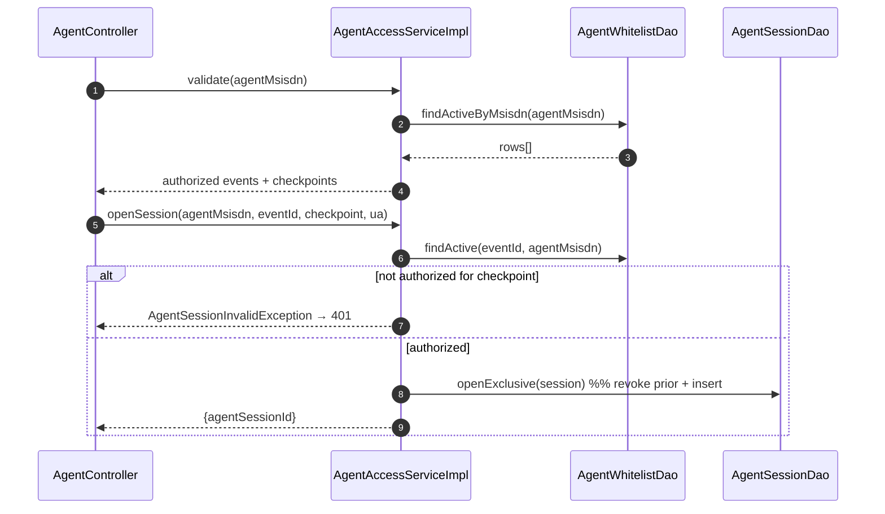
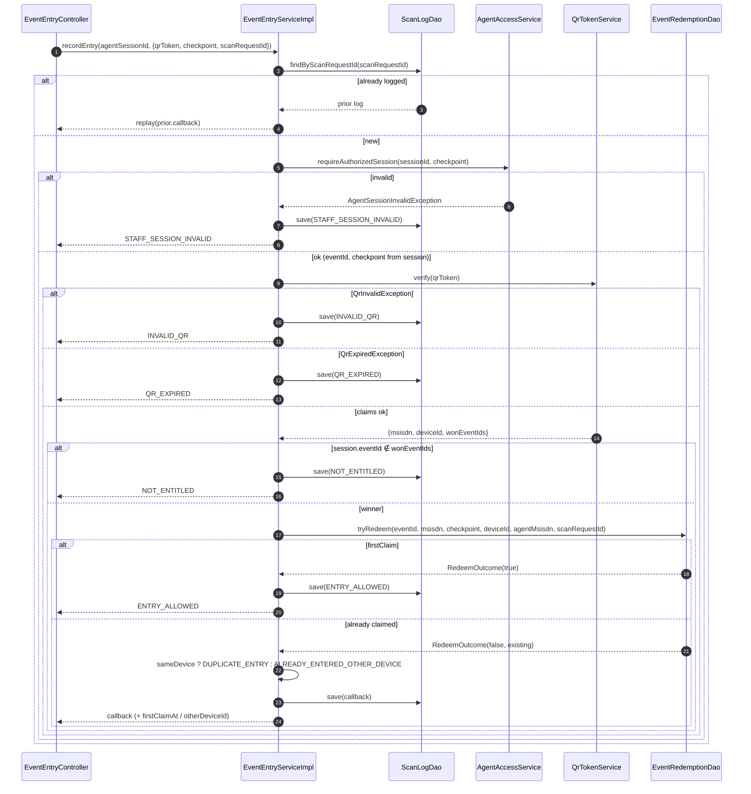

# LLD — Event Pass (Membership QR & Event Entry) — Code-Level

| | |
|---|---|
| **Document type** | Low-Level Design (code) |
| **Module** | `com.airtel.userprofile.eventpass` (new, inside the User Profile Service) |
| **Reference code** | [`reference-impl/eventpass/`](./reference-impl/eventpass) |
| **Companions** | [`03-hld.md`](./03-hld.md) (architecture), [`04-lld.md`](./04-lld.md) (design), [`05-detailed-lld-eventpass.md`](./05-detailed-lld-eventpass.md) (summary) |
| **Date** | September 2026 |

This document catalogues **every code change** for the feature, the **exact conditions** each
branch handles, and the **method-level sequence flows** for all four APIs. It is written against
the existing `contest` module conventions: `com.airtel.userprofile.*`, Lombok Mongo `@Document`s,
**DAO + `MongoTemplate`**, `DuplicateKeyException` for atomic uniqueness (the `orderId` pattern),
the `com.airtel.core.dto.genericResponse.Response` wrapper, `@AuditLog`, and the `IV_USER` header
for the caller MSISDN.

---

## Table of Contents

1. [Module map (all files)](#1-module-map-all-files)
2. [Data model, collections & indexes](#2-data-model-collections--indexes)
3. [Enums & callback contract](#3-enums--callback-contract)
4. [API 4 — Generate QR (conditions + sequence)](#4-api-4--generate-qr)
5. [API 1 — Whitelist agent (conditions + sequence)](#5-api-1--whitelist-agent)
6. [API 2 — Validate agent & open session](#6-api-2--validate-agent--open-session)
7. [API 3 — Entry after scan (the core)](#7-api-3--entry-after-scan-the-core)
8. [QR token — mint & verify conditions](#8-qr-token--mint--verify-conditions)
9. [Atomic redemption — the exactly-once anchor](#9-atomic-redemption--the-exactly-once-anchor)
10. [Winner check — reusing contest data](#10-winner-check--reusing-contest-data)
11. [Idempotency & retry semantics](#11-idempotency--retry-semantics)
12. [Exception → HTTP / callback mapping](#12-exception--http--callback-mapping)
13. [Config, dependencies & wiring](#13-config-dependencies--wiring)

---

## 1. Module map (all files)

Every file below is **new**. Nothing in the existing `contest` module is modified; the winner
check only **reads** `contest_entries`.

| Layer | File | Responsibility |
|---|---|---|
| enum | `enums/Checkpoint.java` | `ENTRY` / `GOODIE`; string (de)serialization + `fromValue` |
| enum | `enums/EntryCallback.java` | 8 decision codes; carries `color`, `admit`, `scannerResumes`, `defaultMessage` |
| document | `document/EventRedemptionDocument.java` | exactly-once anchor; unique `(eventId,msisdn,checkpoint)`, unique sparse `scanRequestId` |
| document | `document/AgentWhitelistDocument.java` | agent authority; unique `(eventId,msisdn)` + `checkpoints` set |
| document | `document/AgentSessionDocument.java` | active scanning session bound to `(msisdn,eventId,checkpoint)` |
| document | `document/ScanLogDocument.java` | append-only audit; unique sparse `scanRequestId`; indexed customer/agent/event |
| dto/req | `dto/request/QrGenerateRequest.java` | `{deviceId, timestamp}` (API 4) |
| dto/req | `dto/request/EntryScanRequest.java` | `{qrToken, checkpoint, scanRequestId}` (API 3) |
| dto/req | `dto/request/WhitelistUpsertRequest.java` | `{eventId, msisdn, checkpoints[]}` (API 1) |
| dto/resp | `dto/response/QrGenerateResponse.java` | `{qrToken, expiresAt}` |
| dto/resp | `dto/response/EntryScanResponse.java` | `{callback, admit, displayColor, message, holderMasked?, firstClaimAt?, otherDeviceId?}` + `of(cb)` factory |
| dto/resp | `dto/response/AgentValidateResponse.java` | `{authorized, events[], agentSessionId?}` |
| dto/resp | `dto/response/AgentEventAccess.java` | `{eventId, eventName?, venue?, checkpoints[]}` |
| dao | `dao/EventRedemptionDao.java` + `impl/…` | `tryRedeem(...)`, `find(...)` — atomic redeem via insert/DuplicateKey |
| dao | `dao/RedeemOutcome.java` | `{firstClaim, row}` result of a redeem attempt |
| dao | `dao/ScanLogDao.java` + `impl/…` | `save`, `findByScanRequestId`, `findByCustomerMsisdnOrderByServerTs` |
| dao | `dao/AgentWhitelistDao.java` + `impl/…` | `upsert`, `findActiveByMsisdn`, `findActive` |
| dao | `dao/AgentSessionDao.java` + `impl/…` | `openExclusive` (revoke-then-insert), `findActiveById` |
| service | `service/MembershipQrService.java` + `impl/…` | API 4 orchestration |
| service | `service/AgentAccessService.java` + `impl/…` | API 1/2 + `requireAuthorizedSession` |
| service | `service/EventEntryService.java` + `impl/…` | API 3 orchestration (the chain) + `scanHistory` |
| service | `service/WinnerLookupService.java` + `impl/…` | winner check over `contest_entries` |
| service | `service/QrTokenService.java` + `impl/…` | mint/verify JWS |
| service | `service/QrIssuanceStore.java` + `impl/…` | single-active `latestJti` pointer (Aerospike) |
| service | `service/QrClaims.java` | verified token payload holder |
| service | `service/MembershipEligibilityService.java` | eligibility gate (wired to existing profile bean) |
| controller | `controller/MembershipQrController.java` | `POST /v1/membership/qr` |
| controller | `controller/AgentController.java` | `POST /v1/agents/whitelist`, `GET /v1/agents/validate`, `POST /v1/agents/session` |
| controller | `controller/EventEntryController.java` | `POST /v1/entry`, `GET /v1/admin/scan-history` |
| exception | `exception/{QrInvalid,QrExpired,AgentSessionInvalid}Exception.java` | typed failures |
| exception | `exception/EventPassExceptionHandler.java` | `@RestControllerAdvice` for the module |
| converter | `converter/CheckpointConverter.java` | `@RequestParam Checkpoint` binding |
| config | `config/EventPassProperties.java` | `eventpass.*` tunables (`@RefreshScope`) |

---

## 2. Data model, collections & indexes



| Collection | Index | Type | Why |
|---|---|---|---|
| `event_redemptions` | `(eventId, msisdn, checkpoint)` | **unique** | one redemption per checkpoint → atomic single-claim |
| `event_redemptions` | `scanRequestId` | unique, sparse | a retried scan can't create a second row |
| `event_agent_whitelist` | `(eventId, msisdn)` | **unique** | one whitelist row per agent per event (upsert target) |
| `event_agent_sessions` | `msisdn` | plain | revoke-all + lookup for single-active |
| `event_scan_logs` | `scanRequestId` | unique, sparse | idempotency replay |
| `event_scan_logs` | `customerMsisdn`, `agentMsisdn`, `eventId` | plain | history / audit queries |

Indexes are declared on the documents (`@CompoundIndex`, `@Indexed(unique=true, sparse=true)`) so
Spring Data auto-creates them — same as `EntryDocument.orderId` in `contest`.

---

## 3. Enums & callback contract

`EntryCallback` is the single source of truth for the agent-facing result. Only `ENTRY_ALLOWED`
has `admit=true`. `STAFF_SESSION_INVALID` has `scannerResumes=false` (scanner stops).

| Callback | admit | color | resumes |
|---|:---:|---|:---:|
| `ENTRY_ALLOWED` | ✅ | green | yes |
| `DUPLICATE_ENTRY` | ❌ | red | yes |
| `ALREADY_ENTERED_OTHER_DEVICE` | ❌ | red | yes |
| `NOT_ENTITLED` | ❌ | red | yes |
| `QR_EXPIRED` | ❌ | grey | yes |
| `INVALID_QR` | ❌ | red | yes |
| `STAFF_SESSION_INVALID` | ❌ | red | **no** |
| `SERVICE_UNAVAILABLE` | ❌ | grey | yes |

`EntryScanResponse.of(callback)` copies `admit/color/message` from the enum; the service overrides
`message`/`holderMasked`/`firstClaimAt`/`otherDeviceId` where relevant.

---

## 4. API 4 — Generate QR

`POST /v1/membership/qr` → `MembershipQrController.generate` → `MembershipQrServiceImpl.generate`.

**Conditions**

| # | Condition | Outcome |
|---|---|---|
| 1 | `IV_USER` blank | 400 (bean validation / handler) |
| 2 | `deviceId` blank | 400 (`@NotBlank`) |
| 3 | `!eligibility.isAdvantageClubMember(msisdn)` | `IllegalArgumentException` → 400 (non-member gets no QR) |
| 4 | member, **no** won events | QR still issued with **empty** `events[]` (any gate → `NOT_ENTITLED`) |
| 5 | member, has won events | QR issued with all won `programId`s embedded |
| 6 | called again (refresh) | new `jti`; `QrIssuanceStore.setLatest` supersedes the previous token immediately |



---

## 5. API 1 — Whitelist agent

`POST /v1/agents/whitelist` → `AgentController.whitelist` → `AgentAccessServiceImpl.upsertWhitelist`
→ `AgentWhitelistDaoImpl.upsert`.

**Conditions**

| # | Condition | Outcome |
|---|---|---|
| 1 | `eventId`/`msisdn` blank or `checkpoints` empty | 400 (`@NotBlank`/`@NotEmpty`) |
| 2 | `(eventId, msisdn)` new | insert row, `active=true`, `createdAt` set |
| 3 | `(eventId, msisdn)` exists | update `checkpoints`, `active`, `updatedAt` (idempotent upsert) |
| 4 | same MSISDN, different event | separate row (an agent can serve many events) |

`AgentWhitelistDaoImpl.upsert` uses `Update.setOnInsert("createdAt", …)` so re-runs don't reset the
creation time — mid-event appends are safe.

---

## 6. API 2 — Validate agent & open session

Two calls: `GET /v1/agents/validate` then `POST /v1/agents/session`.

**Validate conditions** (`AgentAccessServiceImpl.validate`)

| # | Condition | Outcome |
|---|---|---|
| 1 | no active whitelist rows for msisdn | `{authorized:false}` — no event data leaked |
| 2 | ≥1 active row | `{authorized:true, events:[{eventId, checkpoints[]}...]}` |

**Open-session conditions** (`AgentAccessServiceImpl.openSession`)

| # | Condition | Outcome |
|---|---|---|
| 1 | no active whitelist for `(eventId, msisdn)` | `AgentSessionInvalidException` → 401 |
| 2 | whitelist doesn't include requested `checkpoint` | `AgentSessionInvalidException` → 401 |
| 3 | authorized | revoke prior live sessions for msisdn (`openExclusive`), insert new session (TTL 24h), return `agentSessionId` |



---

## 7. API 3 — Entry after scan (the core)

`POST /v1/entry` (header `X-Agent-Session`) → `EventEntryController.recordEntry`
→ `EventEntryServiceImpl.recordEntry`. **Every decision returns HTTP 200** with a callback; only
unexpected faults map to `SERVICE_UNAVAILABLE`.

**Ordered conditions** (short-circuit on first match)

| Step | Condition | Result |
|---|---|---|
| 0 | `scanLogDao.findByScanRequestId` present | **replay** stored callback (idempotent) |
| 1 | session missing / revoked / expired | `STAFF_SESSION_INVALID` |
| 2 | `request.checkpoint != session.checkpoint`, or whitelist no longer active/authorized | `STAFF_SESSION_INVALID` |
| 3a | token signature bad / version unsupported / unresolvable subject | `INVALID_QR` |
| 3b | token past `exp`, or `jti` not the latest (superseded) | `QR_EXPIRED` |
| 4 | `session.eventId ∉ claims.wonEventIds` | `NOT_ENTITLED` |
| 5a | `tryRedeem` inserted the row (won the race) | `ENTRY_ALLOWED` |
| 5b | already redeemed, **same** deviceId | `DUPLICATE_ENTRY` (+ `firstClaimAt`) |
| 5c | already redeemed, **different** deviceId | `ALREADY_ENTERED_OTHER_DEVICE` (+ `firstClaimAt`, `otherDeviceId`) |
| 6 | (always) write `scan_log` | audit row for allow and deny |
| — | any exception thrown in the body | `SERVICE_UNAVAILABLE` (no auto-allow; committed redeem replays on retry) |



---

## 8. QR token — mint & verify conditions

`QrTokenServiceImpl` (jjwt, ES256). Claims: `sub` = `PiiEncryptionDecryption.encrypt(msisdn)`
(opaque; never raw MSISDN), `dev`, `events`, `ver`, `jti`, `iat`, `exp`.

**`issue`**: build JWS, sign with `signingKey` (KMS), `header.keyId = signingKeyId`, then
`QrIssuanceStore.setLatest(msisdn, jti, ttl)` — this is what makes a refresh supersede the old QR.

**`verify` conditions**

| # | Condition | Result |
|---|---|---|
| 1 | signature invalid / malformed / wrong issuer / bad alg | `QrInvalidException` → `INVALID_QR` |
| 2 | JWT `exp` in the past | `QrExpiredException` → `QR_EXPIRED` |
| 3 | `ver` null or `> tokenVersion` | `QrInvalidException` |
| 4 | subject decrypts to blank | `QrInvalidException` |
| 5 | `!QrIssuanceStore.isLatest(msisdn, jti)` (superseded) | `QrExpiredException` |
| 6 | all pass | return `QrClaims{msisdn, deviceId, wonEventIds, jti, iat}` |

> Two independent expiry gates: the JWT `exp` (hard TTL) **and** the single-active `latestJti`
> pointer (immediate supersede on refresh). Either failing → `QR_EXPIRED`, which the customer
> clears by tapping Refresh.

---

## 9. Atomic redemption — the exactly-once anchor

`EventRedemptionDaoImpl.tryRedeem` — the concurrency guarantee is the unique index, not app logic:

```java
try {
    mongoTemplate.insert(doc);                 // unique (eventId,msisdn,checkpoint)
    return new RedeemOutcome(true, doc);        // this scan won → ENTRY_ALLOWED
} catch (DuplicateKeyException dup) {
    EventRedemptionDocument existing = find(eventId, msisdn, checkpoint).orElseThrow(() -> dup);
    return new RedeemOutcome(false, existing);  // already claimed → device split
}
```

| Scenario | Result |
|---|---|
| First scan | insert succeeds → `firstClaim=true` → `ENTRY_ALLOWED` |
| Second scan, same device | insert conflicts → existing row, `deviceId` matches → `DUPLICATE_ENTRY` |
| Second scan, different device | insert conflicts → existing row, `deviceId` differs → `ALREADY_ENTERED_OTHER_DEVICE` |
| Two devices simultaneously | exactly one insert wins; the other gets `DuplicateKeyException` → one admit |
| Unique conflict but row not found | rethrow → caught by service → `SERVICE_UNAVAILABLE` (never auto-allow) |
| ENTRY vs GOODIE | different `checkpoint` → different row → each redeems once |

No read-then-write, so there is no lost-update window (mirrors `contest`'s `orderId` handling).

---

## 10. Winner check — reusing contest data

`WinnerLookupServiceImpl` reads `contest_entries`. A **winner** = an entry whose `winnerInfo`
exists (set by `DrawServiceImpl.upsertWinnerInfoOnEntries`). A live **event = contest `programId`**.

| Method | Query | Used by |
|---|---|---|
| `findWonEventIds(msisdn)` | `msisdn == ? AND winnerInfo exists`, project `programId`, distinct | API 4 — build token `events[]` |
| `isWinner(msisdn, eventId)` | `msisdn == ? AND winnerInfo exists AND programId == ?` (`exists`) | API 3 optional re-check |

No new winner store; no writes to `contest_entries`.

> **Open item (confirm):** event ↔ contest `programId` mapping. If an event spans multiple
> contests or keys on `campaignId`, adjust the projection/criteria accordingly.

---

## 11. Idempotency & retry semantics

Two layers, both keyed on `scanRequestId`:

1. **`scan_log`** — `EventEntryServiceImpl.recordEntry` first calls `findByScanRequestId`; a hit
   **replays** the original callback (no re-run, no re-redeem).
2. **`event_redemptions.scanRequestId`** (unique) — the redemption row itself stamps
   `scanRequestId`, so a crash *between* commit and response is safe: the retry finds the log (or
   the audit save conflicts and we re-read it) and returns the same decision.

`SERVICE_UNAVAILABLE` is **not** written as a terminal log in a way that blocks a genuine retry —
the client reuses the same `scanRequestId` and the chain re-runs; if the redeem had committed, the
retry returns the original `ENTRY_ALLOWED`, never a second admission.

Client contract: the scanner **generates one `scanRequestId` per decoded QR and reuses it on
retry** (see HLD §Idempotency / Q20).

---

## 12. Exception → HTTP / callback mapping

Entry path (API 3): decisions are **200 + callback** (the scanner always parses a decision). Other
paths use `EventPassExceptionHandler` (`@RestControllerAdvice` scoped to the module's controllers).

| Source | Where handled | Result |
|---|---|---|
| `QrInvalidException` | caught in `EventEntryServiceImpl` | 200 `INVALID_QR` |
| `QrExpiredException` | caught in `EventEntryServiceImpl` | 200 `QR_EXPIRED` |
| `AgentSessionInvalidException` (entry) | caught in `EventEntryServiceImpl` | 200 `STAFF_SESSION_INVALID` |
| `AgentSessionInvalidException` (open session) | `EventPassExceptionHandler` | 401 |
| `IllegalArgumentException` (bad input, non-member) | `EventPassExceptionHandler` | 400 |
| any other `Exception` (entry) | caught in `EventEntryServiceImpl` | 200 `SERVICE_UNAVAILABLE` |

---

## 13. Config, dependencies & wiring

**`EventPassProperties`** (`eventpass.*`, `@RefreshScope`): `qrTtlSeconds=300` (Q1 — shared by API 3
& API 4), `agentSessionTtlSeconds=86400`, `tokenVersion=1`, `issuer`, `signingKeyId`.

**Must be wired before it runs (platform):**
1. **jjwt** `io.jsonwebtoken:jjwt-api/impl/jackson` (0.12.x) in `pom.xml`.
2. `@Configuration` beans `PrivateKey signingKey` + `PublicKey verificationKey` from KMS/HSM (`kid` rotation).
3. `MembershipEligibilityService` bound to the existing Advantage-Club eligibility bean.
4. `QrIssuanceStoreImpl`: add `AerospikeDetails.EVENT_QR_LATEST` + a TTL-aware `putDetails` overload.
5. `AgentEventAccess.eventName/venue` enrichment from event/program metadata (optional; null otherwise).

**Not in this module:** the customer-app surfaces (icon, hamburger, tile, splash, walkthrough) —
client-side, see [`04-lld.md`](./04-lld.md) §9.
